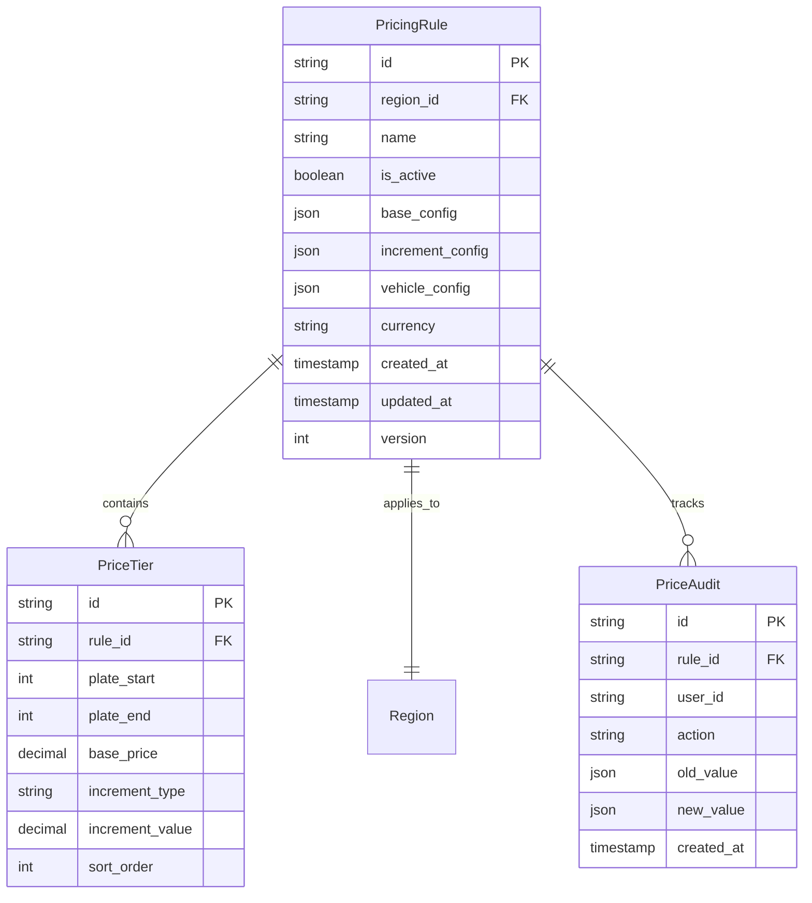
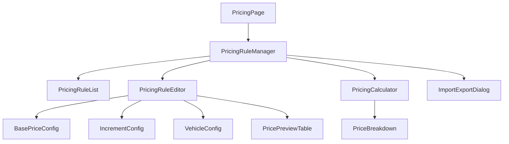
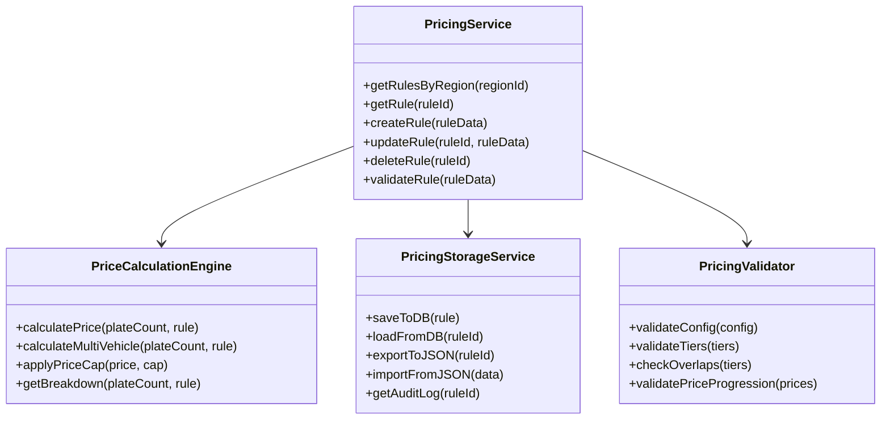
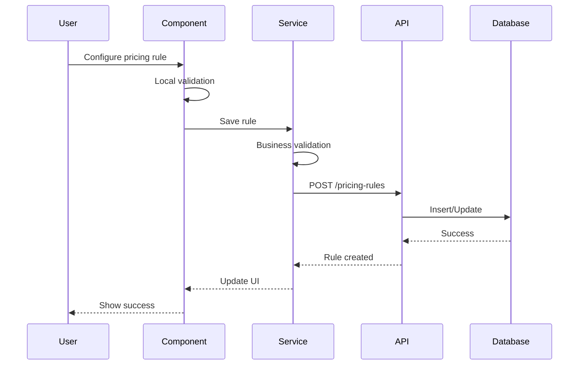

# dynamic-pricing-config - Task 39

Execute task 39 for the dynamic-pricing-config specification.

## Task Description
Unit Tests for Validation

## Code Reuse
**Leverage existing code**: existing test patterns

## Requirements Reference
**Requirements**: 8.1

## Usage
```
/Task:39-dynamic-pricing-config
```

## Instructions

Execute with @spec-task-executor agent the following task: "Unit Tests for Validation"

```
Use the @spec-task-executor agent to implement task 39: "Unit Tests for Validation" for the dynamic-pricing-config specification and include all the below context.

# Steering Context
## Steering Documents Context (Pre-loaded)

### Product Context
# Product Steering Document

## 产品愿景
加拿大快递配送区域地图系统是一个专业的物流配送管理平台，通过可视化地图技术帮助物流公司高效管理配送区域、优化定价策略，提升运营效率。

## 目标用户
- **主要用户**：物流公司运营管理人员
- **次要用户**：配送调度员、客服人员
- **管理用户**：系统管理员、价格策略制定者

## 核心功能

### 现有功能
1. **FSA区域管理**
   - 基于加拿大邮政FSA（Forward Sortation Area）的配送区域划分
   - 可视化展示1600+个FSA多边形边界
   - 区域分组管理（8个默认区域）

2. **价格配置系统**
   - 基于重量区间的阶梯定价
   - 批量导入/导出价格配置
   - 实时价格计算引擎

3. **邮编管理**
   - 完整的加拿大邮编数据库
   - FSA与邮编的映射关系
   - 邮编搜索和筛选

4. **数据管理**
   - 统一存储架构
   - 数据导入导出
   - 自动备份恢复

### 新增功能（卡车派送）
1. **城市级别管理**
   - 以城市为单位的配送区域组织
   - 城市自定义颜色主题
   - 城市下辖多个价格区域

2. **分级区域定价**
   - 每个城市包含1-4个价格区域
   - 区域按价格递增排序（1区最便宜）
   - 视觉化价格梯度（颜色深浅）

3. **增强的搜索功能**
   - 特定邮编快速定位
   - 城市/区域/邮编多级筛选
   - 实时搜索结果高亮

## 业务目标
1. **提升效率**：减少80%的配送区域配置时间
2. **降低成本**：通过优化定价策略降低15%运营成本
3. **改善体验**：提供直观的可视化界面，降低培训成本
4. **扩展性**：支持多种配送模式（标准配送、卡车派送等）

## 成功指标
- 区域配置效率提升度
- 价格策略准确率
- 用户操作错误率降低
- 系统响应时间 < 2秒
- 地图加载时间 < 5秒

## 产品路线图
### Phase 1 (已完成)
- ✅ FSA基础地图展示
- ✅ 区域管理功能
- ✅ 价格配置系统
- ✅ 数据导入导出

### Phase 2 (进行中)
- 🚀 卡车派送模块
- 🚀 城市级别管理
- 🚀 分级定价系统

### Phase 3 (计划中)
- 路线优化算法
- 实时配送追踪
- 客户自助查询
- 移动端应用

---

### Technology Context
# Technology Steering Document

## 技术栈

### 前端技术
- **框架**: React 18.2
- **构建工具**: Vite 5.0
- **路由**: React Router v7
- **样式**: 
  - Tailwind CSS 3.3
  - Cyber/Tech主题设计
- **地图引擎**: 
  - Leaflet 1.9.4
  - React Leaflet 4.2.1
- **动画**: Framer Motion 10.16
- **HTTP客户端**: Axios 1.6.0
- **图标**: Lucide React

### 数据管理
- **状态管理**: React Hooks + Context API
- **本地存储**: localStorage (统一存储架构)
- **数据格式**: JSON
- **地理数据**: GeoJSON格式的FSA边界数据

### 开发工具
- **代码规范**: ESLint
- **包管理**: npm
- **并发执行**: Concurrently
- **桌面应用**: Electron (计划中)

## 架构决策

### 统一存储架构
**决策**: 使用单一的localStorage管理系统替代分散的存储方案

**原因**:
- 简化数据同步逻辑
- 提供统一的数据访问接口
- 便于实现数据恢复和备份

**实现**:
```javascript
// 核心存储模块
src/utils/unifiedStorage.js
src/utils/dataUpdateNotifier.js
src/utils/dataRecovery.js
```

### 组件化架构
**决策**: 采用功能性组件和Hooks模式

**原因**:
- 更好的代码复用性
- 简化状态管理
- 提升开发效率

### 地图渲染策略
**决策**: 使用Leaflet配合GeoJSON渲染FSA边界

**原因**:
- Leaflet性能优秀，支持大量多边形渲染
- GeoJSON是地理数据的标准格式
- React Leaflet提供良好的React集成

## 性能要求

### 响应时间
- 页面加载: < 3秒
- 地图初始化: < 5秒
- 搜索响应: < 500ms
- 数据保存: < 1秒

### 容量限制
- FSA多边形: ~1600个
- 邮编数据: ~850,000条
- localStorage限制: 5-10MB
- 地图缩放级别: 4-18

### 优化策略
- **视口剔除**: 只渲染可见区域的FSA
- **数据分块**: 大数据批量处理时分块进行
- **防抖节流**: 搜索输入使用300ms防抖
- **懒加载**: 按需加载地图瓦片和数据

## 技术约束

### 浏览器兼容性
- Chrome 90+
- Firefox 88+
- Safari 14+
- Edge 90+

### 数据限制
- localStorage大小限制 (5-10MB)
- 单次API请求限制 (100个项目)
- 地图瓦片并发请求限制 (6个)

### 安全要求
- 所有API通信使用HTTPS
- 敏感数据不存储在localStorage
- 实施CORS策略
- XSS防护

## 第三方服务

### 地图服务
- **瓦片服务器**: CartoDB Dark Matter
- **地理编码**: 内置邮编数据库
- **坐标系统**: WGS84 (EPSG:4326)

### 数据源
- **FSA边界**: Statistics Canada 2021 Census
- **邮编数据**: Canada Post官方数据
- **城市数据**: 自维护数据库

### 后端服务 (计划中)
- **数据库**: PostgreSQL + PostGIS
- **API框架**: Node.js + Express
- **ORM**: Prisma
- **缓存**: Redis

## 开发规范

### 代码风格
- ES6+语法
- 函数式编程优先
- 组件名使用PascalCase
- 文件名使用camelCase或PascalCase

### Git工作流
- 主分支: main
- 功能分支: feature/xxx
- 修复分支: fix/xxx
- 提交信息遵循conventional commits

### 测试策略
- 单元测试 (计划中): Jest + React Testing Library
- E2E测试 (计划中): Cypress
- 性能测试: Lighthouse

## 部署架构

### 当前部署
- **静态托管**: Vercel/Netlify
- **构建**: Vite production build
- **CDN**: 自动配置

### 未来架构
- **前端**: CDN + 静态托管
- **后端**: Cloud Run/AWS Lambda
- **数据库**: Cloud SQL/RDS
- **缓存**: Cloud Memorystore/ElastiCache

---

### Structure Context
# Project Structure Steering Document

## 目录结构

```
/
├── .claude/                    # Claude AI配置
│   └── steering/              # 项目指导文档
├── public/                    # 静态资源
│   └── data/                  # FSA边界数据文件
├── src/                       # 源代码
│   ├── components/            # React组件
│   ├── data/                  # 静态数据文件
│   ├── layouts/               # 布局组件
│   ├── pages/                 # 页面组件
│   ├── router/                # 路由配置
│   ├── services/              # 服务层
│   └── utils/                 # 工具函数
├── backend/                   # 后端服务 (如果存在)
└── dist/                      # 构建输出
```

## 文件组织规范

### 组件文件 (`src/components/`)
```
components/
├── maps/                      # 地图相关组件
│   ├── AccurateFSAMap.jsx    # FSA地图主组件
│   └── TruckDeliveryMap.jsx  # 卡车派送地图（新增）
├── regions/                   # 区域管理组件
│   ├── RegionManagementPanel.jsx
│   └── RegionSelector.jsx
├── cities/                    # 城市管理组件（新增）
│   ├── CityManager.jsx
│   └── CityRegionEditor.jsx
└── common/                    # 通用组件
    ├── SearchPanel.jsx
    └── ImportExportManager.jsx
```

### 页面文件 (`src/pages/`)
```
pages/
├── Dashboard/                 # 仪表板
│   └── index.jsx
├── Settings/                  # 设置页面
│   ├── index.jsx
│   ├── RegionSettings.jsx
│   ├── PriceSettings.jsx
│   └── PostalSettings.jsx
└── TruckDelivery/            # 卡车派送（新增）
    ├── index.jsx
    ├── CityView.jsx
    └── RegionDetail.jsx
```

### 工具文件 (`src/utils/`)
```
utils/
├── storage/                   # 存储相关
│   ├── unifiedStorage.js     # 统一存储
│   ├── cityStorage.js        # 城市存储（新增）
│   └── truckDeliveryStorage.js # 卡车派送存储（新增）
├── api/                       # API相关
│   └── apiClient.js
└── helpers/                   # 辅助函数
    ├── geoHelpers.js
    └── priceCalculator.js
```

## 命名规范

### 文件命名
- **组件文件**: PascalCase (如 `RegionManager.jsx`)
- **工具文件**: camelCase (如 `dataHelper.js`)
- **样式文件**: camelCase (如 `styles.module.css`)
- **常量文件**: SCREAMING_SNAKE_CASE (如 `CONSTANTS.js`)

### 变量命名
```javascript
// 组件
const RegionManager = () => { ... }

// 函数
const calculateDeliveryPrice = (weight, region) => { ... }

// 常量
const MAX_REGIONS_PER_CITY = 4;

// 状态
const [selectedCity, setSelectedCity] = useState(null);
```

### CSS类命名
```css
/* BEM风格 + Tailwind */
.city-selector__header { }
.city-selector__item--active { }

/* Tailwind优先 */
className="flex flex-col gap-4 p-6 bg-gray-900"
```

## 数据模型规范

### FSA数据结构
```javascript
{
  fsa: 'M5V',
  province: 'ON',
  city: 'Toronto',
  lat: 43.6426,
  lng: -79.3871,
  postalCodes: ['M5V 3A8', 'M5V 1A1']
}
```

### 城市数据结构（新增）
```javascript
{
  id: 'city-uuid',
  name: 'Toronto',
  province: 'ON',
  color: '#FF5733',        // 城市主题色
  regions: [
    {
      id: 'region-1',
      level: 1,            // 1-4区
      name: '市中心配送区',
      fsaCodes: ['M5V', 'M5G'],
      postalCodes: [],
      priceMultiplier: 1.0, // 价格系数
      color: '#FFE5B4'     // 浅色表示便宜
    }
  ],
  metadata: {
    createdAt: '2024-01-01T00:00:00Z',
    updatedAt: '2024-01-01T00:00:00Z'
  }
}
```

### 价格配置结构
```javascript
{
  basePrice: 15.99,
  weightRanges: [
    { min: 0, max: 10, price: 15.99 },
    { min: 10, max: 20, price: 25.99 }
  ],
  regionMultipliers: {
    '1': 1.0,  // 1区无加价
    '2': 1.2,  // 2区加价20%
    '3': 1.5,  // 3区加价50%
    '4': 2.0   // 4区加价100%
  }
}
```

## 新功能集成指南

### 添加卡车派送功能步骤

1. **创建页面路由**
```javascript
// src/router/index.jsx
{
  path: 'truck-delivery',
  element: <TruckDelivery />
}
```

2. **添加导航菜单**
```javascript
// src/layouts/MainLayout.jsx
<NavLink to="/truck-delivery">卡车派送</NavLink>
```

3. **实现数据存储**
```javascript
// src/utils/storage/cityStorage.js
export const getCities = () => { ... }
export const updateCity = (cityId, data) => { ... }
```

4. **创建UI组件**
```javascript
// src/components/cities/CityManager.jsx
const CityManager = () => {
  // 城市CRUD逻辑
}
```

5. **集成地图展示**
```javascript
// src/components/maps/TruckDeliveryMap.jsx
const TruckDeliveryMap = ({ cities, selectedCity }) => {
  // 城市和区域可视化
}
```

## 代码组织原则

### 单一职责
每个组件/模块只负责一个功能领域

### 依赖注入
通过props传递依赖，避免硬编码

### 数据流向
- 自上而下的数据流
- 通过回调函数向上传递事件
- 使用Context API共享全局状态

### 错误处理
```javascript
try {
  const data = await fetchCityData(cityId);
  return data;
} catch (error) {
  console.error('获取城市数据失败:', error);
  // 显示用户友好的错误信息
  showNotification('加载失败，请重试');
  return null;
}
```

## 测试规范

### 单元测试
- 测试文件与源文件同目录
- 命名: `ComponentName.test.jsx`
- 覆盖率目标: 80%

### 集成测试
- 测试用户操作流程
- 使用React Testing Library
- 模拟API响应

### E2E测试
- 关键用户路径
- 使用Cypress
- 定期运行回归测试

**Note**: Steering documents have been pre-loaded. Do not use get-content to fetch them again.

# Specification Context
## Specification Context (Pre-loaded): dynamic-pricing-config

### Requirements
# Dynamic Pricing Configuration System Requirements

## 1. Introduction

This document outlines the requirements for a flexible pricing configuration system that supports dynamic pricing based on "plates" (板) rather than fixed weight ranges. The system will enable administrators to configure complex pricing rules with base prices, incremental pricing, and vehicle capacity limits.

## 2. Business Context

### 2.1 Current Situation
- Current system uses fixed weight ranges (0-11kg, 11-15kg, etc.)
- Cannot accommodate flexible plate-based pricing models
- Lacks support for dynamic pricing rules and vehicle capacity management

### 2.2 Business Need
- Support plate-based pricing (e.g., plates 1-2 at $150, plate 3+ adds $20 each)
- Handle vehicle capacity limits (max 8 plates per vehicle)
- Calculate overflow into additional vehicles automatically
- Provide configurable pricing caps per vehicle

## 3. User Stories

### 3.1 Configure Base Pricing Rules
**As a** pricing administrator  
**I want to** set base prices for initial plate ranges  
**So that** I can implement tiered pricing strategies

**Acceptance Criteria:**
- WHEN I access the pricing configuration page
- THEN I see all regions with their current pricing rules
- WHEN I select a region for configuration
- THEN I can specify a base price (e.g., $150) for a plate range (e.g., plates 1-2)
- WHEN I save the configuration
- THEN the system validates and stores the pricing rule
- IF the plate ranges overlap with existing rules
- THEN the system displays a validation error

### 3.2 Configure Incremental Pricing
**As a** pricing administrator  
**I want to** set incremental pricing for additional plates  
**So that** prices increase progressively with volume

**Acceptance Criteria:**
- WHEN I configure a region's pricing
- THEN I can specify when incremental pricing starts (e.g., from plate 3)
- WHEN I set an increment value (e.g., $20 per plate)
- THEN the system calculates prices correctly (plate 3 = $170, plate 4 = $190, etc.)
- WHEN I choose percentage-based increments
- THEN the system calculates based on the base price percentage
- IF incremental rules conflict
- THEN the system prevents saving and shows clear error messages

### 3.3 Manage Vehicle Capacity
**As a** pricing administrator  
**I want to** set vehicle capacity limits  
**So that** pricing accounts for multi-vehicle shipments

**Acceptance Criteria:**
- WHEN I set maximum plates per vehicle to 8
- THEN the system enforces this limit in all calculations
- WHEN an order exceeds 8 plates (e.g., 10 plates)
- THEN the system calculates as: first vehicle (8 plates) + second vehicle (2 plates starting from base price)
- WHEN I set a per-vehicle price cap (e.g., $1000)
- THEN no single vehicle charge exceeds this amount
- IF vehicle capacity is changed
- THEN existing quotes are not affected (grandfathering)

### 3.4 Calculate Real-time Pricing
**As a** customer service representative  
**I want to** get instant price quotes based on plate count  
**So that** I can provide accurate pricing to customers

**Acceptance Criteria:**
- WHEN I enter 3 plates for Region 1
- AND Region 1 has: plates 1-2 at $150, +$20 per plate from plate 3
- THEN the system shows: $170 (base $150 + increment $20)
- WHEN I enter 10 plates
- AND vehicle capacity is 8 plates
- THEN the system shows breakdown: Vehicle 1 (8 plates) = $X, Vehicle 2 (2 plates) = $150
- WHEN pricing rules change
- THEN calculations update in real-time without page refresh

### 3.5 Preview Pricing Tables
**As a** pricing administrator  
**I want to** preview pricing for different plate counts  
**So that** I can verify configuration correctness

**Acceptance Criteria:**
- WHEN I complete pricing configuration
- THEN I see a preview table showing prices for 1-20 plates
- WHEN I modify any pricing parameter
- THEN the preview updates immediately
- WHEN there are price anomalies (e.g., price decreases with more plates)
- THEN the system highlights these rows with warnings
- WHEN I hover over a price
- THEN I see the calculation breakdown

### 3.6 Import/Export Configurations
**As a** pricing administrator  
**I want to** import and export pricing configurations  
**So that** I can backup and replicate pricing across regions

**Acceptance Criteria:**
- WHEN I click export for a region
- THEN the system downloads a JSON file with all pricing rules
- WHEN I import a configuration file
- THEN the system validates the format and data
- IF import data is invalid
- THEN the system shows specific validation errors
- WHEN I select "Apply to Multiple Regions"
- THEN I can choose target regions for bulk application

## 4. Functional Requirements

### 4.1 Pricing Rule Components

#### 4.1.1 Base Pricing Configuration
- **Base Plate Range**: Configurable range (e.g., 1-2, 1-3, or just 1 plate)
- **Base Price**: Fixed price for the base range in CAD or USD
- **Currency**: Support for CAD and USD with conversion rates

#### 4.1.2 Incremental Pricing Rules
- **Start Plate**: Which plate number triggers incremental pricing
- **Increment Type**:
  - Fixed: Add fixed amount per plate
  - Percentage: Add percentage of base price
  - Tiered: Different increments for different plate ranges
- **Increment Value**: The amount or percentage to add

#### 4.1.3 Vehicle Constraints
- **Max Plates per Vehicle**: Configurable limit (default: 8)
- **Price Cap per Vehicle**: Optional maximum price per vehicle
- **Overflow Handling**: Automatic calculation for multi-vehicle shipments

### 4.2 Configuration Interface

#### 4.2.1 UI Components
- Region selector with search functionality
- Tabbed interface for different configuration aspects
- Real-time validation with inline error messages
- Visual price curve graph
- Drag-and-drop for plate range adjustment

#### 4.2.2 Configuration Features
- Template library for common pricing models
- Copy configuration between regions
- Bulk edit for multiple regions
- Configuration comparison tool
- Undo/Redo functionality

### 4.3 Calculation Engine

#### 4.3.1 Core Calculations
- Single vehicle price calculation
- Multi-vehicle split calculation
- Price cap application
- Currency conversion

#### 4.3.2 Performance Requirements
- Single calculation response time < 10ms
- Batch calculation (100 items) < 100ms
- Real-time preview updates < 50ms

### 4.4 Data Management

#### 4.4.1 Storage Requirements
- Store configurations in PostgreSQL database
- Maintain configuration version history
- Support configuration rollback
- Archive deleted configurations for 90 days

#### 4.4.2 Audit Trail
- Log all configuration changes
- Track user, timestamp, and changes made
- Provide change comparison views
- Export audit logs for compliance

## 5. Non-Functional Requirements

### 5.1 Performance
- Page load time < 1 second
- Configuration save time < 500ms
- Support 1000+ concurrent users
- Handle 100+ regions without degradation

### 5.2 Usability
- Mobile-responsive design
- Keyboard navigation support
- Contextual help and tooltips
- Configuration wizard for new users
- Clear error messages with resolution guidance

### 5.3 Security
- Role-based access control
- Configuration change requires authentication
- Encrypt sensitive pricing data
- API rate limiting to prevent abuse

### 5.4 Reliability
- 99.9% uptime for pricing calculations
- Graceful degradation if database is unavailable
- Automatic backup every 6 hours
- Disaster recovery within 1 hour

### 5.5 Compatibility
- Integration with existing region management
- Backward compatibility with current price tables
- API compatibility for external systems
- Data migration from legacy system

## 6. Technical Constraints

### 6.1 Technology Stack
- React 18+ with TypeScript
- Tailwind CSS for styling
- Framer Motion for animations
- PostgreSQL for data storage
- Node.js/Express backend

### 6.2 Integration Requirements
- Use existing authentication system
- Integrate with current region/city management
- Maintain API compatibility
- Support existing UI component library

### 6.3 Browser Support
- Chrome 90+
- Firefox 88+
- Safari 14+
- Edge 90+

## 7. Acceptance Criteria

### 7.1 Functional Acceptance
- [ ] All user stories implemented and tested
- [ ] Pricing calculations accurate to 2 decimal places
- [ ] Multi-vehicle calculations work correctly
- [ ] Import/Export functionality operational
- [ ] Configuration templates available

### 7.2 Performance Acceptance
- [ ] All performance metrics met
- [ ] Load testing passed with 1000 concurrent users
- [ ] No memory leaks in 24-hour stress test

### 7.3 Quality Acceptance
- [ ] Code coverage > 80%
- [ ] No critical or high-severity bugs
- [ ] Accessibility WCAG 2.1 AA compliant
- [ ] Security audit passed

## 8. Assumptions and Dependencies

### 8.1 Assumptions
- Users have modern browsers
- Stable internet connection available
- Database infrastructure can handle increased load
- Users trained on new pricing model

### 8.2 Dependencies
- Database migration completed before deployment
- Authentication service available
- Region management system updated
- API documentation updated

## 9. Risks and Mitigation

### 9.1 Technical Risks
- **Risk**: Complex calculations may have edge cases
- **Mitigation**: Comprehensive test suite with edge cases
- **Risk**: Performance degradation with many rules
- **Mitigation**: Implement caching and optimization

### 9.2 Business Risks
- **Risk**: User resistance to new pricing model
- **Mitigation**: Provide training and transition period
- **Risk**: Pricing errors affecting revenue
- **Mitigation**: Parallel run with manual verification

### 9.3 Data Migration Risks
- **Risk**: Data loss during migration
- **Mitigation**: Complete backup and rollback plan
- **Risk**: Inconsistent pricing after migration
- **Mitigation**: Automated validation and reconciliation

## 10. Success Metrics

### 10.1 Business Metrics
- Pricing configuration time reduced by 50%
- Pricing errors reduced by 90%
- Customer satisfaction score > 4.5/5

### 10.2 Technical Metrics
- System availability > 99.9%
- Average response time < 100ms
- Zero data loss incidents

### 10.3 User Adoption Metrics
- 80% of administrators using new system within 2 weeks
- Support tickets reduced by 40%
- Feature utilization rate > 70%

---

### Design
# Dynamic Pricing Configuration System Design

## 1. System Overview

### 1.1 Architecture Pattern
The system follows a **layered architecture** pattern consistent with the existing codebase:
- **Presentation Layer**: React components with Framer Motion animations
- **Business Logic Layer**: Services and calculators for pricing logic
- **Data Access Layer**: Database services and API clients
- **Storage Layer**: PostgreSQL database with Prisma ORM

### 1.2 Integration Points
- Integrates with existing `cityDatabaseService` for region management
- Extends current `truckDelivery` types and validation
- Reuses UI components from `cities` component library
- Leverages existing API infrastructure in `backend/src/routes/`

## 2. Data Model Design

### 2.1 Core Entities



### 2.2 Configuration Schema

```typescript
interface PricingRuleConfig {
  id: string;
  regionId: string;
  name: string;
  isActive: boolean;
  
  // Base pricing configuration
  baseConfig: {
    plateRange: {
      start: number;  // e.g., 1
      end: number;    // e.g., 2
    };
    price: number;    // e.g., 150
  };
  
  // Increment configuration
  incrementConfig: {
    startPlate: number;     // e.g., 3
    type: 'fixed' | 'percentage' | 'tiered';
    value: number;          // e.g., 20 for fixed, 0.1 for 10%
    tiers?: Array<{
      plateRange: { start: number; end: number };
      incrementValue: number;
    }>;
  };
  
  // Vehicle constraints
  vehicleConfig: {
    maxPlatesPerVehicle: number;  // e.g., 8
    priceCapPerVehicle?: number;  // optional cap
    overflowHandling: 'restart' | 'continue';
  };
  
  currency: 'CAD' | 'USD';
  metadata: {
    createdBy: string;
    createdAt: string;
    updatedAt: string;
    version: number;
  };
}
```

### 2.3 Database Tables

```sql
-- New tables to add
CREATE TABLE truck_pricing_rules (
  id UUID PRIMARY KEY DEFAULT gen_random_uuid(),
  region_id UUID NOT NULL REFERENCES truck_delivery_zones(id),
  name VARCHAR(255) NOT NULL,
  is_active BOOLEAN DEFAULT true,
  base_config JSONB NOT NULL,
  increment_config JSONB NOT NULL,
  vehicle_config JSONB NOT NULL,
  currency VARCHAR(3) DEFAULT 'CAD',
  created_at TIMESTAMP DEFAULT NOW(),
  updated_at TIMESTAMP DEFAULT NOW(),
  version INTEGER DEFAULT 1
);

CREATE TABLE truck_price_tiers (
  id UUID PRIMARY KEY DEFAULT gen_random_uuid(),
  rule_id UUID NOT NULL REFERENCES truck_pricing_rules(id) ON DELETE CASCADE,
  plate_start INTEGER NOT NULL,
  plate_end INTEGER NOT NULL,
  base_price DECIMAL(10,2) NOT NULL,
  increment_type VARCHAR(20),
  increment_value DECIMAL(10,4),
  sort_order INTEGER NOT NULL,
  created_at TIMESTAMP DEFAULT NOW()
);

CREATE TABLE truck_price_audit (
  id UUID PRIMARY KEY DEFAULT gen_random_uuid(),
  rule_id UUID NOT NULL REFERENCES truck_pricing_rules(id),
  user_id VARCHAR(255),
  action VARCHAR(50) NOT NULL,
  old_value JSONB,
  new_value JSONB,
  created_at TIMESTAMP DEFAULT NOW()
);

-- Indexes for performance
CREATE INDEX idx_pricing_rules_region ON truck_pricing_rules(region_id);
CREATE INDEX idx_price_tiers_rule ON truck_price_tiers(rule_id);
CREATE INDEX idx_price_audit_rule ON truck_price_audit(rule_id);
CREATE INDEX idx_price_audit_created ON truck_price_audit(created_at);
```

## 3. Component Architecture

### 3.1 Component Hierarchy



### 3.2 Component Specifications

#### 3.2.1 PricingRuleManager
- **Location**: `src/components/pricing/PricingRuleManager.jsx`
- **Purpose**: Main container for pricing configuration
- **State Management**: Uses React hooks with local state
- **Key Props**:
  - `regionId`: Selected region for configuration
  - `onSave`: Callback for saving configuration
  - `initialRule`: Existing rule for editing

#### 3.2.2 PricingRuleEditor
- **Location**: `src/components/pricing/PricingRuleEditor.jsx`
- **Purpose**: Form for creating/editing pricing rules
- **Features**:
  - Real-time validation
  - Preview calculations
  - Undo/redo support
- **Reuses**: Form validation from `types/truckDelivery.js`

#### 3.2.3 PricePreviewTable
- **Location**: `src/components/pricing/PricePreviewTable.jsx`
- **Purpose**: Display calculated prices for different plate counts
- **Features**:
  - Live updates on rule changes
  - Anomaly detection and highlighting
  - Export to CSV

#### 3.2.4 PricingCalculator
- **Location**: `src/components/pricing/PricingCalculator.jsx`
- **Purpose**: Interactive price calculation tool
- **Features**:
  - Plate count input
  - Real-time price calculation
  - Multi-vehicle breakdown

## 4. Service Layer Design

### 4.1 Service Architecture



### 4.2 Service Implementations

#### 4.2.1 PricingService
- **Location**: `src/services/pricingService.js`
- **Responsibilities**:
  - CRUD operations for pricing rules
  - Rule validation and business logic
  - Integration with existing region management
- **Dependencies**:
  - `cityDatabaseService` for region data
  - `apiClient` for backend communication

#### 4.2.2 PriceCalculationEngine
- **Location**: `src/utils/pricing/priceCalculationEngine.js`
- **Responsibilities**:
  - Core pricing calculations
  - Multi-vehicle split logic
  - Price cap application
- **Performance**: All calculations < 10ms

#### 4.2.3 PricingStorageService
- **Location**: `src/utils/pricing/pricingStorageService.js`
- **Responsibilities**:
  - Database persistence
  - Import/export functionality
  - Audit trail management
- **Extends**: Existing storage patterns from `cityDatabaseService`

## 5. API Design

### 5.1 RESTful Endpoints

```yaml
# Pricing Rules API
GET    /api/v1/truck-delivery/pricing-rules
  Query: regionId, isActive, currency
  Response: Array of PricingRule

GET    /api/v1/truck-delivery/pricing-rules/:id
  Response: PricingRule with full details

POST   /api/v1/truck-delivery/pricing-rules
  Body: PricingRuleConfig
  Response: Created PricingRule

PUT    /api/v1/truck-delivery/pricing-rules/:id
  Body: Partial PricingRuleConfig
  Response: Updated PricingRule

DELETE /api/v1/truck-delivery/pricing-rules/:id
  Response: Success message

# Price Calculation API
POST   /api/v1/truck-delivery/calculate-price
  Body: { regionId, plateCount, ruleId? }
  Response: PriceCalculation with breakdown

# Audit API
GET    /api/v1/truck-delivery/pricing-rules/:id/audit
  Query: startDate, endDate, userId
  Response: Array of AuditEntry

# Import/Export API
GET    /api/v1/truck-delivery/pricing-rules/:id/export
  Response: JSON configuration file

POST   /api/v1/truck-delivery/pricing-rules/import
  Body: JSON configuration
  Response: Validation result and created rule
```

### 5.2 API Implementation
- **Location**: `backend/src/routes/truckPricing.js`
- **Middleware**: 
  - Authentication check
  - Rate limiting
  - Input validation
- **Error Handling**: Consistent with existing patterns

## 6. State Management

### 6.1 Component State Strategy
- **Local State**: Form inputs and UI state
- **Context API**: Shared pricing configuration across components
- **Server State**: Cached with React Query or SWR

### 6.2 Data Flow



## 7. Migration Strategy

### 7.1 Data Migration Plan
1. **Backup existing price data**
2. **Create migration script** to convert weight-based to plate-based
3. **Run in parallel** for testing period
4. **Gradual rollout** by region
5. **Full migration** after validation

### 7.2 Backward Compatibility
- Maintain weight-based API endpoints
- Provide conversion utilities
- Support both models during transition
- Deprecation warnings in old endpoints

## 8. Testing Strategy

### 8.1 Unit Tests
- **Calculator Engine**: Test all calculation scenarios
- **Validators**: Test validation rules
- **Services**: Mock API calls and test logic

### 8.2 Integration Tests
- **API Endpoints**: Test full request/response cycle
- **Database Operations**: Test CRUD operations
- **Import/Export**: Test data integrity

### 8.3 E2E Tests
- **Configuration Flow**: Create and edit pricing rules
- **Calculation Flow**: Enter plates and verify prices
- **Migration Flow**: Test data migration process

## 9. Performance Optimizations

### 9.1 Frontend Optimizations
- **Memoization**: Use React.memo for price calculations
- **Debouncing**: Delay API calls during typing
- **Virtual Scrolling**: For large preview tables
- **Code Splitting**: Lazy load pricing components

### 9.2 Backend Optimizations
- **Database Indexing**: On frequently queried fields
- **Query Optimization**: Use efficient JOINs
- **Caching Strategy**: Redis for frequently accessed rules
- **Connection Pooling**: Reuse database connections

### 9.3 Calculation Optimizations
- **Memoized Calculations**: Cache recent calculations
- **Batch Processing**: Process multiple calculations together
- **Worker Threads**: Offload heavy calculations

## 10. Security Considerations

### 10.1 Access Control
- Role-based permissions for configuration
- Audit all configuration changes
- Secure API endpoints with authentication

### 10.2 Data Validation
- Input sanitization on all fields
- Prevent SQL injection
- Validate JSON structures
- Range checks on numerical inputs

### 10.3 Data Protection
- Encrypt sensitive pricing data
- Secure audit logs
- Regular backups
- GDPR compliance for user data

## 11. UI/UX Design Patterns

### 11.1 Design System Integration
- Use existing Tailwind classes
- Follow current color scheme
- Maintain consistent spacing
- Reuse existing components

### 11.2 Interaction Patterns
- **Immediate Feedback**: Show validation errors inline
- **Progressive Disclosure**: Show advanced options on demand
- **Confirmation Dialogs**: For destructive actions
- **Loading States**: Clear loading indicators

### 11.3 Responsive Design
- Mobile-first approach
- Tablet-optimized layouts
- Desktop power-user features
- Touch-friendly controls

## 12. Documentation Requirements

### 12.1 Code Documentation
- JSDoc comments for all functions
- Type definitions for all data structures
- README files in each module
- API documentation with examples

### 12.2 User Documentation
- Configuration guide
- Video tutorials
- FAQ section
- Troubleshooting guide

## 13. Deployment Considerations

### 13.1 Environment Configuration
- Environment variables for feature flags
- Database migration scripts
- Rollback procedures
- Health check endpoints

### 13.2 Monitoring
- Performance metrics tracking
- Error logging and alerting
- Usage analytics
- Audit trail monitoring

## 14. Future Enhancements

### 14.1 Planned Features
- AI-powered price optimization
- Competitor price tracking
- Dynamic pricing based on demand
- Multi-currency support

### 14.2 Extensibility Points
- Plugin architecture for custom calculations
- Webhook support for external systems
- API versioning strategy
- Microservice extraction readiness

**Note**: Specification documents have been pre-loaded. Do not use get-content to fetch them again.

## Task Details
- Task ID: 39
- Description: Unit Tests for Validation
- Leverage: existing test patterns
- Requirements: 8.1

## Instructions
- Implement ONLY task 39: "Unit Tests for Validation"
- Follow all project conventions and leverage existing code
- Mark the task as complete using: claude-code-spec-workflow get-tasks dynamic-pricing-config 39 --mode complete
- Provide a completion summary
```

## Task Completion
When the task is complete, mark it as done:
```bash
claude-code-spec-workflow get-tasks dynamic-pricing-config 39 --mode complete
```

## Next Steps
After task completion, you can:
- Execute the next task using /dynamic-pricing-config-task-[next-id]
- Check overall progress with /spec-status dynamic-pricing-config
