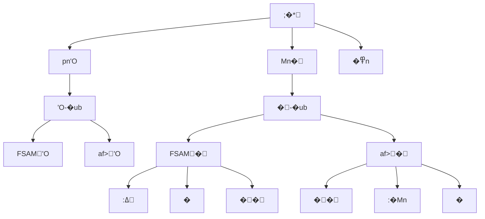

# navigation-restructure - Task 17

Execute task 17 for the navigation-restructure specification.

## Task Description
Remove dashboard button from TruckDelivery index

## Code Reuse
**Leverage existing code**: None - deletion task

## Requirements Reference
**Requirements**: US-004

## Usage
```
/Task:17-navigation-restructure
```

## Instructions

Execute with @spec-task-executor agent the following task: "Remove dashboard button from TruckDelivery index"

```
Use the @spec-task-executor agent to implement task 17: "Remove dashboard button from TruckDelivery index" for the navigation-restructure specification and include all the below context.

# Steering Context
## Steering Documents Context (Pre-loaded)

### Product Context
# Product Steering Document

## 产品愿景
加拿大快递配送区域地图系统是一个专业的物流配送管理平台，通过可视化地图技术帮助物流公司高效管理配送区域、优化定价策略，提升运营效率。

## 目标用户
- **主要用户**：物流公司运营管理人员
- **次要用户**：配送调度员、客服人员
- **管理用户**：系统管理员、价格策略制定者

## 核心功能

### 现有功能
1. **FSA区域管理**
   - 基于加拿大邮政FSA（Forward Sortation Area）的配送区域划分
   - 可视化展示1600+个FSA多边形边界
   - 区域分组管理（8个默认区域）

2. **价格配置系统**
   - 基于重量区间的阶梯定价
   - 批量导入/导出价格配置
   - 实时价格计算引擎

3. **邮编管理**
   - 完整的加拿大邮编数据库
   - FSA与邮编的映射关系
   - 邮编搜索和筛选

4. **数据管理**
   - 统一存储架构
   - 数据导入导出
   - 自动备份恢复

### 新增功能（卡车派送）
1. **城市级别管理**
   - 以城市为单位的配送区域组织
   - 城市自定义颜色主题
   - 城市下辖多个价格区域

2. **分级区域定价**
   - 每个城市包含1-4个价格区域
   - 区域按价格递增排序（1区最便宜）
   - 视觉化价格梯度（颜色深浅）

3. **增强的搜索功能**
   - 特定邮编快速定位
   - 城市/区域/邮编多级筛选
   - 实时搜索结果高亮

## 业务目标
1. **提升效率**：减少80%的配送区域配置时间
2. **降低成本**：通过优化定价策略降低15%运营成本
3. **改善体验**：提供直观的可视化界面，降低培训成本
4. **扩展性**：支持多种配送模式（标准配送、卡车派送等）

## 成功指标
- 区域配置效率提升度
- 价格策略准确率
- 用户操作错误率降低
- 系统响应时间 < 2秒
- 地图加载时间 < 5秒

## 产品路线图
### Phase 1 (已完成)
- ✅ FSA基础地图展示
- ✅ 区域管理功能
- ✅ 价格配置系统
- ✅ 数据导入导出

### Phase 2 (进行中)
- 🚀 卡车派送模块
- 🚀 城市级别管理
- 🚀 分级定价系统

### Phase 3 (计划中)
- 路线优化算法
- 实时配送追踪
- 客户自助查询
- 移动端应用

---

### Technology Context
# Technology Steering Document

## 技术栈

### 前端技术
- **框架**: React 18.2
- **构建工具**: Vite 5.0
- **路由**: React Router v7
- **样式**: 
  - Tailwind CSS 3.3
  - Cyber/Tech主题设计
- **地图引擎**: 
  - Leaflet 1.9.4
  - React Leaflet 4.2.1
- **动画**: Framer Motion 10.16
- **HTTP客户端**: Axios 1.6.0
- **图标**: Lucide React

### 数据管理
- **状态管理**: React Hooks + Context API
- **本地存储**: localStorage (统一存储架构)
- **数据格式**: JSON
- **地理数据**: GeoJSON格式的FSA边界数据

### 开发工具
- **代码规范**: ESLint
- **包管理**: npm
- **并发执行**: Concurrently
- **桌面应用**: Electron (计划中)

## 架构决策

### 统一存储架构
**决策**: 使用单一的localStorage管理系统替代分散的存储方案

**原因**:
- 简化数据同步逻辑
- 提供统一的数据访问接口
- 便于实现数据恢复和备份

**实现**:
```javascript
// 核心存储模块
src/utils/unifiedStorage.js
src/utils/dataUpdateNotifier.js
src/utils/dataRecovery.js
```

### 组件化架构
**决策**: 采用功能性组件和Hooks模式

**原因**:
- 更好的代码复用性
- 简化状态管理
- 提升开发效率

### 地图渲染策略
**决策**: 使用Leaflet配合GeoJSON渲染FSA边界

**原因**:
- Leaflet性能优秀，支持大量多边形渲染
- GeoJSON是地理数据的标准格式
- React Leaflet提供良好的React集成

## 性能要求

### 响应时间
- 页面加载: < 3秒
- 地图初始化: < 5秒
- 搜索响应: < 500ms
- 数据保存: < 1秒

### 容量限制
- FSA多边形: ~1600个
- 邮编数据: ~850,000条
- localStorage限制: 5-10MB
- 地图缩放级别: 4-18

### 优化策略
- **视口剔除**: 只渲染可见区域的FSA
- **数据分块**: 大数据批量处理时分块进行
- **防抖节流**: 搜索输入使用300ms防抖
- **懒加载**: 按需加载地图瓦片和数据

## 技术约束

### 浏览器兼容性
- Chrome 90+
- Firefox 88+
- Safari 14+
- Edge 90+

### 数据限制
- localStorage大小限制 (5-10MB)
- 单次API请求限制 (100个项目)
- 地图瓦片并发请求限制 (6个)

### 安全要求
- 所有API通信使用HTTPS
- 敏感数据不存储在localStorage
- 实施CORS策略
- XSS防护

## 第三方服务

### 地图服务
- **瓦片服务器**: CartoDB Dark Matter
- **地理编码**: 内置邮编数据库
- **坐标系统**: WGS84 (EPSG:4326)

### 数据源
- **FSA边界**: Statistics Canada 2021 Census
- **邮编数据**: Canada Post官方数据
- **城市数据**: 自维护数据库

### 后端服务 (计划中)
- **数据库**: PostgreSQL + PostGIS
- **API框架**: Node.js + Express
- **ORM**: Prisma
- **缓存**: Redis

## 开发规范

### 代码风格
- ES6+语法
- 函数式编程优先
- 组件名使用PascalCase
- 文件名使用camelCase或PascalCase

### Git工作流
- 主分支: main
- 功能分支: feature/xxx
- 修复分支: fix/xxx
- 提交信息遵循conventional commits

### 测试策略
- 单元测试 (计划中): Jest + React Testing Library
- E2E测试 (计划中): Cypress
- 性能测试: Lighthouse

## 部署架构

### 当前部署
- **静态托管**: Vercel/Netlify
- **构建**: Vite production build
- **CDN**: 自动配置

### 未来架构
- **前端**: CDN + 静态托管
- **后端**: Cloud Run/AWS Lambda
- **数据库**: Cloud SQL/RDS
- **缓存**: Cloud Memorystore/ElastiCache

---

### Structure Context
# Project Structure Steering Document

## 目录结构

```
/
├── .claude/                    # Claude AI配置
│   └── steering/              # 项目指导文档
├── public/                    # 静态资源
│   └── data/                  # FSA边界数据文件
├── src/                       # 源代码
│   ├── components/            # React组件
│   ├── data/                  # 静态数据文件
│   ├── layouts/               # 布局组件
│   ├── pages/                 # 页面组件
│   ├── router/                # 路由配置
│   ├── services/              # 服务层
│   └── utils/                 # 工具函数
├── backend/                   # 后端服务 (如果存在)
└── dist/                      # 构建输出
```

## 文件组织规范

### 组件文件 (`src/components/`)
```
components/
├── maps/                      # 地图相关组件
│   ├── AccurateFSAMap.jsx    # FSA地图主组件
│   └── TruckDeliveryMap.jsx  # 卡车派送地图（新增）
├── regions/                   # 区域管理组件
│   ├── RegionManagementPanel.jsx
│   └── RegionSelector.jsx
├── cities/                    # 城市管理组件（新增）
│   ├── CityManager.jsx
│   └── CityRegionEditor.jsx
└── common/                    # 通用组件
    ├── SearchPanel.jsx
    └── ImportExportManager.jsx
```

### 页面文件 (`src/pages/`)
```
pages/
├── Dashboard/                 # 仪表板
│   └── index.jsx
├── Settings/                  # 设置页面
│   ├── index.jsx
│   ├── RegionSettings.jsx
│   ├── PriceSettings.jsx
│   └── PostalSettings.jsx
└── TruckDelivery/            # 卡车派送（新增）
    ├── index.jsx
    ├── CityView.jsx
    └── RegionDetail.jsx
```

### 工具文件 (`src/utils/`)
```
utils/
├── storage/                   # 存储相关
│   ├── unifiedStorage.js     # 统一存储
│   ├── cityStorage.js        # 城市存储（新增）
│   └── truckDeliveryStorage.js # 卡车派送存储（新增）
├── api/                       # API相关
│   └── apiClient.js
└── helpers/                   # 辅助函数
    ├── geoHelpers.js
    └── priceCalculator.js
```

## 命名规范

### 文件命名
- **组件文件**: PascalCase (如 `RegionManager.jsx`)
- **工具文件**: camelCase (如 `dataHelper.js`)
- **样式文件**: camelCase (如 `styles.module.css`)
- **常量文件**: SCREAMING_SNAKE_CASE (如 `CONSTANTS.js`)

### 变量命名
```javascript
// 组件
const RegionManager = () => { ... }

// 函数
const calculateDeliveryPrice = (weight, region) => { ... }

// 常量
const MAX_REGIONS_PER_CITY = 4;

// 状态
const [selectedCity, setSelectedCity] = useState(null);
```

### CSS类命名
```css
/* BEM风格 + Tailwind */
.city-selector__header { }
.city-selector__item--active { }

/* Tailwind优先 */
className="flex flex-col gap-4 p-6 bg-gray-900"
```

## 数据模型规范

### FSA数据结构
```javascript
{
  fsa: 'M5V',
  province: 'ON',
  city: 'Toronto',
  lat: 43.6426,
  lng: -79.3871,
  postalCodes: ['M5V 3A8', 'M5V 1A1']
}
```

### 城市数据结构（新增）
```javascript
{
  id: 'city-uuid',
  name: 'Toronto',
  province: 'ON',
  color: '#FF5733',        // 城市主题色
  regions: [
    {
      id: 'region-1',
      level: 1,            // 1-4区
      name: '市中心配送区',
      fsaCodes: ['M5V', 'M5G'],
      postalCodes: [],
      priceMultiplier: 1.0, // 价格系数
      color: '#FFE5B4'     // 浅色表示便宜
    }
  ],
  metadata: {
    createdAt: '2024-01-01T00:00:00Z',
    updatedAt: '2024-01-01T00:00:00Z'
  }
}
```

### 价格配置结构
```javascript
{
  basePrice: 15.99,
  weightRanges: [
    { min: 0, max: 10, price: 15.99 },
    { min: 10, max: 20, price: 25.99 }
  ],
  regionMultipliers: {
    '1': 1.0,  // 1区无加价
    '2': 1.2,  // 2区加价20%
    '3': 1.5,  // 3区加价50%
    '4': 2.0   // 4区加价100%
  }
}
```

## 新功能集成指南

### 添加卡车派送功能步骤

1. **创建页面路由**
```javascript
// src/router/index.jsx
{
  path: 'truck-delivery',
  element: <TruckDelivery />
}
```

2. **添加导航菜单**
```javascript
// src/layouts/MainLayout.jsx
<NavLink to="/truck-delivery">卡车派送</NavLink>
```

3. **实现数据存储**
```javascript
// src/utils/storage/cityStorage.js
export const getCities = () => { ... }
export const updateCity = (cityId, data) => { ... }
```

4. **创建UI组件**
```javascript
// src/components/cities/CityManager.jsx
const CityManager = () => {
  // 城市CRUD逻辑
}
```

5. **集成地图展示**
```javascript
// src/components/maps/TruckDeliveryMap.jsx
const TruckDeliveryMap = ({ cities, selectedCity }) => {
  // 城市和区域可视化
}
```

## 代码组织原则

### 单一职责
每个组件/模块只负责一个功能领域

### 依赖注入
通过props传递依赖，避免硬编码

### 数据流向
- 自上而下的数据流
- 通过回调函数向上传递事件
- 使用Context API共享全局状态

### 错误处理
```javascript
try {
  const data = await fetchCityData(cityId);
  return data;
} catch (error) {
  console.error('获取城市数据失败:', error);
  // 显示用户友好的错误信息
  showNotification('加载失败，请重试');
  return null;
}
```

## 测试规范

### 单元测试
- 测试文件与源文件同目录
- 命名: `ComponentName.test.jsx`
- 覆盖率目标: 80%

### 集成测试
- 测试用户操作流程
- 使用React Testing Library
- 模拟API响应

### E2E测试
- 关键用户路径
- 使用Cypress
- 定期运行回归测试

**Note**: Steering documents have been pre-loaded. Do not use get-content to fetch them again.

# Specification Context
## Specification Context (Pre-loaded): navigation-restructure

### Requirements
# �*��B�c

## ����
Ͱ�����*ӄpn'Oe���n:pnU:'O	���Mn�	��:�Лp��*B���}�(7S�

## �o�
SM��X(��
1. **e��q**pn'Oe�c(;�*"pn'O"af>ub��"pn'O"	�	
2. **���B**Mn��pnU:���(w�	p�:
3. **�*
�**
ub�epn'O��
�
4. **(7S��**(7���~0@��

## (7E�

### US-001: �pn'Oe�
**\:** ��(7  
**�** (*��0���@	pn'O  
**�** ��
���pn��

**�6�**:
- WHEN ��;�*�"pn'O"�U THEN �0@	�(�pn'Oh
- WHEN (pn'Ohu THEN �0"FSAM'O"�"af>'O"$*	y
- WHEN 	��'O THEN �����l0���hOpnU:ub
- IF *e��v�'O THEN ��{~��0h-

### US-002: �Mn���
**\:** �ߡX  
**�** @	Mn����-(*�˄:�  
**�** ��H0�L��Mn��

**�6�**:
- WHEN ��;�*�"Mn�"�U THEN �0@	Mn	y
- WHEN (Mn�ub THEN �0"FSAM�"�"af>�"$*;�{
- WHEN 	�FSAM� THEN >::ߡ�<Mn��IP��
- WHEN 	�af>� THEN >:��:�MnIP��
- IF Mnub�	pn��B THEN �����^�l0'O

### US-003: �*B�ӄ
**\:** ��(7  
**�** p��*B�  
**�** ����ӄv~0@��

**�6�**:
- WHEN �;�* THEN �>:��Upn'OMn��߾n
- WHEN �e�;�U THEN >:�������h
- WHEN (�Uub THEN bQ�*p>:�Mn
- IF ��b THEN Л�w�*ѿ��

### US-004: �d�Ye�
**\:** ����  
**�** �d@	�
��*e�  
**�** MN��,�(7��

**�6�**:
- WHEN (af>�ub THEN 
�>:"pn'O"	�
- WHEN ��af>'O THEN �;�*"pn'O"e��e
- WHEN ���� THEN @	ub��pn'O�we��d
- IF Лub�pn�� THEN (�L���h��^�l

### US-005: ��:��{�
**\:** ��(7  
**�** ��ɾ��:
{����  
**�** ���\H�����\

**�6�**:
- WHEN ��*�U THEN pn'O{��(�h�s��MonitorBarChart	
- WHEN ��*�U THEN Mn�{��(�n�s��SettingsSliders	
- WHEN (pn'Oub THEN ub�(�r;��hO@
- WHEN (Mn�ub THEN ub�(�@�hULb

## ^��B

### NFR-001: '��B
- �*b͔�� < 200ms
- ub�}�� < 3�
- /Ҡ}�ˠ}

### NFR-002: ���'
- �*Mn�-�
- /�����'O�!W
- �1Mnp�iU

### NFR-003: (7S�
- ��	(7��\`�
- Лsф�!�;
- ͔��/
OU:�

## �/�_
- (�	�React Router v6�1��
- ��	�Tailwind CSS7F�
- |��	����pnӄ
- 
qͰ	��;��pnA

## ��H�
1. **P0 - �{��**�pn'Oe��Mn�
2. **P1 - �垰**�*B��d�Ye�
3. **P2 - �垰**��:�w�*��

## �i�
- **�i**�	(7`�9��� �p
  - **�**Лp���.��c
- **�i**�1̈́��qͰ	��
  - **�**�Y��1�͚e��

## ��
- (7�(3!���0��U��ub
- �*ӄp�(7���
- �ӄ��!W����
- *e�������98��*;�

---

### Design
# �*�ľ��c

## ����

### �*ӄ�ĹH



### �1����

```mermaid
graph LR
    A[/] --> A1[�u - ͚0 /dashboards]
    
    B[/dashboards] --> B1[pn'O-�]
    B --> B2[/dashboards/fsa]
    B --> B3[/dashboards/truck-delivery]
    
    C[/management] --> C1[�-�]
    C --> C2[/management/fsa]
    C --> C3[/management/truck-delivery]
    
    C2 --> C21[/management/fsa/regions]
    C2 --> C22[/management/fsa/prices]
    C2 --> C23[/management/fsa/postal-codes]
    
    C3 --> C31[/management/truck-delivery/cities]
    C3 --> C32[/management/truck-delivery/city/:id]
    
    D[/settings] --> D1[�߾n]
```

## ����

### 1. ;�*��̈́ (MainLayout.jsx)

**9���**
- �navigationp�:3*;�Uy
- �dquickLinks�w��
- 9nSM>:P�*

```javascript
const navigation = [
  { 
    name: 'pn'O', 
    href: '/dashboards', 
    icon: Monitor,
    description: 'pn��-�'
  },
  { 
    name: 'Mn�', 
    href: '/management', 
    icon: Sliders,
    description: '��Mn-�'
  },
  { 
    name: '�߾n', 
    href: '/settings', 
    icon: Settings,
    description: '���p�n'
  }
];
```

### 2. ��pn'O-�u (DashboardHub.jsx)

**����**
- U:@	�(�pn'OaG
- �*aG+������
- ���e���hO'O

```javascript
const dashboards = [
  {
    id: 'fsa-delivery',
    title: 'FSAMpn'O',
    description: '��ѧFSA:�M�',
    icon: MapPin,
    color: 'from-blue-500 to-cyan-500',
    href: '/dashboards/fsa',
    preview: '/previews/fsa-dashboard.png'
  },
  {
    id: 'truck-delivery',
    title: 'af>pn'O',
    description: '�MQܞ�ѧ',
    icon: Truck,
    color: 'from-purple-500 to-pink-500',
    href: '/dashboards/truck-delivery',
    preview: '/previews/truck-dashboard.png'
  }
];
```

### 3. ���-�u (ManagementHub.jsx)

**����**
- {U:�!W
- ���e�
- >:!W�ߡ�o

```javascript
const managementModules = {
  fsa: {
    title: 'FSAM�',
    icon: Package,
    modules: [
      { name: ':ߡ', href: '/management/fsa/regions', icon: Map },
      { name: '�<Mn', href: '/management/fsa/prices', icon: DollarSign },
      { name: '��', href: '/management/fsa/postal-codes', icon: MapPin }
    ]
  },
  truck: {
    title: 'af>�',
    icon: Truck,
    modules: [
      { name: '��', href: '/management/truck-delivery/cities', icon: Building2 },
      { name: ':�Mn', href: '/management/truck-delivery/regions', icon: Layers },
      { name: '�<Ve', href: '/management/truck-delivery/pricing', icon: Calculator }
    ]
  }
};
```

### 4. �1̈́��

**�1ӄt**
```javascript
// ��1ӄ
const router = createBrowserRouter([
  {
    path: '/',
    element: <MainLayout />,
    children: [
      // �u͚0pn'O-�
      {
        index: true,
        element: <Navigate to="/dashboards" replace />
      },
      // pn'O!W
      {
        path: 'dashboards',
        children: [
          {
            index: true,
            element: <DashboardHub />
          },
          {
            path: 'fsa',
            element: <FSADashboard />
          },
          {
            path: 'truck-delivery',
            element: <TruckDeliveryDashboard />
          }
        ]
      },
      // �-�!W
      {
        path: 'management',
        children: [
          {
            index: true,
            element: <ManagementHub />
          },
          {
            path: 'fsa',
            element: <FSAManagementLayout />,
            children: [
              { path: 'regions', element: <RegionSettings /> },
              { path: 'prices', element: <PriceSettings /> },
              { path: 'postal-codes', element: <PostalSettings /> }
            ]
          },
          {
            path: 'truck-delivery',
            element: <TruckManagementLayout />,
            children: [
              { path: 'cities', element: <TruckDelivery /> },
              { path: 'city/:cityId', element: <CityView /> }
            ]
          }
        ]
      },
      // �߾n
      {
        path: 'settings',
        element: <Settings />
      }
    ]
  }
]);
```

## pnA��

### �*��

```mermaid
graph TB
    A[URL�] --> B[MainLayout]
    B --> C{�$�}
    C -->|/dashboards| D[�ϧ�"]
    C -->|/management| E[>:�P�U]
    C -->|/settings| F[>:�n	y]
    
    D --> G[hO'O!]
    E --> H[ơLb]
    F --> I[�nLb]
```

### bQ�*;�

```javascript
// bQ;�
const generateBreadcrumbs = (pathname) => {
  const paths = pathname.split('/').filter(Boolean);
  const breadcrumbs = [];
  
  paths.forEach((path, index) => {
    const href = '/' + paths.slice(0, index + 1).join('/');
    const name = pathNameMap[path] || path;
    breadcrumbs.push({ name, href });
  });
  
  return breadcrumbs;
};
```

## 7��

### ��:Ve

1. **pn'O{**
   - �r�o (bg-gray-900)
   - �r	��aG
   - hO@�*
   - (MonitorBarChart3I�

2. **Mn�{**
   - ��o (bg-gray-800)
   - �r	��hU
   - ��+��:@
   - (SettingsSlidersI�

3. **�!�;**
   ```css
   /* ubb�; */
   .page-transition {
     animation: fadeIn 0.3s ease-in-out;
   }
   
   /* �*خ�; */
   .nav-active {
     transition: all 0.2s ease;
     background: linear-gradient(to right, theme('colors.blue.600'), theme('colors.blue.700'));
   }
   ```

## |�'��

### ��1͚

```javascript
// �|�
const redirects = [
  { from: '/settings/regions', to: '/management/fsa/regions' },
  { from: '/settings/prices', to: '/management/fsa/prices' },
  { from: '/settings/postal-codes', to: '/management/fsa/postal-codes' },
  { from: '/truck-delivery', to: '/management/truck-delivery/cities' },
  { from: '/truck-delivery/dashboard', to: '/dashboards/truck-delivery' },
  { from: '/', to: '/dashboards' }
];
```

### pn��

�pn��@	pnX��
��t���

## ��Ve

### 6���

1. **Phase 1: �@��**
   - �DashboardHub�ManagementHub��
   - t�1Mn
   - ��͚;�

2. **Phase 2: �*̈́**
   - �9MainLayout�*ӄ
   - ���P�U
   - ��bQ�*

3. **Phase 3: ub��**
   - t�	ub�
   - �d�Ye�
   - ������

4. **Phase 4: ��**
   - ���!�;
   - ���w�*
   - '�

## �/Ƃ

### ��
(Ve

- **
(�	��**
  - AccurateFSAMap - FSA0���
  - RegionManagementPanel - :ߡb
  - @	�	�Settingsub��
  
- **��9���**
  - MainLayout - �*ӄ
  - TruckDelivery/index.jsx - �dpn'O	�
  - Dashboard/index.jsx - t:FSADashboard

### '�

- (React.lazy�L�1Ҡ}
- ���1��}Ve
- 'O���2�'�
- (React.memo�*��

## K�Ve

### UCK�
- �*��2�K�
- �1�lK�
- ͚;�K�

### �K�
- �t�*AK�
- pn�}K�
- ubb'�K�

### (7�6K�
- �*('K�
- ���t'��
- '���

**Note**: Specification documents have been pre-loaded. Do not use get-content to fetch them again.

## Task Details
- Task ID: 17
- Description: Remove dashboard button from TruckDelivery index
- Leverage: None - deletion task
- Requirements: US-004

## Instructions
- Implement ONLY task 17: "Remove dashboard button from TruckDelivery index"
- Follow all project conventions and leverage existing code
- Mark the task as complete using: claude-code-spec-workflow get-tasks navigation-restructure 17 --mode complete
- Provide a completion summary
```

## Task Completion
When the task is complete, mark it as done:
```bash
claude-code-spec-workflow get-tasks navigation-restructure 17 --mode complete
```

## Next Steps
After task completion, you can:
- Execute the next task using /navigation-restructure-task-[next-id]
- Check overall progress with /spec-status navigation-restructure
