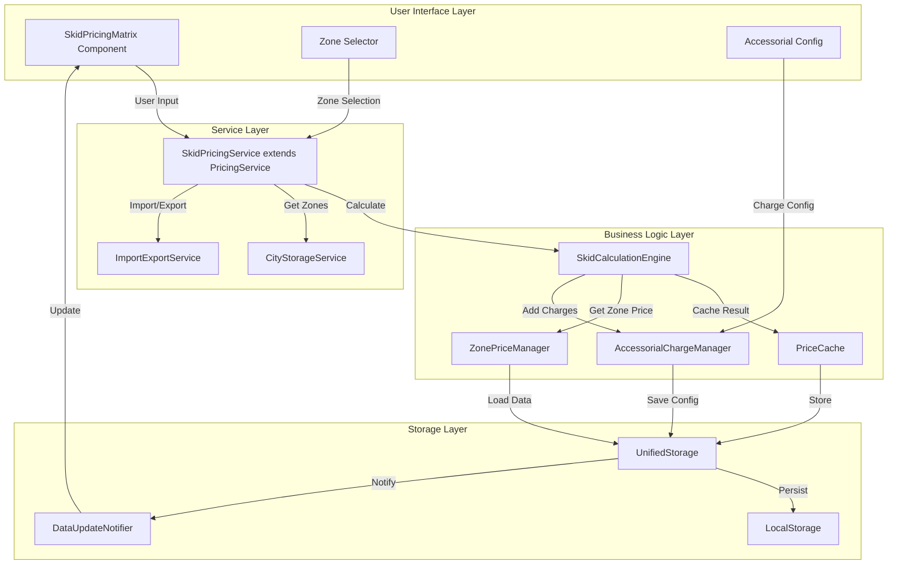
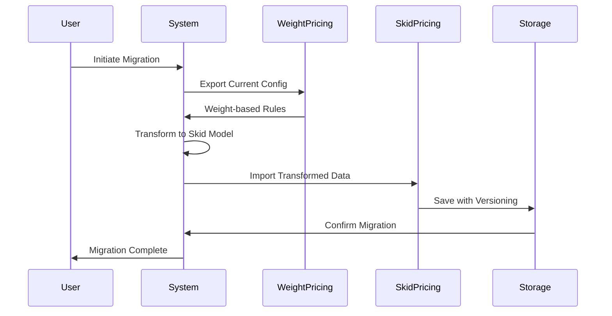

# skid-based-pricing - Task 1

Execute task 1 for the skid-based-pricing specification.

## Task Description
Create skid pricing type definitions in src/types/skidPricing.js

## Code Reuse
**Leverage existing code**: src/types/pricing.ts structure

## Requirements Reference
**Requirements**: 1.1, 2.1

## Usage
```
/Task:1-skid-based-pricing
```

## Instructions

Execute with @spec-task-executor agent the following task: "Create skid pricing type definitions in src/types/skidPricing.js"

```
Use the @spec-task-executor agent to implement task 1: "Create skid pricing type definitions in src/types/skidPricing.js" for the skid-based-pricing specification and include all the below context.

# Steering Context
## Steering Documents Context (Pre-loaded)

### Product Context
# Product Steering Document

## 产品愿景
加拿大快递配送区域地图系统是一个专业的物流配送管理平台，通过可视化地图技术帮助物流公司高效管理配送区域、优化定价策略，提升运营效率。

## 目标用户
- **主要用户**：物流公司运营管理人员
- **次要用户**：配送调度员、客服人员
- **管理用户**：系统管理员、价格策略制定者

## 核心功能

### 现有功能
1. **FSA区域管理**
   - 基于加拿大邮政FSA（Forward Sortation Area）的配送区域划分
   - 可视化展示1600+个FSA多边形边界
   - 区域分组管理（8个默认区域）

2. **价格配置系统**
   - 基于重量区间的阶梯定价
   - 批量导入/导出价格配置
   - 实时价格计算引擎

3. **邮编管理**
   - 完整的加拿大邮编数据库
   - FSA与邮编的映射关系
   - 邮编搜索和筛选

4. **数据管理**
   - 统一存储架构
   - 数据导入导出
   - 自动备份恢复

### 新增功能（卡车派送）
1. **城市级别管理**
   - 以城市为单位的配送区域组织
   - 城市自定义颜色主题
   - 城市下辖多个价格区域

2. **分级区域定价**
   - 每个城市包含1-4个价格区域
   - 区域按价格递增排序（1区最便宜）
   - 视觉化价格梯度（颜色深浅）

3. **增强的搜索功能**
   - 特定邮编快速定位
   - 城市/区域/邮编多级筛选
   - 实时搜索结果高亮

## 业务目标
1. **提升效率**：减少80%的配送区域配置时间
2. **降低成本**：通过优化定价策略降低15%运营成本
3. **改善体验**：提供直观的可视化界面，降低培训成本
4. **扩展性**：支持多种配送模式（标准配送、卡车派送等）

## 成功指标
- 区域配置效率提升度
- 价格策略准确率
- 用户操作错误率降低
- 系统响应时间 < 2秒
- 地图加载时间 < 5秒

## 产品路线图
### Phase 1 (已完成)
- ✅ FSA基础地图展示
- ✅ 区域管理功能
- ✅ 价格配置系统
- ✅ 数据导入导出

### Phase 2 (进行中)
- 🚀 卡车派送模块
- 🚀 城市级别管理
- 🚀 分级定价系统

### Phase 3 (计划中)
- 路线优化算法
- 实时配送追踪
- 客户自助查询
- 移动端应用

---

### Technology Context
# Technology Steering Document

## 技术栈

### 前端技术
- **框架**: React 18.2
- **构建工具**: Vite 5.0
- **路由**: React Router v7
- **样式**: 
  - Tailwind CSS 3.3
  - Cyber/Tech主题设计
- **地图引擎**: 
  - Leaflet 1.9.4
  - React Leaflet 4.2.1
- **动画**: Framer Motion 10.16
- **HTTP客户端**: Axios 1.6.0
- **图标**: Lucide React

### 数据管理
- **状态管理**: React Hooks + Context API
- **本地存储**: localStorage (统一存储架构)
- **数据格式**: JSON
- **地理数据**: GeoJSON格式的FSA边界数据

### 开发工具
- **代码规范**: ESLint
- **包管理**: npm
- **并发执行**: Concurrently
- **桌面应用**: Electron (计划中)

## 架构决策

### 统一存储架构
**决策**: 使用单一的localStorage管理系统替代分散的存储方案

**原因**:
- 简化数据同步逻辑
- 提供统一的数据访问接口
- 便于实现数据恢复和备份

**实现**:
```javascript
// 核心存储模块
src/utils/unifiedStorage.js
src/utils/dataUpdateNotifier.js
src/utils/dataRecovery.js
```

### 组件化架构
**决策**: 采用功能性组件和Hooks模式

**原因**:
- 更好的代码复用性
- 简化状态管理
- 提升开发效率

### 地图渲染策略
**决策**: 使用Leaflet配合GeoJSON渲染FSA边界

**原因**:
- Leaflet性能优秀，支持大量多边形渲染
- GeoJSON是地理数据的标准格式
- React Leaflet提供良好的React集成

## 性能要求

### 响应时间
- 页面加载: < 3秒
- 地图初始化: < 5秒
- 搜索响应: < 500ms
- 数据保存: < 1秒

### 容量限制
- FSA多边形: ~1600个
- 邮编数据: ~850,000条
- localStorage限制: 5-10MB
- 地图缩放级别: 4-18

### 优化策略
- **视口剔除**: 只渲染可见区域的FSA
- **数据分块**: 大数据批量处理时分块进行
- **防抖节流**: 搜索输入使用300ms防抖
- **懒加载**: 按需加载地图瓦片和数据

## 技术约束

### 浏览器兼容性
- Chrome 90+
- Firefox 88+
- Safari 14+
- Edge 90+

### 数据限制
- localStorage大小限制 (5-10MB)
- 单次API请求限制 (100个项目)
- 地图瓦片并发请求限制 (6个)

### 安全要求
- 所有API通信使用HTTPS
- 敏感数据不存储在localStorage
- 实施CORS策略
- XSS防护

## 第三方服务

### 地图服务
- **瓦片服务器**: CartoDB Dark Matter
- **地理编码**: 内置邮编数据库
- **坐标系统**: WGS84 (EPSG:4326)

### 数据源
- **FSA边界**: Statistics Canada 2021 Census
- **邮编数据**: Canada Post官方数据
- **城市数据**: 自维护数据库

### 后端服务 (计划中)
- **数据库**: PostgreSQL + PostGIS
- **API框架**: Node.js + Express
- **ORM**: Prisma
- **缓存**: Redis

## 开发规范

### 代码风格
- ES6+语法
- 函数式编程优先
- 组件名使用PascalCase
- 文件名使用camelCase或PascalCase

### Git工作流
- 主分支: main
- 功能分支: feature/xxx
- 修复分支: fix/xxx
- 提交信息遵循conventional commits

### 测试策略
- 单元测试 (计划中): Jest + React Testing Library
- E2E测试 (计划中): Cypress
- 性能测试: Lighthouse

## 部署架构

### 当前部署
- **静态托管**: Vercel/Netlify
- **构建**: Vite production build
- **CDN**: 自动配置

### 未来架构
- **前端**: CDN + 静态托管
- **后端**: Cloud Run/AWS Lambda
- **数据库**: Cloud SQL/RDS
- **缓存**: Cloud Memorystore/ElastiCache

---

### Structure Context
# Project Structure Steering Document

## 目录结构

```
/
├── .claude/                    # Claude AI配置
│   └── steering/              # 项目指导文档
├── public/                    # 静态资源
│   └── data/                  # FSA边界数据文件
├── src/                       # 源代码
│   ├── components/            # React组件
│   ├── data/                  # 静态数据文件
│   ├── layouts/               # 布局组件
│   ├── pages/                 # 页面组件
│   ├── router/                # 路由配置
│   ├── services/              # 服务层
│   └── utils/                 # 工具函数
├── backend/                   # 后端服务 (如果存在)
└── dist/                      # 构建输出
```

## 文件组织规范

### 组件文件 (`src/components/`)
```
components/
├── maps/                      # 地图相关组件
│   ├── AccurateFSAMap.jsx    # FSA地图主组件
│   └── TruckDeliveryMap.jsx  # 卡车派送地图（新增）
├── regions/                   # 区域管理组件
│   ├── RegionManagementPanel.jsx
│   └── RegionSelector.jsx
├── cities/                    # 城市管理组件（新增）
│   ├── CityManager.jsx
│   └── CityRegionEditor.jsx
└── common/                    # 通用组件
    ├── SearchPanel.jsx
    └── ImportExportManager.jsx
```

### 页面文件 (`src/pages/`)
```
pages/
├── Dashboard/                 # 仪表板
│   └── index.jsx
├── Settings/                  # 设置页面
│   ├── index.jsx
│   ├── RegionSettings.jsx
│   ├── PriceSettings.jsx
│   └── PostalSettings.jsx
└── TruckDelivery/            # 卡车派送（新增）
    ├── index.jsx
    ├── CityView.jsx
    └── RegionDetail.jsx
```

### 工具文件 (`src/utils/`)
```
utils/
├── storage/                   # 存储相关
│   ├── unifiedStorage.js     # 统一存储
│   ├── cityStorage.js        # 城市存储（新增）
│   └── truckDeliveryStorage.js # 卡车派送存储（新增）
├── api/                       # API相关
│   └── apiClient.js
└── helpers/                   # 辅助函数
    ├── geoHelpers.js
    └── priceCalculator.js
```

## 命名规范

### 文件命名
- **组件文件**: PascalCase (如 `RegionManager.jsx`)
- **工具文件**: camelCase (如 `dataHelper.js`)
- **样式文件**: camelCase (如 `styles.module.css`)
- **常量文件**: SCREAMING_SNAKE_CASE (如 `CONSTANTS.js`)

### 变量命名
```javascript
// 组件
const RegionManager = () => { ... }

// 函数
const calculateDeliveryPrice = (weight, region) => { ... }

// 常量
const MAX_REGIONS_PER_CITY = 4;

// 状态
const [selectedCity, setSelectedCity] = useState(null);
```

### CSS类命名
```css
/* BEM风格 + Tailwind */
.city-selector__header { }
.city-selector__item--active { }

/* Tailwind优先 */
className="flex flex-col gap-4 p-6 bg-gray-900"
```

## 数据模型规范

### FSA数据结构
```javascript
{
  fsa: 'M5V',
  province: 'ON',
  city: 'Toronto',
  lat: 43.6426,
  lng: -79.3871,
  postalCodes: ['M5V 3A8', 'M5V 1A1']
}
```

### 城市数据结构（新增）
```javascript
{
  id: 'city-uuid',
  name: 'Toronto',
  province: 'ON',
  color: '#FF5733',        // 城市主题色
  regions: [
    {
      id: 'region-1',
      level: 1,            // 1-4区
      name: '市中心配送区',
      fsaCodes: ['M5V', 'M5G'],
      postalCodes: [],
      priceMultiplier: 1.0, // 价格系数
      color: '#FFE5B4'     // 浅色表示便宜
    }
  ],
  metadata: {
    createdAt: '2024-01-01T00:00:00Z',
    updatedAt: '2024-01-01T00:00:00Z'
  }
}
```

### 价格配置结构
```javascript
{
  basePrice: 15.99,
  weightRanges: [
    { min: 0, max: 10, price: 15.99 },
    { min: 10, max: 20, price: 25.99 }
  ],
  regionMultipliers: {
    '1': 1.0,  // 1区无加价
    '2': 1.2,  // 2区加价20%
    '3': 1.5,  // 3区加价50%
    '4': 2.0   // 4区加价100%
  }
}
```

## 新功能集成指南

### 添加卡车派送功能步骤

1. **创建页面路由**
```javascript
// src/router/index.jsx
{
  path: 'truck-delivery',
  element: <TruckDelivery />
}
```

2. **添加导航菜单**
```javascript
// src/layouts/MainLayout.jsx
<NavLink to="/truck-delivery">卡车派送</NavLink>
```

3. **实现数据存储**
```javascript
// src/utils/storage/cityStorage.js
export const getCities = () => { ... }
export const updateCity = (cityId, data) => { ... }
```

4. **创建UI组件**
```javascript
// src/components/cities/CityManager.jsx
const CityManager = () => {
  // 城市CRUD逻辑
}
```

5. **集成地图展示**
```javascript
// src/components/maps/TruckDeliveryMap.jsx
const TruckDeliveryMap = ({ cities, selectedCity }) => {
  // 城市和区域可视化
}
```

## 代码组织原则

### 单一职责
每个组件/模块只负责一个功能领域

### 依赖注入
通过props传递依赖，避免硬编码

### 数据流向
- 自上而下的数据流
- 通过回调函数向上传递事件
- 使用Context API共享全局状态

### 错误处理
```javascript
try {
  const data = await fetchCityData(cityId);
  return data;
} catch (error) {
  console.error('获取城市数据失败:', error);
  // 显示用户友好的错误信息
  showNotification('加载失败，请重试');
  return null;
}
```

## 测试规范

### 单元测试
- 测试文件与源文件同目录
- 命名: `ComponentName.test.jsx`
- 覆盖率目标: 80%

### 集成测试
- 测试用户操作流程
- 使用React Testing Library
- 模拟API响应

### E2E测试
- 关键用户路径
- 使用Cypress
- 定期运行回归测试

**Note**: Steering documents have been pre-loaded. Do not use get-content to fetch them again.

# Specification Context
## Specification Context (Pre-loaded): skid-based-pricing

### Requirements
# Requirements Document - Skid-Based Dynamic Pricing System

## Introduction

The current dynamic pricing system relies on weight ranges for price calculation, which does not align with industry standards. Based on the provided rate card, the logistics industry standard is to price based on skids (pallets) with different price zones for different delivery regions. This feature will restructure the existing pricing system to implement a skid-based tiered pricing model that matches real-world business practices.

## Alignment with Product Vision

This feature directly supports the product vision goals outlined in product.md:

1. **Efficiency Enhancement**: Accurate skid-based pricing reduces manual calculation errors by 80%
2. **Cost Reduction**: Proper pricing strategies help optimize operational costs by 15%
3. **User Experience**: Industry-standard pricing interface reduces training requirements
4. **Scalability**: Provides flexible pricing configuration for truck delivery module (Phase 2)

The feature aligns with Phase 2 objectives for truck delivery module enhancement, specifically supporting city-level management and tiered regional pricing.

## Requirements

### Requirement 1: Skid-Based Pricing Model

**User Story:** As a logistics operations manager, I want to configure prices based on skids rather than weight, so that our pricing aligns with industry standards

#### Acceptance Criteria

1. WHEN the user opens pricing configuration THEN the system SHALL display a skid-based price configuration interface
2. WHEN entering skid ranges THEN the system SHALL support configurations from 1 skid to 16+ skids
3. IF the user configures a price for a specific skid count THEN the system SHALL save and apply that price for quotes
4. WHEN skid count exceeds 16 THEN the system SHALL apply the "16+" pricing rule
5. IF there are gaps in skid range configuration THEN the system SHALL display a validation warning

### Requirement 2: Multi-Zone Price Matrix

**User Story:** As a pricing strategist, I want to set different prices for different delivery zones, so that pricing reflects actual delivery distances and costs

#### Acceptance Criteria

1. WHEN viewing pricing configuration THEN the system SHALL display price columns for Zone 1 through Zone 5
2. IF a specific zone is selected THEN the system SHALL highlight that zone's price column
3. WHEN a zone has no configuration THEN the system SHALL display it as empty with option to configure
4. IF the user edits zone prices THEN the system SHALL support bulk copy and paste operations
5. WHEN saving zone prices AND Zone X price is lower than Zone X-1 THEN the system SHALL display a warning about price inconsistency

### Requirement 3: Price Table Import/Export

**User Story:** As a system administrator, I want to import Excel-formatted price tables, so that I can quickly migrate existing pricing data

#### Acceptance Criteria

1. WHEN clicking import button THEN the system SHALL accept Excel (.xlsx) and CSV format files
2. IF the file format is incorrect THEN the system SHALL display detailed error messages with format requirements
3. WHEN import is successful THEN the system SHALL display number of records imported and update status
4. WHEN exporting price table THEN the system SHALL generate a complete price matrix with all zones and skid counts
5. IF imported data conflicts with existing data THEN the system SHALL provide conflict resolution options (overwrite/skip/merge)

### Requirement 4: Accessorial Charges Configuration

**User Story:** As a finance officer, I want to configure special accessorial charges, so that special delivery situations are properly priced

#### Acceptance Criteria

1. WHEN configuring accessorial charges THEN the system SHALL support common items like tailgate service and residential delivery
2. IF an accessorial item is selected THEN the system SHALL allow setting fixed amount or percentage fees
3. WHEN accessorial charges are enabled THEN the system SHALL automatically include them in price calculations
4. WHEN viewing a quote THEN the system SHALL clearly display base price and accessorial charge breakdown
5. IF accessorial charges are modified THEN the system SHALL log the change history with effective dates

### Requirement 5: Real-Time Price Calculation

**User Story:** As a customer service representative, I want to get accurate quotes immediately after entering skid count and zone, so that I can quickly respond to customer inquiries

#### Acceptance Criteria

1. WHEN entering skid count THEN the system SHALL display calculated price within 500ms
2. IF a different zone is selected THEN the system SHALL update the price display in real-time
3. WHEN skid count exceeds configured range THEN the system SHALL use the highest skid tier's incremental rule
4. IF accessorial charges are included THEN the system SHALL display itemized charges and total price
5. WHEN price calculation is complete THEN the system SHALL provide a one-click copy quote function

## Non-Functional Requirements

### Performance
- Price calculation response time < 500ms
- Price table load time < 2 seconds
- Support 100 concurrent price queries
- Excel import of 10,000 records < 30 seconds

### Security
- Price configuration changes require administrator privileges
- All price changes logged in audit trail
- Sensitive pricing data transmitted via HTTPS
- Support price configuration versioning and rollback

### Reliability
- System availability > 99.9%
- Price calculation accuracy 100%
- Daily automated backups
- Support hot-reload of price configurations without system restart

### Usability
- Excel-like price table interface requiring no training
- Keyboard shortcuts for rapid editing
- Downloadable price configuration templates
- Real-time input validation to prevent configuration errors
- Multi-language support (Chinese/English)

---

### Design
# Design Document - Skid-Based Dynamic Pricing System

## Overview

This design document outlines the technical architecture for transforming the existing weight-based pricing system into a skid-based pricing model. The new system will extend the current pricing infrastructure, reusing existing services and storage patterns while introducing skid-specific calculation logic and a zone-based price matrix interface.

## Steering Document Alignment

### Technical Standards (tech.md)
- **React 18.2 + Vite**: Utilize existing React component architecture with JavaScript/JSX
- **Tailwind CSS**: Maintain cyber/tech theme consistency across new components
- **Unified Storage**: Extend existing `unifiedStorage.js` patterns for data persistence
- **Performance**: Implement Redis-like caching in localStorage for < 500ms response time
- **Internationalization**: Use existing i18n patterns for Chinese/English support

### Project Structure (structure.md)
Following existing conventions:
```
src/
├── components/pricing/skid/      # New skid pricing components
│   ├── SkidPricingMatrix.jsx
│   ├── SkidZoneSelector.jsx
│   └── AccessorialConfig.jsx
├── utils/pricing/                # Extended pricing utilities
│   ├── skidCalculator.js         # New skid calculation engine
│   └── skidPriceCache.js         # Performance optimization
└── services/                     # Extended services
    └── skidPricingService.js     # Extends existing pricingService
```

## Code Reuse Analysis

### Existing Components to Leverage
- **PricingRuleList** (`src/components/pricing/PricingRuleList.jsx`): Extend for skid rule display
- **EnhancedPricingRuleEditor** (`src/components/pricing/EnhancedPricingRuleEditor.jsx`): Adapt editor for skid configuration
- **PriceCalculationEngine** (`src/utils/pricing/priceCalculationEngine.js`): Base class for skid calculations
- **cityStorageService** (`src/utils/storage/cityStorage.js`): Zone data management
- **pricingService** (`src/services/pricingService.js`): Extend with skid methods
- **unifiedStorage** (`src/utils/unifiedStorage.js`): Data persistence layer
- **importExportService** (`src/utils/truck/importExportService.js`): Excel/CSV handling

### Integration Points
- **Storage Layer**: Extend existing localStorage keys with `skidPricing_*` prefix
- **API Client**: Use existing `apiClient.js` patterns for backend communication
- **Data Update Notifier**: Subscribe to `dataUpdateNotifier` for real-time sync
- **Audit System**: Integrate with existing audit logging via storage metadata

## Architecture

### Data Flow Diagram


### Migration Strategy


## Components and Interfaces

### Component 1: SkidPricingMatrix
- **Purpose:** Excel-like grid interface for skid pricing configuration
- **Location:** `src/components/pricing/skid/SkidPricingMatrix.jsx`
- **Interfaces:**
```javascript
// Props
{
  cityId: string,              // Current city ID
  zones: Array<Zone>,          // Available zones
  onSave: (data) => void,      // Save callback
  onExport: () => void,        // Export callback
  locale: 'zh' | 'en'          // Language setting
}

// Methods
handleCellEdit(skidCount, zoneId, newPrice)
handleBulkPaste(pastedData)
validatePriceConsistency(zonesPrices)
```
- **Dependencies:** React, Framer Motion, existing grid utilities
- **Reuses:** Keyboard navigation from `EnhancedPricingRuleEditor`, validation from `pricingValidator.js`

### Component 2: SkidCalculationEngine
- **Purpose:** Calculate prices based on skid count and zone with caching
- **Location:** `src/utils/pricing/skidCalculator.js`
- **Interfaces:**
```javascript
class SkidCalculationEngine extends PriceCalculationEngine {
  calculatePrice(skidCount, zoneId, cityId) // Returns: { price, breakdown, cached }
  calculateWithAccessorials(basePrice, chargeIds) // Returns: { total, charges }
  getIncrementalPrice(skidCount) // Returns: number
  clearCache() // Clears calculation cache
}
```
- **Performance:** Implements LRU cache with 100ms TTL for sub-500ms response
- **Reuses:** Base calculation patterns from `PriceCalculationEngine`

### Component 3: SkidPricingService
- **Purpose:** Service layer extending existing pricing service
- **Location:** `src/services/skidPricingService.js`
- **Interfaces:**
```javascript
class SkidPricingService extends PricingService {
  // CRUD Operations
  async getSkidPricing(cityId, zoneId)
  async saveSkidPricing(cityId, pricingData)
  async deleteSkidPricing(cityId, zoneId)
  
  // Import/Export
  async importFromExcel(file)
  async exportToExcel(cityId)
  
  // Calculation
  async calculateQuote(skidCount, zoneId, accessorials)
  
  // Migration
  async migrateFromWeightBased(weightRules)
}
```
- **Reuses:** HTTP client from parent `PricingService`, error handling patterns

### Component 4: ZonePriceManager
- **Purpose:** Manage zone-specific pricing with validation
- **Location:** `src/utils/pricing/zonePriceManager.js`
- **Interfaces:**
```javascript
{
  getZonePrice(zoneId, skidCount) // Returns price or null
  validateZonePricing(prices) // Returns: { valid, errors }
  ensurePriceProgression(zones) // Validates Zone1 < Zone2 < Zone3...
  getZoneMultiplier(zoneId) // Returns multiplier for zone
}
```
- **Storage:** Uses `unifiedStorage` with key pattern: `skidPricing_zone_{cityId}_{zoneId}`

### Component 5: AccessorialChargeManager
- **Purpose:** Manage additional charges configuration
- **Location:** `src/utils/pricing/accessorialManager.js`
- **Interfaces:**
```javascript
{
  getAvailableCharges() // Returns list of configured charges
  addCharge(charge) // Adds new charge type
  calculateCharges(basePrice, selectedChargeIds) // Returns total with breakdown
  getChargeHistory(chargeId) // Returns audit trail
}
```
- **Audit:** All changes logged with timestamp and user info

## Data Models

### JavaScript Object Schemas

```javascript
// Skid Price Configuration
const SkidPriceConfiguration = {
  id: 'uuid',                    // Unique identifier
  name: 'string',                 // Configuration name
  cityId: 'string',               // Associated city
  zones: {                        // Zone price matrix
    'zone_1': {
      skidPrices: [
        { skidCount: 1, price: 90 },
        { skidCount: 2, price: 108 },
        // ...
        { skidCount: '16+', price: 360 }
      ],
      zoneMultiplier: 1.0,
      isActive: true
    },
    // ... zones 2-5
  },
  accessorialCharges: [],         // Array of charge objects
  effectiveDate: 'ISO-8601',      // When pricing takes effect
  expiryDate: 'ISO-8601',         // Optional expiry
  isActive: true,                 // Enable/disable flag
  metadata: {                     // Audit trail
    createdBy: 'userId',
    createdAt: 'ISO-8601',
    updatedAt: 'ISO-8601',
    version: 1                    // Version number for rollback
  }
};

// Accessorial Charge
const AccessorialCharge = {
  id: 'uuid',
  name: {
    en: 'Tailgate Service',
    zh: '尾板服务'
  },
  type: 'TAILGATE|RESIDENTIAL|INSIDE_DELIVERY|CUSTOM',
  chargeType: 'FIXED|PERCENTAGE',
  value: 50,                      // Dollar amount or percentage
  isActive: true
};

// Price Calculation Result
const PriceCalculationResult = {
  skidCount: 5,
  zoneId: 'zone_2',
  basePrice: 198,
  accessorialCharges: [
    { name: 'Tailgate', amount: 50 }
  ],
  totalPrice: 248,
  currency: 'CAD',
  calculatedAt: 'ISO-8601',
  cached: false,                  // Whether result was cached
  breakdown: {                    // Detailed breakdown
    base: 198,
    charges: 50,
    tax: 0,
    total: 248
  }
};
```

## Storage Schema

```javascript
// LocalStorage Keys Structure
{
  // Skid pricing configurations
  'skidPricing_config_{cityId}': SkidPriceConfiguration,
  
  // Zone-specific pricing
  'skidPricing_zone_{cityId}_{zoneId}': ZonePricing,
  
  // Accessorial charges
  'skidPricing_charges_{cityId}': AccessorialCharge[],
  
  // Cache for calculations (TTL: 100ms)
  'skidPricing_cache_{hash}': PriceCalculationResult,
  
  // Migration status
  'skidPricing_migration_status': {
    migrated: boolean,
    migratedAt: 'ISO-8601',
    fromVersion: 'weight-based',
    toVersion: 'skid-based'
  }
}
```

## Error Handling

### Error Scenarios

1. **Invalid Skid Count:**
   - **Detection:** Validation on input (must be 1-16 or '16+')
   - **Handling:** Display inline error message, prevent save
   - **User Impact:** Red border on input, clear error message
   - **Recovery:** Auto-correct to nearest valid value

2. **Zone Price Inconsistency:**
   - **Detection:** Zone X price < Zone X-1 price
   - **Handling:** Warning dialog with comparison table
   - **User Impact:** Yellow warning icon, option to proceed or fix
   - **Recovery:** Suggest auto-adjustment based on percentage increase

3. **Import Format Error:**
   - **Detection:** Excel parsing fails or missing required columns
   - **Handling:** Generate detailed error report
   - **User Impact:** Download error log with row/column details
   - **Recovery:** Provide template download, highlight specific issues

4. **Calculation Timeout:**
   - **Detection:** Calculation exceeds 500ms threshold
   - **Handling:** Return cached result if available, calculate async
   - **User Impact:** Show cached price with refresh indicator
   - **Recovery:** Background calculation with notification when complete

5. **Storage Quota Exceeded:**
   - **Detection:** localStorage quota error
   - **Handling:** Compress old data, archive to IndexedDB
   - **User Impact:** Brief loading indicator during compression
   - **Recovery:** Automatic cleanup of old cache entries

6. **Concurrent Edit Conflict:**
   - **Detection:** Version mismatch on save
   - **Handling:** Show diff dialog with both versions
   - **User Impact:** Choose to merge, overwrite, or cancel
   - **Recovery:** Three-way merge with conflict resolution

## Performance Optimization

### Caching Strategy
- **LRU Cache:** 1000 most recent calculations in memory
- **TTL:** 100ms for real-time updates, 5min for historical quotes
- **Invalidation:** On price configuration change
- **Storage:** Compressed JSON in localStorage

### Optimization Techniques
- **Virtual Scrolling:** For large price matrices
- **Debounced Saves:** 500ms delay on cell edits
- **Batch Updates:** Group multiple cell changes
- **Web Workers:** Heavy calculations off main thread

## Security Implementation

### Access Control
```javascript
// Permission check before price modification
const canModifyPricing = (user) => {
  return user.roles.includes('ADMIN') || 
         user.permissions.includes('PRICING_WRITE');
};

// Audit log for all changes
const auditPriceChange = (change) => {
  const audit = {
    userId: getCurrentUser().id,
    action: change.action,
    oldValue: change.oldValue,
    newValue: change.newValue,
    timestamp: new Date().toISOString(),
    ipAddress: getClientIP(),
    userAgent: navigator.userAgent
  };
  saveAuditLog(audit);
};
```

### Data Protection
- **Encryption:** Sensitive price data encrypted in localStorage
- **Validation:** Server-side validation of all price calculations
- **Rate Limiting:** Max 100 price queries per minute per user

## Internationalization

```javascript
// Language support implementation
const i18n = {
  en: {
    'pricing.skid': 'Skid',
    'pricing.zone': 'Zone',
    'pricing.calculate': 'Calculate Price',
    // ...
  },
  zh: {
    'pricing.skid': '板数',
    'pricing.zone': '区域',
    'pricing.calculate': '计算价格',
    // ...
  }
};

// Component usage
const SkidPricingMatrix = ({ locale = 'en' }) => {
  const t = (key) => i18n[locale][key] || key;
  return <div>{t('pricing.skid')}</div>;
};
```

## Testing Strategy

### Unit Testing
```javascript
// Test calculation accuracy
describe('SkidCalculationEngine', () => {
  test('calculates correct price for 5 skids in zone 2', () => {
    const result = engine.calculatePrice(5, 'zone_2', 'toronto');
    expect(result.price).toBe(198);
  });
  
  test('applies 16+ pricing for counts over 16', () => {
    const result = engine.calculatePrice(20, 'zone_1', 'toronto');
    expect(result.price).toBe(360); // 16+ price
  });
});
```

### Integration Testing
- Test complete pricing workflow with all components
- Verify storage layer persistence and retrieval
- Test import/export with real Excel files
- Validate zone progression rules

### End-to-End Testing
```javascript
// Cypress test example
describe('Skid Pricing Configuration', () => {
  it('configures and calculates skid pricing', () => {
    cy.visit('/pricing/config');
    cy.get('[data-testid=skid-input]').type('5');
    cy.get('[data-testid=zone-select]').select('Zone 2');
    cy.get('[data-testid=calculate-btn]').click();
    cy.get('[data-testid=price-result]').should('contain', '$198.00');
  });
});
```

## Migration Plan

### Phase 1: Parallel Operation
- Deploy skid pricing alongside weight-based
- Allow users to switch between modes
- Collect feedback and usage metrics

### Phase 2: Data Migration
- Export all weight-based rules
- Transform to skid-based equivalents
- Import with versioning for rollback

### Phase 3: Cutover
- Switch default to skid-based pricing
- Maintain weight-based in read-only mode
- Archive weight-based after 30 days

**Note**: Specification documents have been pre-loaded. Do not use get-content to fetch them again.

## Task Details
- Task ID: 1
- Description: Create skid pricing type definitions in src/types/skidPricing.js
- Leverage: src/types/pricing.ts structure
- Requirements: 1.1, 2.1

## Instructions
- Implement ONLY task 1: "Create skid pricing type definitions in src/types/skidPricing.js"
- Follow all project conventions and leverage existing code
- Mark the task as complete using: claude-code-spec-workflow get-tasks skid-based-pricing 1 --mode complete
- Provide a completion summary
```

## Task Completion
When the task is complete, mark it as done:
```bash
claude-code-spec-workflow get-tasks skid-based-pricing 1 --mode complete
```

## Next Steps
After task completion, you can:
- Execute the next task using /skid-based-pricing-task-[next-id]
- Check overall progress with /spec-status skid-based-pricing
