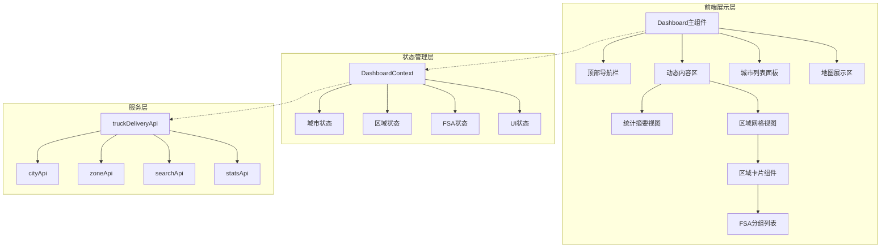
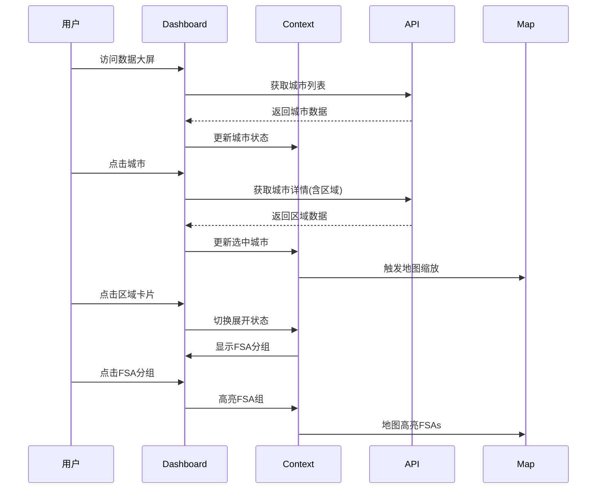

# truck-dashboard-layout-refactor - Task 23

Execute task 23 for the truck-dashboard-layout-refactor specification.

## Task Description
实现移动端适配

## Requirements Reference
**Requirements**: NFR-011

## Usage
```
/Task:23-truck-dashboard-layout-refactor
```

## Instructions

Execute with @spec-task-executor agent the following task: "实现移动端适配"

```
Use the @spec-task-executor agent to implement task 23: "实现移动端适配" for the truck-dashboard-layout-refactor specification and include all the below context.

# Steering Context
## Steering Documents Context (Pre-loaded)

### Product Context
# Product Steering Document

## 产品愿景
加拿大快递配送区域地图系统是一个专业的物流配送管理平台，通过可视化地图技术帮助物流公司高效管理配送区域、优化定价策略，提升运营效率。

## 目标用户
- **主要用户**：物流公司运营管理人员
- **次要用户**：配送调度员、客服人员
- **管理用户**：系统管理员、价格策略制定者

## 核心功能

### 现有功能
1. **FSA区域管理**
   - 基于加拿大邮政FSA（Forward Sortation Area）的配送区域划分
   - 可视化展示1600+个FSA多边形边界
   - 区域分组管理（8个默认区域）

2. **价格配置系统**
   - 基于重量区间的阶梯定价
   - 批量导入/导出价格配置
   - 实时价格计算引擎

3. **邮编管理**
   - 完整的加拿大邮编数据库
   - FSA与邮编的映射关系
   - 邮编搜索和筛选

4. **数据管理**
   - 统一存储架构
   - 数据导入导出
   - 自动备份恢复

### 新增功能（卡车派送）
1. **城市级别管理**
   - 以城市为单位的配送区域组织
   - 城市自定义颜色主题
   - 城市下辖多个价格区域

2. **分级区域定价**
   - 每个城市包含1-4个价格区域
   - 区域按价格递增排序（1区最便宜）
   - 视觉化价格梯度（颜色深浅）

3. **增强的搜索功能**
   - 特定邮编快速定位
   - 城市/区域/邮编多级筛选
   - 实时搜索结果高亮

## 业务目标
1. **提升效率**：减少80%的配送区域配置时间
2. **降低成本**：通过优化定价策略降低15%运营成本
3. **改善体验**：提供直观的可视化界面，降低培训成本
4. **扩展性**：支持多种配送模式（标准配送、卡车派送等）

## 成功指标
- 区域配置效率提升度
- 价格策略准确率
- 用户操作错误率降低
- 系统响应时间 < 2秒
- 地图加载时间 < 5秒

## 产品路线图
### Phase 1 (已完成)
- ✅ FSA基础地图展示
- ✅ 区域管理功能
- ✅ 价格配置系统
- ✅ 数据导入导出

### Phase 2 (进行中)
- 🚀 卡车派送模块
- 🚀 城市级别管理
- 🚀 分级定价系统

### Phase 3 (计划中)
- 路线优化算法
- 实时配送追踪
- 客户自助查询
- 移动端应用

---

### Technology Context
# Technology Steering Document

## 技术栈

### 前端技术
- **框架**: React 18.2
- **构建工具**: Vite 5.0
- **路由**: React Router v7
- **样式**: 
  - Tailwind CSS 3.3
  - Cyber/Tech主题设计
- **地图引擎**: 
  - Leaflet 1.9.4
  - React Leaflet 4.2.1
- **动画**: Framer Motion 10.16
- **HTTP客户端**: Axios 1.6.0
- **图标**: Lucide React

### 数据管理
- **状态管理**: React Hooks + Context API
- **本地存储**: localStorage (统一存储架构)
- **数据格式**: JSON
- **地理数据**: GeoJSON格式的FSA边界数据

### 开发工具
- **代码规范**: ESLint
- **包管理**: npm
- **并发执行**: Concurrently
- **桌面应用**: Electron (计划中)

## 架构决策

### 统一存储架构
**决策**: 使用单一的localStorage管理系统替代分散的存储方案

**原因**:
- 简化数据同步逻辑
- 提供统一的数据访问接口
- 便于实现数据恢复和备份

**实现**:
```javascript
// 核心存储模块
src/utils/unifiedStorage.js
src/utils/dataUpdateNotifier.js
src/utils/dataRecovery.js
```

### 组件化架构
**决策**: 采用功能性组件和Hooks模式

**原因**:
- 更好的代码复用性
- 简化状态管理
- 提升开发效率

### 地图渲染策略
**决策**: 使用Leaflet配合GeoJSON渲染FSA边界

**原因**:
- Leaflet性能优秀，支持大量多边形渲染
- GeoJSON是地理数据的标准格式
- React Leaflet提供良好的React集成

## 性能要求

### 响应时间
- 页面加载: < 3秒
- 地图初始化: < 5秒
- 搜索响应: < 500ms
- 数据保存: < 1秒

### 容量限制
- FSA多边形: ~1600个
- 邮编数据: ~850,000条
- localStorage限制: 5-10MB
- 地图缩放级别: 4-18

### 优化策略
- **视口剔除**: 只渲染可见区域的FSA
- **数据分块**: 大数据批量处理时分块进行
- **防抖节流**: 搜索输入使用300ms防抖
- **懒加载**: 按需加载地图瓦片和数据

## 技术约束

### 浏览器兼容性
- Chrome 90+
- Firefox 88+
- Safari 14+
- Edge 90+

### 数据限制
- localStorage大小限制 (5-10MB)
- 单次API请求限制 (100个项目)
- 地图瓦片并发请求限制 (6个)

### 安全要求
- 所有API通信使用HTTPS
- 敏感数据不存储在localStorage
- 实施CORS策略
- XSS防护

## 第三方服务

### 地图服务
- **瓦片服务器**: CartoDB Dark Matter
- **地理编码**: 内置邮编数据库
- **坐标系统**: WGS84 (EPSG:4326)

### 数据源
- **FSA边界**: Statistics Canada 2021 Census
- **邮编数据**: Canada Post官方数据
- **城市数据**: 自维护数据库

### 后端服务 (计划中)
- **数据库**: PostgreSQL + PostGIS
- **API框架**: Node.js + Express
- **ORM**: Prisma
- **缓存**: Redis

## 开发规范

### 代码风格
- ES6+语法
- 函数式编程优先
- 组件名使用PascalCase
- 文件名使用camelCase或PascalCase

### Git工作流
- 主分支: main
- 功能分支: feature/xxx
- 修复分支: fix/xxx
- 提交信息遵循conventional commits

### 测试策略
- 单元测试 (计划中): Jest + React Testing Library
- E2E测试 (计划中): Cypress
- 性能测试: Lighthouse

## 部署架构

### 当前部署
- **静态托管**: Vercel/Netlify
- **构建**: Vite production build
- **CDN**: 自动配置

### 未来架构
- **前端**: CDN + 静态托管
- **后端**: Cloud Run/AWS Lambda
- **数据库**: Cloud SQL/RDS
- **缓存**: Cloud Memorystore/ElastiCache

---

### Structure Context
# Project Structure Steering Document

## 目录结构

```
/
├── .claude/                    # Claude AI配置
│   └── steering/              # 项目指导文档
├── public/                    # 静态资源
│   └── data/                  # FSA边界数据文件
├── src/                       # 源代码
│   ├── components/            # React组件
│   ├── data/                  # 静态数据文件
│   ├── layouts/               # 布局组件
│   ├── pages/                 # 页面组件
│   ├── router/                # 路由配置
│   ├── services/              # 服务层
│   └── utils/                 # 工具函数
├── backend/                   # 后端服务 (如果存在)
└── dist/                      # 构建输出
```

## 文件组织规范

### 组件文件 (`src/components/`)
```
components/
├── maps/                      # 地图相关组件
│   ├── AccurateFSAMap.jsx    # FSA地图主组件
│   └── TruckDeliveryMap.jsx  # 卡车派送地图（新增）
├── regions/                   # 区域管理组件
│   ├── RegionManagementPanel.jsx
│   └── RegionSelector.jsx
├── cities/                    # 城市管理组件（新增）
│   ├── CityManager.jsx
│   └── CityRegionEditor.jsx
└── common/                    # 通用组件
    ├── SearchPanel.jsx
    └── ImportExportManager.jsx
```

### 页面文件 (`src/pages/`)
```
pages/
├── Dashboard/                 # 仪表板
│   └── index.jsx
├── Settings/                  # 设置页面
│   ├── index.jsx
│   ├── RegionSettings.jsx
│   ├── PriceSettings.jsx
│   └── PostalSettings.jsx
└── TruckDelivery/            # 卡车派送（新增）
    ├── index.jsx
    ├── CityView.jsx
    └── RegionDetail.jsx
```

### 工具文件 (`src/utils/`)
```
utils/
├── storage/                   # 存储相关
│   ├── unifiedStorage.js     # 统一存储
│   ├── cityStorage.js        # 城市存储（新增）
│   └── truckDeliveryStorage.js # 卡车派送存储（新增）
├── api/                       # API相关
│   └── apiClient.js
└── helpers/                   # 辅助函数
    ├── geoHelpers.js
    └── priceCalculator.js
```

## 命名规范

### 文件命名
- **组件文件**: PascalCase (如 `RegionManager.jsx`)
- **工具文件**: camelCase (如 `dataHelper.js`)
- **样式文件**: camelCase (如 `styles.module.css`)
- **常量文件**: SCREAMING_SNAKE_CASE (如 `CONSTANTS.js`)

### 变量命名
```javascript
// 组件
const RegionManager = () => { ... }

// 函数
const calculateDeliveryPrice = (weight, region) => { ... }

// 常量
const MAX_REGIONS_PER_CITY = 4;

// 状态
const [selectedCity, setSelectedCity] = useState(null);
```

### CSS类命名
```css
/* BEM风格 + Tailwind */
.city-selector__header { }
.city-selector__item--active { }

/* Tailwind优先 */
className="flex flex-col gap-4 p-6 bg-gray-900"
```

## 数据模型规范

### FSA数据结构
```javascript
{
  fsa: 'M5V',
  province: 'ON',
  city: 'Toronto',
  lat: 43.6426,
  lng: -79.3871,
  postalCodes: ['M5V 3A8', 'M5V 1A1']
}
```

### 城市数据结构（新增）
```javascript
{
  id: 'city-uuid',
  name: 'Toronto',
  province: 'ON',
  color: '#FF5733',        // 城市主题色
  regions: [
    {
      id: 'region-1',
      level: 1,            // 1-4区
      name: '市中心配送区',
      fsaCodes: ['M5V', 'M5G'],
      postalCodes: [],
      priceMultiplier: 1.0, // 价格系数
      color: '#FFE5B4'     // 浅色表示便宜
    }
  ],
  metadata: {
    createdAt: '2024-01-01T00:00:00Z',
    updatedAt: '2024-01-01T00:00:00Z'
  }
}
```

### 价格配置结构
```javascript
{
  basePrice: 15.99,
  weightRanges: [
    { min: 0, max: 10, price: 15.99 },
    { min: 10, max: 20, price: 25.99 }
  ],
  regionMultipliers: {
    '1': 1.0,  // 1区无加价
    '2': 1.2,  // 2区加价20%
    '3': 1.5,  // 3区加价50%
    '4': 2.0   // 4区加价100%
  }
}
```

## 新功能集成指南

### 添加卡车派送功能步骤

1. **创建页面路由**
```javascript
// src/router/index.jsx
{
  path: 'truck-delivery',
  element: <TruckDelivery />
}
```

2. **添加导航菜单**
```javascript
// src/layouts/MainLayout.jsx
<NavLink to="/truck-delivery">卡车派送</NavLink>
```

3. **实现数据存储**
```javascript
// src/utils/storage/cityStorage.js
export const getCities = () => { ... }
export const updateCity = (cityId, data) => { ... }
```

4. **创建UI组件**
```javascript
// src/components/cities/CityManager.jsx
const CityManager = () => {
  // 城市CRUD逻辑
}
```

5. **集成地图展示**
```javascript
// src/components/maps/TruckDeliveryMap.jsx
const TruckDeliveryMap = ({ cities, selectedCity }) => {
  // 城市和区域可视化
}
```

## 代码组织原则

### 单一职责
每个组件/模块只负责一个功能领域

### 依赖注入
通过props传递依赖，避免硬编码

### 数据流向
- 自上而下的数据流
- 通过回调函数向上传递事件
- 使用Context API共享全局状态

### 错误处理
```javascript
try {
  const data = await fetchCityData(cityId);
  return data;
} catch (error) {
  console.error('获取城市数据失败:', error);
  // 显示用户友好的错误信息
  showNotification('加载失败，请重试');
  return null;
}
```

## 测试规范

### 单元测试
- 测试文件与源文件同目录
- 命名: `ComponentName.test.jsx`
- 覆盖率目标: 80%

### 集成测试
- 测试用户操作流程
- 使用React Testing Library
- 模拟API响应

### E2E测试
- 关键用户路径
- 使用Cypress
- 定期运行回归测试

**Note**: Steering documents have been pre-loaded. Do not use get-content to fetch them again.

# Specification Context
## Specification Context (Pre-loaded): truck-dashboard-layout-refactor

### Requirements
# 卡车派送数据大屏布局重构 - 需求文档

## 1. 项目概述

### 1.1 背景
当前卡车派送数据大屏的布局存在以下问题：
- 左侧城市列表组件过大，占用过多屏幕空间
- 统计卡片区域固定显示8个指标，缺乏动态性
- 城市、区域、FSA分组之间的联动关系不够直观
- 区域和FSA分组信息需要深度交互才能查看

### 1.2 目标
重构数据大屏布局，实现更紧凑、更直观的界面设计：
- 精简左侧城市列表，减少空间占用
- 将顶部统计区域改为动态展示选中城市的区域信息
- 实现城市→区域→FSA分组的层级联动显示
- 提供更直观的数据可视化体验

### 1.3 范围
- 重构 Dashboard.jsx 页面布局结构
- 优化城市列表组件的展示形式
- 实现新的顶部区域展示组件
- 增强城市、区域、FSA分组的联动交互
- 保持现有功能不受影响

## 2. 用户故事

### 2.1 城市列表精简
**作为** 数据大屏用户
**我想要** 看到更精简的城市列表
**以便** 有更多空间展示地图和数据信息

**验收标准：**
- WHEN 用户访问数据大屏
- THEN 左侧城市列表宽度应该从 w-80 (320px) 减少到 w-64 (256px) 或更小
- AND 城市卡片应该使用更紧凑的设计
- AND 保留关键信息（城市名、省份、区域数、FSA数）

### 2.2 动态区域展示
**作为** 数据大屏用户
**我想要** 在顶部看到选中城市的区域列表
**以便** 快速了解和选择城市的不同配送区域

**验收标准：**
- WHEN 用户未选择城市时
- THEN 顶部显示总体统计信息
- WHEN 用户点击某个城市后
- THEN 顶部区域动态切换为该城市的区域列表
- AND 每个区域显示为可点击的卡片
- AND 显示区域名称和包含的FSA数量

### 2.3 区域FSA展示
**作为** 数据大屏用户
**我想要** 看到每个区域包含的FSA列表
**以便** 了解区域的具体覆盖范围

**验收标准：**
- WHEN 用户点击某个区域卡片
- THEN 在区域卡片下方展开显示FSA列表
- AND FSA按分组进行组织显示
- AND 地图同步高亮显示该区域的所有FSA

### 2.4 FSA分组展示
**作为** 数据大屏用户
**我想要** 看到区域内的FSA分组信息
**以便** 了解FSA的组织结构和定价分组

**验收标准：**
- WHEN 区域卡片展开显示FSA时
- THEN FSA应该按分组进行展示
- AND 每个分组显示分组名称
- AND 分组内的FSA代码清晰可见
- AND 支持点击分组高亮对应的FSA

### 2.5 响应式布局
**作为** 不同设备的用户
**我想要** 在各种屏幕尺寸上都能正常使用
**以便** 灵活地查看数据大屏

**验收标准：**
- WHEN 屏幕宽度小于1280px
- THEN 区域卡片应该自动调整列数
- WHEN 屏幕宽度小于768px
- THEN 左侧城市列表应该可以收起或浮动显示

## 3. 功能需求

### 3.1 布局结构调整
- **FR-001**: 左侧城市列表宽度调整为 w-64 或更小
- **FR-002**: 移除固定的8个统计卡片网格
- **FR-003**: 顶部区域改为动态内容区
- **FR-004**: 保留顶部导航栏和标题区域

### 3.2 城市列表组件
- **FR-005**: 城市卡片使用紧凑设计，高度不超过80px
- **FR-006**: 显示城市名称、省份缩写、区域数、FSA数
- **FR-007**: 选中状态通过边框和背景色突出显示
- **FR-008**: 支持搜索和筛选功能

### 3.3 动态区域展示
- **FR-009**: 未选择城市时显示总体统计摘要
- **FR-010**: 选择城市后显示该城市的所有区域
- **FR-011**: 区域卡片按网格布局，自适应列数
- **FR-012**: 区域卡片显示区域名称、等级、FSA数量

### 3.4 FSA分组展示
- **FR-013**: 区域卡片可展开/收起
- **FR-014**: 展开后显示该区域的所有FSA分组
- **FR-015**: FSA分组显示分组名称和包含的FSA代码
- **FR-016**: 支持分组级别的交互（点击高亮）

### 3.5 地图联动
- **FR-017**: 点击城市时地图缩放到城市范围
- **FR-018**: 点击区域时地图高亮该区域的FSA
- **FR-019**: 点击FSA分组时地图高亮对应的FSA
- **FR-020**: 保持现有的地图交互功能

## 4. 非功能需求

### 4.1 性能要求
- **NFR-001**: 城市列表滚动流畅，无卡顿
- **NFR-002**: 区域卡片展开/收起动画流畅（<300ms）
- **NFR-003**: 地图联动响应时间 <500ms
- **NFR-004**: 支持100+城市的列表渲染

### 4.2 可用性要求
- **NFR-005**: 交互反馈明确，状态变化清晰
- **NFR-006**: 支持键盘导航
- **NFR-007**: 颜色对比度符合WCAG 2.1 AA标准
- **NFR-008**: 错误状态有明确提示

### 4.3 兼容性要求
- **NFR-009**: 支持Chrome、Firefox、Safari最新版本
- **NFR-010**: 支持1280x720以上分辨率
- **NFR-011**: 响应式设计支持平板和桌面设备

## 5. 技术约束

### 5.1 技术栈
- 使用React 18 + Vite构建
- 使用Tailwind CSS进行样式设计
- 使用Framer Motion处理动画
- 使用现有的API服务层

### 5.2 代码约束
- 保持与现有代码风格一致
- 复用现有的组件和服务
- 遵循项目的文件组织结构
- 保持向后兼容性

## 6. 界面原型说明

### 6.1 布局结构
```
┌─────────────────────────────────────────────────────────┐
│                     顶部导航栏                            │
├────────┬────────────────────────────────────────────────┤
│        │              动态内容区                          │
│  城市   │  ┌──────┐ ┌──────┐ ┌──────┐ ┌──────┐        │
│  列表   │  │区域1  │ │区域2  │ │区域3  │ │区域4  │        │
│  (精简) │  │分组1  │ │分组1  │ │分组1  │ │分组1  │        │
│        │  │分组2  │ │分组2  │ │分组2  │ │分组2  │        │
│        │  └──────┘ └──────┘ └──────┘ └──────┘        │
│        ├────────────────────────────────────────────────┤
│        │                                                 │
│        │                  地图区域                        │
│        │                                                 │
└────────┴────────────────────────────────────────────────┘
```

### 6.2 交互流程
1. 初始状态：显示城市列表 + 总体统计 + 全国地图
2. 点击城市：顶部切换为区域卡片 + 地图缩放到城市
3. 点击区域：区域卡片展开显示FSA分组 + 地图高亮FSA
4. 点击分组：地图高亮该分组的FSA

## 7. 数据需求

### 7.1 城市数据
- 城市ID、名称、省份
- 区域列表（包含区域ID、名称、等级）
- FSA统计数据

### 7.2 区域数据
- 区域ID、名称、等级
- FSA代码列表
- FSA分组信息

### 7.3 FSA分组数据
- 分组ID、名称
- 包含的FSA代码列表
- 分组类型（如价格分组）

## 8. 验收标准

### 8.1 功能验收
- [ ] 城市列表成功精简且信息完整
- [ ] 顶部区域根据选中城市动态变化
- [ ] 区域卡片可正常展开/收起
- [ ] FSA分组正确显示
- [ ] 地图联动功能正常

### 8.2 性能验收
- [ ] 页面加载时间 <2秒
- [ ] 交互响应时间符合要求
- [ ] 无明显的内存泄漏

### 8.3 兼容性验收
- [ ] 在目标浏览器上正常运行
- [ ] 响应式布局正常工作
- [ ] 无控制台错误

## 9. 风险与依赖

### 9.1 风险
- 大量DOM操作可能影响性能
- 复杂的状态管理可能导致bug
- 动画效果可能在低端设备上卡顿

### 9.2 依赖
- 依赖后端API提供完整的区域和FSA分组数据
- 依赖现有的地图组件支持新的交互方式
- 依赖设计团队提供具体的视觉规范

## 10. 迭代计划

### Phase 1 - 基础布局重构
- 调整城市列表宽度
- 实现动态内容区
- 基础的城市选择联动

### Phase 2 - 区域展示
- 实现区域卡片组件
- 添加展开/收起功能
- 集成FSA分组显示

### Phase 3 - 优化与完善
- 添加动画效果
- 性能优化
- 响应式适配

---

### Design
# 卡车派送数据大屏布局重构 - 设计文档

## 1. 架构概述

### 1.1 系统架构


### 1.2 组件层次结构
```
TruckDeliveryDashboard/
├── DashboardHeader/              # 顶部导航栏
│   ├── Logo & Title
│   ├── StatusIndicator
│   └── NavigationControls
├── DynamicContentArea/           # 动态内容区
│   ├── StatsOverview/           # 未选择城市时的统计视图
│   │   ├── MiniStatCard
│   │   └── TrendIndicator
│   └── RegionGrid/              # 选择城市后的区域网格
│       ├── RegionCard/
│       │   ├── RegionHeader
│       │   ├── RegionStats
│       │   └── FSAGroupList/
│       │       ├── GroupHeader
│       │       └── FSAChips
│       └── EmptyState
├── CityListPanel/                # 城市列表面板
│   ├── SearchBar
│   ├── CityList/
│   │   └── CompactCityCard
│   └── ActivityFeed
└── MapContainer/                 # 地图容器
    ├── TruckDeliveryMap
    └── MapLegend
```

## 2. 详细设计

### 2.1 组件设计

#### 2.1.1 Dashboard主组件重构
```javascript
// src/pages/TruckDelivery/Dashboard.jsx
const TruckDeliveryDashboard = () => {
  // 状态管理
  const [selectedCity, setSelectedCity] = useState(null);
  const [expandedRegions, setExpandedRegions] = useState(new Set());
  const [highlightedFSAGroup, setHighlightedFSAGroup] = useState(null);

  // 布局结构
  return (
    <DashboardProvider value={{...}}>
      <div className="h-screen bg-gray-900 flex flex-col">
        <DashboardHeader />
        <DynamicContentArea
          selectedCity={selectedCity}
          expandedRegions={expandedRegions}
        />
        <div className="flex-1 flex">
          <CityListPanel
            cities={cities}
            selectedCity={selectedCity}
            onCitySelect={handleCitySelect}
          />
          <MapContainer
            selectedCity={selectedCity}
            highlightedFSAs={highlightedFSAs}
          />
        </div>
      </div>
    </DashboardProvider>
  );
};
```

#### 2.1.2 动态内容区组件
```javascript
// src/components/dashboard/DynamicContentArea.jsx
const DynamicContentArea = ({ selectedCity, expandedRegions }) => {
  if (!selectedCity) {
    return <StatsOverview />;
  }

  return (
    <RegionGrid
      cityId={selectedCity.id}
      regions={selectedCity.regions}
      expandedRegions={expandedRegions}
    />
  );
};
```

#### 2.1.3 区域卡片组件
```javascript
// src/components/dashboard/RegionCard.jsx
const RegionCard = ({ region, isExpanded, onToggle }) => {
  return (
    <motion.div
      className="bg-gray-800 rounded-lg p-4 cursor-pointer"
      layout
      animate={{ height: isExpanded ? 'auto' : '120px' }}
    >
      <RegionHeader
        name={region.name}
        level={region.level}
        fsaCount={region.fsaCodes.length}
        onClick={onToggle}
      />

      <AnimatePresence>
        {isExpanded && (
          <motion.div
            initial={{ opacity: 0, height: 0 }}
            animate={{ opacity: 1, height: 'auto' }}
            exit={{ opacity: 0, height: 0 }}
          >
            <FSAGroupList groups={region.fsaGroups} />
          </motion.div>
        )}
      </AnimatePresence>
    </motion.div>
  );
};
```

#### 2.1.4 精简城市卡片组件
```javascript
// src/components/dashboard/CompactCityCard.jsx
const CompactCityCard = ({ city, isSelected, onClick }) => {
  return (
    <div
      className={`
        p-3 rounded-lg cursor-pointer transition-all
        ${isSelected
          ? 'bg-blue-900/30 border-blue-500'
          : 'bg-gray-800/50 border-gray-700'
        }
        hover:bg-gray-700 border
      `}
      onClick={onClick}
    >
      <div className="flex items-center space-x-2">
        <div
          className="w-8 h-8 rounded flex-shrink-0 flex items-center justify-center"
          style={{ backgroundColor: city.themeColor + '30' }}
        >
          <span className="text-xs font-bold" style={{ color: city.themeColor }}>
            {city.province.substring(0, 2)}
          </span>
        </div>
        <div className="flex-1 min-w-0">
          <h4 className="text-sm font-medium text-white truncate">
            {city.name}
          </h4>
          <div className="flex items-center space-x-3 text-xs text-gray-400">
            <span>区域: {city.totalRegions}</span>
            <span>FSA: {city.totalFSAs}</span>
          </div>
        </div>
      </div>
    </div>
  );
};
```

### 2.2 状态管理设计

#### 2.2.1 Context设计
```javascript
// src/contexts/DashboardContext.jsx
const DashboardContext = createContext();

export const DashboardProvider = ({ children }) => {
  const [state, dispatch] = useReducer(dashboardReducer, initialState);

  const value = {
    // 城市相关
    cities: state.cities,
    selectedCity: state.selectedCity,
    selectCity: (city) => dispatch({ type: 'SELECT_CITY', payload: city }),

    // 区域相关
    expandedRegions: state.expandedRegions,
    toggleRegion: (regionId) => dispatch({ type: 'TOGGLE_REGION', payload: regionId }),

    // FSA相关
    highlightedFSAs: state.highlightedFSAs,
    highlightFSAGroup: (group) => dispatch({ type: 'HIGHLIGHT_FSA_GROUP', payload: group }),

    // UI状态
    loading: state.loading,
    error: state.error
  };

  return (
    <DashboardContext.Provider value={value}>
      {children}
    </DashboardContext.Provider>
  );
};
```

#### 2.2.2 Reducer设计
```javascript
// src/reducers/dashboardReducer.js
const dashboardReducer = (state, action) => {
  switch (action.type) {
    case 'SELECT_CITY':
      return {
        ...state,
        selectedCity: action.payload,
        expandedRegions: new Set(), // 重置展开状态
        highlightedFSAs: extractCityFSAs(action.payload)
      };

    case 'TOGGLE_REGION':
      const newExpanded = new Set(state.expandedRegions);
      if (newExpanded.has(action.payload)) {
        newExpanded.delete(action.payload);
      } else {
        newExpanded.add(action.payload);
      }
      return {
        ...state,
        expandedRegions: newExpanded
      };

    case 'HIGHLIGHT_FSA_GROUP':
      return {
        ...state,
        highlightedFSAs: action.payload.fsaCodes,
        highlightedGroup: action.payload
      };

    default:
      return state;
  }
};
```

### 2.3 数据流设计

#### 2.3.1 数据获取流程


#### 2.3.2 数据结构
```typescript
interface City {
  id: string;
  name: string;
  province: string;
  themeColor: string;
  totalRegions: number;
  totalFSAs: number;
  regions?: Region[];
}

interface Region {
  id: string;
  cityId: string;
  name: string;
  level: number;
  fsaCodes: string[];
  fsaGroups: FSAGroup[];
}

interface FSAGroup {
  id: string;
  name: string;
  type: 'price' | 'geographic' | 'custom';
  fsaCodes: string[];
}
```

### 2.4 样式设计

#### 2.4.1 响应式布局策略
```css
/* 布局断点 */
.dynamic-content-area {
  @apply grid gap-4;
  /* 默认手机: 1列 */
  @apply grid-cols-1;
  /* 平板: 2列 */
  @apply md:grid-cols-2;
  /* 桌面: 3-4列 */
  @apply lg:grid-cols-3 xl:grid-cols-4;
  /* 大屏: 5-6列 */
  @apply 2xl:grid-cols-5 3xl:grid-cols-6;
}

.city-list-panel {
  /* 默认宽度 */
  @apply w-64;
  /* 小屏幕时可收起 */
  @apply lg:w-64 md:w-56 sm:w-48;
  /* 超小屏幕时浮动 */
  @apply sm:absolute sm:z-10 lg:relative lg:z-0;
}
```

#### 2.4.2 动画设计
```javascript
// 动画配置
const animations = {
  // 区域卡片展开动画
  regionExpand: {
    transition: {
      duration: 0.3,
      ease: [0.4, 0, 0.2, 1]
    }
  },

  // FSA组悬停动画
  fsaGroupHover: {
    scale: 1.02,
    transition: { duration: 0.2 }
  },

  // 城市切换动画
  citySwitch: {
    initial: { opacity: 0, y: 20 },
    animate: { opacity: 1, y: 0 },
    exit: { opacity: 0, y: -20 },
    transition: { duration: 0.3 }
  }
};
```

### 2.5 性能优化设计

#### 2.5.1 虚拟滚动
```javascript
// 城市列表虚拟滚动
import { FixedSizeList } from 'react-window';

const VirtualCityList = ({ cities, selectedCity, onSelect }) => {
  return (
    <FixedSizeList
      height={600}
      itemCount={cities.length}
      itemSize={80}
      width="100%"
    >
      {({ index, style }) => (
        <div style={style}>
          <CompactCityCard
            city={cities[index]}
            isSelected={selectedCity?.id === cities[index].id}
            onClick={() => onSelect(cities[index])}
          />
        </div>
      )}
    </FixedSizeList>
  );
};
```

#### 2.5.2 懒加载策略
```javascript
// 区域数据懒加载
const useRegionData = (cityId) => {
  const [regions, setRegions] = useState([]);
  const [loading, setLoading] = useState(false);

  useEffect(() => {
    if (!cityId) return;

    const loadRegions = async () => {
      setLoading(true);
      const data = await zoneApi.getByCityId(cityId);
      setRegions(data);
      setLoading(false);
    };

    loadRegions();
  }, [cityId]);

  return { regions, loading };
};
```

#### 2.5.3 缓存策略
```javascript
// 数据缓存管理
class DashboardCache {
  constructor() {
    this.cache = new Map();
    this.maxAge = 5 * 60 * 1000; // 5分钟
  }

  set(key, data) {
    this.cache.set(key, {
      data,
      timestamp: Date.now()
    });
  }

  get(key) {
    const item = this.cache.get(key);
    if (!item) return null;

    if (Date.now() - item.timestamp > this.maxAge) {
      this.cache.delete(key);
      return null;
    }

    return item.data;
  }
}
```

## 3. 接口设计

### 3.1 组件接口

#### 3.1.1 DynamicContentArea Props
```typescript
interface DynamicContentAreaProps {
  selectedCity: City | null;
  expandedRegions: Set<string>;
  onRegionToggle: (regionId: string) => void;
  onFSAGroupClick: (group: FSAGroup) => void;
}
```

#### 3.1.2 RegionCard Props
```typescript
interface RegionCardProps {
  region: Region;
  isExpanded: boolean;
  onToggle: () => void;
  onFSAGroupSelect: (group: FSAGroup) => void;
}
```

#### 3.1.3 CityListPanel Props
```typescript
interface CityListPanelProps {
  cities: City[];
  selectedCity: City | null;
  onCitySelect: (city: City) => void;
  searchEnabled?: boolean;
  activityFeedEnabled?: boolean;
}
```

### 3.2 API接口调整

无需修改现有API，复用现有接口：
- `cityApi.getAll()` - 获取城市列表
- `cityApi.getById(id)` - 获取城市详情(含区域)
- `zoneApi.getByCityId(cityId)` - 获取城市区域
- `statsApi.getOverview()` - 获取总体统计

## 4. 错误处理设计

### 4.1 错误边界
```javascript
class DashboardErrorBoundary extends Component {
  state = { hasError: false, error: null };

  static getDerivedStateFromError(error) {
    return { hasError: true, error };
  }

  render() {
    if (this.state.hasError) {
      return (
        <div className="flex items-center justify-center h-screen bg-gray-900">
          <div className="text-center">
            <h2 className="text-xl text-white mb-4">数据加载失败</h2>
            <button
              className="px-4 py-2 bg-blue-600 text-white rounded"
              onClick={() => window.location.reload()}
            >
              刷新页面
            </button>
          </div>
        </div>
      );
    }

    return this.props.children;
  }
}
```

### 4.2 加载状态处理
```javascript
const LoadingState = ({ message = "加载中..." }) => (
  <div className="flex items-center justify-center p-8">
    <Loader2 className="w-6 h-6 animate-spin text-blue-500 mr-2" />
    <span className="text-gray-400">{message}</span>
  </div>
);

const EmptyState = ({ message = "暂无数据" }) => (
  <div className="flex flex-col items-center justify-center p-8">
    <AlertCircle className="w-12 h-12 text-gray-600 mb-2" />
    <span className="text-gray-400">{message}</span>
  </div>
);
```

## 5. 测试策略

### 5.1 单元测试
```javascript
// RegionCard.test.jsx
describe('RegionCard', () => {
  it('should render region information', () => {
    const region = mockRegion();
    render(<RegionCard region={region} />);
    expect(screen.getByText(region.name)).toBeInTheDocument();
  });

  it('should expand on click', () => {
    const onToggle = jest.fn();
    render(<RegionCard region={mockRegion()} onToggle={onToggle} />);
    fireEvent.click(screen.getByRole('button'));
    expect(onToggle).toHaveBeenCalled();
  });
});
```

### 5.2 集成测试
```javascript
// Dashboard.integration.test.jsx
describe('Dashboard Integration', () => {
  it('should load and display cities', async () => {
    render(<TruckDeliveryDashboard />);
    await waitFor(() => {
      expect(screen.getByText('Toronto')).toBeInTheDocument();
    });
  });

  it('should show regions when city selected', async () => {
    render(<TruckDeliveryDashboard />);
    fireEvent.click(await screen.findByText('Toronto'));
    await waitFor(() => {
      expect(screen.getByText('Downtown')).toBeInTheDocument();
    });
  });
});
```

## 6. 部署注意事项

### 6.1 构建优化
```javascript
// vite.config.js 优化配置
export default {
  build: {
    rollupOptions: {
      output: {
        manualChunks: {
          'vendor': ['react', 'react-dom'],
          'map': ['leaflet', 'react-leaflet'],
          'animation': ['framer-motion']
        }
      }
    }
  }
};
```

### 6.2 环境配置
```javascript
// 环境变量配置
const config = {
  API_BASE_URL: import.meta.env.VITE_API_URL || 'http://localhost:5001',
  MAP_TILE_URL: import.meta.env.VITE_MAP_TILE_URL,
  CACHE_DURATION: import.meta.env.VITE_CACHE_DURATION || 300000
};
```

## 7. 迁移计划

### 7.1 分阶段实施
1. **阶段1**: 创建新组件，不影响现有功能
2. **阶段2**: 在开发环境集成测试
3. **阶段3**: 灰度发布，部分用户测试
4. **阶段4**: 全量发布，移除旧代码

### 7.2 回滚方案
```javascript
// 功能开关
const useNewDashboard = localStorage.getItem('feature_new_dashboard') === 'true';

export default useNewDashboard ? NewDashboard : OldDashboard;
```

**Note**: Specification documents have been pre-loaded. Do not use get-content to fetch them again.

## Task Details
- Task ID: 23
- Description: 实现移动端适配
- Requirements: NFR-011

## Instructions
- Implement ONLY task 23: "实现移动端适配"
- Follow all project conventions and leverage existing code
- Mark the task as complete using: claude-code-spec-workflow get-tasks truck-dashboard-layout-refactor 23 --mode complete
- Provide a completion summary
```

## Task Completion
When the task is complete, mark it as done:
```bash
claude-code-spec-workflow get-tasks truck-dashboard-layout-refactor 23 --mode complete
```

## Next Steps
After task completion, you can:
- Execute the next task using /truck-dashboard-layout-refactor-task-[next-id]
- Check overall progress with /spec-status truck-dashboard-layout-refactor
