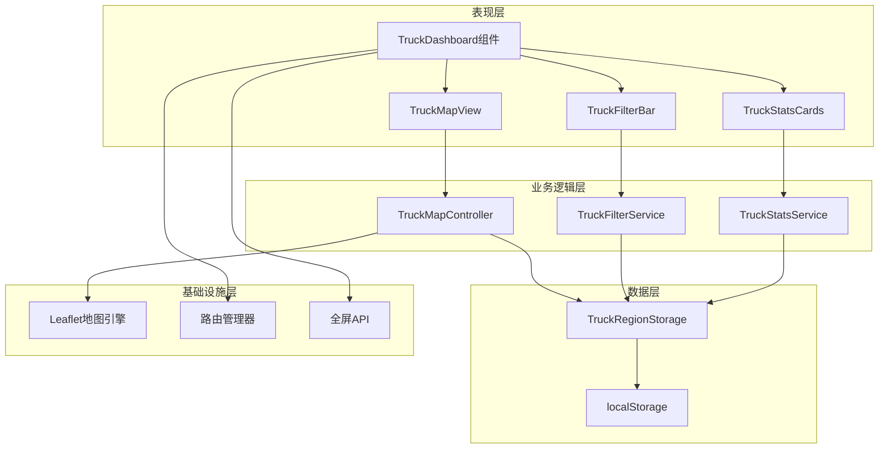
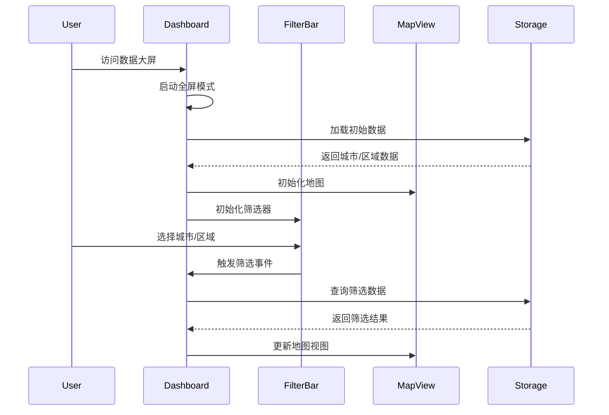

# truck-dashboard-refactor - Task 16

Execute task 16 for the truck-dashboard-refactor specification.

## Task Description
初始化卡车区域数据

## Requirements Reference
**Requirements**: FR-007, US-004

## Usage
```
/Task:16-truck-dashboard-refactor
```

## Instructions

Execute with @spec-task-executor agent the following task: "初始化卡车区域数据"

```
Use the @spec-task-executor agent to implement task 16: "初始化卡车区域数据" for the truck-dashboard-refactor specification and include all the below context.

# Steering Context
## Steering Documents Context (Pre-loaded)

### Product Context
# Product Steering Document

## 产品愿景
加拿大快递配送区域地图系统是一个专业的物流配送管理平台，通过可视化地图技术帮助物流公司高效管理配送区域、优化定价策略，提升运营效率。

## 目标用户
- **主要用户**：物流公司运营管理人员
- **次要用户**：配送调度员、客服人员
- **管理用户**：系统管理员、价格策略制定者

## 核心功能

### 现有功能
1. **FSA区域管理**
   - 基于加拿大邮政FSA（Forward Sortation Area）的配送区域划分
   - 可视化展示1600+个FSA多边形边界
   - 区域分组管理（8个默认区域）

2. **价格配置系统**
   - 基于重量区间的阶梯定价
   - 批量导入/导出价格配置
   - 实时价格计算引擎

3. **邮编管理**
   - 完整的加拿大邮编数据库
   - FSA与邮编的映射关系
   - 邮编搜索和筛选

4. **数据管理**
   - 统一存储架构
   - 数据导入导出
   - 自动备份恢复

### 新增功能（卡车派送）
1. **城市级别管理**
   - 以城市为单位的配送区域组织
   - 城市自定义颜色主题
   - 城市下辖多个价格区域

2. **分级区域定价**
   - 每个城市包含1-4个价格区域
   - 区域按价格递增排序（1区最便宜）
   - 视觉化价格梯度（颜色深浅）

3. **增强的搜索功能**
   - 特定邮编快速定位
   - 城市/区域/邮编多级筛选
   - 实时搜索结果高亮

## 业务目标
1. **提升效率**：减少80%的配送区域配置时间
2. **降低成本**：通过优化定价策略降低15%运营成本
3. **改善体验**：提供直观的可视化界面，降低培训成本
4. **扩展性**：支持多种配送模式（标准配送、卡车派送等）

## 成功指标
- 区域配置效率提升度
- 价格策略准确率
- 用户操作错误率降低
- 系统响应时间 < 2秒
- 地图加载时间 < 5秒

## 产品路线图
### Phase 1 (已完成)
- ✅ FSA基础地图展示
- ✅ 区域管理功能
- ✅ 价格配置系统
- ✅ 数据导入导出

### Phase 2 (进行中)
- 🚀 卡车派送模块
- 🚀 城市级别管理
- 🚀 分级定价系统

### Phase 3 (计划中)
- 路线优化算法
- 实时配送追踪
- 客户自助查询
- 移动端应用

---

### Technology Context
# Technology Steering Document

## 技术栈

### 前端技术
- **框架**: React 18.2
- **构建工具**: Vite 5.0
- **路由**: React Router v7
- **样式**: 
  - Tailwind CSS 3.3
  - Cyber/Tech主题设计
- **地图引擎**: 
  - Leaflet 1.9.4
  - React Leaflet 4.2.1
- **动画**: Framer Motion 10.16
- **HTTP客户端**: Axios 1.6.0
- **图标**: Lucide React

### 数据管理
- **状态管理**: React Hooks + Context API
- **本地存储**: localStorage (统一存储架构)
- **数据格式**: JSON
- **地理数据**: GeoJSON格式的FSA边界数据

### 开发工具
- **代码规范**: ESLint
- **包管理**: npm
- **并发执行**: Concurrently
- **桌面应用**: Electron (计划中)

## 架构决策

### 统一存储架构
**决策**: 使用单一的localStorage管理系统替代分散的存储方案

**原因**:
- 简化数据同步逻辑
- 提供统一的数据访问接口
- 便于实现数据恢复和备份

**实现**:
```javascript
// 核心存储模块
src/utils/unifiedStorage.js
src/utils/dataUpdateNotifier.js
src/utils/dataRecovery.js
```

### 组件化架构
**决策**: 采用功能性组件和Hooks模式

**原因**:
- 更好的代码复用性
- 简化状态管理
- 提升开发效率

### 地图渲染策略
**决策**: 使用Leaflet配合GeoJSON渲染FSA边界

**原因**:
- Leaflet性能优秀，支持大量多边形渲染
- GeoJSON是地理数据的标准格式
- React Leaflet提供良好的React集成

## 性能要求

### 响应时间
- 页面加载: < 3秒
- 地图初始化: < 5秒
- 搜索响应: < 500ms
- 数据保存: < 1秒

### 容量限制
- FSA多边形: ~1600个
- 邮编数据: ~850,000条
- localStorage限制: 5-10MB
- 地图缩放级别: 4-18

### 优化策略
- **视口剔除**: 只渲染可见区域的FSA
- **数据分块**: 大数据批量处理时分块进行
- **防抖节流**: 搜索输入使用300ms防抖
- **懒加载**: 按需加载地图瓦片和数据

## 技术约束

### 浏览器兼容性
- Chrome 90+
- Firefox 88+
- Safari 14+
- Edge 90+

### 数据限制
- localStorage大小限制 (5-10MB)
- 单次API请求限制 (100个项目)
- 地图瓦片并发请求限制 (6个)

### 安全要求
- 所有API通信使用HTTPS
- 敏感数据不存储在localStorage
- 实施CORS策略
- XSS防护

## 第三方服务

### 地图服务
- **瓦片服务器**: CartoDB Dark Matter
- **地理编码**: 内置邮编数据库
- **坐标系统**: WGS84 (EPSG:4326)

### 数据源
- **FSA边界**: Statistics Canada 2021 Census
- **邮编数据**: Canada Post官方数据
- **城市数据**: 自维护数据库

### 后端服务 (计划中)
- **数据库**: PostgreSQL + PostGIS
- **API框架**: Node.js + Express
- **ORM**: Prisma
- **缓存**: Redis

## 开发规范

### 代码风格
- ES6+语法
- 函数式编程优先
- 组件名使用PascalCase
- 文件名使用camelCase或PascalCase

### Git工作流
- 主分支: main
- 功能分支: feature/xxx
- 修复分支: fix/xxx
- 提交信息遵循conventional commits

### 测试策略
- 单元测试 (计划中): Jest + React Testing Library
- E2E测试 (计划中): Cypress
- 性能测试: Lighthouse

## 部署架构

### 当前部署
- **静态托管**: Vercel/Netlify
- **构建**: Vite production build
- **CDN**: 自动配置

### 未来架构
- **前端**: CDN + 静态托管
- **后端**: Cloud Run/AWS Lambda
- **数据库**: Cloud SQL/RDS
- **缓存**: Cloud Memorystore/ElastiCache

---

### Structure Context
# Project Structure Steering Document

## 目录结构

```
/
├── .claude/                    # Claude AI配置
│   └── steering/              # 项目指导文档
├── public/                    # 静态资源
│   └── data/                  # FSA边界数据文件
├── src/                       # 源代码
│   ├── components/            # React组件
│   ├── data/                  # 静态数据文件
│   ├── layouts/               # 布局组件
│   ├── pages/                 # 页面组件
│   ├── router/                # 路由配置
│   ├── services/              # 服务层
│   └── utils/                 # 工具函数
├── backend/                   # 后端服务 (如果存在)
└── dist/                      # 构建输出
```

## 文件组织规范

### 组件文件 (`src/components/`)
```
components/
├── maps/                      # 地图相关组件
│   ├── AccurateFSAMap.jsx    # FSA地图主组件
│   └── TruckDeliveryMap.jsx  # 卡车派送地图（新增）
├── regions/                   # 区域管理组件
│   ├── RegionManagementPanel.jsx
│   └── RegionSelector.jsx
├── cities/                    # 城市管理组件（新增）
│   ├── CityManager.jsx
│   └── CityRegionEditor.jsx
└── common/                    # 通用组件
    ├── SearchPanel.jsx
    └── ImportExportManager.jsx
```

### 页面文件 (`src/pages/`)
```
pages/
├── Dashboard/                 # 仪表板
│   └── index.jsx
├── Settings/                  # 设置页面
│   ├── index.jsx
│   ├── RegionSettings.jsx
│   ├── PriceSettings.jsx
│   └── PostalSettings.jsx
└── TruckDelivery/            # 卡车派送（新增）
    ├── index.jsx
    ├── CityView.jsx
    └── RegionDetail.jsx
```

### 工具文件 (`src/utils/`)
```
utils/
├── storage/                   # 存储相关
│   ├── unifiedStorage.js     # 统一存储
│   ├── cityStorage.js        # 城市存储（新增）
│   └── truckDeliveryStorage.js # 卡车派送存储（新增）
├── api/                       # API相关
│   └── apiClient.js
└── helpers/                   # 辅助函数
    ├── geoHelpers.js
    └── priceCalculator.js
```

## 命名规范

### 文件命名
- **组件文件**: PascalCase (如 `RegionManager.jsx`)
- **工具文件**: camelCase (如 `dataHelper.js`)
- **样式文件**: camelCase (如 `styles.module.css`)
- **常量文件**: SCREAMING_SNAKE_CASE (如 `CONSTANTS.js`)

### 变量命名
```javascript
// 组件
const RegionManager = () => { ... }

// 函数
const calculateDeliveryPrice = (weight, region) => { ... }

// 常量
const MAX_REGIONS_PER_CITY = 4;

// 状态
const [selectedCity, setSelectedCity] = useState(null);
```

### CSS类命名
```css
/* BEM风格 + Tailwind */
.city-selector__header { }
.city-selector__item--active { }

/* Tailwind优先 */
className="flex flex-col gap-4 p-6 bg-gray-900"
```

## 数据模型规范

### FSA数据结构
```javascript
{
  fsa: 'M5V',
  province: 'ON',
  city: 'Toronto',
  lat: 43.6426,
  lng: -79.3871,
  postalCodes: ['M5V 3A8', 'M5V 1A1']
}
```

### 城市数据结构（新增）
```javascript
{
  id: 'city-uuid',
  name: 'Toronto',
  province: 'ON',
  color: '#FF5733',        // 城市主题色
  regions: [
    {
      id: 'region-1',
      level: 1,            // 1-4区
      name: '市中心配送区',
      fsaCodes: ['M5V', 'M5G'],
      postalCodes: [],
      priceMultiplier: 1.0, // 价格系数
      color: '#FFE5B4'     // 浅色表示便宜
    }
  ],
  metadata: {
    createdAt: '2024-01-01T00:00:00Z',
    updatedAt: '2024-01-01T00:00:00Z'
  }
}
```

### 价格配置结构
```javascript
{
  basePrice: 15.99,
  weightRanges: [
    { min: 0, max: 10, price: 15.99 },
    { min: 10, max: 20, price: 25.99 }
  ],
  regionMultipliers: {
    '1': 1.0,  // 1区无加价
    '2': 1.2,  // 2区加价20%
    '3': 1.5,  // 3区加价50%
    '4': 2.0   // 4区加价100%
  }
}
```

## 新功能集成指南

### 添加卡车派送功能步骤

1. **创建页面路由**
```javascript
// src/router/index.jsx
{
  path: 'truck-delivery',
  element: <TruckDelivery />
}
```

2. **添加导航菜单**
```javascript
// src/layouts/MainLayout.jsx
<NavLink to="/truck-delivery">卡车派送</NavLink>
```

3. **实现数据存储**
```javascript
// src/utils/storage/cityStorage.js
export const getCities = () => { ... }
export const updateCity = (cityId, data) => { ... }
```

4. **创建UI组件**
```javascript
// src/components/cities/CityManager.jsx
const CityManager = () => {
  // 城市CRUD逻辑
}
```

5. **集成地图展示**
```javascript
// src/components/maps/TruckDeliveryMap.jsx
const TruckDeliveryMap = ({ cities, selectedCity }) => {
  // 城市和区域可视化
}
```

## 代码组织原则

### 单一职责
每个组件/模块只负责一个功能领域

### 依赖注入
通过props传递依赖，避免硬编码

### 数据流向
- 自上而下的数据流
- 通过回调函数向上传递事件
- 使用Context API共享全局状态

### 错误处理
```javascript
try {
  const data = await fetchCityData(cityId);
  return data;
} catch (error) {
  console.error('获取城市数据失败:', error);
  // 显示用户友好的错误信息
  showNotification('加载失败，请重试');
  return null;
}
```

## 测试规范

### 单元测试
- 测试文件与源文件同目录
- 命名: `ComponentName.test.jsx`
- 覆盖率目标: 80%

### 集成测试
- 测试用户操作流程
- 使用React Testing Library
- 模拟API响应

### E2E测试
- 关键用户路径
- 使用Cypress
- 定期运行回归测试

**Note**: Steering documents have been pre-loaded. Do not use get-content to fetch them again.

# Specification Context
## Specification Context (Pre-loaded): truck-dashboard-refactor

### Requirements
# 卡车配送数据大屏重构 - 需求文档

## 1. 概述

### 1.1 项目背景
当前的卡车配送数据大屏复用了FSA分区管理的大屏组件，导致功能混乱、界面不适配、交互问题频发。需要创建专门的卡车配送数据大屏，提供独立的配送管理视图和功能。

### 1.2 项目目标
- 创建独立的卡车配送数据大屏组件，脱离FSA分区管理逻辑
- 实现全屏展示模式，优化视觉效果和空间利用
- 修复现有的交互问题（地图控制、导航回退、搜索功能）
- 建立卡车配送专属的分区管理体系

### 1.3 成功标准
- [ ] 全屏模式下无侧边栏干扰，界面简洁专注
- [ ] 导航回退功能正常，无控制台错误和页面刷新
- [ ] 地图交互流畅，支持拖动、缩放操作
- [ ] 搜索功能完整可用，支持城市、区域筛选
- [ ] 卡车分区数据独立管理，与FSA分区完全分离

## 2. 用户故事

### 2.1 配送管理员视角

**US-001: 全屏数据监控**
- **作为**配送管理员
- **我想要**进入数据大屏时自动全屏展示
- **以便**获得最大化的视觉空间，专注于配送数据监控

**US-002: 筛选栏操作**
- **作为**配送管理员
- **我想要**在顶部有精简的筛选栏
- **以便**快速切换不同城市和区域的配送视图

**US-003: 地图交互**
- **作为**配送管理员
- **我想要**自由操作地图（拖动、缩放）
- **以便**查看不同层级的配送区域详情

**US-004: 区域管理**
- **作为**配送管理员
- **我想要**查看卡车配送专属的分区
- **以便**了解真实的配送服务覆盖范围

### 2.2 系统操作员视角

**US-005: 导航操作**
- **作为**系统操作员
- **我想要**流畅的导航回退功能
- **以便**在不同页面间切换时不会遇到刷新循环问题

**US-006: 搜索功能**
- **作为**系统操作员
- **我想要**正常工作的搜索组件
- **以便**快速定位特定城市或配送区域

## 3. 功能需求

### 3.1 界面布局

**FR-001: 全屏模式**
- 系统应当在进入数据大屏时自动启用全屏模式
- 系统应当隐藏左侧导航栏，仅保留顶部筛选栏
- 系统应当最大化地图显示区域

**FR-002: 筛选栏设计**
- 系统应当在顶部提供紧凑的筛选栏
- 系统应当包含城市选择、区域筛选、搜索功能
- 系统应当支持筛选条件的清除和重置

### 3.2 导航功能

**FR-003: 回退机制**
- 系统应当正确处理浏览器回退操作
- 系统应当避免无限刷新循环
- 系统应当保持页面状态稳定

**FR-004: 路由管理**
- 系统应当使用独立的路由路径 `/truck-delivery/dashboard`
- 系统应当正确处理路由参数和查询字符串
- 系统应当支持深链接和书签功能

### 3.3 地图控制

**FR-005: 交互操作**
- 系统应当支持地图拖动操作
- 系统应当支持地图缩放（滚轮、按钮、手势）
- 系统应当保持用户的视图状态，不强制回退

**FR-006: 视图管理**
- 系统应当正确响应城市选择，聚焦到相应区域
- 系统应当支持区域高亮显示
- 系统应当提供平滑的视图过渡动画

### 3.4 数据管理

**FR-007: 卡车分区数据**
- 系统应当使用独立的卡车配送分区数据
- 系统应当与FSA分区数据完全隔离
- 系统应当支持卡车分区的动态加载和更新

**FR-008: 搜索功能**
- 系统应当提供正常工作的搜索组件
- 系统应当支持城市、区域、邮编搜索
- 系统应当显示搜索建议和历史记录

## 4. 非功能需求

### 4.1 性能需求

**NFR-001: 响应时间**
- 页面加载时间应小于2秒
- 地图交互响应时间应小于100ms
- 搜索结果返回时间应小于500ms

**NFR-002: 渲染性能**
- 地图渲染帧率应保持在30fps以上
- 大量数据点渲染时应使用聚类或视口剔除
- 内存使用应保持在合理范围内

### 4.2 兼容性需求

**NFR-003: 浏览器支持**
- 支持Chrome 90+、Firefox 88+、Safari 14+、Edge 90+
- 支持响应式布局，适配不同屏幕尺寸
- 支持触摸屏设备的手势操作

### 4.3 可用性需求

**NFR-004: 用户体验**
- 界面应简洁直观，符合数据大屏设计规范
- 操作应流畅自然，无卡顿和闪烁
- 错误提示应清晰友好，提供解决方案

## 5. 接受标准

### 5.1 全屏模式验证
- **GIVEN** 用户访问卡车配送数据大屏
- **WHEN** 页面加载完成
- **THEN** 界面应自动进入全屏模式，左侧导航栏被隐藏

### 5.2 导航回退验证
- **GIVEN** 用户在数据大屏页面
- **WHEN** 点击浏览器回退按钮
- **THEN** 应正常返回上一页，无刷新循环，控制台无错误

### 5.3 地图交互验证
- **GIVEN** 地图已加载显示
- **WHEN** 用户拖动地图或缩放
- **THEN** 地图应正常响应，保持新的视图位置，不强制回退

### 5.4 搜索功能验证
- **GIVEN** 搜索组件已加载
- **WHEN** 用户输入搜索关键词
- **THEN** 应显示相关搜索建议，选择后正确定位到目标区域

### 5.5 分区数据验证
- **GIVEN** 选择了特定城市
- **WHEN** 查看分区信息
- **THEN** 应显示卡车配送专属分区，不包含FSA管理分区

## 6. 约束和假设

### 6.1 技术约束
- 必须基于现有的React + Leaflet技术栈
- 必须兼容现有的数据存储结构
- 必须保持与其他模块的接口兼容性

### 6.2 业务约束
- 不影响现有FSA分区管理功能
- 保持数据的一致性和完整性
- 遵循公司的UI/UX设计规范

### 6.3 假设
- 卡车配送分区数据结构已定义
- 用户具备基本的地图操作知识
- 网络连接稳定，支持实时数据更新

## 7. 风险和缓解措施

| 风险 | 影响 | 概率 | 缓解措施 |
|------|------|------|----------|
| 地图性能问题 | 高 | 中 | 实施视口剔除、数据分层加载 |
| 浏览器兼容性 | 中 | 低 | 充分测试，提供降级方案 |
| 数据迁移复杂 | 高 | 中 | 分阶段迁移，保留兼容层 |
| 用户习惯改变 | 中 | 高 | 提供用户引导，保留熟悉元素 |

## 8. 依赖关系

### 8.1 内部依赖
- 卡车配送数据服务模块
- 地图渲染引擎
- 路由管理系统
- 状态管理服务

### 8.2 外部依赖
- React 18+
- React-Leaflet
- Tailwind CSS
- Framer Motion

## 9. 验收标准总结

- [ ] 全屏模式正常工作，无侧边栏显示
- [ ] 导航回退无刷新循环问题
- [ ] 地图可自由拖动和缩放
- [ ] 搜索功能正常可用
- [ ] 显示卡车配送专属分区数据
- [ ] 性能指标达到要求
- [ ] 通过所有接受标准测试

---

### Design
# 卡车配送数据大屏重构 - 设计文档

## 1. 架构概述

### 1.1 系统架构


### 1.2 组件架构
将创建独立的卡车配送数据大屏组件体系，完全脱离现有的FSA管理组件：

- **TruckDashboard**: 主容器组件，管理全屏模式和整体布局
- **TruckMapView**: 专用地图组件，处理卡车配送区域显示
- **TruckFilterBar**: 顶部筛选栏，提供城市和区域筛选
- **TruckStatsCards**: 统计卡片组件，显示关键指标

### 1.3 数据流设计


## 2. 详细设计

### 2.1 全屏模式实现

#### 2.1.1 自动全屏机制
```javascript
// 使用Fullscreen API实现
class FullscreenManager {
  static enter() {
    const element = document.documentElement;
    if (element.requestFullscreen) {
      element.requestFullscreen();
    } else if (element.webkitRequestFullscreen) {
      element.webkitRequestFullscreen();
    } else if (element.msRequestFullscreen) {
      element.msRequestFullscreen();
    }
  }
  
  static exit() {
    if (document.exitFullscreen) {
      document.exitFullscreen();
    }
  }
  
  static toggle() {
    if (!document.fullscreenElement) {
      this.enter();
    } else {
      this.exit();
    }
  }
}
```

#### 2.1.2 布局调整策略
- 移除 `TruckDeliveryLayout` 包装器
- 直接渲染全屏容器
- 使用 CSS Grid 实现响应式布局

### 2.2 导航问题修复

#### 2.2.1 问题分析
当前问题是由于 `useEffect` 中的省份/区域状态监听导致的无限循环。每次状态更新触发地图视图更新，而地图更新又触发状态变化。

#### 2.2.2 解决方案
```javascript
// 使用防抖和状态锁定机制
const useMapViewController = () => {
  const [isUserInteracting, setIsUserInteracting] = useState(false);
  const [viewState, setViewState] = useState(null);
  const updateTimeoutRef = useRef(null);
  
  const updateView = useCallback((newView) => {
    if (isUserInteracting) return;
    
    clearTimeout(updateTimeoutRef.current);
    updateTimeoutRef.current = setTimeout(() => {
      setViewState(newView);
    }, 300); // 防抖延迟
  }, [isUserInteracting]);
  
  return { viewState, updateView, setIsUserInteracting };
};
```

#### 2.2.3 路由状态管理
```javascript
// 使用URL参数保存筛选状态
const useFilterState = () => {
  const [searchParams, setSearchParams] = useSearchParams();
  
  const filters = {
    city: searchParams.get('city'),
    region: searchParams.get('region'),
    search: searchParams.get('search')
  };
  
  const updateFilters = (newFilters) => {
    const params = new URLSearchParams(searchParams);
    Object.entries(newFilters).forEach(([key, value]) => {
      if (value) params.set(key, value);
      else params.delete(key);
    });
    setSearchParams(params, { replace: true });
  };
  
  return { filters, updateFilters };
};
```

### 2.3 地图交互优化

#### 2.3.1 独立的地图控制器
```javascript
class TruckMapController {
  constructor(mapInstance) {
    this.map = mapInstance;
    this.userInteracting = false;
    this.pendingUpdate = null;
  }
  
  // 用户交互事件处理
  onUserInteractionStart() {
    this.userInteracting = true;
    this.clearPendingUpdate();
  }
  
  onUserInteractionEnd() {
    setTimeout(() => {
      this.userInteracting = false;
      this.applyPendingUpdate();
    }, 500);
  }
  
  // 程序化视图更新
  setView(center, zoom, options = {}) {
    if (this.userInteracting) {
      this.pendingUpdate = { center, zoom, options };
      return;
    }
    
    this.map.setView(center, zoom, {
      animate: true,
      duration: 0.8,
      ...options
    });
  }
  
  fitBounds(bounds, options = {}) {
    if (this.userInteracting) {
      this.pendingUpdate = { bounds, options };
      return;
    }
    
    this.map.fitBounds(bounds, {
      padding: [20, 20],
      animate: true,
      ...options
    });
  }
  
  clearPendingUpdate() {
    this.pendingUpdate = null;
  }
  
  applyPendingUpdate() {
    if (!this.pendingUpdate || this.userInteracting) return;
    
    if (this.pendingUpdate.bounds) {
      this.fitBounds(this.pendingUpdate.bounds, this.pendingUpdate.options);
    } else if (this.pendingUpdate.center) {
      this.setView(
        this.pendingUpdate.center, 
        this.pendingUpdate.zoom, 
        this.pendingUpdate.options
      );
    }
    
    this.pendingUpdate = null;
  }
}
```

#### 2.3.2 地图事件监听
```javascript
// React组件中的事件绑定
const TruckMapView = ({ controller }) => {
  const handleMapEvents = useMemo(() => ({
    movestart: () => controller.onUserInteractionStart(),
    moveend: () => controller.onUserInteractionEnd(),
    zoomstart: () => controller.onUserInteractionStart(),
    zoomend: () => controller.onUserInteractionEnd(),
    dragstart: () => controller.onUserInteractionStart(),
    dragend: () => controller.onUserInteractionEnd()
  }), [controller]);
  
  return (
    <MapContainer
      eventHandlers={handleMapEvents}
      // ... 其他配置
    />
  );
};
```

### 2.4 卡车分区数据管理

#### 2.4.1 数据模型
```typescript
interface TruckDeliveryZone {
  id: string;
  name: string;
  level: number; // 1-5 级配送优先级
  cityId: string;
  boundaries: GeoJSON.Feature[];
  fsaCodes: string[]; // 关联的FSA代码
  coverage: {
    area: number; // 平方公里
    population: number; // 覆盖人口
  };
  metrics: {
    avgDeliveryTime: number; // 平均配送时间（小时）
    dailyCapacity: number; // 日配送能力
    activeDrivers: number; // 活跃司机数
  };
  color: string; // 显示颜色
  active: boolean; // 是否启用
}
```

#### 2.4.2 存储服务
```javascript
class TruckZoneStorage {
  static STORAGE_KEY = 'truck_delivery_zones';
  
  static getZones(cityId) {
    const key = `${this.STORAGE_KEY}_${cityId}`;
    const data = localStorage.getItem(key);
    return data ? JSON.parse(data) : [];
  }
  
  static saveZones(cityId, zones) {
    const key = `${this.STORAGE_KEY}_${cityId}`;
    localStorage.setItem(key, JSON.stringify(zones));
    this.notifyUpdate(cityId, zones);
  }
  
  static notifyUpdate(cityId, zones) {
    window.dispatchEvent(new CustomEvent('truck-zones-updated', {
      detail: { cityId, zones }
    }));
  }
  
  static subscribe(callback) {
    const handler = (event) => callback(event.detail);
    window.addEventListener('truck-zones-updated', handler);
    return () => window.removeEventListener('truck-zones-updated', handler);
  }
}
```

### 2.5 搜索组件修复

#### 2.5.1 搜索服务优化
```javascript
class TruckSearchService {
  constructor() {
    this.searchIndex = null;
    this.debounceTimer = null;
  }
  
  async buildIndex(cities, zones) {
    this.searchIndex = {
      cities: cities.map(c => ({
        type: 'city',
        id: c.id,
        name: c.name,
        searchTerms: [c.name, c.province, c.id].join(' ').toLowerCase(),
        data: c
      })),
      zones: zones.map(z => ({
        type: 'zone',
        id: z.id,
        name: z.name,
        searchTerms: [z.name, ...z.fsaCodes].join(' ').toLowerCase(),
        data: z
      }))
    };
  }
  
  search(query, limit = 10) {
    if (!this.searchIndex || !query) return [];
    
    const normalizedQuery = query.toLowerCase();
    const results = [];
    
    // 搜索城市
    this.searchIndex.cities.forEach(item => {
      if (item.searchTerms.includes(normalizedQuery)) {
        results.push({
          ...item,
          score: item.name.toLowerCase() === normalizedQuery ? 100 : 80
        });
      }
    });
    
    // 搜索区域
    this.searchIndex.zones.forEach(item => {
      if (item.searchTerms.includes(normalizedQuery)) {
        results.push({
          ...item,
          score: item.name.toLowerCase() === normalizedQuery ? 90 : 70
        });
      }
    });
    
    // 排序并限制结果数量
    return results
      .sort((a, b) => b.score - a.score)
      .slice(0, limit);
  }
  
  debounceSearch(query, callback, delay = 300) {
    clearTimeout(this.debounceTimer);
    this.debounceTimer = setTimeout(() => {
      const results = this.search(query);
      callback(results);
    }, delay);
  }
}
```

### 2.6 组件结构设计

#### 2.6.1 TruckDashboard主组件
```jsx
const TruckDashboard = () => {
  const [isFullscreen, setIsFullscreen] = useState(false);
  const [filters, setFilters] = useState({});
  const [selectedCity, setSelectedCity] = useState(null);
  const [selectedZones, setSelectedZones] = useState([]);
  const mapController = useRef(null);
  
  // 自动进入全屏
  useEffect(() => {
    FullscreenManager.enter();
    setIsFullscreen(true);
    
    return () => {
      FullscreenManager.exit();
    };
  }, []);
  
  // 处理筛选变化
  const handleFilterChange = (newFilters) => {
    setFilters(newFilters);
    updateMapView(newFilters);
  };
  
  return (
    <div className="truck-dashboard">
      <TruckFilterBar 
        onFilterChange={handleFilterChange}
        selectedCity={selectedCity}
        selectedZones={selectedZones}
      />
      <div className="dashboard-content">
        <TruckStatsCards 
          city={selectedCity}
          zones={selectedZones}
        />
        <TruckMapView
          ref={mapController}
          city={selectedCity}
          zones={selectedZones}
          filters={filters}
        />
      </div>
    </div>
  );
};
```

#### 2.6.2 TruckFilterBar组件
```jsx
const TruckFilterBar = ({ onFilterChange, selectedCity, selectedZones }) => {
  const [searchValue, setSearchValue] = useState('');
  const searchService = useRef(new TruckSearchService());
  const [suggestions, setSuggestions] = useState([]);
  
  const handleSearch = (value) => {
    setSearchValue(value);
    searchService.current.debounceSearch(value, setSuggestions);
  };
  
  return (
    <div className="truck-filter-bar">
      <button className="back-button" onClick={() => window.history.back()}>
        <ArrowLeft /> 返回
      </button>
      
      <div className="search-container">
        <Search className="search-icon" />
        <input
          type="text"
          value={searchValue}
          onChange={(e) => handleSearch(e.target.value)}
          placeholder="搜索城市、区域或FSA..."
        />
        {suggestions.length > 0 && (
          <SearchSuggestions 
            suggestions={suggestions}
            onSelect={(item) => onFilterChange({ [item.type]: item.id })}
          />
        )}
      </div>
      
      <CitySelector 
        value={selectedCity}
        onChange={(city) => onFilterChange({ city })}
      />
      
      <ZoneFilter
        city={selectedCity}
        value={selectedZones}
        onChange={(zones) => onFilterChange({ zones })}
      />
      
      <button className="clear-filters" onClick={() => onFilterChange({})}>
        清除筛选
      </button>
    </div>
  );
};
```

## 3. 数据迁移策略

### 3.1 迁移步骤
1. **创建新的数据结构**: 定义卡车配送专属的数据模型
2. **数据映射**: 从现有FSA数据创建初始卡车配送区域
3. **并行运行**: 新旧系统并行运行一段时间
4. **逐步切换**: 分城市逐步切换到新系统
5. **清理旧数据**: 确认稳定后清理旧的FSA关联

### 3.2 兼容性保证
```javascript
// 数据适配器
class TruckDataAdapter {
  static fromFSARegion(fsaRegion, cityId) {
    return {
      id: `truck_${fsaRegion.id}`,
      name: fsaRegion.name,
      level: fsaRegion.level || 1,
      cityId: cityId,
      boundaries: fsaRegion.boundaries,
      fsaCodes: fsaRegion.fsaList || [],
      coverage: {
        area: 0, // 需要计算
        population: 0 // 需要统计
      },
      metrics: {
        avgDeliveryTime: 2.5,
        dailyCapacity: 100,
        activeDrivers: 5
      },
      color: fsaRegion.color || '#3B82F6',
      active: true
    };
  }
  
  static toFSARegion(truckZone) {
    return {
      id: truckZone.id.replace('truck_', ''),
      name: truckZone.name,
      level: truckZone.level,
      fsaList: truckZone.fsaCodes,
      boundaries: truckZone.boundaries,
      color: truckZone.color
    };
  }
}
```

## 4. 性能优化

### 4.1 地图渲染优化
- **视口剔除**: 只渲染可见区域的数据
- **层级细节(LOD)**: 根据缩放级别调整显示细节
- **WebGL渲染**: 使用Leaflet.GL提升大量数据渲染性能

### 4.2 数据加载优化
- **懒加载**: 按需加载区域详细数据
- **缓存策略**: 使用IndexedDB缓存地图数据
- **增量更新**: 只更新变化的数据部分

### 4.3 交互响应优化
- **防抖节流**: 优化频繁触发的事件
- **虚拟滚动**: 长列表使用虚拟滚动
- **预加载**: 预测用户行为，提前加载数据

## 5. 测试策略

### 5.1 单元测试
- 测试各个服务类的核心方法
- 测试数据转换和验证逻辑
- 测试事件处理和状态管理

### 5.2 集成测试
- 测试组件间的数据流
- 测试地图交互和视图更新
- 测试搜索和筛选功能

### 5.3 性能测试
- 测试大量数据的渲染性能
- 测试地图交互的响应时间
- 测试内存使用和泄漏情况

## 6. 部署计划

### 6.1 分阶段部署
1. **阶段1**: 部署到开发环境，内部测试
2. **阶段2**: 灰度发布，10%用户
3. **阶段3**: 扩大到50%用户
4. **阶段4**: 全量发布

### 6.2 回滚策略
- 保留旧版本代码分支
- 使用功能开关控制新旧版本
- 准备快速回滚脚本

## 7. 监控和维护

### 7.1 性能监控
- 前端性能监控(FPS、加载时间)
- 用户行为分析
- 错误日志收集

### 7.2 维护计划
- 定期性能优化
- 数据清理和归档
- 功能迭代和改进

**Note**: Specification documents have been pre-loaded. Do not use get-content to fetch them again.

## Task Details
- Task ID: 16
- Description: 初始化卡车区域数据
- Requirements: FR-007, US-004

## Instructions
- Implement ONLY task 16: "初始化卡车区域数据"
- Follow all project conventions and leverage existing code
- Mark the task as complete using: claude-code-spec-workflow get-tasks truck-dashboard-refactor 16 --mode complete
- Provide a completion summary
```

## Task Completion
When the task is complete, mark it as done:
```bash
claude-code-spec-workflow get-tasks truck-dashboard-refactor 16 --mode complete
```

## Next Steps
After task completion, you can:
- Execute the next task using /truck-dashboard-refactor-task-[next-id]
- Check overall progress with /spec-status truck-dashboard-refactor
