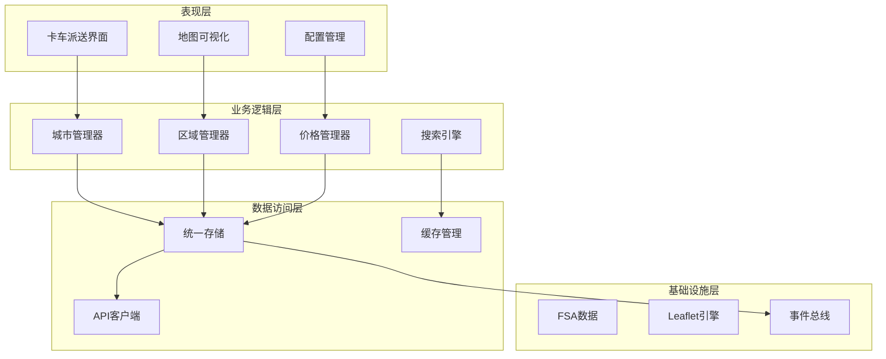
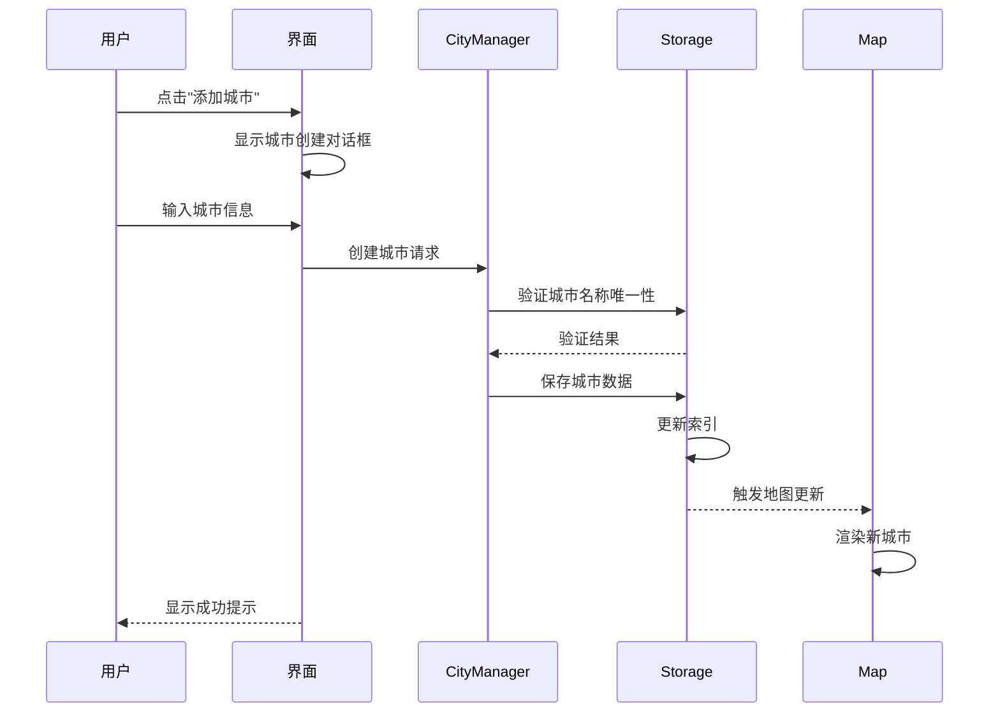
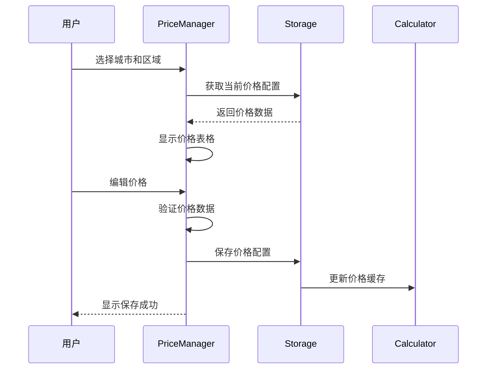

# truck-delivery - Task 50

Execute task 50 for the truck-delivery specification.

## Task Description
Implement search logic

## Code Reuse
**Leverage existing code**: FSA index from cityStorage

## Requirements Reference
**Requirements**: US-005

## Usage
```
/Task:50-truck-delivery
```

## Instructions

Execute with @spec-task-executor agent the following task: "Implement search logic"

```
Use the @spec-task-executor agent to implement task 50: "Implement search logic" for the truck-delivery specification and include all the below context.

# Steering Context
## Steering Documents Context (Pre-loaded)

### Product Context
# Product Steering Document

## 产品愿景
加拿大快递配送区域地图系统是一个专业的物流配送管理平台，通过可视化地图技术帮助物流公司高效管理配送区域、优化定价策略，提升运营效率。

## 目标用户
- **主要用户**：物流公司运营管理人员
- **次要用户**：配送调度员、客服人员
- **管理用户**：系统管理员、价格策略制定者

## 核心功能

### 现有功能
1. **FSA区域管理**
   - 基于加拿大邮政FSA（Forward Sortation Area）的配送区域划分
   - 可视化展示1600+个FSA多边形边界
   - 区域分组管理（8个默认区域）

2. **价格配置系统**
   - 基于重量区间的阶梯定价
   - 批量导入/导出价格配置
   - 实时价格计算引擎

3. **邮编管理**
   - 完整的加拿大邮编数据库
   - FSA与邮编的映射关系
   - 邮编搜索和筛选

4. **数据管理**
   - 统一存储架构
   - 数据导入导出
   - 自动备份恢复

### 新增功能（卡车派送）
1. **城市级别管理**
   - 以城市为单位的配送区域组织
   - 城市自定义颜色主题
   - 城市下辖多个价格区域

2. **分级区域定价**
   - 每个城市包含1-4个价格区域
   - 区域按价格递增排序（1区最便宜）
   - 视觉化价格梯度（颜色深浅）

3. **增强的搜索功能**
   - 特定邮编快速定位
   - 城市/区域/邮编多级筛选
   - 实时搜索结果高亮

## 业务目标
1. **提升效率**：减少80%的配送区域配置时间
2. **降低成本**：通过优化定价策略降低15%运营成本
3. **改善体验**：提供直观的可视化界面，降低培训成本
4. **扩展性**：支持多种配送模式（标准配送、卡车派送等）

## 成功指标
- 区域配置效率提升度
- 价格策略准确率
- 用户操作错误率降低
- 系统响应时间 < 2秒
- 地图加载时间 < 5秒

## 产品路线图
### Phase 1 (已完成)
- ✅ FSA基础地图展示
- ✅ 区域管理功能
- ✅ 价格配置系统
- ✅ 数据导入导出

### Phase 2 (进行中)
- 🚀 卡车派送模块
- 🚀 城市级别管理
- 🚀 分级定价系统

### Phase 3 (计划中)
- 路线优化算法
- 实时配送追踪
- 客户自助查询
- 移动端应用

---

### Technology Context
# Technology Steering Document

## 技术栈

### 前端技术
- **框架**: React 18.2
- **构建工具**: Vite 5.0
- **路由**: React Router v7
- **样式**: 
  - Tailwind CSS 3.3
  - Cyber/Tech主题设计
- **地图引擎**: 
  - Leaflet 1.9.4
  - React Leaflet 4.2.1
- **动画**: Framer Motion 10.16
- **HTTP客户端**: Axios 1.6.0
- **图标**: Lucide React

### 数据管理
- **状态管理**: React Hooks + Context API
- **本地存储**: localStorage (统一存储架构)
- **数据格式**: JSON
- **地理数据**: GeoJSON格式的FSA边界数据

### 开发工具
- **代码规范**: ESLint
- **包管理**: npm
- **并发执行**: Concurrently
- **桌面应用**: Electron (计划中)

## 架构决策

### 统一存储架构
**决策**: 使用单一的localStorage管理系统替代分散的存储方案

**原因**:
- 简化数据同步逻辑
- 提供统一的数据访问接口
- 便于实现数据恢复和备份

**实现**:
```javascript
// 核心存储模块
src/utils/unifiedStorage.js
src/utils/dataUpdateNotifier.js
src/utils/dataRecovery.js
```

### 组件化架构
**决策**: 采用功能性组件和Hooks模式

**原因**:
- 更好的代码复用性
- 简化状态管理
- 提升开发效率

### 地图渲染策略
**决策**: 使用Leaflet配合GeoJSON渲染FSA边界

**原因**:
- Leaflet性能优秀，支持大量多边形渲染
- GeoJSON是地理数据的标准格式
- React Leaflet提供良好的React集成

## 性能要求

### 响应时间
- 页面加载: < 3秒
- 地图初始化: < 5秒
- 搜索响应: < 500ms
- 数据保存: < 1秒

### 容量限制
- FSA多边形: ~1600个
- 邮编数据: ~850,000条
- localStorage限制: 5-10MB
- 地图缩放级别: 4-18

### 优化策略
- **视口剔除**: 只渲染可见区域的FSA
- **数据分块**: 大数据批量处理时分块进行
- **防抖节流**: 搜索输入使用300ms防抖
- **懒加载**: 按需加载地图瓦片和数据

## 技术约束

### 浏览器兼容性
- Chrome 90+
- Firefox 88+
- Safari 14+
- Edge 90+

### 数据限制
- localStorage大小限制 (5-10MB)
- 单次API请求限制 (100个项目)
- 地图瓦片并发请求限制 (6个)

### 安全要求
- 所有API通信使用HTTPS
- 敏感数据不存储在localStorage
- 实施CORS策略
- XSS防护

## 第三方服务

### 地图服务
- **瓦片服务器**: CartoDB Dark Matter
- **地理编码**: 内置邮编数据库
- **坐标系统**: WGS84 (EPSG:4326)

### 数据源
- **FSA边界**: Statistics Canada 2021 Census
- **邮编数据**: Canada Post官方数据
- **城市数据**: 自维护数据库

### 后端服务 (计划中)
- **数据库**: PostgreSQL + PostGIS
- **API框架**: Node.js + Express
- **ORM**: Prisma
- **缓存**: Redis

## 开发规范

### 代码风格
- ES6+语法
- 函数式编程优先
- 组件名使用PascalCase
- 文件名使用camelCase或PascalCase

### Git工作流
- 主分支: main
- 功能分支: feature/xxx
- 修复分支: fix/xxx
- 提交信息遵循conventional commits

### 测试策略
- 单元测试 (计划中): Jest + React Testing Library
- E2E测试 (计划中): Cypress
- 性能测试: Lighthouse

## 部署架构

### 当前部署
- **静态托管**: Vercel/Netlify
- **构建**: Vite production build
- **CDN**: 自动配置

### 未来架构
- **前端**: CDN + 静态托管
- **后端**: Cloud Run/AWS Lambda
- **数据库**: Cloud SQL/RDS
- **缓存**: Cloud Memorystore/ElastiCache

---

### Structure Context
# Project Structure Steering Document

## 目录结构

```
/
├── .claude/                    # Claude AI配置
│   └── steering/              # 项目指导文档
├── public/                    # 静态资源
│   └── data/                  # FSA边界数据文件
├── src/                       # 源代码
│   ├── components/            # React组件
│   ├── data/                  # 静态数据文件
│   ├── layouts/               # 布局组件
│   ├── pages/                 # 页面组件
│   ├── router/                # 路由配置
│   ├── services/              # 服务层
│   └── utils/                 # 工具函数
├── backend/                   # 后端服务 (如果存在)
└── dist/                      # 构建输出
```

## 文件组织规范

### 组件文件 (`src/components/`)
```
components/
├── maps/                      # 地图相关组件
│   ├── AccurateFSAMap.jsx    # FSA地图主组件
│   └── TruckDeliveryMap.jsx  # 卡车派送地图（新增）
├── regions/                   # 区域管理组件
│   ├── RegionManagementPanel.jsx
│   └── RegionSelector.jsx
├── cities/                    # 城市管理组件（新增）
│   ├── CityManager.jsx
│   └── CityRegionEditor.jsx
└── common/                    # 通用组件
    ├── SearchPanel.jsx
    └── ImportExportManager.jsx
```

### 页面文件 (`src/pages/`)
```
pages/
├── Dashboard/                 # 仪表板
│   └── index.jsx
├── Settings/                  # 设置页面
│   ├── index.jsx
│   ├── RegionSettings.jsx
│   ├── PriceSettings.jsx
│   └── PostalSettings.jsx
└── TruckDelivery/            # 卡车派送（新增）
    ├── index.jsx
    ├── CityView.jsx
    └── RegionDetail.jsx
```

### 工具文件 (`src/utils/`)
```
utils/
├── storage/                   # 存储相关
│   ├── unifiedStorage.js     # 统一存储
│   ├── cityStorage.js        # 城市存储（新增）
│   └── truckDeliveryStorage.js # 卡车派送存储（新增）
├── api/                       # API相关
│   └── apiClient.js
└── helpers/                   # 辅助函数
    ├── geoHelpers.js
    └── priceCalculator.js
```

## 命名规范

### 文件命名
- **组件文件**: PascalCase (如 `RegionManager.jsx`)
- **工具文件**: camelCase (如 `dataHelper.js`)
- **样式文件**: camelCase (如 `styles.module.css`)
- **常量文件**: SCREAMING_SNAKE_CASE (如 `CONSTANTS.js`)

### 变量命名
```javascript
// 组件
const RegionManager = () => { ... }

// 函数
const calculateDeliveryPrice = (weight, region) => { ... }

// 常量
const MAX_REGIONS_PER_CITY = 4;

// 状态
const [selectedCity, setSelectedCity] = useState(null);
```

### CSS类命名
```css
/* BEM风格 + Tailwind */
.city-selector__header { }
.city-selector__item--active { }

/* Tailwind优先 */
className="flex flex-col gap-4 p-6 bg-gray-900"
```

## 数据模型规范

### FSA数据结构
```javascript
{
  fsa: 'M5V',
  province: 'ON',
  city: 'Toronto',
  lat: 43.6426,
  lng: -79.3871,
  postalCodes: ['M5V 3A8', 'M5V 1A1']
}
```

### 城市数据结构（新增）
```javascript
{
  id: 'city-uuid',
  name: 'Toronto',
  province: 'ON',
  color: '#FF5733',        // 城市主题色
  regions: [
    {
      id: 'region-1',
      level: 1,            // 1-4区
      name: '市中心配送区',
      fsaCodes: ['M5V', 'M5G'],
      postalCodes: [],
      priceMultiplier: 1.0, // 价格系数
      color: '#FFE5B4'     // 浅色表示便宜
    }
  ],
  metadata: {
    createdAt: '2024-01-01T00:00:00Z',
    updatedAt: '2024-01-01T00:00:00Z'
  }
}
```

### 价格配置结构
```javascript
{
  basePrice: 15.99,
  weightRanges: [
    { min: 0, max: 10, price: 15.99 },
    { min: 10, max: 20, price: 25.99 }
  ],
  regionMultipliers: {
    '1': 1.0,  // 1区无加价
    '2': 1.2,  // 2区加价20%
    '3': 1.5,  // 3区加价50%
    '4': 2.0   // 4区加价100%
  }
}
```

## 新功能集成指南

### 添加卡车派送功能步骤

1. **创建页面路由**
```javascript
// src/router/index.jsx
{
  path: 'truck-delivery',
  element: <TruckDelivery />
}
```

2. **添加导航菜单**
```javascript
// src/layouts/MainLayout.jsx
<NavLink to="/truck-delivery">卡车派送</NavLink>
```

3. **实现数据存储**
```javascript
// src/utils/storage/cityStorage.js
export const getCities = () => { ... }
export const updateCity = (cityId, data) => { ... }
```

4. **创建UI组件**
```javascript
// src/components/cities/CityManager.jsx
const CityManager = () => {
  // 城市CRUD逻辑
}
```

5. **集成地图展示**
```javascript
// src/components/maps/TruckDeliveryMap.jsx
const TruckDeliveryMap = ({ cities, selectedCity }) => {
  // 城市和区域可视化
}
```

## 代码组织原则

### 单一职责
每个组件/模块只负责一个功能领域

### 依赖注入
通过props传递依赖，避免硬编码

### 数据流向
- 自上而下的数据流
- 通过回调函数向上传递事件
- 使用Context API共享全局状态

### 错误处理
```javascript
try {
  const data = await fetchCityData(cityId);
  return data;
} catch (error) {
  console.error('获取城市数据失败:', error);
  // 显示用户友好的错误信息
  showNotification('加载失败，请重试');
  return null;
}
```

## 测试规范

### 单元测试
- 测试文件与源文件同目录
- 命名: `ComponentName.test.jsx`
- 覆盖率目标: 80%

### 集成测试
- 测试用户操作流程
- 使用React Testing Library
- 模拟API响应

### E2E测试
- 关键用户路径
- 使用Cypress
- 定期运行回归测试

**Note**: Steering documents have been pre-loaded. Do not use get-content to fetch them again.

# Specification Context
## Specification Context (Pre-loaded): truck-delivery

### Requirements
# 卡车派送功能需求文档

## 功能概述
实现加拿大快递配送系统的卡车派送模块，支持以城市为单位的配送区域管理，每个城市可包含1-4个价格递增的配送区域，提供可视化地图展示和价格管理功能。

## 用户故事

### US-001: 城市管理
**作为** 物流管理员  
**我想要** 创建和管理以城市为单位的配送区域  
**以便** 更好地组织和管理不同城市的配送业务

**验收标准**:
- WHEN 我访问卡车派送模块 THEN 我能看到城市列表
- WHEN 我创建新城市 THEN 系统要求输入城市名称、省份和主题色
- WHEN 城市创建成功 THEN 城市出现在列表中并可在地图上查看
- IF 城市名称已存在 THEN 系统提示错误信息
- WHEN 我编辑城市信息 THEN 更改立即生效并同步到地图

### US-002: 分级区域配置
**作为** 价格策略制定者  
**我想要** 为每个城市配置1-10个不同价格等级的配送区域  
**以便** 实现基于距离或难度的差异化定价

**验收标准**:
- WHEN 我选择一个城市 THEN 我可以添加最多10个配送区域(默认显示4个，可扩展)
- WHEN 城市已有10个区域 THEN 添加按钮被禁用并显示"已达最大区域数"
- WHEN 我配置区域 THEN 必须指定区域等级(1-10)、名称和包含的FSA代码
- WHEN 我设置区域等级 THEN 每个区域可独立设置价格，无需依赖系数
- IF FSA已被其他城市使用 THEN 系统提示冲突并阻止保存
- WHEN 我调整区域边界 THEN 地图实时更新显示

### US-003: 价格配置管理
**作为** 价格管理员  
**我想要** 为每个城市的每个区域独立设置基于重量的阶梯价格  
**以便** 精确控制不同区域的配送成本

**验收标准**:
- WHEN 我选择城市和区域 THEN 显示该区域独立的价格配置表
- WHEN 我为某个区域设置价格 THEN 每个重量区间可独立定价
- WHEN 区域价格设置 THEN 每个区域有完全独立的价格体系，不依赖系数计算
- WHEN 价格计算时 THEN 直接使用该区域对应重量区间的价格
- WHEN 我批量导入价格 THEN 系统验证格式并更新所有相关区域
- IF 价格数据无效 THEN 显示详细错误信息(字段名、行号、错误原因)

### US-004: 地图可视化
**作为** 运营人员  
**我想要** 在地图上直观查看城市和区域的配送范围  
**以便** 快速了解配送覆盖情况和价格分布

**验收标准**:
- WHEN 我打开卡车派送地图 THEN 显示所有配置的城市
- WHEN 城市在地图上显示 THEN 使用其主题色作为标识
- WHEN 我选择一个城市 THEN 地图聚焦并显示其所有区域
- WHEN 区域显示 THEN 使用渐进色调区分不同区域(1-10区从浅到深)
- WHEN 地图加载 THEN 初始渲染时间不超过3秒
- WHEN 我搜索邮编 THEN 地图定位并高亮对应的城市和区域

### US-005: 邮编搜索定位
**作为** 客服人员  
**我想要** 通过邮编快速查找对应的城市和配送区域  
**以便** 为客户提供准确的配送信息和报价

**验收标准**:
- WHEN 我输入完整邮编 THEN 系统显示所属城市、区域和价格
- WHEN 我输入FSA代码 THEN 显示该FSA覆盖的所有邮编
- WHEN 搜索结果显示 THEN 包含城市名、区域等级和预估价格
- IF 邮编未被任何城市覆盖 THEN 提示"该地区暂无卡车派送服务"
- WHEN 我点击搜索结果 THEN 地图自动定位到该位置

### US-006: 数据导入导出
**作为** 系统管理员  
**我想要** 批量导入导出城市和区域配置  
**以便** 快速部署新城市或备份现有配置

**验收标准**:
- WHEN 我导出配置 THEN 生成包含所有城市、区域和价格的JSON文件
- WHEN 我导入配置 THEN 系统验证数据完整性和格式
- WHEN 数据验证时 THEN 检查必填字段、数据类型、值范围、FSA代码格式
- IF 导入数据与现有数据冲突 THEN 提供冲突解决选项(覆盖/跳过/合并)
- WHEN 导入成功 THEN 显示导入统计(新增/更新/跳过的记录数)
- WHEN 我选择部分导出 THEN 可以只导出特定城市的数据

## 功能性需求

### FR-001: 城市数据模型
- 每个城市必须有唯一ID、名称、省份代码、主题色
- 城市可包含1-10个配送区域(通常使用4个)
- 城市数据需支持版本控制和审计日志

### FR-002: 区域数据模型
- 每个区域必须有ID、cityId、等级(1-10)、名称、FSA列表、独立价格配置
- 区域等级仅用于显示顺序和颜色区分
- FSA代码在卡车派送模块内必须唯一(不能被多个城市使用)
- 区域数据包含创建时间、更新时间和版本号
- 每个区域拥有完整的重量-价格配置表

### FR-003: 价格计算引擎
- 每个区域独立配置重量区间的阶梯定价
- 价格直接查表获取，无需系数计算
- 支持13个标准重量区间(0-64kg+)
- 价格计算需考虑特殊日期和促销规则(预留接口)

### FR-004: 地图渲染性能
- 支持同时显示20个城市的详细边界
- 地图初始加载时间不超过5秒
- 支持平滑的缩放和平移操作
- 使用视口剔除优化大量FSA渲染

### FR-005: 搜索功能
- 支持邮编、FSA、城市名的模糊搜索
- 搜索响应时间<500ms
- 搜索结果需包含完整的层级信息

### FR-006: 数据持久化
- 使用统一存储架构保存城市和区域数据
- 支持自动备份和恢复机制
- 数据更新通过dataUpdateNotifier触发全局通知
- 数据包含版本号和时间戳用于冲突检测

## 非功能性需求

### NFR-001: 性能要求
- 页面加载时间 < 3秒
- 地图初始渲染 < 5秒
- 搜索响应时间 < 500ms
- 支持1000+个FSA的流畅渲染(使用视口剔除)

### NFR-002: 可用性要求
- 界面遵循现有的Cyber/Tech主题设计
- 支持键盘导航和快捷键
- 提供操作提示和帮助文档
- 错误信息清晰且可操作

### NFR-003: 兼容性要求
- 支持Chrome 90+、Firefox 88+、Safari 14+
- 响应式设计，支持1366×768以上分辨率
- 与现有FSA管理模块数据互通

### NFR-004: 安全性要求
- 敏感价格配置使用混淆存储
- 操作日志记录在sessionStorage
- 基于配置的角色访问控制

## 约束条件

### 技术约束
- 必须使用React 18和现有技术栈
- 复用现有的unifiedStorage存储架构
- 遵循现有的代码规范和组件模式

### 业务约束
- FSA代码在卡车派送模块内不能跨城市重复使用
- 每个城市最多10个价格区域(默认使用4个)
- 每个区域价格独立配置，不强制递增关系

### 数据约束
- 使用加拿大官方FSA边界数据
- localStorage实际可用空间限制在5MB以内
- 批量导入单次最多处理100条记录

## 依赖关系

### 内部依赖
- 统一存储模块(unifiedStorage.js)
- FSA数据服务(deliverableFSA.js)
- 地图组件(AccurateFSAMap.jsx)
- 价格计算引擎(quotationGenerator.js)

### 外部依赖
- Leaflet地图引擎
- React Router路由
- Tailwind CSS样式框架

## 风险和假设

### 风险
- FSA边界数据可能不完整或过时
- 大量城市数据可能超出localStorage限制
- 地图渲染性能可能受设备性能影响

### 假设
- 用户浏览器支持现代JavaScript特性
- 网络连接稳定(地图瓦片加载)
- FSA数据格式保持稳定

## 成功标准
- 所有用户故事的验收标准通过
- 性能指标达到要求
- 与现有系统无缝集成
- 用户培训后可独立操作

## 附录

### 术语表
- **FSA**: Forward Sortation Area，加拿大邮编前3位
- **卡车派送**: 使用卡车进行的大件或批量配送服务
- **价格区域**: 城市内按配送难度划分的定价区域
- **独立定价**: 每个区域拥有完全独立的价格体系

### 参考资料
- 产品指导文档: `.claude/steering/product.md`
- 技术规范: `.claude/steering/tech.md`
- 项目结构: `.claude/steering/structure.md`

---

### Design
# 卡车派送功能设计文档

## 指导文档对齐

### 与 tech.md 对齐
- **技术栈一致性**: 使用React 18、Vite、Tailwind CSS、Leaflet等现有技术栈
- **存储架构**: 复用unifiedStorage统一存储架构，遵循5MB localStorage限制
- **性能指标**: 页面加载<3秒，地图渲染<5秒，搜索响应<500ms
- **开发规范**: 遵循ES6+语法、函数式编程、组件命名规范

### 与 structure.md 对齐
- **目录结构**: 
  - 城市管理组件: `src/components/cities/`
  - 地图组件: `src/components/maps/TruckDeliveryMap.jsx`
  - 工具函数: `src/utils/storage/cityStorage.js`
  - 页面组件: `src/pages/TruckDelivery/`
- **命名规范**: PascalCase组件名，camelCase工具函数
- **数据模型**: 遵循现有FSA和区域数据结构规范

### 与 product.md 对齐
- **Phase 2目标**: 实现卡车派送、城市管理、分级定价
- **业务目标**: 提升配置效率80%，降低运营成本15%
- **用户体验**: 直观可视化界面，降低培训成本

## 代码复用分析

### 可直接复用的组件
1. **AccurateFSAMap**: 地图渲染核心逻辑，包括FSA边界渲染、缩放控制
2. **AnimatedSearchBox**: 搜索框动画和防抖逻辑
3. **FilterButtonGroup**: 筛选按钮组件
4. **MainLayout**: 整体布局框架
5. **dataUpdateNotifier**: 事件通知系统
6. **unifiedStorage**: 存储管理架构

### 需要扩展的组件
1. **RegionPriceManager**: 
   - 移除价格系数逻辑
   - 改为独立价格表编辑
   - 保留重量区间配置界面
2. **RegionManagementPanel**:
   - 扩展支持10个区域
   - 添加城市关联逻辑

### 新建组件
1. **CityManager**: 城市CRUD管理
2. **CityRegionEditor**: 城市下区域编辑
3. **TruckDeliveryMap**: 卡车派送专用地图
4. **TruckPriceTable**: 独立价格表组件

## 系统架构概述

### 整体架构
卡车派送模块作为独立功能模块集成到现有系统中，复用现有的地图渲染、存储架构和UI组件库。采用分层架构设计：



### 模块间交互
- **松耦合设计**: 通过事件总线(dataUpdateNotifier)实现模块间通信
- **数据一致性**: 使用统一存储架构确保数据同步
- **性能优化**: 使用缓存层减少重复计算

## 数据模型设计

### 城市数据模型
```typescript
interface TruckDeliveryCity {
  id: string;                    // UUID
  name: string;                  // 城市名称
  province: string;              // 省份代码
  themeColor: string;           // 主题色 #RRGGBB
  regions: TruckDeliveryRegion[]; // 区域列表(1-10个)
  isActive: boolean;            // 是否启用
  metadata: {
    createdAt: string;          // ISO时间戳
    updatedAt: string;          // ISO时间戳
    version: number;            // 版本号
    createdBy?: string;         // 创建者
    notes?: string;             // 备注
  };
}
```

### 区域数据模型
```typescript
interface TruckDeliveryRegion {
  id: string;                    // UUID
  cityId: string;                // 关联城市ID
  level: number;                 // 区域等级(1-10，仅用于排序和显示)
  name: string;                  // 区域名称
  fsaCodes: string[];           // FSA代码列表
  priceTable: RegionPriceTable; // 独立价格表(每个重量区间独立定价)
  displayColor?: string;         // 显示颜色(根据等级自动计算)
  boundary?: GeoJSON;            // 区域边界(由FSA聚合)
  metadata: {
    createdAt: string;
    updatedAt: string;
    version: number;
  };
}
```

### 价格配置模型
```typescript
interface RegionPriceTable {
  regionId: string;              // 关联区域ID
  prices: WeightRangePrice[];    // 独立的重量区间价格表
  currency: 'CAD';               // 货币单位
  effectiveDate?: string;        // 生效日期
  expiryDate?: string;          // 失效日期
}

interface WeightRangePrice {
  id: string;                    // range_1 to range_13
  min: number;                   // 最小重量(kg)
  max: number;                   // 最大重量(kg)  
  label: string;                 // 显示标签 (如 "0-11 KGS")
  price: number;                 // 该区间的独立价格(无需系数计算)
  isActive: boolean;             // 是否启用
}
```

### 存储键设计
```javascript
// localStorage键名规范
const STORAGE_KEYS = {
  TRUCK_CITIES: 'truck_delivery_cities',           // 城市列表
  TRUCK_CITY_PREFIX: 'truck_city_',               // 单个城市: truck_city_{id}
  TRUCK_REGION_PREFIX: 'truck_region_',           // 单个区域: truck_region_{id}
  TRUCK_PRICE_PREFIX: 'truck_price_',             // 价格配置: truck_price_{regionId}
  TRUCK_FSA_INDEX: 'truck_fsa_city_index',        // FSA-城市索引
  TRUCK_BACKUP_PREFIX: 'truck_backup_'            // 备份前缀
};
```

## 核心组件设计

### 1. 卡车派送主界面
**组件**: `TruckDeliveryDashboard.jsx`
**职责**: 
- 整合地图、城市列表、配置面板
- 管理全局状态和路由
- 协调子组件交互

**复用组件**:
- MainLayout (布局框架)
- AnimatedSearchBox (搜索框)
- FilterButtonGroup (筛选按钮)

### 2. 城市管理组件
**组件**: `CityManager.jsx`
**职责**:
- 城市CRUD操作
- 城市列表展示和筛选
- 主题色选择器

**状态管理**:
```javascript
const [cities, setCities] = useState([]);
const [selectedCity, setSelectedCity] = useState(null);
const [isEditing, setIsEditing] = useState(false);
const [searchTerm, setSearchTerm] = useState('');
```

### 3. 区域编辑器
**组件**: `CityRegionEditor.jsx`
**职责**:
- 管理城市下的1-10个区域
- FSA分配和冲突检测
- 区域边界可视化

**关键功能**:
- 动态添加/删除区域(最多10个)
- FSA拖拽分配
- 实时冲突检测
- 颜色自动计算

### 4. 卡车派送地图
**组件**: `TruckDeliveryMap.jsx`
**职责**:
- 渲染城市和区域边界
- 处理地图交互
- 显示价格热力图

**复用/扩展**: 基于AccurateFSAMap组件
```javascript
// 继承现有地图功能
import { AccurateFSAMap } from './AccurateFSAMap';

// 扩展渲染逻辑
const renderCityRegions = (city) => {
  return city.regions.map(region => ({
    ...region,
    color: calculateRegionColor(city.themeColor, region.level),
    opacity: calculateOpacity(region.level)
  }));
};
```

### 5. 区域价格管理器
**组件**: `RegionPriceManager.jsx`
**职责**:
- 独立配置每个区域的价格表
- 批量价格导入/导出
- 价格历史记录

**复用**: 基于现有RegionPriceManager组件改造
- 移除价格系数逻辑
- 增加独立价格表编辑
- 保留重量区间配置

### 6. 搜索和定位
**组件**: `TruckDeliverySearch.jsx`
**职责**:
- 邮编/FSA/城市搜索
- 搜索结果高亮
- 地图自动定位

**集成点**:
```javascript
// 复用现有搜索逻辑
import { AnimatedSearchBox } from './AnimatedSearchBox';
import { searchFSAByPostalCode } from '../utils/searchEngine';

// 扩展搜索范围
const searchInTruckDelivery = (query) => {
  // 搜索城市
  const cityResults = searchCities(query);
  // 搜索区域
  const regionResults = searchRegions(query);
  // 搜索FSA
  const fsaResults = searchFSA(query);
  
  return [...cityResults, ...regionResults, ...fsaResults];
};
```

## 服务层设计

### 1. 城市存储服务
**文件**: `src/utils/storage/cityStorage.js`
```javascript
export class CityStorageService {
  // 获取所有城市
  async getAllCities() {
    return await storageService.get(STORAGE_KEYS.TRUCK_CITIES) || [];
  }
  
  // 保存城市
  async saveCity(city) {
    // 验证FSA冲突
    await this.validateFSAConflicts(city);
    // 保存数据
    await storageService.set(`${STORAGE_KEYS.TRUCK_CITY_PREFIX}${city.id}`, city);
    // 更新索引
    await this.updateFSAIndex(city);
    // 触发更新通知
    dataUpdateNotifier.notify('city', city);
  }
  
  // FSA冲突检测
  async validateFSAConflicts(city) {
    const index = await this.getFSAIndex();
    const conflicts = [];
    
    city.regions.forEach(region => {
      region.fsaCodes.forEach(fsa => {
        if (index[fsa] && index[fsa] !== city.id) {
          conflicts.push({ fsa, existingCity: index[fsa] });
        }
      });
    });
    
    if (conflicts.length > 0) {
      throw new FSAConflictError(conflicts);
    }
  }
}
```

### 2. 价格计算服务
**文件**: `src/utils/truck/truckPriceCalculator.js`
```javascript
export class TruckPriceCalculator {
  // 计算配送价格 - 直接查表，无系数计算
  calculatePrice(weight, regionId) {
    const priceTable = this.getPriceTable(regionId);
    const priceEntry = this.findPriceByWeight(weight, priceTable.prices);
    
    if (!priceEntry || !priceEntry.isActive) {
      throw new Error(`No active price for weight ${weight}kg in region ${regionId}`);
    }
    
    // 直接返回该重量区间的独立价格
    return {
      price: priceEntry.price,        // 直接使用配置的价格
      weightRange: priceEntry.label,  // 如 "0-11 KGS"
      regionId: regionId,
      weight: weight
    };
  }
  
  // 查找重量对应的价格
  findPriceByWeight(weight, prices) {
    return prices.find(p => weight >= p.min && weight <= p.max);
  }
  
  // 批量计算
  calculateBulkPrices(items, regionId) {
    return items.map(item => ({
      ...item,
      ...this.calculatePrice(item.weight, regionId)
    }));
  }
}
```

### 3. 地图数据服务
**文件**: `src/utils/storage/truckMapDataService.js`
```javascript
export class TruckMapDataService {
  // 构建城市地图数据
  async buildCityMapData(cityId) {
    const city = await cityStorage.getCity(cityId);
    const fsaBoundaries = await this.loadFSABoundaries(city);
    
    return {
      type: 'FeatureCollection',
      features: city.regions.map(region => ({
        type: 'Feature',
        properties: {
          regionId: region.id,
          regionName: region.name,
          level: region.level,
          cityId: city.id,
          cityName: city.name,
          color: this.calculateColor(city.themeColor, region.level)
        },
        geometry: this.mergeGeometries(
          region.fsaCodes.map(fsa => fsaBoundaries[fsa])
        )
      }))
    };
  }
  
  // 颜色计算
  calculateColor(baseColor, level) {
    // 根据等级调整颜色深浅
    const opacity = 0.2 + (level / 10) * 0.7; // 0.2-0.9
    return { color: baseColor, opacity };
  }
}
```

## 用户界面设计

### 页面布局
```
┌──────────────────────────────────────────────┐
│                  顶部导航栏                    │
├──────────────┬───────────────────────────────┤
│              │                               │
│   城市列表    │          地图视图              │
│              │                               │
│   [搜索框]    │      [城市/区域边界渲染]       │
│              │                               │
│   城市1 🟢    │                               │
│   城市2 🔵    │      [价格热力图叠加]          │
│   城市3 🟡    │                               │
│              │                               │
│   [+添加城市]  │      [缩放/平移控制]          │
│              │                               │
├──────────────┴───────────────────────────────┤
│          底部配置面板 (可折叠)                  │
│  [区域管理] [价格设置] [导入导出] [统计分析]     │
└──────────────────────────────────────────────┘
```

### 交互流程

#### 创建城市流程


#### 配置区域价格流程


## 性能优化策略

### 地图渲染优化
1. **视口剔除**: 只渲染可见区域的FSA
2. **分级加载**: 根据缩放级别加载不同精度的边界
3. **边界简化**: 使用Douglas-Peucker算法简化多边形
4. **WebWorker**: 在后台线程处理大量地理数据

```javascript
// 视口剔除实现
const filterVisibleRegions = (regions, mapBounds) => {
  return regions.filter(region => {
    const regionBounds = L.geoJSON(region.boundary).getBounds();
    return mapBounds.intersects(regionBounds);
  });
};
```

### 数据缓存策略
1. **多级缓存**: 内存 > localStorage > API
2. **增量更新**: 只同步变更的数据
3. **压缩存储**: 使用LZ-string压缩大数据
4. **过期策略**: 自动清理过期缓存

```javascript
// 缓存管理
class CacheManager {
  constructor() {
    this.memCache = new Map();
    this.maxMemSize = 50; // 50MB
  }
  
  get(key) {
    // 先查内存
    if (this.memCache.has(key)) {
      return this.memCache.get(key);
    }
    // 再查localStorage
    const stored = localStorage.getItem(key);
    if (stored) {
      const data = JSON.parse(stored);
      // 加入内存缓存
      this.memCache.set(key, data);
      return data;
    }
    return null;
  }
}
```

### 搜索性能优化
1. **索引构建**: 预构建FSA和邮编索引
2. **防抖处理**: 搜索输入防抖300ms
3. **结果缓存**: 缓存最近搜索结果
4. **模糊匹配**: 使用Trie树加速前缀搜索

## 错误处理策略

### 错误分类和处理
```javascript
// 业务逻辑错误
class FSAConflictError extends Error {
  constructor(conflicts) {
    super('FSA codes already assigned to other cities');
    this.name = 'FSAConflictError';
    this.conflicts = conflicts;
    this.recoverable = true;
  }
}

// 存储错误
class StorageQuotaError extends Error {
  constructor(required, available) {
    super(`Storage quota exceeded: need ${required}MB, have ${available}MB`);
    this.name = 'StorageQuotaError';
    this.required = required;
    this.available = available;
    this.recoverable = false;
  }
}

// 数据验证错误
class ValidationError extends Error {
  constructor(field, value, rule) {
    super(`Validation failed for ${field}: ${rule}`);
    this.name = 'ValidationError';
    this.field = field;
    this.value = value;
    this.rule = rule;
    this.recoverable = true;
  }
}
```

### 全局错误处理器
```javascript
// src/utils/truck/errorHandler.js
export const handleTruckDeliveryError = (error, context) => {
  console.error(`Error in ${context}:`, error);
  
  if (error.recoverable) {
    // 可恢复错误：提示用户并提供解决方案
    showNotification({
      type: 'warning',
      message: error.message,
      action: getRecoveryAction(error)
    });
  } else {
    // 不可恢复错误：记录日志并降级处理
    logError(error, context);
    fallbackToSafeState();
  }
};
```

### 错误恢复策略
1. **API调用重试**: 指数退避算法，最多重试3次
2. **数据验证失败**: 保留用户输入，高亮错误字段
3. **存储配额超限**: 自动清理过期数据或提示用户
4. **FSA冲突**: 显示冲突详情，提供解决选项

## 安全考虑

### 数据保护
1. **价格混淆**: 敏感价格数据使用简单混淆
2. **操作日志**: 记录关键操作到sessionStorage
3. **权限控制**: 基于配置的功能访问控制
4. **输入验证**: 严格验证用户输入

```javascript
// 价格数据混淆
const obfuscatePrice = (price) => {
  return btoa(String(price).split('').reverse().join(''));
};

const deobfuscatePrice = (obfuscated) => {
  return Number(atob(obfuscated).split('').reverse().join(''));
};
```

## 完整测试策略

### 单元测试
**覆盖率目标**: 80%

**关键测试点**:
```javascript
// src/utils/truck/__tests__/truckPriceCalculator.test.js
describe('TruckPriceCalculator', () => {
  test('should return correct price for weight range', () => {
    const calculator = new TruckPriceCalculator();
    const result = calculator.calculatePrice(10, 'region-1');
    expect(result.price).toBe(15.99);
    expect(result.weightRange).toBe('0-11 KGS');
  });
  
  test('should throw error for invalid weight', () => {
    const calculator = new TruckPriceCalculator();
    expect(() => calculator.calculatePrice(-1, 'region-1')).toThrow();
  });
});

// src/utils/truck/__tests__/cityStorage.test.js
describe('CityStorageService', () => {
  test('should detect FSA conflicts', async () => {
    const service = new CityStorageService();
    const city = { id: 'city-1', regions: [{ fsaCodes: ['M5V'] }] };
    await expect(service.validateFSAConflicts(city)).rejects.toThrow(FSAConflictError);
  });
});
```

### 集成测试
**测试场景**:
1. **城市创建流程**
   - 创建城市 → 添加区域 → 分配FSA → 设置价格
   - 验证数据持久化和地图更新

2. **价格配置流程**
   - 选择区域 → 编辑价格表 → 保存 → 验证计算
   - 测试批量导入和导出

3. **搜索定位流程**
   - 输入邮编 → 搜索 → 验证结果 → 地图定位
   - 测试模糊搜索和自动完成

### E2E测试
```javascript
// cypress/e2e/truck-delivery.cy.js
describe('Truck Delivery Feature', () => {
  it('should create city with regions', () => {
    cy.visit('/truck-delivery');
    cy.get('[data-cy=add-city]').click();
    cy.get('[data-cy=city-name]').type('Toronto');
    cy.get('[data-cy=save-city]').click();
    cy.get('[data-cy=city-list]').should('contain', 'Toronto');
  });
});
```

### 性能测试基准
- **地图渲染**: 20个城市 < 5秒 (与tech.md一致)
- **搜索响应**: 1000个FSA < 500ms
- **价格计算**: 1000次查表 < 100ms
- **数据加载**: 5MB数据 < 2秒

## 部署和迁移

### 部署清单
1. 创建新路由 `/truck-delivery`
2. 添加导航菜单项
3. 初始化存储结构
4. 迁移现有FSA数据（如需要）

### 数据迁移策略
```javascript
// 从现有区域数据迁移到卡车派送
const migrateExistingRegions = async () => {
  const existingRegions = await getAllRegionConfigs();
  const cities = [];
  
  // 转换为城市-区域结构
  Object.values(existingRegions).forEach(region => {
    if (region.fsaCodes && region.fsaCodes.length > 0) {
      // 创建虚拟城市
      cities.push({
        id: generateId(),
        name: `迁移区域 ${region.id}`,
        regions: [{
          level: 1,
          fsaCodes: region.fsaCodes,
          priceConfig: region.weightRanges
        }]
      });
    }
  });
  
  return cities;
};
```

## 未来扩展

### 计划功能
1. **路线优化**: 集成路线规划算法
2. **实时追踪**: WebSocket实时更新配送状态
3. **移动端**: React Native移动应用
4. **API开放**: 对外提供价格查询API

### 扩展接口预留
```javascript
// 预留扩展接口
export interface TruckDeliveryExtensions {
  // 路线优化
  routeOptimizer?: IRouteOptimizer;
  // 实时追踪
  trackingService?: ITrackingService;
  // 第三方集成
  integrations?: IIntegration[];
}
```

## 总结

本设计文档定义了卡车派送功能的完整技术架构，充分复用现有组件和基础设施，同时保持模块独立性。通过分层架构、事件驱动和缓存优化，确保系统的可扩展性和高性能。独立的价格配置体系提供了最大的灵活性，满足复杂的业务需求。

**Note**: Specification documents have been pre-loaded. Do not use get-content to fetch them again.

## Task Details
- Task ID: 50
- Description: Implement search logic
- Leverage: FSA index from cityStorage
- Requirements: US-005

## Instructions
- Implement ONLY task 50: "Implement search logic"
- Follow all project conventions and leverage existing code
- Mark the task as complete using: claude-code-spec-workflow get-tasks truck-delivery 50 --mode complete
- Provide a completion summary
```

## Task Completion
When the task is complete, mark it as done:
```bash
claude-code-spec-workflow get-tasks truck-delivery 50 --mode complete
```

## Next Steps
After task completion, you can:
- Execute the next task using /truck-delivery-task-[next-id]
- Check overall progress with /spec-status truck-delivery
