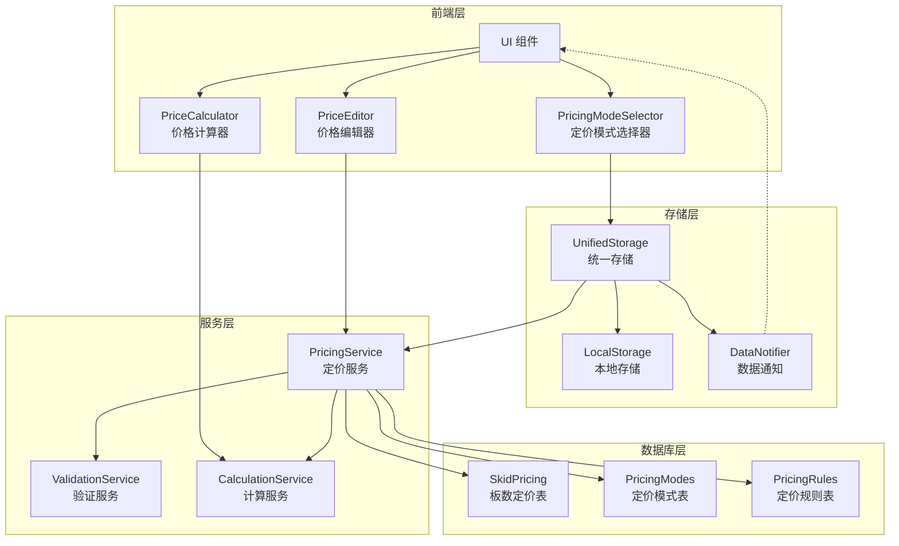
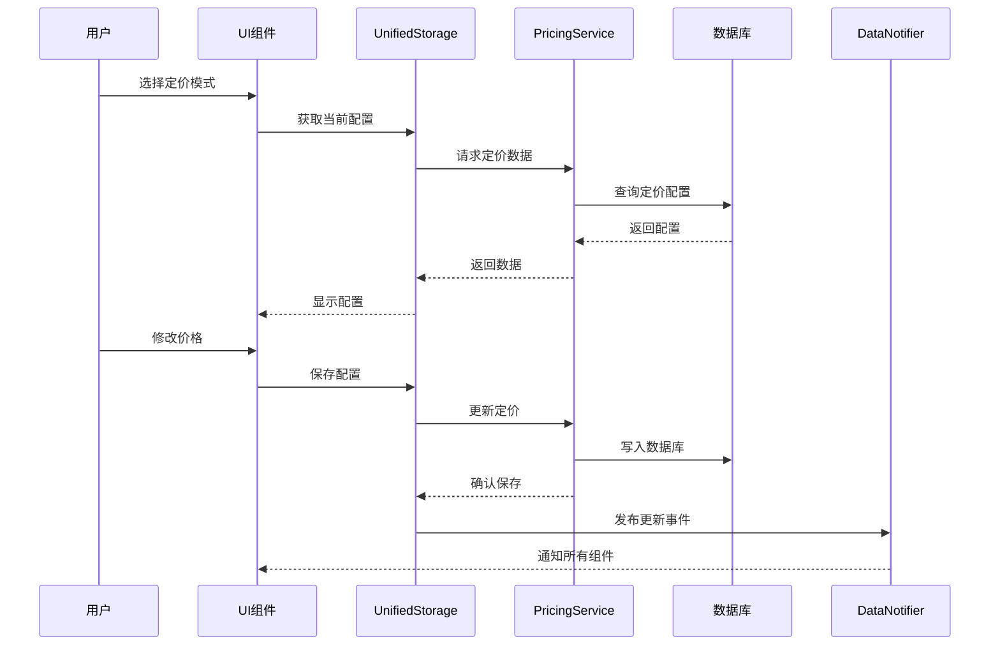
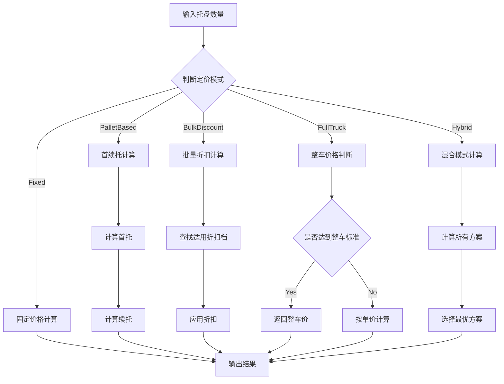

# truck-pricing-enhancement - Task 4

Execute task 4 for the truck-pricing-enhancement specification.

## Task Description
创建定价模式路由文件

## Code Reuse
**Leverage existing code**: backend/src/routes/skidPricing.js

## Requirements Reference
**Requirements**: 1, 4

## Usage
```
/Task:4-truck-pricing-enhancement
```

## Instructions

Execute with @spec-task-executor agent the following task: "创建定价模式路由文件"

```
Use the @spec-task-executor agent to implement task 4: "创建定价模式路由文件" for the truck-pricing-enhancement specification and include all the below context.

# Steering Context
## Steering Documents Context (Pre-loaded)

### Product Context
# Product Steering Document

## 产品愿景
加拿大快递配送区域地图系统是一个专业的物流配送管理平台，通过可视化地图技术帮助物流公司高效管理配送区域、优化定价策略，提升运营效率。

## 目标用户
- **主要用户**：物流公司运营管理人员
- **次要用户**：配送调度员、客服人员
- **管理用户**：系统管理员、价格策略制定者

## 核心功能

### 现有功能
1. **FSA区域管理**
   - 基于加拿大邮政FSA（Forward Sortation Area）的配送区域划分
   - 可视化展示1600+个FSA多边形边界
   - 区域分组管理（8个默认区域）

2. **价格配置系统**
   - 基于重量区间的阶梯定价
   - 批量导入/导出价格配置
   - 实时价格计算引擎

3. **邮编管理**
   - 完整的加拿大邮编数据库
   - FSA与邮编的映射关系
   - 邮编搜索和筛选

4. **数据管理**
   - 统一存储架构
   - 数据导入导出
   - 自动备份恢复

### 新增功能（卡车派送）
1. **城市级别管理**
   - 以城市为单位的配送区域组织
   - 城市自定义颜色主题
   - 城市下辖多个价格区域

2. **分级区域定价**
   - 每个城市包含1-4个价格区域
   - 区域按价格递增排序（1区最便宜）
   - 视觉化价格梯度（颜色深浅）

3. **增强的搜索功能**
   - 特定邮编快速定位
   - 城市/区域/邮编多级筛选
   - 实时搜索结果高亮

## 业务目标
1. **提升效率**：减少80%的配送区域配置时间
2. **降低成本**：通过优化定价策略降低15%运营成本
3. **改善体验**：提供直观的可视化界面，降低培训成本
4. **扩展性**：支持多种配送模式（标准配送、卡车派送等）

## 成功指标
- 区域配置效率提升度
- 价格策略准确率
- 用户操作错误率降低
- 系统响应时间 < 2秒
- 地图加载时间 < 5秒

## 产品路线图
### Phase 1 (已完成)
- ✅ FSA基础地图展示
- ✅ 区域管理功能
- ✅ 价格配置系统
- ✅ 数据导入导出

### Phase 2 (进行中)
- 🚀 卡车派送模块
- 🚀 城市级别管理
- 🚀 分级定价系统

### Phase 3 (计划中)
- 路线优化算法
- 实时配送追踪
- 客户自助查询
- 移动端应用

---

### Technology Context
# Technology Steering Document

## 技术栈

### 前端技术
- **框架**: React 18.2
- **构建工具**: Vite 5.0
- **路由**: React Router v7
- **样式**: 
  - Tailwind CSS 3.3
  - Cyber/Tech主题设计
- **地图引擎**: 
  - Leaflet 1.9.4
  - React Leaflet 4.2.1
- **动画**: Framer Motion 10.16
- **HTTP客户端**: Axios 1.6.0
- **图标**: Lucide React

### 数据管理
- **状态管理**: React Hooks + Context API
- **本地存储**: localStorage (统一存储架构)
- **数据格式**: JSON
- **地理数据**: GeoJSON格式的FSA边界数据

### 开发工具
- **代码规范**: ESLint
- **包管理**: npm
- **并发执行**: Concurrently
- **桌面应用**: Electron (计划中)

## 架构决策

### 统一存储架构
**决策**: 使用单一的localStorage管理系统替代分散的存储方案

**原因**:
- 简化数据同步逻辑
- 提供统一的数据访问接口
- 便于实现数据恢复和备份

**实现**:
```javascript
// 核心存储模块
src/utils/unifiedStorage.js
src/utils/dataUpdateNotifier.js
src/utils/dataRecovery.js
```

### 组件化架构
**决策**: 采用功能性组件和Hooks模式

**原因**:
- 更好的代码复用性
- 简化状态管理
- 提升开发效率

### 地图渲染策略
**决策**: 使用Leaflet配合GeoJSON渲染FSA边界

**原因**:
- Leaflet性能优秀，支持大量多边形渲染
- GeoJSON是地理数据的标准格式
- React Leaflet提供良好的React集成

## 性能要求

### 响应时间
- 页面加载: < 3秒
- 地图初始化: < 5秒
- 搜索响应: < 500ms
- 数据保存: < 1秒

### 容量限制
- FSA多边形: ~1600个
- 邮编数据: ~850,000条
- localStorage限制: 5-10MB
- 地图缩放级别: 4-18

### 优化策略
- **视口剔除**: 只渲染可见区域的FSA
- **数据分块**: 大数据批量处理时分块进行
- **防抖节流**: 搜索输入使用300ms防抖
- **懒加载**: 按需加载地图瓦片和数据

## 技术约束

### 浏览器兼容性
- Chrome 90+
- Firefox 88+
- Safari 14+
- Edge 90+

### 数据限制
- localStorage大小限制 (5-10MB)
- 单次API请求限制 (100个项目)
- 地图瓦片并发请求限制 (6个)

### 安全要求
- 所有API通信使用HTTPS
- 敏感数据不存储在localStorage
- 实施CORS策略
- XSS防护

## 第三方服务

### 地图服务
- **瓦片服务器**: CartoDB Dark Matter
- **地理编码**: 内置邮编数据库
- **坐标系统**: WGS84 (EPSG:4326)

### 数据源
- **FSA边界**: Statistics Canada 2021 Census
- **邮编数据**: Canada Post官方数据
- **城市数据**: 自维护数据库

### 后端服务 (计划中)
- **数据库**: PostgreSQL + PostGIS
- **API框架**: Node.js + Express
- **ORM**: Prisma
- **缓存**: Redis

## 开发规范

### 代码风格
- ES6+语法
- 函数式编程优先
- 组件名使用PascalCase
- 文件名使用camelCase或PascalCase

### Git工作流
- 主分支: main
- 功能分支: feature/xxx
- 修复分支: fix/xxx
- 提交信息遵循conventional commits

### 测试策略
- 单元测试 (计划中): Jest + React Testing Library
- E2E测试 (计划中): Cypress
- 性能测试: Lighthouse

## 部署架构

### 当前部署
- **静态托管**: Vercel/Netlify
- **构建**: Vite production build
- **CDN**: 自动配置

### 未来架构
- **前端**: CDN + 静态托管
- **后端**: Cloud Run/AWS Lambda
- **数据库**: Cloud SQL/RDS
- **缓存**: Cloud Memorystore/ElastiCache

---

### Structure Context
# Project Structure Steering Document

## 目录结构

```
/
├── .claude/                    # Claude AI配置
│   └── steering/              # 项目指导文档
├── public/                    # 静态资源
│   └── data/                  # FSA边界数据文件
├── src/                       # 源代码
│   ├── components/            # React组件
│   ├── data/                  # 静态数据文件
│   ├── layouts/               # 布局组件
│   ├── pages/                 # 页面组件
│   ├── router/                # 路由配置
│   ├── services/              # 服务层
│   └── utils/                 # 工具函数
├── backend/                   # 后端服务 (如果存在)
└── dist/                      # 构建输出
```

## 文件组织规范

### 组件文件 (`src/components/`)
```
components/
├── maps/                      # 地图相关组件
│   ├── AccurateFSAMap.jsx    # FSA地图主组件
│   └── TruckDeliveryMap.jsx  # 卡车派送地图（新增）
├── regions/                   # 区域管理组件
│   ├── RegionManagementPanel.jsx
│   └── RegionSelector.jsx
├── cities/                    # 城市管理组件（新增）
│   ├── CityManager.jsx
│   └── CityRegionEditor.jsx
└── common/                    # 通用组件
    ├── SearchPanel.jsx
    └── ImportExportManager.jsx
```

### 页面文件 (`src/pages/`)
```
pages/
├── Dashboard/                 # 仪表板
│   └── index.jsx
├── Settings/                  # 设置页面
│   ├── index.jsx
│   ├── RegionSettings.jsx
│   ├── PriceSettings.jsx
│   └── PostalSettings.jsx
└── TruckDelivery/            # 卡车派送（新增）
    ├── index.jsx
    ├── CityView.jsx
    └── RegionDetail.jsx
```

### 工具文件 (`src/utils/`)
```
utils/
├── storage/                   # 存储相关
│   ├── unifiedStorage.js     # 统一存储
│   ├── cityStorage.js        # 城市存储（新增）
│   └── truckDeliveryStorage.js # 卡车派送存储（新增）
├── api/                       # API相关
│   └── apiClient.js
└── helpers/                   # 辅助函数
    ├── geoHelpers.js
    └── priceCalculator.js
```

## 命名规范

### 文件命名
- **组件文件**: PascalCase (如 `RegionManager.jsx`)
- **工具文件**: camelCase (如 `dataHelper.js`)
- **样式文件**: camelCase (如 `styles.module.css`)
- **常量文件**: SCREAMING_SNAKE_CASE (如 `CONSTANTS.js`)

### 变量命名
```javascript
// 组件
const RegionManager = () => { ... }

// 函数
const calculateDeliveryPrice = (weight, region) => { ... }

// 常量
const MAX_REGIONS_PER_CITY = 4;

// 状态
const [selectedCity, setSelectedCity] = useState(null);
```

### CSS类命名
```css
/* BEM风格 + Tailwind */
.city-selector__header { }
.city-selector__item--active { }

/* Tailwind优先 */
className="flex flex-col gap-4 p-6 bg-gray-900"
```

## 数据模型规范

### FSA数据结构
```javascript
{
  fsa: 'M5V',
  province: 'ON',
  city: 'Toronto',
  lat: 43.6426,
  lng: -79.3871,
  postalCodes: ['M5V 3A8', 'M5V 1A1']
}
```

### 城市数据结构（新增）
```javascript
{
  id: 'city-uuid',
  name: 'Toronto',
  province: 'ON',
  color: '#FF5733',        // 城市主题色
  regions: [
    {
      id: 'region-1',
      level: 1,            // 1-4区
      name: '市中心配送区',
      fsaCodes: ['M5V', 'M5G'],
      postalCodes: [],
      priceMultiplier: 1.0, // 价格系数
      color: '#FFE5B4'     // 浅色表示便宜
    }
  ],
  metadata: {
    createdAt: '2024-01-01T00:00:00Z',
    updatedAt: '2024-01-01T00:00:00Z'
  }
}
```

### 价格配置结构
```javascript
{
  basePrice: 15.99,
  weightRanges: [
    { min: 0, max: 10, price: 15.99 },
    { min: 10, max: 20, price: 25.99 }
  ],
  regionMultipliers: {
    '1': 1.0,  // 1区无加价
    '2': 1.2,  // 2区加价20%
    '3': 1.5,  // 3区加价50%
    '4': 2.0   // 4区加价100%
  }
}
```

## 新功能集成指南

### 添加卡车派送功能步骤

1. **创建页面路由**
```javascript
// src/router/index.jsx
{
  path: 'truck-delivery',
  element: <TruckDelivery />
}
```

2. **添加导航菜单**
```javascript
// src/layouts/MainLayout.jsx
<NavLink to="/truck-delivery">卡车派送</NavLink>
```

3. **实现数据存储**
```javascript
// src/utils/storage/cityStorage.js
export const getCities = () => { ... }
export const updateCity = (cityId, data) => { ... }
```

4. **创建UI组件**
```javascript
// src/components/cities/CityManager.jsx
const CityManager = () => {
  // 城市CRUD逻辑
}
```

5. **集成地图展示**
```javascript
// src/components/maps/TruckDeliveryMap.jsx
const TruckDeliveryMap = ({ cities, selectedCity }) => {
  // 城市和区域可视化
}
```

## 代码组织原则

### 单一职责
每个组件/模块只负责一个功能领域

### 依赖注入
通过props传递依赖，避免硬编码

### 数据流向
- 自上而下的数据流
- 通过回调函数向上传递事件
- 使用Context API共享全局状态

### 错误处理
```javascript
try {
  const data = await fetchCityData(cityId);
  return data;
} catch (error) {
  console.error('获取城市数据失败:', error);
  // 显示用户友好的错误信息
  showNotification('加载失败，请重试');
  return null;
}
```

## 测试规范

### 单元测试
- 测试文件与源文件同目录
- 命名: `ComponentName.test.jsx`
- 覆盖率目标: 80%

### 集成测试
- 测试用户操作流程
- 使用React Testing Library
- 模拟API响应

### E2E测试
- 关键用户路径
- 使用Cypress
- 定期运行回归测试

**Note**: Steering documents have been pre-loaded. Do not use get-content to fetch them again.

# Specification Context
## Specification Context (Pre-loaded): truck-pricing-enhancement

### Requirements
# 卡车定价增强功能需求文档

## 简介

本功能旨在增强卡车配送管理中心的定价模式，在现有的固定价格和自定义价格基础上，增加更灵活的托盘定价配置模式。新模式支持首托价格、续托价格、批量折扣和整车优惠等复杂定价策略。

### 背景

当前系统支持基于板数的固定价格配置（1-16板固定价格），但无法满足以下业务场景：
- 首托和续托差异化定价
- 批量折扣（如6板起优惠价）
- 整车特殊定价
- 动态定价策略

### 核心概念

- **首托价格**：第一个托盘的价格
- **续托价格**：后续托盘的单价
- **批量折扣**：达到指定数量后的优惠价格
- **整车定价**：固定整车价格

## 与产品愿景的一致性

该功能支持以下产品目标：

### 业务价值提升
- **灵活性**：满足不同客户的差异化定价需求
- **竞争力**：提供更具竞争力的批量运输价格
- **效率**：简化大批量运输的报价流程

### 用户体验优化
- **透明度**：清晰展示不同数量的价格优势
- **便捷性**：快速配置复杂定价策略
- **可视化**：直观展示价格梯度

### 技术架构对齐
- 基于现有的 Unified Storage Architecture
- 扩展现有的 SkidPricingMatrix 组件
- 复用 pricingService API 结构

## 需求

### 需求1：托盘定价模式配置

**用户故事：** 作为物流管理员，我希望配置首托和续托的差异化价格，以便为客户提供更有竞争力的批量运输报价。

#### 验收标准

1. **WHEN** 管理员选择"托盘定价"模式时，**THEN** 系统应显示首托价格和续托价格输入框
2. **IF** 管理员输入首托价格为$40，续托价格为$15，**THEN** 系统应计算：
   - 1托：$40
   - 2托：$40 + $15 = $55
   - 3托：$40 + $15*2 = $70
3. **WHEN** 价格配置保存后，**THEN** 系统应通过 dataUpdateNotifier 同步更新所有相关组件
4. **IF** 用户清空某个价格字段，**THEN** 系统应回退到区域默认价格

### 需求2：批量折扣配置

**用户故事：** 作为物流管理员，我希望设置批量折扣规则，以便鼓励客户选择更多数量的托盘运输。

#### 验收标准

1. **WHEN** 管理员配置"6板起，每板$43"的规则时，**THEN** 系统应：
   - 1-5板使用常规定价
   - 6板及以上使用$43/板的固定价格
2. **IF** 存在多个批量折扣规则，**THEN** 系统应按数量从小到大应用最优价格
3. **WHEN** 批量折扣与首续托定价同时存在，**THEN** 系统应显示清晰的价格计算说明

### 需求3：整车定价配置

**用户故事：** 作为物流管理员，我希望设置整车固定价格，以便为大批量运输提供优惠价格。

#### 验收标准

1. **WHEN** 管理员设置"整车价格$450"时，**THEN** 系统应在价格计算时提供整车选项
2. **IF** 托盘数量达到整车标准（如10+板），**THEN** 系统应自动推荐整车价格
3. **WHEN** 客户选择整车运输，**THEN** 系统应显示固定整车价格，不受板数影响

### 需求4：定价模式切换

**用户故事：** 作为物流管理员，我希望在不同定价模式间灵活切换，以适应不同的业务场景。

#### 验收标准

1. **WHEN** 管理员切换定价模式时，**THEN** 系统应保存当前模式的配置数据
2. **IF** 切换回之前的模式，**THEN** 系统应恢复该模式的历史配置
3. **WHEN** 某个区域/分组使用特定定价模式，**THEN** 系统应在界面上清晰标识

### 需求5：价格预览与计算

**用户故事：** 作为客户服务代表，我希望实时预览不同数量下的价格，以便快速回答客户询价。

#### 验收标准

1. **WHEN** 输入托盘数量时，**THEN** 系统应实时显示：
   - 单项价格明细
   - 应用的折扣规则
   - 最终总价
2. **IF** 存在多种定价选项（如整车vs按板），**THEN** 系统应对比显示最优方案
3. **WHEN** 价格配置更新，**THEN** 预览应立即反映新价格

### 需求6：批量导入导出

**用户故事：** 作为物流管理员，我希望批量导入导出定价配置，以便快速复制和备份定价策略。

#### 验收标准

1. **WHEN** 导出定价配置时，**THEN** 系统应生成包含所有定价模式的Excel/CSV文件
2. **IF** 导入包含新定价模式的文件，**THEN** 系统应正确解析并应用配置
3. **WHEN** 导入数据格式错误，**THEN** 系统应提供具体的错误位置和修正建议

## 非功能性需求

### 性能要求

1. **价格计算响应时间**：< 100ms
2. **配置保存时间**：< 500ms
3. **批量导入处理**：支持10,000条记录，处理时间< 5秒
4. **UI渲染**：支持同时显示20个区域的价格配置，无卡顿

### 可用性要求

1. **界面一致性**：遵循现有的cyber主题设计语言
2. **错误提示**：所有输入验证错误应在3秒内显示
3. **撤销操作**：支持撤销最近5次价格配置更改
4. **快捷键**：支持Tab键快速切换输入框

### 可靠性要求

1. **数据持久化**：使用localStorage和后端数据库双重存储
2. **数据恢复**：系统崩溃后能恢复未保存的配置
3. **并发编辑**：支持多用户同时编辑不同区域配置
4. **数据完整性**：防止价格配置冲突和循环依赖

### 安全性要求

1. **权限控制**：仅管理员可修改定价配置
2. **审计日志**：记录所有价格变更的操作历史
3. **数据加密**：敏感定价数据在传输和存储时加密
4. **输入验证**：防止SQL注入和XSS攻击

## 技术约束

### 现有系统集成

1. **必须使用** `unifiedStorage.js` 进行数据管理
2. **必须通过** `dataUpdateNotifier` 同步组件状态
3. **必须扩展** 现有的 `SkidPricingMatrix` 组件
4. **必须兼容** 现有的 `pricingService` API

### 数据库架构

1. **扩展** `SkidPricing` 表支持新字段
2. **保持** `GroupSkidPricing` 表的兼容性
3. **添加** 新的定价模式配置表

### 前端框架

1. **React 18** with Vite
2. **Tailwind CSS** for styling
3. **Framer Motion** for animations
4. **React Leaflet** for map integration

## 边界条件

1. **价格范围**：$0 - $99,999
2. **托盘数量**：1 - 999
3. **折扣规则数量**：最多10条/区域
4. **整车定义**：可配置的托盘数量阈值

## 风险与缓解措施

1. **风险**：复杂定价规则可能导致计算错误
   **缓解**：实施单元测试和价格计算验证

2. **风险**：大量定价配置影响系统性能
   **缓解**：实施缓存策略和分页加载

3. **风险**：用户理解复杂定价模式困难
   **缓解**：提供交互式价格计算器和帮助文档

---

### Design
# 卡车定价增强功能设计文档

## 概述

本设计文档描述了卡车配送管理中心定价增强功能的技术实现方案。新功能在现有固定价格模式基础上，扩展支持首续托定价、批量折扣和整车优惠等复杂定价策略。

## 架构设计

### 系统架构图



### 数据流架构



## 数据模型设计

### 扩展数据库表结构

#### 1. PricingModes 表（新增）

```sql
CREATE TABLE pricing_modes (
    id UUID PRIMARY KEY DEFAULT gen_random_uuid(),
    city_id VARCHAR(50) NOT NULL,
    zone_id VARCHAR(50) NOT NULL,
    mode_type VARCHAR(50) NOT NULL, -- 'fixed', 'palletBased', 'bulkDiscount', 'fullTruck'
    config JSONB NOT NULL,
    is_active BOOLEAN DEFAULT true,
    priority INTEGER DEFAULT 0,
    created_at TIMESTAMP DEFAULT NOW(),
    updated_at TIMESTAMP DEFAULT NOW(),
    created_by VARCHAR(100),

    UNIQUE(city_id, zone_id, mode_type),
    INDEX idx_pricing_modes_city (city_id),
    INDEX idx_pricing_modes_zone (zone_id),
    INDEX idx_pricing_modes_active (is_active)
);
```

#### 2. PricingRules 表（新增）

```sql
CREATE TABLE pricing_rules (
    id UUID PRIMARY KEY DEFAULT gen_random_uuid(),
    mode_id UUID REFERENCES pricing_modes(id),
    rule_type VARCHAR(50) NOT NULL, -- 'firstPallet', 'additionalPallet', 'bulkStart', 'fullTruck'
    min_quantity INTEGER,
    max_quantity INTEGER,
    price DECIMAL(10,2),
    price_per_unit DECIMAL(10,2),
    discount_percent DECIMAL(5,2),
    sort_order INTEGER DEFAULT 0,
    created_at TIMESTAMP DEFAULT NOW(),

    INDEX idx_pricing_rules_mode (mode_id),
    INDEX idx_pricing_rules_type (rule_type)
);
```

### 定价配置数据结构

```typescript
// 定价模式枚举
interface PricingMode {
  type: 'fixed' | 'palletBased' | 'bulkDiscount' | 'fullTruck' | 'hybrid';
  config: PricingConfig;
  priority: number;
  isActive: boolean;
}

// 托盘定价配置
interface PalletBasedConfig {
  firstPalletPrice: number;      // 首托价格
  additionalPalletPrice: number; // 续托价格
  maxPallets?: number;            // 最大托盘数
}

// 批量折扣配置
interface BulkDiscountConfig {
  tiers: Array<{
    minQuantity: number;
    maxQuantity?: number;
    pricePerPallet: number;
    discountPercent?: number;
  }>;
}

// 整车定价配置
interface FullTruckConfig {
  minPallets: number;     // 最小托盘数
  fixedPrice: number;     // 固定价格
  maxPallets?: number;    // 最大托盘数
}

// 混合定价配置
interface HybridConfig {
  basePricing: PalletBasedConfig;
  bulkDiscounts?: BulkDiscountConfig;
  fullTruckOption?: FullTruckConfig;
}
```

## 组件设计

### 1. PricingModeSelector 组件

**功能**：定价模式选择和配置界面

```jsx
// 组件结构
PricingModeSelector
├── ModeTabBar           // 模式选项卡
├── FixedPriceEditor     // 固定价格编辑器
├── PalletBasedEditor    // 托盘定价编辑器
├── BulkDiscountEditor   // 批量折扣编辑器
├── FullTruckEditor      // 整车定价编辑器
└── HybridModeEditor     // 混合模式编辑器
```

**Props 接口**：
```typescript
interface PricingModeSelectorProps {
  cityId: string;
  zoneId: string;
  currentMode?: PricingMode;
  onModeChange: (mode: PricingMode) => void;
  onSave: (config: PricingConfig) => Promise<void>;
  disabled?: boolean;
}
```

### 2. PriceCalculator 组件

**功能**：实时价格计算和预览

```jsx
// 组件结构
PriceCalculator
├── QuantityInput        // 数量输入
├── PriceBreakdown       // 价格明细
├── DiscountDisplay      // 折扣显示
├── ComparisonChart      // 价格对比图
└── RecommendationPanel  // 最优方案推荐
```

**计算逻辑流程**：



### 3. PriceEditor 增强组件

**功能**：扩展现有 SkidPricingMatrix 组件

```typescript
// 增强接口
interface EnhancedPriceEditorProps extends SkidPricingMatrixProps {
  pricingMode: PricingMode;
  enableBulkEdit: boolean;
  showComparison: boolean;
  validationRules?: ValidationRule[];
}

// 验证规则
interface ValidationRule {
  field: string;
  validator: (value: any, context: any) => boolean;
  message: string;
}
```

## API 设计

### 新增 API 端点

#### 1. 定价模式管理

```typescript
// 获取定价模式配置
GET /api/v1/truck-delivery/pricing-modes/:cityId/:zoneId
Response: {
  modes: PricingMode[],
  activeMode: string,
  lastUpdated: string
}

// 更新定价模式
POST /api/v1/truck-delivery/pricing-modes/:cityId/:zoneId
Body: {
  mode: PricingMode,
  effectiveDate?: string
}

// 删除定价模式
DELETE /api/v1/truck-delivery/pricing-modes/:cityId/:zoneId/:modeType
```

#### 2. 价格计算服务

```typescript
// 计算价格
POST /api/v1/truck-delivery/calculate-price
Body: {
  cityId: string,
  zoneId: string,
  quantity: number,
  options?: {
    urgency?: 'normal' | 'express',
    includeFullTruck?: boolean
  }
}
Response: {
  basePrice: number,
  finalPrice: number,
  breakdown: PriceBreakdown[],
  appliedRules: string[],
  recommendations?: Recommendation[]
}
```

#### 3. 批量导入导出

```typescript
// 导出定价配置
GET /api/v1/truck-delivery/pricing-export/:cityId
Query: {
  format: 'excel' | 'csv' | 'json',
  includeHistory?: boolean
}

// 导入定价配置
POST /api/v1/truck-delivery/pricing-import/:cityId
Body: FormData (file upload)
Response: {
  imported: number,
  failed: number,
  errors?: ImportError[]
}
```

### 服务层扩展

```javascript
// pricingService.js 扩展
class EnhancedPricingService extends PricingService {
  // 定价模式管理
  async getPricingModes(cityId, zoneId) { ... }
  async savePricingMode(cityId, zoneId, mode) { ... }
  async deletePricingMode(cityId, zoneId, modeType) { ... }

  // 价格计算
  async calculatePrice(cityId, zoneId, quantity, options) { ... }
  async compareModePrices(cityId, zoneId, quantities) { ... }

  // 验证和规则
  async validatePricingConfig(config) { ... }
  async applyBusinessRules(price, context) { ... }

  // 批量操作
  async exportPricing(cityId, format, options) { ... }
  async importPricing(cityId, file, options) { ... }
}
```

## 状态管理

### LocalStorage 结构扩展

```javascript
// 新增 localStorage keys
const STORAGE_KEYS = {
  PRICING_MODES: 'pricing_modes_v2',
  PRICING_RULES: 'pricing_rules_v2',
  PRICE_CACHE: 'price_calculation_cache',
  USER_PREFERENCES: 'pricing_user_prefs'
};

// 数据结构
localStorage: {
  pricing_modes_v2: {
    [cityId]: {
      [zoneId]: {
        activeMode: string,
        modes: PricingMode[],
        lastUpdated: timestamp
      }
    }
  },
  pricing_rules_v2: {
    [modeId]: PricingRule[]
  },
  price_calculation_cache: {
    [cacheKey]: {
      result: CalculationResult,
      timestamp: number,
      ttl: number
    }
  }
}
```

### 数据同步机制

```javascript
// 扩展 dataUpdateNotifier
class PricingDataNotifier extends DataUpdateNotifier {
  // 新事件类型
  static EVENTS = {
    ...DataUpdateNotifier.EVENTS,
    PRICING_MODE_CHANGED: 'pricing_mode_changed',
    PRICING_RULE_UPDATED: 'pricing_rule_updated',
    PRICE_CALCULATION_COMPLETED: 'price_calculation_completed'
  };

  // 发布定价模式变更
  notifyPricingModeChange(cityId, zoneId, mode) {
    this.emit(EVENTS.PRICING_MODE_CHANGED, {
      cityId,
      zoneId,
      mode,
      timestamp: Date.now()
    });
  }
}
```

## 性能优化

### 1. 价格计算缓存

```javascript
class PriceCalculationCache {
  constructor(ttl = 300000) { // 5分钟缓存
    this.cache = new Map();
    this.ttl = ttl;
  }

  getCacheKey(cityId, zoneId, quantity, mode) {
    return `${cityId}:${zoneId}:${quantity}:${mode}`;
  }

  get(key) {
    const entry = this.cache.get(key);
    if (entry && Date.now() - entry.timestamp < this.ttl) {
      return entry.result;
    }
    return null;
  }

  set(key, result) {
    this.cache.set(key, {
      result,
      timestamp: Date.now()
    });
  }
}
```

### 2. 批量操作优化

```javascript
// 批量更新优化
class BatchPricingUpdater {
  constructor(batchSize = 100) {
    this.queue = [];
    this.batchSize = batchSize;
    this.processing = false;
  }

  async addUpdate(update) {
    this.queue.push(update);
    if (!this.processing) {
      await this.processQueue();
    }
  }

  async processQueue() {
    this.processing = true;
    while (this.queue.length > 0) {
      const batch = this.queue.splice(0, this.batchSize);
      await this.processBatch(batch);
    }
    this.processing = false;
  }

  async processBatch(batch) {
    // 使用事务处理批量更新
    return await prisma.$transaction(
      batch.map(update =>
        prisma.pricingModes.upsert(update)
      )
    );
  }
}
```

### 3. UI 渲染优化

```javascript
// 使用 React.memo 和 useMemo 优化
const PriceCell = React.memo(({ price, mode, quantity }) => {
  const calculatedPrice = useMemo(() => {
    return calculatePrice(price, mode, quantity);
  }, [price, mode, quantity]);

  return <div>{calculatedPrice}</div>;
});

// 虚拟列表优化大量数据显示
import { FixedSizeList } from 'react-window';

const PriceList = ({ items }) => (
  <FixedSizeList
    height={600}
    itemCount={items.length}
    itemSize={50}
    width="100%"
  >
    {({ index, style }) => (
      <div style={style}>
        <PriceCell {...items[index]} />
      </div>
    )}
  </FixedSizeList>
);
```

## 错误处理

### 错误类型定义

```typescript
enum PricingErrorType {
  INVALID_MODE = 'INVALID_MODE',
  CALCULATION_FAILED = 'CALCULATION_FAILED',
  CONFIGURATION_CONFLICT = 'CONFIGURATION_CONFLICT',
  VALIDATION_FAILED = 'VALIDATION_FAILED',
  IMPORT_FAILED = 'IMPORT_FAILED'
}

class PricingError extends Error {
  constructor(
    public type: PricingErrorType,
    public message: string,
    public details?: any
  ) {
    super(message);
  }
}
```

### 错误处理策略

```javascript
const errorHandlers = {
  [PricingErrorType.INVALID_MODE]: (error) => {
    // 回退到默认模式
    return { fallback: 'fixed', notify: true };
  },
  [PricingErrorType.CALCULATION_FAILED]: (error) => {
    // 使用缓存的价格
    return { useCache: true, retry: true };
  },
  [PricingErrorType.CONFIGURATION_CONFLICT]: (error) => {
    // 提示用户解决冲突
    return { showConflictResolver: true };
  }
};
```

## 测试策略

### 单元测试覆盖率要求

- 价格计算逻辑：100%
- API 端点：90%
- UI 组件：80%
- 数据验证：100%

### 核心测试用例

```javascript
// 价格计算测试
describe('PriceCalculation', () => {
  test('首续托定价计算', () => {
    const config = {
      firstPalletPrice: 40,
      additionalPalletPrice: 15
    };
    expect(calculatePalletBased(1, config)).toBe(40);
    expect(calculatePalletBased(3, config)).toBe(70);
  });

  test('批量折扣计算', () => {
    const config = {
      tiers: [
        { minQuantity: 1, maxQuantity: 5, pricePerPallet: 50 },
        { minQuantity: 6, pricePerPallet: 43 }
      ]
    };
    expect(calculateBulkDiscount(4, config)).toBe(200);
    expect(calculateBulkDiscount(8, config)).toBe(344);
  });
});
```

## 部署计划

### 阶段划分

1. **Phase 1**: 数据库迁移和 API 部署
2. **Phase 2**: UI 组件更新和集成
3. **Phase 3**: 数据迁移和用户培训

### 回滚策略

- 保留原有定价模式作为备份
- 支持一键切换回旧版本
- 数据备份和快速恢复机制

## 兼容性考虑

### 后向兼容

- 现有固定价格配置自动迁移到新系统
- API 保持旧版本端点 6 个月
- 前端组件支持传统模式和新模式

### 数据迁移

```sql
-- 迁移脚本
INSERT INTO pricing_modes (city_id, zone_id, mode_type, config)
SELECT
  city_id,
  zone_id,
  'fixed' as mode_type,
  jsonb_build_object(
    'prices', jsonb_object_agg(skid_count, price)
  ) as config
FROM skid_pricing
WHERE is_active = true
GROUP BY city_id, zone_id;
```

## 监控和告警

### 关键指标

1. **价格计算响应时间** - P95 < 100ms
2. **API 调用成功率** - > 99.9%
3. **缓存命中率** - > 80%
4. **错误率** - < 0.1%

### 告警规则

```javascript
const alertRules = [
  {
    metric: 'calculation_time_p95',
    threshold: 200,
    severity: 'warning'
  },
  {
    metric: 'api_error_rate',
    threshold: 0.01,
    severity: 'critical'
  }
];
```

**Note**: Specification documents have been pre-loaded. Do not use get-content to fetch them again.

## Task Details
- Task ID: 4
- Description: 创建定价模式路由文件
- Leverage: backend/src/routes/skidPricing.js
- Requirements: 1, 4

## Instructions
- Implement ONLY task 4: "创建定价模式路由文件"
- Follow all project conventions and leverage existing code
- Mark the task as complete using: claude-code-spec-workflow get-tasks truck-pricing-enhancement 4 --mode complete
- Provide a completion summary
```

## Task Completion
When the task is complete, mark it as done:
```bash
claude-code-spec-workflow get-tasks truck-pricing-enhancement 4 --mode complete
```

## Next Steps
After task completion, you can:
- Execute the next task using /truck-pricing-enhancement-task-[next-id]
- Check overall progress with /spec-status truck-pricing-enhancement
