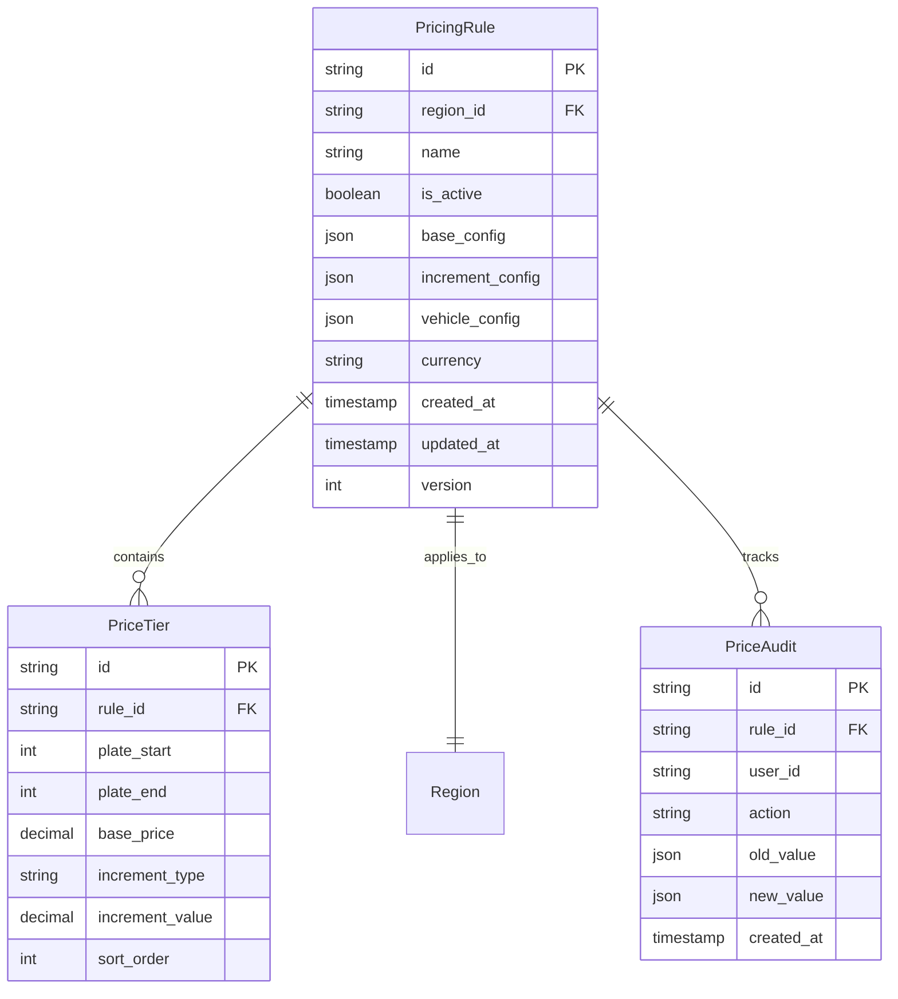
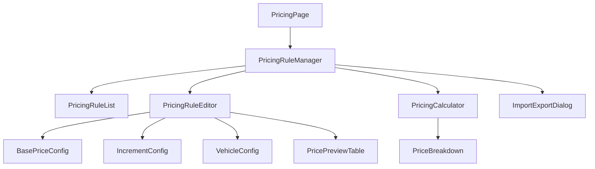
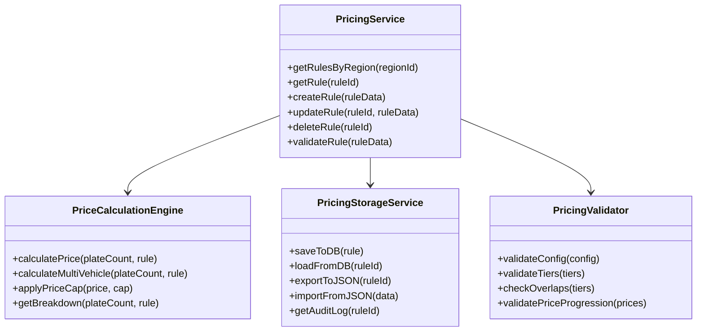
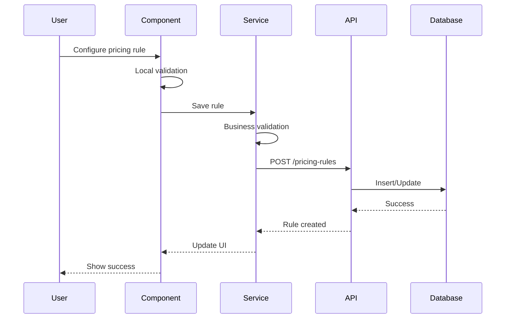

# Dynamic Pricing Configuration System Design

## 1. System Overview

### 1.1 Architecture Pattern
The system follows a **layered architecture** pattern consistent with the existing codebase:
- **Presentation Layer**: React components with Framer Motion animations
- **Business Logic Layer**: Services and calculators for pricing logic
- **Data Access Layer**: Database services and API clients
- **Storage Layer**: PostgreSQL database with Prisma ORM

### 1.2 Integration Points
- Integrates with existing `cityDatabaseService` for region management
- Extends current `truckDelivery` types and validation
- Reuses UI components from `cities` component library
- Leverages existing API infrastructure in `backend/src/routes/`

## 2. Data Model Design

### 2.1 Core Entities



### 2.2 Configuration Schema

```typescript
interface PricingRuleConfig {
  id: string;
  regionId: string;
  name: string;
  isActive: boolean;
  
  // Base pricing configuration
  baseConfig: {
    plateRange: {
      start: number;  // e.g., 1
      end: number;    // e.g., 2
    };
    price: number;    // e.g., 150
  };
  
  // Increment configuration
  incrementConfig: {
    startPlate: number;     // e.g., 3
    type: 'fixed' | 'percentage' | 'tiered';
    value: number;          // e.g., 20 for fixed, 0.1 for 10%
    tiers?: Array<{
      plateRange: { start: number; end: number };
      incrementValue: number;
    }>;
  };
  
  // Vehicle constraints
  vehicleConfig: {
    maxPlatesPerVehicle: number;  // e.g., 8
    priceCapPerVehicle?: number;  // optional cap
    overflowHandling: 'restart' | 'continue';
  };
  
  currency: 'CAD' | 'USD';
  metadata: {
    createdBy: string;
    createdAt: string;
    updatedAt: string;
    version: number;
  };
}
```

### 2.3 Database Tables

```sql
-- New tables to add
CREATE TABLE truck_pricing_rules (
  id UUID PRIMARY KEY DEFAULT gen_random_uuid(),
  region_id UUID NOT NULL REFERENCES truck_delivery_zones(id),
  name VARCHAR(255) NOT NULL,
  is_active BOOLEAN DEFAULT true,
  base_config JSONB NOT NULL,
  increment_config JSONB NOT NULL,
  vehicle_config JSONB NOT NULL,
  currency VARCHAR(3) DEFAULT 'CAD',
  created_at TIMESTAMP DEFAULT NOW(),
  updated_at TIMESTAMP DEFAULT NOW(),
  version INTEGER DEFAULT 1
);

CREATE TABLE truck_price_tiers (
  id UUID PRIMARY KEY DEFAULT gen_random_uuid(),
  rule_id UUID NOT NULL REFERENCES truck_pricing_rules(id) ON DELETE CASCADE,
  plate_start INTEGER NOT NULL,
  plate_end INTEGER NOT NULL,
  base_price DECIMAL(10,2) NOT NULL,
  increment_type VARCHAR(20),
  increment_value DECIMAL(10,4),
  sort_order INTEGER NOT NULL,
  created_at TIMESTAMP DEFAULT NOW()
);

CREATE TABLE truck_price_audit (
  id UUID PRIMARY KEY DEFAULT gen_random_uuid(),
  rule_id UUID NOT NULL REFERENCES truck_pricing_rules(id),
  user_id VARCHAR(255),
  action VARCHAR(50) NOT NULL,
  old_value JSONB,
  new_value JSONB,
  created_at TIMESTAMP DEFAULT NOW()
);

-- Indexes for performance
CREATE INDEX idx_pricing_rules_region ON truck_pricing_rules(region_id);
CREATE INDEX idx_price_tiers_rule ON truck_price_tiers(rule_id);
CREATE INDEX idx_price_audit_rule ON truck_price_audit(rule_id);
CREATE INDEX idx_price_audit_created ON truck_price_audit(created_at);
```

## 3. Component Architecture

### 3.1 Component Hierarchy



### 3.2 Component Specifications

#### 3.2.1 PricingRuleManager
- **Location**: `src/components/pricing/PricingRuleManager.jsx`
- **Purpose**: Main container for pricing configuration
- **State Management**: Uses React hooks with local state
- **Key Props**:
  - `regionId`: Selected region for configuration
  - `onSave`: Callback for saving configuration
  - `initialRule`: Existing rule for editing

#### 3.2.2 PricingRuleEditor
- **Location**: `src/components/pricing/PricingRuleEditor.jsx`
- **Purpose**: Form for creating/editing pricing rules
- **Features**:
  - Real-time validation
  - Preview calculations
  - Undo/redo support
- **Reuses**: Form validation from `types/truckDelivery.js`

#### 3.2.3 PricePreviewTable
- **Location**: `src/components/pricing/PricePreviewTable.jsx`
- **Purpose**: Display calculated prices for different plate counts
- **Features**:
  - Live updates on rule changes
  - Anomaly detection and highlighting
  - Export to CSV

#### 3.2.4 PricingCalculator
- **Location**: `src/components/pricing/PricingCalculator.jsx`
- **Purpose**: Interactive price calculation tool
- **Features**:
  - Plate count input
  - Real-time price calculation
  - Multi-vehicle breakdown

## 4. Service Layer Design

### 4.1 Service Architecture



### 4.2 Service Implementations

#### 4.2.1 PricingService
- **Location**: `src/services/pricingService.js`
- **Responsibilities**:
  - CRUD operations for pricing rules
  - Rule validation and business logic
  - Integration with existing region management
- **Dependencies**:
  - `cityDatabaseService` for region data
  - `apiClient` for backend communication

#### 4.2.2 PriceCalculationEngine
- **Location**: `src/utils/pricing/priceCalculationEngine.js`
- **Responsibilities**:
  - Core pricing calculations
  - Multi-vehicle split logic
  - Price cap application
- **Performance**: All calculations < 10ms

#### 4.2.3 PricingStorageService
- **Location**: `src/utils/pricing/pricingStorageService.js`
- **Responsibilities**:
  - Database persistence
  - Import/export functionality
  - Audit trail management
- **Extends**: Existing storage patterns from `cityDatabaseService`

## 5. API Design

### 5.1 RESTful Endpoints

```yaml
# Pricing Rules API
GET    /api/v1/truck-delivery/pricing-rules
  Query: regionId, isActive, currency
  Response: Array of PricingRule

GET    /api/v1/truck-delivery/pricing-rules/:id
  Response: PricingRule with full details

POST   /api/v1/truck-delivery/pricing-rules
  Body: PricingRuleConfig
  Response: Created PricingRule

PUT    /api/v1/truck-delivery/pricing-rules/:id
  Body: Partial PricingRuleConfig
  Response: Updated PricingRule

DELETE /api/v1/truck-delivery/pricing-rules/:id
  Response: Success message

# Price Calculation API
POST   /api/v1/truck-delivery/calculate-price
  Body: { regionId, plateCount, ruleId? }
  Response: PriceCalculation with breakdown

# Audit API
GET    /api/v1/truck-delivery/pricing-rules/:id/audit
  Query: startDate, endDate, userId
  Response: Array of AuditEntry

# Import/Export API
GET    /api/v1/truck-delivery/pricing-rules/:id/export
  Response: JSON configuration file

POST   /api/v1/truck-delivery/pricing-rules/import
  Body: JSON configuration
  Response: Validation result and created rule
```

### 5.2 API Implementation
- **Location**: `backend/src/routes/truckPricing.js`
- **Middleware**: 
  - Authentication check
  - Rate limiting
  - Input validation
- **Error Handling**: Consistent with existing patterns

## 6. State Management

### 6.1 Component State Strategy
- **Local State**: Form inputs and UI state
- **Context API**: Shared pricing configuration across components
- **Server State**: Cached with React Query or SWR

### 6.2 Data Flow



## 7. Migration Strategy

### 7.1 Data Migration Plan
1. **Backup existing price data**
2. **Create migration script** to convert weight-based to plate-based
3. **Run in parallel** for testing period
4. **Gradual rollout** by region
5. **Full migration** after validation

### 7.2 Backward Compatibility
- Maintain weight-based API endpoints
- Provide conversion utilities
- Support both models during transition
- Deprecation warnings in old endpoints

## 8. Testing Strategy

### 8.1 Unit Tests
- **Calculator Engine**: Test all calculation scenarios
- **Validators**: Test validation rules
- **Services**: Mock API calls and test logic

### 8.2 Integration Tests
- **API Endpoints**: Test full request/response cycle
- **Database Operations**: Test CRUD operations
- **Import/Export**: Test data integrity

### 8.3 E2E Tests
- **Configuration Flow**: Create and edit pricing rules
- **Calculation Flow**: Enter plates and verify prices
- **Migration Flow**: Test data migration process

## 9. Performance Optimizations

### 9.1 Frontend Optimizations
- **Memoization**: Use React.memo for price calculations
- **Debouncing**: Delay API calls during typing
- **Virtual Scrolling**: For large preview tables
- **Code Splitting**: Lazy load pricing components

### 9.2 Backend Optimizations
- **Database Indexing**: On frequently queried fields
- **Query Optimization**: Use efficient JOINs
- **Caching Strategy**: Redis for frequently accessed rules
- **Connection Pooling**: Reuse database connections

### 9.3 Calculation Optimizations
- **Memoized Calculations**: Cache recent calculations
- **Batch Processing**: Process multiple calculations together
- **Worker Threads**: Offload heavy calculations

## 10. Security Considerations

### 10.1 Access Control
- Role-based permissions for configuration
- Audit all configuration changes
- Secure API endpoints with authentication

### 10.2 Data Validation
- Input sanitization on all fields
- Prevent SQL injection
- Validate JSON structures
- Range checks on numerical inputs

### 10.3 Data Protection
- Encrypt sensitive pricing data
- Secure audit logs
- Regular backups
- GDPR compliance for user data

## 11. UI/UX Design Patterns

### 11.1 Design System Integration
- Use existing Tailwind classes
- Follow current color scheme
- Maintain consistent spacing
- Reuse existing components

### 11.2 Interaction Patterns
- **Immediate Feedback**: Show validation errors inline
- **Progressive Disclosure**: Show advanced options on demand
- **Confirmation Dialogs**: For destructive actions
- **Loading States**: Clear loading indicators

### 11.3 Responsive Design
- Mobile-first approach
- Tablet-optimized layouts
- Desktop power-user features
- Touch-friendly controls

## 12. Documentation Requirements

### 12.1 Code Documentation
- JSDoc comments for all functions
- Type definitions for all data structures
- README files in each module
- API documentation with examples

### 12.2 User Documentation
- Configuration guide
- Video tutorials
- FAQ section
- Troubleshooting guide

## 13. Deployment Considerations

### 13.1 Environment Configuration
- Environment variables for feature flags
- Database migration scripts
- Rollback procedures
- Health check endpoints

### 13.2 Monitoring
- Performance metrics tracking
- Error logging and alerting
- Usage analytics
- Audit trail monitoring

## 14. Future Enhancements

### 14.1 Planned Features
- AI-powered price optimization
- Competitor price tracking
- Dynamic pricing based on demand
- Multi-currency support

### 14.2 Extensibility Points
- Plugin architecture for custom calculations
- Webhook support for external systems
- API versioning strategy
- Microservice extraction readiness