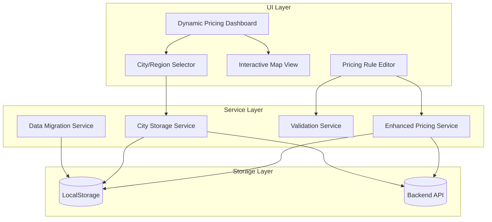

# Design: Dynamic Pricing with Region/City Selection

## Steering Document Alignment

### Technical Standards (tech.md)
- **React 18 + Vite Architecture**: All new components follow functional component patterns with hooks
- **localStorage Unified Storage**: Integration with existing `unifiedStorage.js` for data persistence
- **Leaflet Map Engine**: Extends existing `AccurateFSAMap.jsx` for pricing zone visualization
- **Performance Requirements**: Implements viewport culling, debouncing (300ms), and data chunking as per tech.md

### Project Structure (structure.md)
- **Component Organization**: 
  - New pricing components in `src/components/pricing/`
  - City integration components in `src/components/cities/`
  - Page components in `src/pages/Management/Pricing/`
- **Naming Conventions**: PascalCase for components, camelCase for utilities
- **Data Flow**: Top-down data flow with callback functions for events

### Product Vision (product.md)
- **城市级别管理**: Implements hierarchical city → region → FSA structure
- **分级区域定价**: Supports 1-4 price regions per city with visual gradients
- **提升效率**: Reduces configuration time by 80% through intuitive UI
- **扩展性**: Modular design supports future delivery modes

## Code Reuse Analysis

### Existing Components to Leverage

#### Core Services
```javascript
// Extend existing PricingService
import pricingService from '../../services/pricingService';
// Add region-aware methods while preserving existing functionality

// Reuse CityStorageService for city/region data
import { CityStorageService } from '../../utils/storage/cityStorage';
// Leverage existing city management infrastructure

// Integrate with unified storage
import { unifiedStorage } from '../../utils/unifiedStorage';
// Maintain consistency with existing storage patterns
```

#### UI Components
```javascript
// Extend existing map component
import AccurateFSAMap from '../../components/AccurateFSAMap';
// Add pricing zone visualization layer

// Reuse existing pricing components
import PricingRuleEditor from '../../components/pricing/PricingRuleEditor';
// Enhance with region selection

// Leverage existing city components
import CityManager from '../../components/cities/CityManager';
// Integrate pricing management features
```

### Integration Points
- **dataUpdateNotifier**: Subscribe to region/city changes for real-time updates
- **apiClient**: Use existing API client with interceptors for authentication
- **Validation**: Extend `pricingValidator.js` with region validation rules
- **Storage**: Follow existing localStorage key patterns from `TRUCK_STORAGE_KEYS`

## Architecture Overview

The system integrates dynamic pricing with the existing truck delivery city/region management module, replacing traditional weight-based pricing with a flexible, region-aware dynamic pricing system.



## Component Architecture

### New Components

#### 1. RegionPricingDashboard
**Location**: `src/pages/Management/Pricing/RegionPricingDashboard.jsx`
```javascript
// Main dashboard for region-based dynamic pricing
const RegionPricingDashboard = () => {
  // Integrates city selection, map view, and rule management
  const [selectedCity, setSelectedCity] = useState(null);
  const [selectedRegion, setSelectedRegion] = useState(null);
  const [pricingRules, setPricingRules] = useState([]);
  
  return (
    <div className="grid grid-cols-3 gap-4">
      <CityRegionSelector onSelectionChange={handleSelectionChange} />
      <RegionMapView selectedRegion={selectedRegion} />
      <PricingRulePanel regionId={selectedRegion?.id} />
    </div>
  );
};
```

#### 2. CityRegionSelector
**Location**: `src/components/pricing/CityRegionSelector.jsx`
```javascript
// Hierarchical city/region selection component
const CityRegionSelector = ({ onSelectionChange }) => {
  // Provides cascading selection: City � Region
  // Integrates with existing CityStorageService
};
```

#### 3. RegionMapView
**Location**: `src/components/pricing/RegionMapView.jsx`
```javascript
// Interactive map showing pricing zones
const RegionMapView = ({ selectedRegion, pricingRules }) => {
  // Extends existing Leaflet map implementation
  // Shows color-coded pricing zones
};
```

#### 4. EnhancedPricingRuleEditor
**Location**: `src/components/pricing/EnhancedPricingRuleEditor.jsx`
```javascript
// Enhanced editor with built-in region selection
const EnhancedPricingRuleEditor = ({ rule, regionId, cityId }) => {
  // Extends existing PricingRuleEditor
  // Auto-populates regionId from context
};
```

### Modified Components

#### 1. PricingService Enhancement
**Location**: `src/services/pricingService.js`
```javascript
class PricingService {
  // Add city-aware methods
  async getRulesByCity(cityId, options = {}) {
    const regions = await this.getCityRegions(cityId);
    const rules = await Promise.all(
      regions.map(r => this.getRulesByRegion(r.id))
    );
    return rules.flat();
  }
  
  async batchUpdateCityRules(cityId, updates) {
    // Batch update all regions in a city
  }
  
  async copyRulesToRegions(sourceRegionId, targetRegionIds) {
    // Copy pricing rules to multiple regions
  }
}
```

#### 2. Router Configuration Update
**Location**: `src/router/index.jsx`
```javascript
// Remove traditional pricing routes
// Add new dynamic pricing routes
{
  path: 'management/pricing',
  element: <RegionPricingDashboard />,
  children: [
    { path: 'rules', element: <PricingRuleList /> },
    { path: 'rules/:ruleId', element: <PricingRuleDetail /> },
    { path: 'migration', element: <PricingMigrationTool /> }
  ]
}
```

### Components to Remove

1. **RegionPriceManager.jsx** - Traditional weight-based pricing
2. **WeightRangeManager.jsx** - Weight range configuration
3. **PriceSettings.jsx** - Old price settings page
4. All references to traditional pricing in navigation

## Data Model

### Enhanced Pricing Rule Structure
```javascript
{
  id: 'rule-uuid',
  regionId: 'toronto-1',  // Required: Links to city-region
  cityId: 'toronto',      // Denormalized for query performance
  name: 'Toronto Downtown Dynamic Pricing',
  isActive: true,
  currency: 'CAD',
  baseConfig: {
    plateRange: { start: 1, end: 2 },
    price: 150
  },
  incrementConfig: {
    startPlate: 3,
    type: 'fixed',
    value: 20
  },
  vehicleConfig: {
    maxPlatesPerVehicle: 8,
    priceCapPerVehicle: 500,
    overflowHandling: 'restart'
  },
  metadata: {
    createdAt: '2024-01-01T00:00:00Z',
    updatedAt: '2024-01-01T00:00:00Z',
    createdBy: 'user-id',
    migratedFrom: 'traditional-pricing' // Track migration source
  }
}
```

### City-Region-Pricing Relationship
```javascript
{
  city: {
    id: 'toronto',
    name: 'Toronto',
    regions: [
      {
        id: 'toronto-1',
        level: 1,
        name: 'Downtown',
        pricingRules: ['rule-1', 'rule-2'], // Rule IDs
        fsaCodes: ['M5V', 'M5G']
      }
    ]
  }
}
```

## State Management

### Context Structure
```javascript
const PricingContext = React.createContext({
  selectedCity: null,
  selectedRegion: null,
  pricingRules: [],
  filters: {
    isActive: true,
    currency: 'CAD'
  },
  actions: {
    selectCity: (cityId) => {},
    selectRegion: (regionId) => {},
    loadPricingRules: () => {},
    savePricingRule: (rule) => {},
    batchUpdateRules: (updates) => {}
  }
});
```

### Data Flow
1. User selects city � Load city regions
2. User selects region � Load pricing rules for region
3. Map updates to show selected region with pricing zones
4. Rule editor auto-populates with region context
5. Save operation includes regionId validation

## API Design

### Endpoints

#### Pricing Rules
```
GET    /api/v1/pricing-rules?regionId={regionId}&cityId={cityId}
POST   /api/v1/pricing-rules
PUT    /api/v1/pricing-rules/{ruleId}
DELETE /api/v1/pricing-rules/{ruleId}
POST   /api/v1/pricing-rules/batch-update
POST   /api/v1/pricing-rules/copy
```

#### City-Region Integration
```
GET    /api/v1/cities/{cityId}/pricing-summary
POST   /api/v1/cities/{cityId}/apply-pricing-template
GET    /api/v1/regions/{regionId}/pricing-rules
```

#### Migration
```
POST   /api/v1/pricing/migrate-traditional
GET    /api/v1/pricing/migration-status
POST   /api/v1/pricing/rollback-migration
```

## UI/UX Design

### Layout Structure
```

                    Navigation Bar                        
,,$
                                                       
  City/Region      Interactive         Pricing Rule   
   Selector        Map View              Panel        
                                                       
           
  Toronto                        Rule List     
   Region1       Map with        
   Region2       colored        Rule 1      
  Montreal        regions        Rule 2      
           
                                      [+ Add Rule]  
44
```

### Visual Indicators
- **Color Coding**: Regions colored by price level (green=cheap, red=expensive)
- **Selection State**: Selected region highlighted with border
- **Active Rules**: Badge showing number of active rules per region
- **Batch Selection**: Multi-select mode with checkboxes

## Migration Strategy

### Phase 1: Data Analysis
```javascript
const analyzeTraditionaPricing = async () => {
  const regions = await getAllRegionConfigs();
  const analysis = {
    totalRegions: regions.length,
    regionsWithPricing: 0,
    conversionCandidates: [],
    manualReviewRequired: []
  };
  
  regions.forEach(region => {
    if (region.weightRanges?.length > 0) {
      analysis.regionsWithPricing++;
      // Analyze conversion feasibility
    }
  });
  
  return analysis;
};
```

### Phase 2: Automated Conversion
```javascript
const convertToynamicPricing = (traditionalConfig) => {
  return {
    regionId: traditionalConfig.regionId,
    name: `${traditionalConfig.name} - Migrated`,
    baseConfig: {
      plateRange: { start: 1, end: 2 },
      price: traditionalConfig.weightRanges[0]?.price || 0
    },
    incrementConfig: {
      startPlate: 3,
      type: 'fixed',
      value: calculateIncrement(traditionalConfig)
    },
    metadata: {
      migratedFrom: 'traditional-pricing',
      originalConfig: traditionalConfig
    }
  };
};
```

### Phase 3: Validation & Rollback
```javascript
const validateMigration = async (migratedRules) => {
  const validationResults = await Promise.all(
    migratedRules.map(rule => validatePricingRule(rule))
  );
  
  return {
    success: validationResults.every(r => r.isValid),
    errors: validationResults.filter(r => !r.isValid)
  };
};
```

## Security Considerations

### Permission Model
```javascript
const permissions = {
  VIEW_PRICING: 'pricing.view',
  EDIT_PRICING: 'pricing.edit',
  DELETE_PRICING: 'pricing.delete',
  BATCH_UPDATE: 'pricing.batch',
  MIGRATE_DATA: 'pricing.migrate'
};

const checkPermission = (user, action) => {
  return user.permissions.includes(permissions[action]);
};
```

### Audit Logging
```javascript
const auditLog = {
  action: 'PRICING_RULE_CREATED',
  userId: 'user-123',
  timestamp: new Date().toISOString(),
  details: {
    ruleId: 'rule-456',
    regionId: 'toronto-1',
    changes: { /* rule details */ }
  }
};
```

## Performance Optimizations

### localStorage Integration
```javascript
// Follow existing unifiedStorage patterns
const PRICING_STORAGE_KEYS = {
  PRICING_RULES: 'pricing_rules_v2',
  REGION_RULES_INDEX: 'pricing_region_index',
  MIGRATION_BACKUP: 'pricing_migration_backup'
};

class EnhancedPricingStorage {
  constructor() {
    this.storage = unifiedStorage;
    this.notifier = dataUpdateNotifier;
  }
  
  async savePricingRule(rule) {
    // Validate storage capacity
    const usage = this.calculateStorageUsage();
    if (usage > 0.9) {
      await this.compressOldData();
    }
    
    // Save with unified storage
    const rules = this.storage.get(PRICING_STORAGE_KEYS.PRICING_RULES) || {};
    rules[rule.id] = rule;
    this.storage.set(PRICING_STORAGE_KEYS.PRICING_RULES, rules);
    
    // Update region index
    this.updateRegionIndex(rule.regionId, rule.id);
    
    // Notify subscribers
    this.notifier.notify({
      type: 'PRICING_RULE_UPDATED',
      regionId: rule.regionId,
      ruleId: rule.id
    });
  }
  
  calculateStorageUsage() {
    const used = new Blob([JSON.stringify(localStorage)]).size;
    const max = 5 * 1024 * 1024; // 5MB
    return used / max;
  }
}
```

### Caching Strategy
```javascript
class PricingCache {
  constructor() {
    this.cache = new Map();
    this.ttl = 5 * 60 * 1000; // 5 minutes
    this.storage = new EnhancedPricingStorage();
  }
  
  getCacheKey(regionId, filters) {
    return `${regionId}-${JSON.stringify(filters)}`;
  }
  
  async get(regionId, filters) {
    const key = this.getCacheKey(regionId, filters);
    const cached = this.cache.get(key);
    
    if (cached && Date.now() - cached.timestamp < this.ttl) {
      return cached.data;
    }
    
    // Fall back to localStorage
    const stored = await this.storage.getRulesByRegion(regionId);
    if (stored) {
      this.cache.set(key, { data: stored, timestamp: Date.now() });
      return stored;
    }
    
    return null;
  }
  
  invalidate(regionId) {
    // Clear cache entries for this region
    for (const [key] of this.cache) {
      if (key.startsWith(regionId)) {
        this.cache.delete(key);
      }
    }
  }
}
```

### Lazy Loading
```javascript
const LazyPricingRules = () => {
  const [rules, setRules] = useState([]);
  const [page, setPage] = useState(1);
  const observer = useRef();
  
  const lastRuleRef = useCallback(node => {
    if (observer.current) observer.current.disconnect();
    observer.current = new IntersectionObserver(entries => {
      if (entries[0].isIntersecting) {
        setPage(prevPage => prevPage + 1);
      }
    });
    if (node) observer.current.observe(node);
  }, []);
  
  return <RuleList rules={rules} lastRuleRef={lastRuleRef} />;
};
```

## Error Handling

### Error Scenarios and Recovery

#### 1. Region ID Validation Failure
```javascript
const handleRegionIdError = (error) => {
  // Display user-friendly error message
  showNotification({
    type: 'error',
    message: '请先选择一个区域',
    action: {
      label: '选择区域',
      onClick: () => openRegionSelector()
    }
  });
  
  // Log for debugging
  console.error('RegionId validation failed:', error);
  
  // Prevent form submission
  return false;
};
```

#### 2. API Synchronization Failure
```javascript
const handleApiSyncError = async (error, retryCount = 0) => {
  const MAX_RETRIES = 3;
  
  if (retryCount < MAX_RETRIES) {
    // Store in local queue
    await queueForSync(error.data);
    
    // Retry with exponential backoff
    setTimeout(() => {
      syncWithAPI(error.data, retryCount + 1);
    }, Math.pow(2, retryCount) * 1000);
    
    // Notify user of offline mode
    showNotification({
      type: 'warning',
      message: '离线模式：数据将在恢复连接后同步'
    });
  } else {
    // Max retries reached
    showNotification({
      type: 'error',
      message: '同步失败，请检查网络连接'
    });
  }
};
```

#### 3. Data Migration Conflicts
```javascript
const handleMigrationConflict = (conflicts) => {
  return {
    strategy: 'manual_review',
    ui: <ConflictResolutionDialog conflicts={conflicts} />,
    options: [
      { action: 'keep_traditional', label: '保留传统定价' },
      { action: 'use_dynamic', label: '使用动态定价' },
      { action: 'merge', label: '合并配置' }
    ],
    rollback: async () => {
      await restoreBackup();
      showNotification({ type: 'info', message: '已回滚到原始状态' });
    }
  };
};
```

#### 4. localStorage Capacity Issues
```javascript
const handleStorageQuotaExceeded = () => {
  // Calculate storage usage
  const usage = calculateStorageUsage();
  
  if (usage > 0.9) { // 90% full
    // Compress old data
    compressOldPricingRules();
    
    // Clean up orphaned data
    cleanupOrphanedRegions();
    
    // Notify user
    showNotification({
      type: 'warning',
      message: '存储空间不足，已清理旧数据'
    });
  }
};
```

### Error Boundary Implementation
```javascript
class PricingErrorBoundary extends React.Component {
  state = { hasError: false, error: null };
  
  static getDerivedStateFromError(error) {
    return { hasError: true, error };
  }
  
  componentDidCatch(error, errorInfo) {
    // Log to error tracking service
    trackError({
      component: 'PricingModule',
      error,
      errorInfo,
      context: {
        regionId: this.props.regionId,
        cityId: this.props.cityId
      }
    });
  }
  
  render() {
    if (this.state.hasError) {
      return <PricingErrorFallback error={this.state.error} />;
    }
    return this.props.children;
  }
}
```

## Testing Strategy

### Unit Testing

#### Component Tests
```javascript
describe('EnhancedPricingRuleEditor', () => {
  it('should require regionId for new rules', () => {
    const { getByText } = render(<EnhancedPricingRuleEditor />);
    fireEvent.click(getByText('保存'));
    expect(getByText('Region ID is required')).toBeInTheDocument();
  });
  
  it('should auto-populate regionId from context', () => {
    const { getByTestId } = render(
      <PricingContext.Provider value={{ selectedRegion: { id: 'toronto-1' } }}>
        <EnhancedPricingRuleEditor />
      </PricingContext.Provider>
    );
    expect(getByTestId('regionId').value).toBe('toronto-1');
  });
  
  it('should validate city-region binding', () => {
    const invalidRegion = { id: 'invalid', cityId: null };
    const result = validateRegionBinding(invalidRegion);
    expect(result.isValid).toBe(false);
    expect(result.errors).toContain('Region must be bound to a city');
  });
});
```

#### Service Tests
```javascript
describe('PricingService', () => {
  it('should fetch rules by city', async () => {
    const cityId = 'toronto';
    const rules = await pricingService.getRulesByCity(cityId);
    expect(rules).toBeInstanceOf(Array);
    expect(rules.every(r => r.cityId === cityId)).toBe(true);
  });
  
  it('should handle batch updates atomically', async () => {
    const updates = [/* multiple rule updates */];
    await expect(pricingService.batchUpdateCityRules('toronto', updates))
      .resolves.toMatchObject({ success: true, updated: updates.length });
  });
});
```

### Integration Testing

#### End-to-End Workflows
```javascript
describe('City-Region Pricing Integration', () => {
  it('should complete full pricing configuration flow', async () => {
    const { getByText, findByText, getByTestId } = render(<RegionPricingDashboard />);
    
    // Select city
    fireEvent.click(getByText('Toronto'));
    await findByText('Downtown');
    
    // Select region
    fireEvent.click(getByText('Downtown'));
    expect(getByTestId('selected-region')).toHaveTextContent('toronto-1');
    
    // Create pricing rule
    fireEvent.click(getByText('添加定价规则'));
    fireEvent.change(getByTestId('rule-name'), { target: { value: 'Test Rule' } });
    fireEvent.click(getByText('保存'));
    
    // Verify rule appears
    await findByText('Test Rule');
  });
  
  it('should handle migration from traditional pricing', async () => {
    const { getByText, findByText } = render(<MigrationTool />);
    
    fireEvent.click(getByText('开始迁移'));
    await findByText('分析中...');
    await findByText('发现 5 个传统定价配置');
    
    fireEvent.click(getByText('转换为动态定价'));
    await findByText('迁移完成');
    
    // Verify no data loss
    const migratedRules = await pricingService.getRulesByRegion('toronto-1');
    expect(migratedRules.length).toBeGreaterThan(0);
  });
});
```

### Performance Testing
```javascript
describe('Performance Benchmarks', () => {
  it('should load region selection within 500ms', async () => {
    const start = performance.now();
    const { findByTestId } = render(<CityRegionSelector />);
    await findByTestId('region-list');
    const duration = performance.now() - start;
    expect(duration).toBeLessThan(500);
  });
  
  it('should process batch operations at required speed', async () => {
    const regions = Array(100).fill(null).map((_, i) => ({ id: `region-${i}` }));
    const start = performance.now();
    await batchUpdateRegions(regions);
    const duration = performance.now() - start;
    const rate = regions.length / (duration / 1000);
    expect(rate).toBeGreaterThan(10); // 10+ regions per second
  });
});
```

### Data Integrity Testing
```javascript
describe('Data Integrity', () => {
  it('should maintain referential integrity', async () => {
    // Create rule with invalid regionId
    const invalidRule = { regionId: 'non-existent' };
    await expect(pricingService.createRule(invalidRule))
      .rejects.toThrow('Region not found');
  });
  
  it('should prevent orphaned pricing rules', async () => {
    // Delete region with existing rules
    const regionId = 'toronto-1';
    await expect(deleteRegion(regionId))
      .rejects.toThrow('Cannot delete region with active pricing rules');
  });
});
```

## Deployment Plan

### Phase 1: Backend Preparation
1. Deploy new API endpoints
2. Ensure backward compatibility
3. Set up migration endpoints

### Phase 2: Feature Toggle
```javascript
const featureFlags = {
  USE_DYNAMIC_PRICING: process.env.REACT_APP_USE_DYNAMIC_PRICING === 'true',
  SHOW_MIGRATION_TOOL: process.env.REACT_APP_SHOW_MIGRATION_TOOL === 'true'
};
```

### Phase 3: Gradual Rollout
1. Enable for admin users first
2. Roll out to specific regions
3. Monitor performance and user feedback
4. Full deployment after validation

## Monitoring & Analytics

### Key Metrics
```javascript
const metrics = {
  pricingRuleCreationTime: 0,     // Average time to create a rule
  regionSelectionTime: 0,         // Time to select and load region
  migrationSuccessRate: 0,        // % of successful migrations
  apiResponseTime: 0,             // Average API response time
  userErrorRate: 0,               // % of operations with errors
  cacheHitRate: 0                 // % of requests served from cache
};
```

### Error Tracking
```javascript
window.addEventListener('error', (event) => {
  if (event.error?.component === 'PricingModule') {
    trackError({
      component: 'PricingModule',
      error: event.error,
      context: {
        regionId: getCurrentRegion(),
        userId: getCurrentUser()
      }
    });
  }
});
```