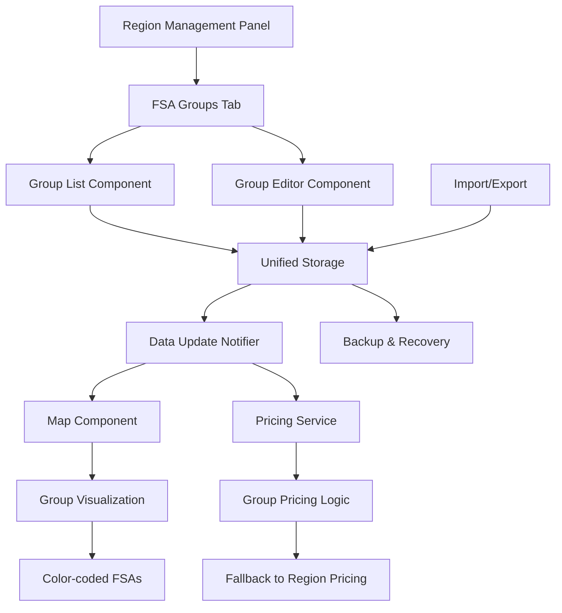

# FSA Group Management Design Document

## Overview

FSA Group Management introduces an optional organizational layer between delivery regions and individual FSAs (Forward Sortation Areas), enabling granular pricing control within regions. This feature allows users to create named groups of FSAs (e.g., "Mississauga", "Downtown Toronto") for location-specific pricing strategies while maintaining the simplicity of the existing workflow for users who don't need this granularity.

The feature integrates seamlessly with the existing unified storage architecture and follows established patterns in the React-based Canadian postal delivery map system. It provides progressive disclosure - groups are optional and hidden by default to avoid overwhelming users.

## Steering Document Alignment

### Technical Standards (tech.md)

- **Unified Storage Architecture**: Extends the existing `unifiedStorage.js` system to include FSA group data alongside region configurations
- **React Hooks + Context API**: Uses established state management patterns with React hooks for component state
- **Component Architecture**: Follows functional component patterns with clear separation of concerns
- **Performance Requirements**: Maintains <500ms response times for group operations and <100ms for price calculations
- **Leaflet Map Engine**: Leverages existing map visualization infrastructure for group color coding

### Project Structure (structure.md)

- **Component Organization**: Places group management components in `src/components/regions/` following existing patterns
- **Data Model Extensions**: Extends the UnifiedRegionConfig structure to include optional `fsaGroups` array
- **Utility Functions**: Adds group-specific utilities in `src/utils/` following camelCase naming conventions
- **Error Handling**: Implements comprehensive try-catch blocks with user-friendly error messages

## Code Reuse Analysis

### Existing Components to Leverage

- **RegionManagementPanel.jsx**: Core UI framework for region configuration - will be extended with new "FSA Groups" tab
- **unifiedStorage.js**: Central data persistence layer - will handle group data using existing patterns
- **dataUpdateNotifier.js**: Real-time update system - will broadcast group changes to subscribed components
- **TruckDeliveryMap.jsx**: Map visualization engine - will display group color coding using existing polygon rendering
- **pricingService.js**: Price calculation engine - will implement group pricing fallback logic

### Integration Points

- **Unified Storage System**: Groups are stored as part of region configuration, maintaining backward compatibility
- **Price Calculation**: Extends existing pricing logic with group-level fallback hierarchy
- **Map Visualization**: Uses existing FSA polygon rendering with group-based color variations
- **Data Update Events**: Leverages established notification system for real-time UI updates

## Architecture

The FSA Group Management system follows a hierarchical data model where groups are optional containers within regions. The architecture maintains backward compatibility by treating groups as an enhancement rather than a replacement of existing functionality.



## Components and Interfaces

### FSAGroupManager Component
- **Purpose:** Main management interface for creating, editing, and deleting FSA groups within a region
- **Interfaces:**
  - `onGroupCreate(groupData)` - Creates new group
  - `onGroupUpdate(groupId, changes)` - Updates existing group
  - `onGroupDelete(groupId)` - Removes group and returns FSAs to ungrouped pool
- **Dependencies:** `unifiedStorage`, `dataUpdateNotifier`
- **Reuses:** Existing region management UI patterns, validation utilities

### FSAGroupEditor Component
- **Purpose:** Modal/panel for editing individual group properties (name, FSA assignments, pricing)
- **Interfaces:**
  - `validateGroupName(name, regionId)` - Ensures unique naming within region
  - `updateFSAAssignments(groupId, fsaChanges)` - Manages FSA membership
  - `configurePricing(groupId, pricingConfig)` - Sets group-specific pricing
- **Dependencies:** Form validation, drag-and-drop handlers
- **Reuses:** Existing pricing configuration components, form validation patterns

### GroupAwarePricingService
- **Purpose:** Enhanced pricing calculation with group-level fallback logic
- **Interfaces:**
  - `calculatePrice(fsa, weight, skidType)` - Main pricing function with group support
  - `getApplicablePricing(fsa, regionId)` - Returns appropriate pricing configuration
  - `getPricingHierarchy(fsa, regionId)` - Shows pricing source (group vs region)
- **Dependencies:** `unifiedStorage`, existing pricing utilities
- **Reuses:** Extends existing `pricingService.js` with minimal changes

### GroupVisualizationLayer Component
- **Purpose:** Map overlay showing group boundaries and color coding
- **Interfaces:**
  - `renderGroupColors(groups, regionTheme)` - Applies group-specific color variations
  - `showGroupTooltip(fsa, groupInfo)` - Displays group information on hover
  - `toggleGroupDisplay(enabled)` - Shows/hides group visualization
- **Dependencies:** Leaflet map instance, existing polygon rendering
- **Reuses:** Leverages existing FSA polygon rendering infrastructure

## Data Models

### Extended UnifiedRegionConfig
```javascript
{
  id: 'region-1',
  name: 'Toronto Central',
  isActive: true,
  fsaCodes: ['M5V', 'M5G', 'M6G', 'M8Y'],
  weightRanges: [...],  // Existing structure

  // NEW: Optional FSA Groups
  fsaGroups: [
    {
      id: 'group-uuid-1',
      name: 'Mississauga',
      fsaCodes: ['M5V', 'M5G'],
      customPricing: {
        enabled: true,
        weightRanges: [...]  // Same structure as region pricing
      },
      displayColor: '#FF5733',  // Derived from region theme
      metadata: {
        createdAt: '2024-01-15T10:30:00Z',
        updatedAt: '2024-01-15T10:30:00Z'
      }
    }
  ],

  lastUpdated: '2024-01-15T10:30:00Z',
  metadata: {...}
}
```

### GroupPricingResult
```javascript
{
  price: 25.99,
  source: 'group',  // 'group' | 'region'
  sourceId: 'group-uuid-1',
  sourceName: 'Mississauga',
  appliedRange: {
    min: 10.001,
    max: 15.000,
    label: '10.001-15.000 KGS'
  },
  metadata: {
    calculatedAt: '2024-01-15T10:30:00Z',
    fallbackUsed: false
  }
}
```

## Error Handling

### Error Scenarios

1. **Group Name Conflict**
   - **Handling:** Validate uniqueness before save, show inline error with suggested alternatives
   - **User Impact:** Clear error message: "Group name 'Downtown' already exists. Try 'Downtown Core' or 'Downtown East'"

2. **FSA Assignment Conflict**
   - **Handling:** Prevent FSA from being in multiple groups, offer to move from current group
   - **User Impact:** Confirmation dialog: "FSA M5V is already in group 'Mississauga'. Move to 'Downtown'?"

3. **Pricing Configuration Error**
   - **Handling:** Validate pricing ranges, ensure no gaps or overlaps
   - **User Impact:** Highlight problematic ranges with specific error messages

4. **Data Persistence Failure**
   - **Handling:** Implement automatic retry with exponential backoff, maintain optimistic UI updates
   - **User Impact:** Notification: "Saving changes... (retry 2/3)" with option to revert

5. **Import Validation Failure**
   - **Handling:** Pre-validate import data, show detailed conflict report before applying
   - **User Impact:** Import preview with warnings: "3 FSAs not found in region, 1 duplicate group name"

## Testing Strategy

### Unit Testing
- **Group Data Operations**: Test create, update, delete operations with edge cases
- **Pricing Fallback Logic**: Verify correct hierarchy (group → region → default)
- **Validation Functions**: Test name uniqueness, FSA conflict detection
- **Data Migration**: Ensure backward compatibility with regions without groups

### Integration Testing
- **Storage Integration**: Test group data persistence and retrieval through unifiedStorage
- **Map Visualization**: Verify group colors render correctly on map with various region themes
- **Real-time Updates**: Test dataUpdateNotifier propagation to multiple components
- **Import/Export**: Test complete group configuration round-trip

### End-to-End Testing
- **Group Management Workflow**: Create group → assign FSAs → configure pricing → verify map display
- **Pricing Calculation Flow**: Test price calculation with groups vs without groups
- **Migration Scenario**: Upgrade existing regions to include groups without data loss
- **Performance Testing**: Verify response times under maximum group configuration (20 groups per region)

## Implementation Plan

### Phase 1: Core Data Layer (Week 1)
- Extend `unifiedStorage.js` with group operations
- Implement group validation and conflict detection
- Add group support to `dataUpdateNotifier.js`
- Create data migration utilities for existing regions

### Phase 2: Pricing Integration (Week 1-2)
- Extend `pricingService.js` with group-aware pricing logic
- Implement fallback hierarchy (group → region)
- Add pricing source tracking and metadata
- Unit test pricing calculations with various group configurations

### Phase 3: UI Components (Week 2-3)
- Create `FSAGroupManager.jsx` main interface
- Build `FSAGroupEditor.jsx` for individual group editing
- Implement drag-and-drop FSA assignment
- Add group management tab to existing `RegionManagementPanel.jsx`

### Phase 4: Map Visualization (Week 3)
- Extend `TruckDeliveryMap.jsx` with group color coding
- Implement group toggle and legend updates
- Add hover tooltips showing group information
- Test map performance with maximum group configuration

### Phase 5: Import/Export & Polish (Week 4)
- Add group support to existing import/export functionality
- Implement group configuration backup and restore
- Add comprehensive error handling and user feedback
- Perform end-to-end testing and performance optimization

### Migration Strategy
- **Backward Compatibility**: Existing regions continue to function without modification
- **Gradual Adoption**: Groups are opt-in via new UI elements
- **Data Preservation**: All existing FSA assignments and pricing remain intact
- **Rollback Plan**: Groups can be disabled via feature flag without data loss

### Feature Flag Implementation
```javascript
// In src/utils/featureFlags.js
export const FEATURE_FLAGS = {
  FSA_GROUP_MANAGEMENT: localStorage.getItem('feature_fsa_groups') === 'true'
};

// Conditional rendering in components
{FEATURE_FLAGS.FSA_GROUP_MANAGEMENT && (
  <FSAGroupsTab regionId={selectedRegion.id} />
)}
```

This design ensures the FSA Group Management feature integrates seamlessly with existing systems while providing the flexibility needed for advanced pricing strategies. The implementation prioritizes backward compatibility and progressive disclosure to maintain system stability and user experience.