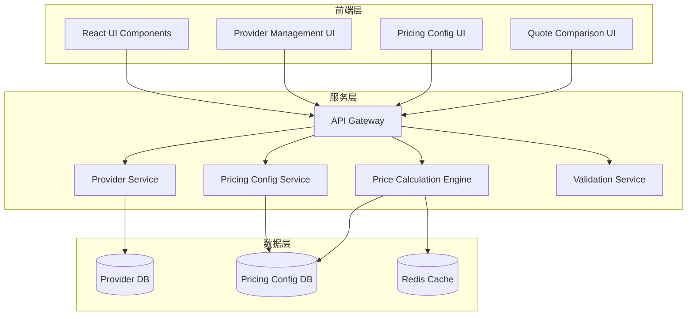
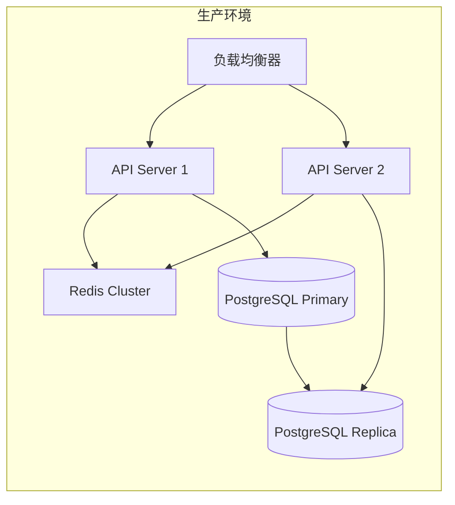

# 服务商管理系统设计文档

## 1. 系统架构概述

### 1.1 整体架构



### 1.2 核心设计原则

1. **模块化设计**：服务商管理与定价配置分离，便于独立维护
2. **策略模式**：不同定价模式通过策略模式实现，易于扩展
3. **缓存优先**：频繁访问的价格配置缓存在Redis中
4. **版本控制**：所有配置支持版本管理，可回滚
5. **向后兼容**：新系统兼容现有定价规则

## 2. 数据模型设计

### 2.1 服务商实体

```typescript
interface Provider {
  id: string;
  code: string;                    // 服务商代码（如PDN, FGX等）
  name: string;                     // 服务商名称
  status: ProviderStatus;           // 状态
  type: ProviderType;               // 类型（快递、货运、专线等）
  contactInfo: ContactInfo;         // 联系信息
  capabilities: Capability[];       // 服务能力
  serviceAreas: ServiceArea[];      // 服务区域
  pricingModels: PricingModel[];    // 定价模型
  surcharges: Surcharge[];          // 附加费用
  businessRules: BusinessRule[];    // 业务规则
  integration: IntegrationConfig;   // 集成配置
  metadata: Metadata;               // 元数据
}

enum ProviderStatus {
  ACTIVE = 'active',
  INACTIVE = 'inactive',
  SUSPENDED = 'suspended',
  PENDING = 'pending'
}

interface ServiceArea {
  id: string;
  providerId: string;
  zoneId: string;                  // 服务商的Zone ID
  zoneName: string;                 // Zone名称（如Zone 1, Zone 2）
  regions: Region[];                // 包含的地区
  fsaCodes: string[];               // FSA代码列表
  postalCodeRanges: PostalRange[]; // 邮编范围
  cities: string[];                 // 城市列表
  priority: number;                 // 优先级
}
```

### 2.2 定价模型设计

```typescript
interface PricingModel {
  id: string;
  providerId: string;
  name: string;
  type: PricingType;
  unit: PricingUnit;
  configuration: PricingConfig;
  effectiveDate: Date;
  expiryDate?: Date;
  zones: string[];                  // 适用的Zone
  priority: number;
  version: number;
}

enum PricingType {
  WEIGHT_ZONE = 'weight_zone',      // 重量区间+Zone矩阵
  FIRST_CONT = 'first_cont',        // 首续模式
  FIXED_TABLE = 'fixed_table',      // 固定价格表
  LINEAR = 'linear',                 // 线性定价
  TIERED = 'tiered',                // 阶梯定价
  CUSTOM = 'custom'                  // 自定义公式
}

// 重量区间定价配置
interface WeightZoneConfig {
  weightRanges: WeightRange[];
  zonePrices: ZonePrice[];
}

interface WeightRange {
  min: number;
  max: number;
  unit: 'skids' | 'kg' | 'lbs';
}

interface ZonePrice {
  zoneId: string;
  weightRangeId: string;
  price: number;
}

// 首续模式配置
interface FirstContConfig {
  firstUnit: {
    quantity: number;
    price: number;
  };
  continuationUnit: {
    quantity: number;
    price: number;
  };
  maxUnits?: number;
  priceCapPerVehicle?: number;
}
```

### 2.3 附加费用模型

```typescript
interface Surcharge {
  id: string;
  providerId: string;
  code: string;                     // 费用代码
  name: string;                     // 费用名称
  description: string;
  type: SurchargeType;
  calculation: CalculationType;
  value: number;
  conditions: Condition[];          // 触发条件
  stackable: boolean;               // 是否可叠加
  priority: number;
  effectiveDate: Date;
  expiryDate?: Date;
}

enum SurchargeType {
  RESIDENTIAL = 'residential',       // 住宅送货
  LIFTGATE = 'liftgate',            // 尾板服务
  INSIDE_DELIVERY = 'inside',        // 室内派送
  APPOINTMENT = 'appointment',       // 预约送货
  DANGEROUS_GOODS = 'dangerous',     // 危险品
  RUSH = 'rush',                     // 加急
  FUEL = 'fuel',                     // 燃油附加
  CUSTOM = 'custom'                  // 自定义
}

enum CalculationType {
  FIXED = 'fixed',                   // 固定金额
  PERCENTAGE = 'percentage',         // 百分比
  PER_UNIT = 'per_unit'             // 按单位计费
}
```

## 3. 核心组件设计

### 3.1 价格计算引擎

```typescript
class PriceCalculationEngine {
  private strategies: Map<PricingType, PricingStrategy>;
  private cache: CacheService;
  
  constructor() {
    this.registerStrategies();
  }
  
  async calculate(request: PriceRequest): Promise<PriceResponse> {
    // 1. 获取适用的服务商
    const providers = await this.getAvailableProviders(request);
    
    // 2. 并行计算各服务商价格
    const quotes = await Promise.all(
      providers.map(provider => this.calculateProviderPrice(provider, request))
    );
    
    // 3. 排序和筛选
    const sortedQuotes = this.sortQuotes(quotes, request.sortBy);
    
    // 4. 返回结果
    return {
      quotes: sortedQuotes,
      recommendedQuote: sortedQuotes[0],
      calculatedAt: new Date()
    };
  }
  
  private async calculateProviderPrice(
    provider: Provider, 
    request: PriceRequest
  ): Promise<Quote> {
    // 1. 确定适用的定价模型
    const pricingModel = this.selectPricingModel(provider, request);
    
    // 2. 使用对应策略计算基础价格
    const strategy = this.strategies.get(pricingModel.type);
    const basePrice = await strategy.calculate(pricingModel, request);
    
    // 3. 计算附加费用
    const surcharges = this.calculateSurcharges(provider, request);
    
    // 4. 组装报价
    return {
      providerId: provider.id,
      providerName: provider.name,
      basePrice,
      surcharges,
      totalPrice: basePrice + surcharges.total,
      breakdown: this.generateBreakdown(basePrice, surcharges),
      estimatedDelivery: this.estimateDelivery(provider, request),
      metadata: {
        pricingModelUsed: pricingModel.id,
        zoneApplied: this.determineZone(provider, request)
      }
    };
  }
}
```

### 3.2 定价策略实现

```typescript
// 策略接口
interface PricingStrategy {
  calculate(model: PricingModel, request: PriceRequest): Promise<number>;
  validate(model: PricingModel): ValidationResult;
}

// 重量区间策略
class WeightZoneStrategy implements PricingStrategy {
  async calculate(model: PricingModel, request: PriceRequest): Promise<number> {
    const config = model.configuration as WeightZoneConfig;
    
    // 1. 确定重量区间
    const weightRange = this.findWeightRange(config.weightRanges, request.weight);
    
    // 2. 确定Zone
    const zone = this.determineZone(model, request.destination);
    
    // 3. 查找价格
    const zonePrice = config.zonePrices.find(
      zp => zp.zoneId === zone && zp.weightRangeId === weightRange.id
    );
    
    return zonePrice?.price || 0;
  }
  
  validate(model: PricingModel): ValidationResult {
    // 验证配置完整性
    return { valid: true, errors: [] };
  }
}

// 首续模式策略
class FirstContStrategy implements PricingStrategy {
  async calculate(model: PricingModel, request: PriceRequest): Promise<number> {
    const config = model.configuration as FirstContConfig;
    const units = request.quantity;
    
    let totalPrice = 0;
    
    // 1. 计算首单位价格
    if (units > 0) {
      totalPrice += config.firstUnit.price;
    }
    
    // 2. 计算续单位价格
    const contUnits = Math.max(0, units - config.firstUnit.quantity);
    const contGroups = Math.ceil(contUnits / config.continuationUnit.quantity);
    totalPrice += contGroups * config.continuationUnit.price;
    
    // 3. 应用价格上限
    if (config.priceCapPerVehicle && totalPrice > config.priceCapPerVehicle) {
      totalPrice = config.priceCapPerVehicle;
    }
    
    return totalPrice;
  }
  
  validate(model: PricingModel): ValidationResult {
    return { valid: true, errors: [] };
  }
}
```

### 3.3 配置管理服务

```typescript
class ConfigurationService {
  private versionControl: VersionControl;
  private validator: ConfigValidator;
  
  async createProvider(data: CreateProviderDto): Promise<Provider> {
    // 1. 验证数据
    await this.validator.validateProvider(data);
    
    // 2. 创建服务商
    const provider = await this.providerRepo.create(data);
    
    // 3. 初始化版本控制
    await this.versionControl.createSnapshot(provider);
    
    // 4. 发布事件
    await this.eventBus.publish('provider.created', provider);
    
    return provider;
  }
  
  async updatePricingModel(
    id: string, 
    updates: UpdatePricingModelDto
  ): Promise<PricingModel> {
    // 1. 获取当前配置
    const current = await this.pricingRepo.findById(id);
    
    // 2. 创建新版本
    const newVersion = {
      ...current,
      ...updates,
      version: current.version + 1
    };
    
    // 3. 验证新配置
    await this.validator.validatePricingModel(newVersion);
    
    // 4. 保存新版本
    await this.pricingRepo.save(newVersion);
    
    // 5. 保留历史版本
    await this.versionControl.archiveVersion(current);
    
    // 6. 清除缓存
    await this.cache.invalidate(`pricing:${id}`);
    
    return newVersion;
  }
}
```

## 4. API设计

### 4.1 RESTful API结构

```yaml
/api/v1/providers:
  get:
    summary: 获取服务商列表
    parameters:
      - status: active|inactive|all
      - type: express|freight|dedicated
      - serviceArea: cityName|fsaCode
    responses:
      200: Provider[]
      
  post:
    summary: 创建服务商
    requestBody: CreateProviderDto
    responses:
      201: Provider

/api/v1/providers/{id}:
  get:
    summary: 获取服务商详情
    responses:
      200: Provider
      404: Not Found
      
  put:
    summary: 更新服务商
    requestBody: UpdateProviderDto
    responses:
      200: Provider
      
  delete:
    summary: 删除服务商
    responses:
      204: No Content

/api/v1/providers/{id}/pricing-models:
  get:
    summary: 获取服务商定价模型
    responses:
      200: PricingModel[]
      
  post:
    summary: 创建定价模型
    requestBody: CreatePricingModelDto
    responses:
      201: PricingModel

/api/v1/pricing/calculate:
  post:
    summary: 计算运费
    requestBody:
      origin: Address
      destination: Address
      items: Item[]
      services: Service[]
    responses:
      200: PriceResponse

/api/v1/pricing/compare:
  post:
    summary: 比较多个服务商
    requestBody: CompareRequest
    responses:
      200: ComparisonResult
```

### 4.2 WebSocket实时更新

```typescript
// 价格配置实时更新
interface PriceUpdateEvent {
  type: 'price.updated' | 'provider.status.changed' | 'surcharge.added';
  providerId: string;
  data: any;
  timestamp: Date;
}

// WebSocket连接处理
class PriceUpdateSocket {
  constructor(private io: SocketIO.Server) {
    this.setupHandlers();
  }
  
  private setupHandlers() {
    this.io.on('connection', (socket) => {
      // 订阅价格更新
      socket.on('subscribe:price-updates', (providerIds: string[]) => {
        providerIds.forEach(id => {
          socket.join(`provider:${id}`);
        });
      });
      
      // 推送更新
      EventBus.on('price.updated', (event: PriceUpdateEvent) => {
        this.io.to(`provider:${event.providerId}`).emit('price-update', event);
      });
    });
  }
}
```

## 5. 前端组件设计

### 5.1 服务商管理组件

```typescript
// 服务商列表组件
const ProviderList: React.FC = () => {
  const [providers, setProviders] = useState<Provider[]>([]);
  const [filter, setFilter] = useState<FilterOptions>({});
  
  return (
    <div className="provider-list">
      <ProviderFilter onFilterChange={setFilter} />
      <DataTable
        columns={providerColumns}
        data={providers}
        onRowClick={handleProviderSelect}
      />
      <ProviderActions
        onAdd={handleAddProvider}
        onImport={handleImport}
        onExport={handleExport}
      />
    </div>
  );
};

// 定价配置组件
const PricingConfig: React.FC<{providerId: string}> = ({ providerId }) => {
  const [models, setModels] = useState<PricingModel[]>([]);
  const [selectedModel, setSelectedModel] = useState<PricingModel | null>(null);
  
  return (
    <div className="pricing-config">
      <PricingModelSelector
        models={models}
        onSelect={setSelectedModel}
      />
      {selectedModel && (
        <PricingModelEditor
          model={selectedModel}
          onSave={handleSave}
          onTest={handleTest}
        />
      )}
      <PricingPreview
        model={selectedModel}
        testData={testData}
      />
    </div>
  );
};
```

### 5.2 价格计算组件

```typescript
// 价格计算器组件
const PriceCalculator: React.FC = () => {
  const [request, setRequest] = useState<PriceRequest>({});
  const [quotes, setQuotes] = useState<Quote[]>([]);
  const [loading, setLoading] = useState(false);
  
  const calculatePrice = async () => {
    setLoading(true);
    try {
      const response = await api.calculatePrice(request);
      setQuotes(response.quotes);
    } finally {
      setLoading(false);
    }
  };
  
  return (
    <div className="price-calculator">
      <ShipmentForm
        onSubmit={setRequest}
      />
      <CalculateButton
        onClick={calculatePrice}
        loading={loading}
      />
      <QuoteComparison
        quotes={quotes}
        onSelectQuote={handleQuoteSelect}
      />
    </div>
  );
};

// 报价对比组件
const QuoteComparison: React.FC<{quotes: Quote[]}> = ({ quotes }) => {
  return (
    <div className="quote-comparison">
      <QuoteTable quotes={quotes} />
      <QuoteChart quotes={quotes} />
      <QuoteDetails
        quote={selectedQuote}
        showBreakdown={true}
      />
    </div>
  );
};
```

## 6. 集成方案

### 6.1 与现有系统集成

```typescript
// 适配器模式连接新旧系统
class LegacyPricingAdapter {
  constructor(
    private newEngine: PriceCalculationEngine,
    private legacyEngine: LegacyPricingEngine
  ) {}
  
  async calculatePrice(request: any): Promise<any> {
    // 1. 检查是否使用新系统
    if (this.shouldUseNewSystem(request)) {
      // 转换请求格式
      const newRequest = this.transformRequest(request);
      const response = await this.newEngine.calculate(newRequest);
      // 转换响应格式
      return this.transformResponse(response);
    }
    
    // 2. 降级到旧系统
    return this.legacyEngine.calculate(request);
  }
  
  private shouldUseNewSystem(request: any): boolean {
    // 基于配置或请求特征判断
    return config.useNewPricingEngine && 
           request.provider in config.migratedProviders;
  }
}
```

### 6.2 数据迁移策略

```typescript
class DataMigration {
  async migrateProvider(legacyProvider: any): Promise<Provider> {
    // 1. 映射基本信息
    const provider = this.mapBasicInfo(legacyProvider);
    
    // 2. 转换定价规则
    const pricingModels = await this.convertPricingRules(
      legacyProvider.pricingRules
    );
    
    // 3. 生成服务区域
    const serviceAreas = this.generateServiceAreas(
      legacyProvider.regions
    );
    
    // 4. 创建新服务商
    return await this.providerService.create({
      ...provider,
      pricingModels,
      serviceAreas
    });
  }
  
  async rollback(providerId: string): Promise<void> {
    // 支持回滚到旧系统
    await this.versionControl.rollback(providerId);
  }
}
```

## 7. 性能优化

### 7.1 缓存策略

```typescript
class CacheStrategy {
  // 多级缓存
  private l1Cache: Map<string, any> = new Map(); // 内存缓存
  private l2Cache: RedisClient;                  // Redis缓存
  
  async get(key: string): Promise<any> {
    // 1. 检查L1缓存
    if (this.l1Cache.has(key)) {
      return this.l1Cache.get(key);
    }
    
    // 2. 检查L2缓存
    const cached = await this.l2Cache.get(key);
    if (cached) {
      this.l1Cache.set(key, cached);
      return cached;
    }
    
    return null;
  }
  
  async set(key: string, value: any, ttl?: number): Promise<void> {
    // 同时更新两级缓存
    this.l1Cache.set(key, value);
    await this.l2Cache.set(key, value, ttl);
  }
}
```

### 7.2 批量处理优化

```typescript
class BatchProcessor {
  async calculateBatchPrices(requests: PriceRequest[]): Promise<PriceResponse[]> {
    // 1. 按服务商分组
    const grouped = this.groupByProvider(requests);
    
    // 2. 并行处理每个服务商的批量请求
    const results = await Promise.all(
      Object.entries(grouped).map(([providerId, batch]) =>
        this.processBatch(providerId, batch)
      )
    );
    
    // 3. 合并结果
    return this.mergeResults(results);
  }
}
```

## 8. 监控和日志

### 8.1 监控指标

```typescript
interface Metrics {
  // 性能指标
  priceCalculationLatency: Histogram;
  apiResponseTime: Histogram;
  cacheHitRate: Gauge;
  
  // 业务指标
  quotesGenerated: Counter;
  providersActive: Gauge;
  pricingErrors: Counter;
  
  // 系统指标
  memoryUsage: Gauge;
  cpuUsage: Gauge;
  databaseConnections: Gauge;
}
```

### 8.2 审计日志

```typescript
class AuditLogger {
  async logConfigChange(change: ConfigChange): Promise<void> {
    await this.auditLog.create({
      timestamp: new Date(),
      userId: change.userId,
      action: change.action,
      entityType: 'pricing_config',
      entityId: change.entityId,
      oldValue: change.oldValue,
      newValue: change.newValue,
      reason: change.reason
    });
  }
}
```

## 9. 安全考虑

### 9.1 权限控制

```typescript
enum Permission {
  PROVIDER_VIEW = 'provider:view',
  PROVIDER_CREATE = 'provider:create',
  PROVIDER_UPDATE = 'provider:update',
  PROVIDER_DELETE = 'provider:delete',
  PRICING_VIEW = 'pricing:view',
  PRICING_UPDATE = 'pricing:update',
  PRICING_APPROVE = 'pricing:approve'
}

class AuthorizationService {
  async checkPermission(
    user: User, 
    permission: Permission, 
    resource?: any
  ): Promise<boolean> {
    // 基于角色的访问控制
    return user.roles.some(role => 
      role.permissions.includes(permission)
    );
  }
}
```

### 9.2 数据验证

```typescript
class ValidationService {
  validatePricingModel(model: PricingModel): ValidationResult {
    const errors: string[] = [];
    
    // 1. 验证价格范围
    if (model.configuration.minPrice < 0) {
      errors.push('价格不能为负数');
    }
    
    // 2. 验证日期逻辑
    if (model.expiryDate && model.expiryDate < model.effectiveDate) {
      errors.push('失效日期不能早于生效日期');
    }
    
    // 3. 验证配置完整性
    if (!this.isConfigComplete(model.configuration)) {
      errors.push('配置信息不完整');
    }
    
    return {
      valid: errors.length === 0,
      errors
    };
  }
}
```

## 10. 测试策略

### 10.1 单元测试

```typescript
describe('PriceCalculationEngine', () => {
  it('should calculate weight zone pricing correctly', async () => {
    const request = createMockRequest({ weight: 5, zone: 'zone1' });
    const result = await engine.calculate(request);
    expect(result.totalPrice).toBe(150);
  });
  
  it('should apply surcharges correctly', async () => {
    const request = createMockRequest({ 
      deliveryType: 'residential' 
    });
    const result = await engine.calculate(request);
    expect(result.surcharges.residential).toBe(50);
  });
});
```

### 10.2 集成测试

```typescript
describe('Provider API Integration', () => {
  it('should create and retrieve provider', async () => {
    const provider = await api.createProvider(mockProvider);
    const retrieved = await api.getProvider(provider.id);
    expect(retrieved).toEqual(provider);
  });
  
  it('should calculate prices across multiple providers', async () => {
    const quotes = await api.compareProviders(mockRequest);
    expect(quotes).toHaveLength(3);
    expect(quotes[0].totalPrice).toBeLessThan(quotes[1].totalPrice);
  });
});
```

## 11. 部署架构



## 12. 未来扩展

### 12.1 计划功能

1. **AI价格优化**：基于历史数据自动优化定价策略
2. **实时竞价**：服务商实时报价系统
3. **智能路由**：基于多因素的最优服务商选择
4. **预测分析**：需求预测和容量规划

### 12.2 技术演进

1. **微服务化**：将单体服务拆分为微服务
2. **事件驱动**：采用事件溯源和CQRS模式
3. **GraphQL API**：提供更灵活的数据查询
4. **容器化部署**：使用Kubernetes进行编排