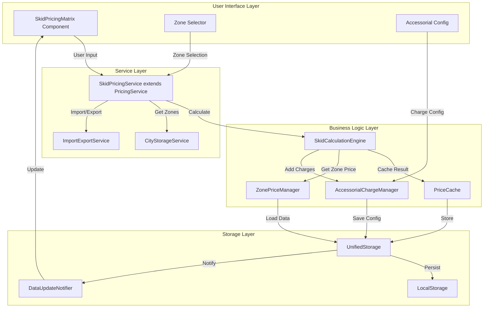
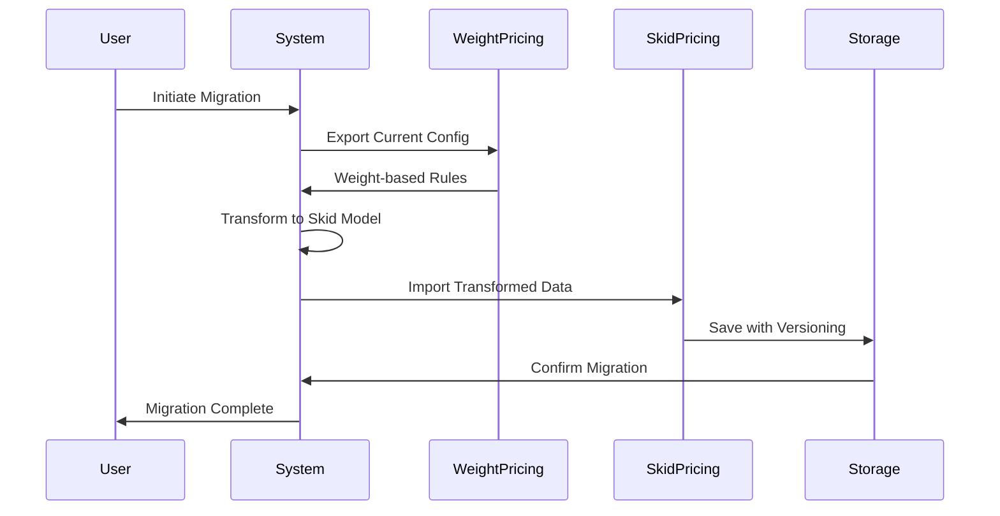

# Design Document - Skid-Based Dynamic Pricing System

## Overview

This design document outlines the technical architecture for transforming the existing weight-based pricing system into a skid-based pricing model. The new system will extend the current pricing infrastructure, reusing existing services and storage patterns while introducing skid-specific calculation logic and a zone-based price matrix interface.

## Steering Document Alignment

### Technical Standards (tech.md)
- **React 18.2 + Vite**: Utilize existing React component architecture with JavaScript/JSX
- **Tailwind CSS**: Maintain cyber/tech theme consistency across new components
- **Unified Storage**: Extend existing `unifiedStorage.js` patterns for data persistence
- **Performance**: Implement Redis-like caching in localStorage for < 500ms response time
- **Internationalization**: Use existing i18n patterns for Chinese/English support

### Project Structure (structure.md)
Following existing conventions:
```
src/
├── components/pricing/skid/      # New skid pricing components
│   ├── SkidPricingMatrix.jsx
│   ├── SkidZoneSelector.jsx
│   └── AccessorialConfig.jsx
├── utils/pricing/                # Extended pricing utilities
│   ├── skidCalculator.js         # New skid calculation engine
│   └── skidPriceCache.js         # Performance optimization
└── services/                     # Extended services
    └── skidPricingService.js     # Extends existing pricingService
```

## Code Reuse Analysis

### Existing Components to Leverage
- **PricingRuleList** (`src/components/pricing/PricingRuleList.jsx`): Extend for skid rule display
- **EnhancedPricingRuleEditor** (`src/components/pricing/EnhancedPricingRuleEditor.jsx`): Adapt editor for skid configuration
- **PriceCalculationEngine** (`src/utils/pricing/priceCalculationEngine.js`): Base class for skid calculations
- **cityStorageService** (`src/utils/storage/cityStorage.js`): Zone data management
- **pricingService** (`src/services/pricingService.js`): Extend with skid methods
- **unifiedStorage** (`src/utils/unifiedStorage.js`): Data persistence layer
- **importExportService** (`src/utils/truck/importExportService.js`): Excel/CSV handling

### Integration Points
- **Storage Layer**: Extend existing localStorage keys with `skidPricing_*` prefix
- **API Client**: Use existing `apiClient.js` patterns for backend communication
- **Data Update Notifier**: Subscribe to `dataUpdateNotifier` for real-time sync
- **Audit System**: Integrate with existing audit logging via storage metadata

## Architecture

### Data Flow Diagram


### Migration Strategy


## Components and Interfaces

### Component 1: SkidPricingMatrix
- **Purpose:** Excel-like grid interface for skid pricing configuration
- **Location:** `src/components/pricing/skid/SkidPricingMatrix.jsx`
- **Interfaces:**
```javascript
// Props
{
  cityId: string,              // Current city ID
  zones: Array<Zone>,          // Available zones
  onSave: (data) => void,      // Save callback
  onExport: () => void,        // Export callback
  locale: 'zh' | 'en'          // Language setting
}

// Methods
handleCellEdit(skidCount, zoneId, newPrice)
handleBulkPaste(pastedData)
validatePriceConsistency(zonesPrices)
```
- **Dependencies:** React, Framer Motion, existing grid utilities
- **Reuses:** Keyboard navigation from `EnhancedPricingRuleEditor`, validation from `pricingValidator.js`

### Component 2: SkidCalculationEngine
- **Purpose:** Calculate prices based on skid count and zone with caching
- **Location:** `src/utils/pricing/skidCalculator.js`
- **Interfaces:**
```javascript
class SkidCalculationEngine extends PriceCalculationEngine {
  calculatePrice(skidCount, zoneId, cityId) // Returns: { price, breakdown, cached }
  calculateWithAccessorials(basePrice, chargeIds) // Returns: { total, charges }
  getIncrementalPrice(skidCount) // Returns: number
  clearCache() // Clears calculation cache
}
```
- **Performance:** Implements LRU cache with 100ms TTL for sub-500ms response
- **Reuses:** Base calculation patterns from `PriceCalculationEngine`

### Component 3: SkidPricingService
- **Purpose:** Service layer extending existing pricing service
- **Location:** `src/services/skidPricingService.js`
- **Interfaces:**
```javascript
class SkidPricingService extends PricingService {
  // CRUD Operations
  async getSkidPricing(cityId, zoneId)
  async saveSkidPricing(cityId, pricingData)
  async deleteSkidPricing(cityId, zoneId)
  
  // Import/Export
  async importFromExcel(file)
  async exportToExcel(cityId)
  
  // Calculation
  async calculateQuote(skidCount, zoneId, accessorials)
  
  // Migration
  async migrateFromWeightBased(weightRules)
}
```
- **Reuses:** HTTP client from parent `PricingService`, error handling patterns

### Component 4: ZonePriceManager
- **Purpose:** Manage zone-specific pricing with validation
- **Location:** `src/utils/pricing/zonePriceManager.js`
- **Interfaces:**
```javascript
{
  getZonePrice(zoneId, skidCount) // Returns price or null
  validateZonePricing(prices) // Returns: { valid, errors }
  ensurePriceProgression(zones) // Validates Zone1 < Zone2 < Zone3...
  getZoneMultiplier(zoneId) // Returns multiplier for zone
}
```
- **Storage:** Uses `unifiedStorage` with key pattern: `skidPricing_zone_{cityId}_{zoneId}`

### Component 5: AccessorialChargeManager
- **Purpose:** Manage additional charges configuration
- **Location:** `src/utils/pricing/accessorialManager.js`
- **Interfaces:**
```javascript
{
  getAvailableCharges() // Returns list of configured charges
  addCharge(charge) // Adds new charge type
  calculateCharges(basePrice, selectedChargeIds) // Returns total with breakdown
  getChargeHistory(chargeId) // Returns audit trail
}
```
- **Audit:** All changes logged with timestamp and user info

## Data Models

### JavaScript Object Schemas

```javascript
// Skid Price Configuration
const SkidPriceConfiguration = {
  id: 'uuid',                    // Unique identifier
  name: 'string',                 // Configuration name
  cityId: 'string',               // Associated city
  zones: {                        // Zone price matrix
    'zone_1': {
      skidPrices: [
        { skidCount: 1, price: 90 },
        { skidCount: 2, price: 108 },
        // ...
        { skidCount: '16+', price: 360 }
      ],
      zoneMultiplier: 1.0,
      isActive: true
    },
    // ... zones 2-5
  },
  accessorialCharges: [],         // Array of charge objects
  effectiveDate: 'ISO-8601',      // When pricing takes effect
  expiryDate: 'ISO-8601',         // Optional expiry
  isActive: true,                 // Enable/disable flag
  metadata: {                     // Audit trail
    createdBy: 'userId',
    createdAt: 'ISO-8601',
    updatedAt: 'ISO-8601',
    version: 1                    // Version number for rollback
  }
};

// Accessorial Charge
const AccessorialCharge = {
  id: 'uuid',
  name: {
    en: 'Tailgate Service',
    zh: '尾板服务'
  },
  type: 'TAILGATE|RESIDENTIAL|INSIDE_DELIVERY|CUSTOM',
  chargeType: 'FIXED|PERCENTAGE',
  value: 50,                      // Dollar amount or percentage
  isActive: true
};

// Price Calculation Result
const PriceCalculationResult = {
  skidCount: 5,
  zoneId: 'zone_2',
  basePrice: 198,
  accessorialCharges: [
    { name: 'Tailgate', amount: 50 }
  ],
  totalPrice: 248,
  currency: 'CAD',
  calculatedAt: 'ISO-8601',
  cached: false,                  // Whether result was cached
  breakdown: {                    // Detailed breakdown
    base: 198,
    charges: 50,
    tax: 0,
    total: 248
  }
};
```

## Storage Schema

```javascript
// LocalStorage Keys Structure
{
  // Skid pricing configurations
  'skidPricing_config_{cityId}': SkidPriceConfiguration,
  
  // Zone-specific pricing
  'skidPricing_zone_{cityId}_{zoneId}': ZonePricing,
  
  // Accessorial charges
  'skidPricing_charges_{cityId}': AccessorialCharge[],
  
  // Cache for calculations (TTL: 100ms)
  'skidPricing_cache_{hash}': PriceCalculationResult,
  
  // Migration status
  'skidPricing_migration_status': {
    migrated: boolean,
    migratedAt: 'ISO-8601',
    fromVersion: 'weight-based',
    toVersion: 'skid-based'
  }
}
```

## Error Handling

### Error Scenarios

1. **Invalid Skid Count:**
   - **Detection:** Validation on input (must be 1-16 or '16+')
   - **Handling:** Display inline error message, prevent save
   - **User Impact:** Red border on input, clear error message
   - **Recovery:** Auto-correct to nearest valid value

2. **Zone Price Inconsistency:**
   - **Detection:** Zone X price < Zone X-1 price
   - **Handling:** Warning dialog with comparison table
   - **User Impact:** Yellow warning icon, option to proceed or fix
   - **Recovery:** Suggest auto-adjustment based on percentage increase

3. **Import Format Error:**
   - **Detection:** Excel parsing fails or missing required columns
   - **Handling:** Generate detailed error report
   - **User Impact:** Download error log with row/column details
   - **Recovery:** Provide template download, highlight specific issues

4. **Calculation Timeout:**
   - **Detection:** Calculation exceeds 500ms threshold
   - **Handling:** Return cached result if available, calculate async
   - **User Impact:** Show cached price with refresh indicator
   - **Recovery:** Background calculation with notification when complete

5. **Storage Quota Exceeded:**
   - **Detection:** localStorage quota error
   - **Handling:** Compress old data, archive to IndexedDB
   - **User Impact:** Brief loading indicator during compression
   - **Recovery:** Automatic cleanup of old cache entries

6. **Concurrent Edit Conflict:**
   - **Detection:** Version mismatch on save
   - **Handling:** Show diff dialog with both versions
   - **User Impact:** Choose to merge, overwrite, or cancel
   - **Recovery:** Three-way merge with conflict resolution

## Performance Optimization

### Caching Strategy
- **LRU Cache:** 1000 most recent calculations in memory
- **TTL:** 100ms for real-time updates, 5min for historical quotes
- **Invalidation:** On price configuration change
- **Storage:** Compressed JSON in localStorage

### Optimization Techniques
- **Virtual Scrolling:** For large price matrices
- **Debounced Saves:** 500ms delay on cell edits
- **Batch Updates:** Group multiple cell changes
- **Web Workers:** Heavy calculations off main thread

## Security Implementation

### Access Control
```javascript
// Permission check before price modification
const canModifyPricing = (user) => {
  return user.roles.includes('ADMIN') || 
         user.permissions.includes('PRICING_WRITE');
};

// Audit log for all changes
const auditPriceChange = (change) => {
  const audit = {
    userId: getCurrentUser().id,
    action: change.action,
    oldValue: change.oldValue,
    newValue: change.newValue,
    timestamp: new Date().toISOString(),
    ipAddress: getClientIP(),
    userAgent: navigator.userAgent
  };
  saveAuditLog(audit);
};
```

### Data Protection
- **Encryption:** Sensitive price data encrypted in localStorage
- **Validation:** Server-side validation of all price calculations
- **Rate Limiting:** Max 100 price queries per minute per user

## Internationalization

```javascript
// Language support implementation
const i18n = {
  en: {
    'pricing.skid': 'Skid',
    'pricing.zone': 'Zone',
    'pricing.calculate': 'Calculate Price',
    // ...
  },
  zh: {
    'pricing.skid': '板数',
    'pricing.zone': '区域',
    'pricing.calculate': '计算价格',
    // ...
  }
};

// Component usage
const SkidPricingMatrix = ({ locale = 'en' }) => {
  const t = (key) => i18n[locale][key] || key;
  return <div>{t('pricing.skid')}</div>;
};
```

## Testing Strategy

### Unit Testing
```javascript
// Test calculation accuracy
describe('SkidCalculationEngine', () => {
  test('calculates correct price for 5 skids in zone 2', () => {
    const result = engine.calculatePrice(5, 'zone_2', 'toronto');
    expect(result.price).toBe(198);
  });
  
  test('applies 16+ pricing for counts over 16', () => {
    const result = engine.calculatePrice(20, 'zone_1', 'toronto');
    expect(result.price).toBe(360); // 16+ price
  });
});
```

### Integration Testing
- Test complete pricing workflow with all components
- Verify storage layer persistence and retrieval
- Test import/export with real Excel files
- Validate zone progression rules

### End-to-End Testing
```javascript
// Cypress test example
describe('Skid Pricing Configuration', () => {
  it('configures and calculates skid pricing', () => {
    cy.visit('/pricing/config');
    cy.get('[data-testid=skid-input]').type('5');
    cy.get('[data-testid=zone-select]').select('Zone 2');
    cy.get('[data-testid=calculate-btn]').click();
    cy.get('[data-testid=price-result]').should('contain', '$198.00');
  });
});
```

## Migration Plan

### Phase 1: Parallel Operation
- Deploy skid pricing alongside weight-based
- Allow users to switch between modes
- Collect feedback and usage metrics

### Phase 2: Data Migration
- Export all weight-based rules
- Transform to skid-based equivalents
- Import with versioning for rollback

### Phase 3: Cutover
- Switch default to skid-based pricing
- Maintain weight-based in read-only mode
- Archive weight-based after 30 days