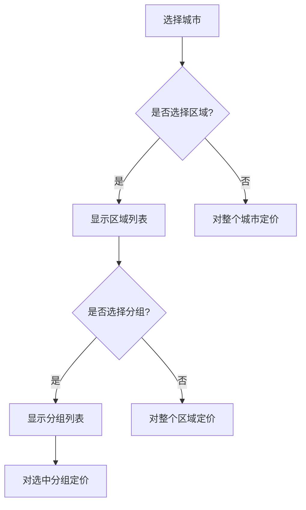

# 板数定价系统 - UI/UX设计文档

## 1. 设计理念

### 核心原则
- **层级清晰**: 城市 → 区域 → 分组的视觉层级明确
- **操作直观**: 减少用户思考成本，所见即所得
- **信息密度适中**: 避免信息过载，保持界面简洁
- **响应迅速**: 实时反馈用户操作

## 2. 布局设计

### 2.1 整体布局结构

```
┌────────────────────────────────────────────────────────────────┐
│ 🚚 板数定价管理  │ 返回管理中心                               │ <- 顶部导航栏
├────────────────────────────────────────────────────────────────┤
│                                                                │
│ [多伦多 ▼] [渥太华] [蒙特利尔] [温哥华] [卡尔加里] [+更多]    │ <- 城市选择器
│                                                                │
├────────────────────────────────────────────────────────────────┤
│ 📍 多伦多区域                                                  │
│ ┌──────────┐ ┌──────────┐ ┌──────────┐ ┌──────────┐         │
│ │Downtown ✓│ │North York│ │Etobicoke │ │Scarborough│         │ <- 区域卡片
│ │12 groups │ │8 groups  │ │6 groups  │ │10 groups │         │
│ └──────────┘ └──────────┘ └──────────┘ └──────────┘         │
├────────────────────────────────────────────────────────────────┤
│ 📦 Downtown 分组 (12)                   [全选] [反选] [清空]   │
│ ┌────────────────────────────────────────────────────────┐    │
│ │ □ Group A (M5V, M5G, M5H) - 当前: 阶梯定价            │    │
│ │ □ Group B (M5E, M5J, M5K) - 当前: 固定价格 $15/板     │    │ <- 分组列表
│ │ ☑ Group C (M5A, M5B, M5C) - 当前: 未设置              │    │
│ │ ☑ Group D (M5L, M5M, M5N) - 当前: 未设置              │    │
│ └────────────────────────────────────────────────────────┘    │
├────────────────────────────────────────────────────────────────┤
│                                                                │
│  定价配置面板                                                  │
│                                                                │
├────────────────────────────────────────────────────────────────┤
│ [保存更改] [预览价格] [导出配置] [重置]          最后更新: 刚刚 │
└────────────────────────────────────────────────────────────────┘
```

### 2.2 组件尺寸规范

| 组件 | 高度 | 说明 |
|-----|------|------|
| 城市选择器 | 60px | 大号按钮，突出显示 |
| 区域卡片 | 80px | 中等大小，包含统计信息 |
| 分组项 | 36px | 紧凑设计，显示关键信息 |
| 定价面板 | 自适应 | 根据选择的定价模式调整 |

## 3. 交互设计

### 3.1 选择器交互流程



### 3.2 定价模式选择

```
┌─────────────────────────────────────────────────────────┐
│ 选择定价模式:                                           │
│                                                         │
│ ┌─────────────┐ ┌─────────────┐ ┌─────────────┐       │
│ │  💵 固定价格 │ │ 📊 首续托   │ │ 📈 阶梯定价 │       │
│ │  每板统一价  │ │ 差异化定价  │ │ 数量折扣   │       │
│ └─────────────┘ └─────────────┘ └─────────────┘       │
│                                                         │
│ ┌─────────────┐                                        │
│ │  🚛 整车定价 │                                        │
│ │  批量优惠    │                                        │
│ └─────────────┘                                        │
└─────────────────────────────────────────────────────────┘
```

## 4. 定价配置界面

### 4.1 固定价格模式

```
┌─────────────────────────────────────────────────────────┐
│ 💵 固定价格配置                                         │
├─────────────────────────────────────────────────────────┤
│                                                         │
│  单价设置:  [  15.00  ] $/板                           │
│                                                         │
│  预估成本:                                              │
│  • 5板:  $75.00                                        │
│  • 10板: $150.00                                       │
│  • 15板: $225.00                                       │
│                                                         │
└─────────────────────────────────────────────────────────┘
```

### 4.2 阶梯定价模式

```
┌─────────────────────────────────────────────────────────┐
│ 📈 阶梯定价配置                                         │
├─────────────────────────────────────────────────────────┤
│                                                         │
│  板数范围        单价($/板)                            │
│  ─────────────────────────────────                     │
│  1-4 板         [  20.00  ]                            │
│  5-8 板         [  18.00  ]                            │
│  9-12 板        [  16.00  ]                            │
│  13-16 板       [  14.00  ]                            │
│  16+ 板         [  12.00  ]                            │
│                                                         │
│  [+ 添加阶梯]                                          │
│                                                         │
└─────────────────────────────────────────────────────────┘
```

## 5. 视觉设计

### 5.1 色彩方案

| 用途 | 颜色代码 | 说明 |
|-----|---------|------|
| 主色调 | #3B82F6 | 蓝色，可信赖感 |
| 成功色 | #10B981 | 绿色，操作成功 |
| 警告色 | #F59E0B | 橙色，需要注意 |
| 危险色 | #EF4444 | 红色，错误/删除 |
| 背景色 | #111827 | 深灰色，夜间模式 |
| 边框色 | #374151 | 中灰色，分隔线 |

### 5.2 字体规范

| 层级 | 大小 | 字重 | 用途 |
|------|-----|------|-----|
| H1 | 24px | Bold | 页面标题 |
| H2 | 20px | Semibold | 区域标题 |
| H3 | 16px | Medium | 卡片标题 |
| Body | 14px | Regular | 正文内容 |
| Small | 12px | Regular | 辅助信息 |

## 6. 响应式设计

### 6.1 断点设置

| 断点 | 宽度 | 布局调整 |
|------|------|---------|
| Desktop | ≥1440px | 完整布局，3列分组 |
| Laptop | 1024-1439px | 2列分组显示 |
| Tablet | 768-1023px | 单列布局，折叠部分面板 |

### 6.2 移动端适配

- 不支持移动端编辑（<768px）
- 显示提示："请使用桌面版进行价格配置"

## 7. 动画与过渡

### 7.1 过渡效果

| 动作 | 时长 | 缓动函数 |
|------|-----|---------|
| 面板展开/收起 | 300ms | ease-out |
| 按钮悬停 | 150ms | ease-in-out |
| 切换定价模式 | 200ms | ease-out |
| 保存成功提示 | 400ms | bounce |

### 7.2 加载状态

```
┌─────────────────────────────────────────────────────────┐
│                                                         │
│                    ⟳ 正在加载价格数据...                │
│                                                         │
│                    ████████░░░░ 60%                    │
│                                                         │
└─────────────────────────────────────────────────────────┘
```

## 8. 错误处理

### 8.1 错误提示样式

```
┌─────────────────────────────────────────────────────────┐
│ ⚠️ 价格配置错误                                         │
├─────────────────────────────────────────────────────────┤
│                                                         │
│  阶梯价格必须递减，请检查第3个阶梯的价格设置            │
│                                                         │
│  [查看详情]                              [关闭]         │
└─────────────────────────────────────────────────────────┘
```

### 8.2 验证规则

- 价格必须为正数
- 阶梯定价必须覆盖所有数量范围
- 首续托定价的续托价格不能高于首托价格
- 整车起始板数必须大于1

## 9. 实时预览功能

### 9.1 价格计算器

```
┌─────────────────────────────────────────────────────────┐
│ 💰 价格计算器                                           │
├─────────────────────────────────────────────────────────┤
│                                                         │
│  输入板数: [  10  ] 板                                 │
│                                                         │
│  计算结果:                                              │
│  ─────────────────────────────────                     │
│  适用规则: Downtown > Group C > 阶梯定价               │
│  单价: $16.00/板 (9-12板区间)                         │
│  总价: $160.00                                         │
│                                                         │
│  [复制结果]                                            │
└─────────────────────────────────────────────────────────┘
```

## 10. 快捷操作

### 10.1 批量操作菜单

```
┌─────────────────────────────────────────────────────────┐
│ 批量操作 (已选择 4 个分组)                              │
├─────────────────────────────────────────────────────────┤
│                                                         │
│  • 应用相同价格                                        │
│  • 复制价格配置                                        │
│  • 清除价格设置                                        │
│  • 导出选中配置                                        │
│                                                         │
└─────────────────────────────────────────────────────────┘
```

### 10.2 键盘快捷键

| 快捷键 | 功能 |
|--------|-----|
| Ctrl+S | 保存配置 |
| Ctrl+Z | 撤销操作 |
| Ctrl+A | 全选分组 |
| Ctrl+C | 复制价格 |
| Ctrl+V | 粘贴价格 |
| Esc | 关闭弹窗 |

## 11. 数据导入导出

### 11.1 导出界面

```
┌─────────────────────────────────────────────────────────┐
│ 📤 导出价格配置                                         │
├─────────────────────────────────────────────────────────┤
│                                                         │
│  导出范围:                                              │
│  ○ 全部城市                                            │
│  ● 当前城市 (多伦多)                                   │
│  ○ 选中分组 (4个)                                      │
│                                                         │
│  导出格式:                                              │
│  ● Excel (.xlsx)                                       │
│  ○ CSV (.csv)                                          │
│  ○ JSON (.json)                                        │
│                                                         │
│  [下载文件]                             [取消]          │
└─────────────────────────────────────────────────────────┘
```

## 12. 性能优化建议

### 12.1 虚拟滚动
- 分组列表超过50项时启用虚拟滚动
- 可视区域外的元素不渲染

### 12.2 防抖与节流
- 输入框输入: 300ms 防抖
- 滚动事件: 16ms 节流
- 自动保存: 5秒防抖

### 12.3 懒加载
- 非当前城市的数据延迟加载
- 图表和预览功能按需加载

## 附录

### A. 组件库选择
- 基础组件: Ant Design / Material-UI
- 图表: Recharts / Chart.js
- 动画: Framer Motion
- 虚拟滚动: react-window

### B. 无障碍设计
- 所有交互元素支持键盘操作
- 提供 ARIA 标签
- 对比度符合 WCAG 2.1 AA 标准
- 支持屏幕阅读器