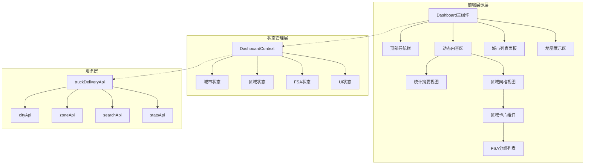
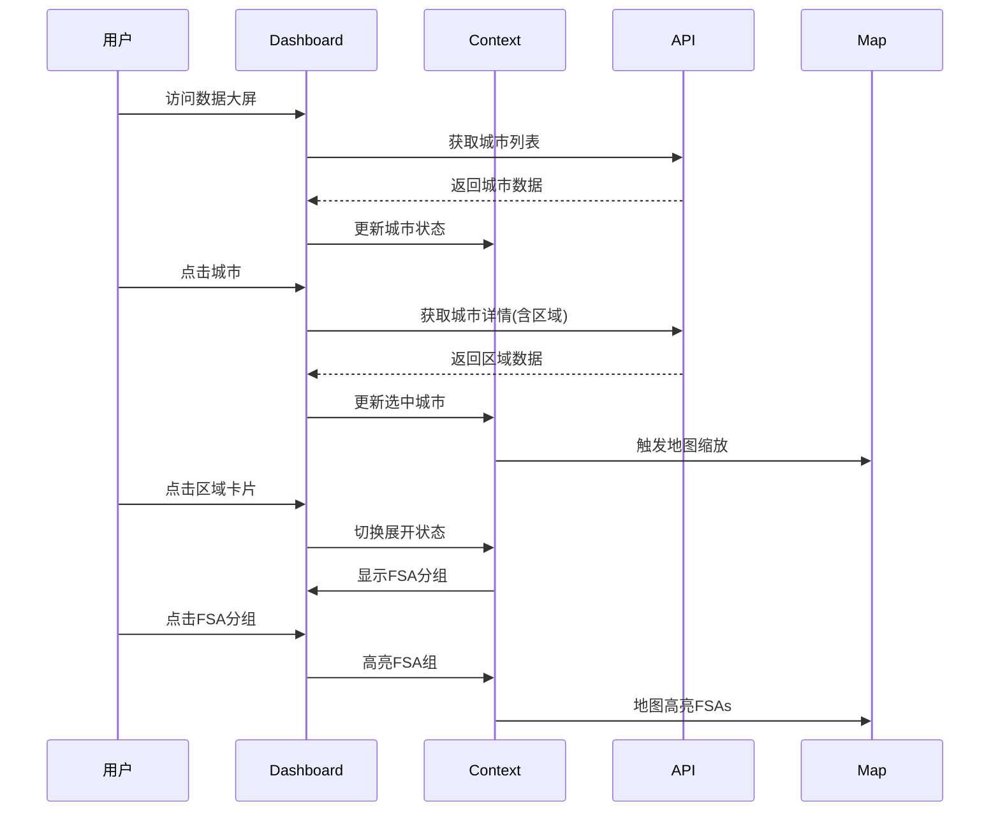

# 卡车派送数据大屏布局重构 - 设计文档

## 1. 架构概述

### 1.1 系统架构


### 1.2 组件层次结构
```
TruckDeliveryDashboard/
├── DashboardHeader/              # 顶部导航栏
│   ├── Logo & Title
│   ├── StatusIndicator
│   └── NavigationControls
├── DynamicContentArea/           # 动态内容区
│   ├── StatsOverview/           # 未选择城市时的统计视图
│   │   ├── MiniStatCard
│   │   └── TrendIndicator
│   └── RegionGrid/              # 选择城市后的区域网格
│       ├── RegionCard/
│       │   ├── RegionHeader
│       │   ├── RegionStats
│       │   └── FSAGroupList/
│       │       ├── GroupHeader
│       │       └── FSAChips
│       └── EmptyState
├── CityListPanel/                # 城市列表面板
│   ├── SearchBar
│   ├── CityList/
│   │   └── CompactCityCard
│   └── ActivityFeed
└── MapContainer/                 # 地图容器
    ├── TruckDeliveryMap
    └── MapLegend
```

## 2. 详细设计

### 2.1 组件设计

#### 2.1.1 Dashboard主组件重构
```javascript
// src/pages/TruckDelivery/Dashboard.jsx
const TruckDeliveryDashboard = () => {
  // 状态管理
  const [selectedCity, setSelectedCity] = useState(null);
  const [expandedRegions, setExpandedRegions] = useState(new Set());
  const [highlightedFSAGroup, setHighlightedFSAGroup] = useState(null);

  // 布局结构
  return (
    <DashboardProvider value={{...}}>
      <div className="h-screen bg-gray-900 flex flex-col">
        <DashboardHeader />
        <DynamicContentArea
          selectedCity={selectedCity}
          expandedRegions={expandedRegions}
        />
        <div className="flex-1 flex">
          <CityListPanel
            cities={cities}
            selectedCity={selectedCity}
            onCitySelect={handleCitySelect}
          />
          <MapContainer
            selectedCity={selectedCity}
            highlightedFSAs={highlightedFSAs}
          />
        </div>
      </div>
    </DashboardProvider>
  );
};
```

#### 2.1.2 动态内容区组件
```javascript
// src/components/dashboard/DynamicContentArea.jsx
const DynamicContentArea = ({ selectedCity, expandedRegions }) => {
  if (!selectedCity) {
    return <StatsOverview />;
  }

  return (
    <RegionGrid
      cityId={selectedCity.id}
      regions={selectedCity.regions}
      expandedRegions={expandedRegions}
    />
  );
};
```

#### 2.1.3 区域卡片组件
```javascript
// src/components/dashboard/RegionCard.jsx
const RegionCard = ({ region, isExpanded, onToggle }) => {
  return (
    <motion.div
      className="bg-gray-800 rounded-lg p-4 cursor-pointer"
      layout
      animate={{ height: isExpanded ? 'auto' : '120px' }}
    >
      <RegionHeader
        name={region.name}
        level={region.level}
        fsaCount={region.fsaCodes.length}
        onClick={onToggle}
      />

      <AnimatePresence>
        {isExpanded && (
          <motion.div
            initial={{ opacity: 0, height: 0 }}
            animate={{ opacity: 1, height: 'auto' }}
            exit={{ opacity: 0, height: 0 }}
          >
            <FSAGroupList groups={region.fsaGroups} />
          </motion.div>
        )}
      </AnimatePresence>
    </motion.div>
  );
};
```

#### 2.1.4 精简城市卡片组件
```javascript
// src/components/dashboard/CompactCityCard.jsx
const CompactCityCard = ({ city, isSelected, onClick }) => {
  return (
    <div
      className={`
        p-3 rounded-lg cursor-pointer transition-all
        ${isSelected
          ? 'bg-blue-900/30 border-blue-500'
          : 'bg-gray-800/50 border-gray-700'
        }
        hover:bg-gray-700 border
      `}
      onClick={onClick}
    >
      <div className="flex items-center space-x-2">
        <div
          className="w-8 h-8 rounded flex-shrink-0 flex items-center justify-center"
          style={{ backgroundColor: city.themeColor + '30' }}
        >
          <span className="text-xs font-bold" style={{ color: city.themeColor }}>
            {city.province.substring(0, 2)}
          </span>
        </div>
        <div className="flex-1 min-w-0">
          <h4 className="text-sm font-medium text-white truncate">
            {city.name}
          </h4>
          <div className="flex items-center space-x-3 text-xs text-gray-400">
            <span>区域: {city.totalRegions}</span>
            <span>FSA: {city.totalFSAs}</span>
          </div>
        </div>
      </div>
    </div>
  );
};
```

### 2.2 状态管理设计

#### 2.2.1 Context设计
```javascript
// src/contexts/DashboardContext.jsx
const DashboardContext = createContext();

export const DashboardProvider = ({ children }) => {
  const [state, dispatch] = useReducer(dashboardReducer, initialState);

  const value = {
    // 城市相关
    cities: state.cities,
    selectedCity: state.selectedCity,
    selectCity: (city) => dispatch({ type: 'SELECT_CITY', payload: city }),

    // 区域相关
    expandedRegions: state.expandedRegions,
    toggleRegion: (regionId) => dispatch({ type: 'TOGGLE_REGION', payload: regionId }),

    // FSA相关
    highlightedFSAs: state.highlightedFSAs,
    highlightFSAGroup: (group) => dispatch({ type: 'HIGHLIGHT_FSA_GROUP', payload: group }),

    // UI状态
    loading: state.loading,
    error: state.error
  };

  return (
    <DashboardContext.Provider value={value}>
      {children}
    </DashboardContext.Provider>
  );
};
```

#### 2.2.2 Reducer设计
```javascript
// src/reducers/dashboardReducer.js
const dashboardReducer = (state, action) => {
  switch (action.type) {
    case 'SELECT_CITY':
      return {
        ...state,
        selectedCity: action.payload,
        expandedRegions: new Set(), // 重置展开状态
        highlightedFSAs: extractCityFSAs(action.payload)
      };

    case 'TOGGLE_REGION':
      const newExpanded = new Set(state.expandedRegions);
      if (newExpanded.has(action.payload)) {
        newExpanded.delete(action.payload);
      } else {
        newExpanded.add(action.payload);
      }
      return {
        ...state,
        expandedRegions: newExpanded
      };

    case 'HIGHLIGHT_FSA_GROUP':
      return {
        ...state,
        highlightedFSAs: action.payload.fsaCodes,
        highlightedGroup: action.payload
      };

    default:
      return state;
  }
};
```

### 2.3 数据流设计

#### 2.3.1 数据获取流程


#### 2.3.2 数据结构
```typescript
interface City {
  id: string;
  name: string;
  province: string;
  themeColor: string;
  totalRegions: number;
  totalFSAs: number;
  regions?: Region[];
}

interface Region {
  id: string;
  cityId: string;
  name: string;
  level: number;
  fsaCodes: string[];
  fsaGroups: FSAGroup[];
}

interface FSAGroup {
  id: string;
  name: string;
  type: 'price' | 'geographic' | 'custom';
  fsaCodes: string[];
}
```

### 2.4 样式设计

#### 2.4.1 响应式布局策略
```css
/* 布局断点 */
.dynamic-content-area {
  @apply grid gap-4;
  /* 默认手机: 1列 */
  @apply grid-cols-1;
  /* 平板: 2列 */
  @apply md:grid-cols-2;
  /* 桌面: 3-4列 */
  @apply lg:grid-cols-3 xl:grid-cols-4;
  /* 大屏: 5-6列 */
  @apply 2xl:grid-cols-5 3xl:grid-cols-6;
}

.city-list-panel {
  /* 默认宽度 */
  @apply w-64;
  /* 小屏幕时可收起 */
  @apply lg:w-64 md:w-56 sm:w-48;
  /* 超小屏幕时浮动 */
  @apply sm:absolute sm:z-10 lg:relative lg:z-0;
}
```

#### 2.4.2 动画设计
```javascript
// 动画配置
const animations = {
  // 区域卡片展开动画
  regionExpand: {
    transition: {
      duration: 0.3,
      ease: [0.4, 0, 0.2, 1]
    }
  },

  // FSA组悬停动画
  fsaGroupHover: {
    scale: 1.02,
    transition: { duration: 0.2 }
  },

  // 城市切换动画
  citySwitch: {
    initial: { opacity: 0, y: 20 },
    animate: { opacity: 1, y: 0 },
    exit: { opacity: 0, y: -20 },
    transition: { duration: 0.3 }
  }
};
```

### 2.5 性能优化设计

#### 2.5.1 虚拟滚动
```javascript
// 城市列表虚拟滚动
import { FixedSizeList } from 'react-window';

const VirtualCityList = ({ cities, selectedCity, onSelect }) => {
  return (
    <FixedSizeList
      height={600}
      itemCount={cities.length}
      itemSize={80}
      width="100%"
    >
      {({ index, style }) => (
        <div style={style}>
          <CompactCityCard
            city={cities[index]}
            isSelected={selectedCity?.id === cities[index].id}
            onClick={() => onSelect(cities[index])}
          />
        </div>
      )}
    </FixedSizeList>
  );
};
```

#### 2.5.2 懒加载策略
```javascript
// 区域数据懒加载
const useRegionData = (cityId) => {
  const [regions, setRegions] = useState([]);
  const [loading, setLoading] = useState(false);

  useEffect(() => {
    if (!cityId) return;

    const loadRegions = async () => {
      setLoading(true);
      const data = await zoneApi.getByCityId(cityId);
      setRegions(data);
      setLoading(false);
    };

    loadRegions();
  }, [cityId]);

  return { regions, loading };
};
```

#### 2.5.3 缓存策略
```javascript
// 数据缓存管理
class DashboardCache {
  constructor() {
    this.cache = new Map();
    this.maxAge = 5 * 60 * 1000; // 5分钟
  }

  set(key, data) {
    this.cache.set(key, {
      data,
      timestamp: Date.now()
    });
  }

  get(key) {
    const item = this.cache.get(key);
    if (!item) return null;

    if (Date.now() - item.timestamp > this.maxAge) {
      this.cache.delete(key);
      return null;
    }

    return item.data;
  }
}
```

## 3. 接口设计

### 3.1 组件接口

#### 3.1.1 DynamicContentArea Props
```typescript
interface DynamicContentAreaProps {
  selectedCity: City | null;
  expandedRegions: Set<string>;
  onRegionToggle: (regionId: string) => void;
  onFSAGroupClick: (group: FSAGroup) => void;
}
```

#### 3.1.2 RegionCard Props
```typescript
interface RegionCardProps {
  region: Region;
  isExpanded: boolean;
  onToggle: () => void;
  onFSAGroupSelect: (group: FSAGroup) => void;
}
```

#### 3.1.3 CityListPanel Props
```typescript
interface CityListPanelProps {
  cities: City[];
  selectedCity: City | null;
  onCitySelect: (city: City) => void;
  searchEnabled?: boolean;
  activityFeedEnabled?: boolean;
}
```

### 3.2 API接口调整

无需修改现有API，复用现有接口：
- `cityApi.getAll()` - 获取城市列表
- `cityApi.getById(id)` - 获取城市详情(含区域)
- `zoneApi.getByCityId(cityId)` - 获取城市区域
- `statsApi.getOverview()` - 获取总体统计

## 4. 错误处理设计

### 4.1 错误边界
```javascript
class DashboardErrorBoundary extends Component {
  state = { hasError: false, error: null };

  static getDerivedStateFromError(error) {
    return { hasError: true, error };
  }

  render() {
    if (this.state.hasError) {
      return (
        <div className="flex items-center justify-center h-screen bg-gray-900">
          <div className="text-center">
            <h2 className="text-xl text-white mb-4">数据加载失败</h2>
            <button
              className="px-4 py-2 bg-blue-600 text-white rounded"
              onClick={() => window.location.reload()}
            >
              刷新页面
            </button>
          </div>
        </div>
      );
    }

    return this.props.children;
  }
}
```

### 4.2 加载状态处理
```javascript
const LoadingState = ({ message = "加载中..." }) => (
  <div className="flex items-center justify-center p-8">
    <Loader2 className="w-6 h-6 animate-spin text-blue-500 mr-2" />
    <span className="text-gray-400">{message}</span>
  </div>
);

const EmptyState = ({ message = "暂无数据" }) => (
  <div className="flex flex-col items-center justify-center p-8">
    <AlertCircle className="w-12 h-12 text-gray-600 mb-2" />
    <span className="text-gray-400">{message}</span>
  </div>
);
```

## 5. 测试策略

### 5.1 单元测试
```javascript
// RegionCard.test.jsx
describe('RegionCard', () => {
  it('should render region information', () => {
    const region = mockRegion();
    render(<RegionCard region={region} />);
    expect(screen.getByText(region.name)).toBeInTheDocument();
  });

  it('should expand on click', () => {
    const onToggle = jest.fn();
    render(<RegionCard region={mockRegion()} onToggle={onToggle} />);
    fireEvent.click(screen.getByRole('button'));
    expect(onToggle).toHaveBeenCalled();
  });
});
```

### 5.2 集成测试
```javascript
// Dashboard.integration.test.jsx
describe('Dashboard Integration', () => {
  it('should load and display cities', async () => {
    render(<TruckDeliveryDashboard />);
    await waitFor(() => {
      expect(screen.getByText('Toronto')).toBeInTheDocument();
    });
  });

  it('should show regions when city selected', async () => {
    render(<TruckDeliveryDashboard />);
    fireEvent.click(await screen.findByText('Toronto'));
    await waitFor(() => {
      expect(screen.getByText('Downtown')).toBeInTheDocument();
    });
  });
});
```

## 6. 部署注意事项

### 6.1 构建优化
```javascript
// vite.config.js 优化配置
export default {
  build: {
    rollupOptions: {
      output: {
        manualChunks: {
          'vendor': ['react', 'react-dom'],
          'map': ['leaflet', 'react-leaflet'],
          'animation': ['framer-motion']
        }
      }
    }
  }
};
```

### 6.2 环境配置
```javascript
// 环境变量配置
const config = {
  API_BASE_URL: import.meta.env.VITE_API_URL || 'http://localhost:5001',
  MAP_TILE_URL: import.meta.env.VITE_MAP_TILE_URL,
  CACHE_DURATION: import.meta.env.VITE_CACHE_DURATION || 300000
};
```

## 7. 迁移计划

### 7.1 分阶段实施
1. **阶段1**: 创建新组件，不影响现有功能
2. **阶段2**: 在开发环境集成测试
3. **阶段3**: 灰度发布，部分用户测试
4. **阶段4**: 全量发布，移除旧代码

### 7.2 回滚方案
```javascript
// 功能开关
const useNewDashboard = localStorage.getItem('feature_new_dashboard') === 'true';

export default useNewDashboard ? NewDashboard : OldDashboard;
```