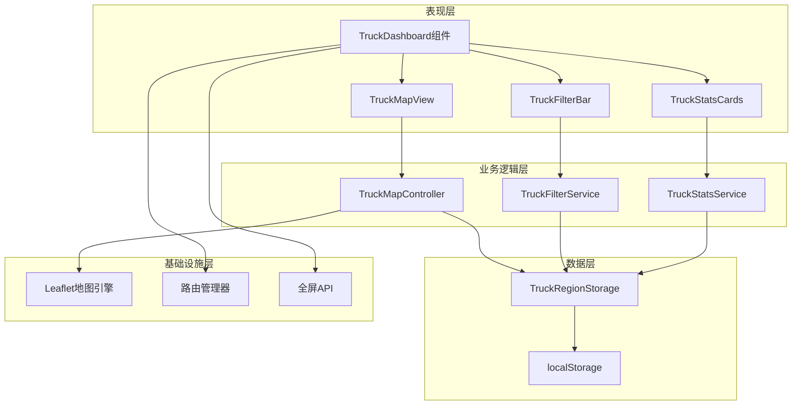
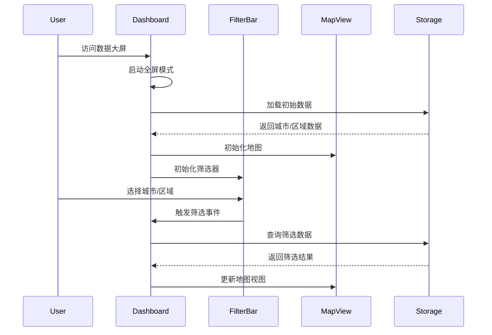

# 卡车配送数据大屏重构 - 设计文档

## 1. 架构概述

### 1.1 系统架构


### 1.2 组件架构
将创建独立的卡车配送数据大屏组件体系，完全脱离现有的FSA管理组件：

- **TruckDashboard**: 主容器组件，管理全屏模式和整体布局
- **TruckMapView**: 专用地图组件，处理卡车配送区域显示
- **TruckFilterBar**: 顶部筛选栏，提供城市和区域筛选
- **TruckStatsCards**: 统计卡片组件，显示关键指标

### 1.3 数据流设计


## 2. 详细设计

### 2.1 全屏模式实现

#### 2.1.1 自动全屏机制
```javascript
// 使用Fullscreen API实现
class FullscreenManager {
  static enter() {
    const element = document.documentElement;
    if (element.requestFullscreen) {
      element.requestFullscreen();
    } else if (element.webkitRequestFullscreen) {
      element.webkitRequestFullscreen();
    } else if (element.msRequestFullscreen) {
      element.msRequestFullscreen();
    }
  }
  
  static exit() {
    if (document.exitFullscreen) {
      document.exitFullscreen();
    }
  }
  
  static toggle() {
    if (!document.fullscreenElement) {
      this.enter();
    } else {
      this.exit();
    }
  }
}
```

#### 2.1.2 布局调整策略
- 移除 `TruckDeliveryLayout` 包装器
- 直接渲染全屏容器
- 使用 CSS Grid 实现响应式布局

### 2.2 导航问题修复

#### 2.2.1 问题分析
当前问题是由于 `useEffect` 中的省份/区域状态监听导致的无限循环。每次状态更新触发地图视图更新，而地图更新又触发状态变化。

#### 2.2.2 解决方案
```javascript
// 使用防抖和状态锁定机制
const useMapViewController = () => {
  const [isUserInteracting, setIsUserInteracting] = useState(false);
  const [viewState, setViewState] = useState(null);
  const updateTimeoutRef = useRef(null);
  
  const updateView = useCallback((newView) => {
    if (isUserInteracting) return;
    
    clearTimeout(updateTimeoutRef.current);
    updateTimeoutRef.current = setTimeout(() => {
      setViewState(newView);
    }, 300); // 防抖延迟
  }, [isUserInteracting]);
  
  return { viewState, updateView, setIsUserInteracting };
};
```

#### 2.2.3 路由状态管理
```javascript
// 使用URL参数保存筛选状态
const useFilterState = () => {
  const [searchParams, setSearchParams] = useSearchParams();
  
  const filters = {
    city: searchParams.get('city'),
    region: searchParams.get('region'),
    search: searchParams.get('search')
  };
  
  const updateFilters = (newFilters) => {
    const params = new URLSearchParams(searchParams);
    Object.entries(newFilters).forEach(([key, value]) => {
      if (value) params.set(key, value);
      else params.delete(key);
    });
    setSearchParams(params, { replace: true });
  };
  
  return { filters, updateFilters };
};
```

### 2.3 地图交互优化

#### 2.3.1 独立的地图控制器
```javascript
class TruckMapController {
  constructor(mapInstance) {
    this.map = mapInstance;
    this.userInteracting = false;
    this.pendingUpdate = null;
  }
  
  // 用户交互事件处理
  onUserInteractionStart() {
    this.userInteracting = true;
    this.clearPendingUpdate();
  }
  
  onUserInteractionEnd() {
    setTimeout(() => {
      this.userInteracting = false;
      this.applyPendingUpdate();
    }, 500);
  }
  
  // 程序化视图更新
  setView(center, zoom, options = {}) {
    if (this.userInteracting) {
      this.pendingUpdate = { center, zoom, options };
      return;
    }
    
    this.map.setView(center, zoom, {
      animate: true,
      duration: 0.8,
      ...options
    });
  }
  
  fitBounds(bounds, options = {}) {
    if (this.userInteracting) {
      this.pendingUpdate = { bounds, options };
      return;
    }
    
    this.map.fitBounds(bounds, {
      padding: [20, 20],
      animate: true,
      ...options
    });
  }
  
  clearPendingUpdate() {
    this.pendingUpdate = null;
  }
  
  applyPendingUpdate() {
    if (!this.pendingUpdate || this.userInteracting) return;
    
    if (this.pendingUpdate.bounds) {
      this.fitBounds(this.pendingUpdate.bounds, this.pendingUpdate.options);
    } else if (this.pendingUpdate.center) {
      this.setView(
        this.pendingUpdate.center, 
        this.pendingUpdate.zoom, 
        this.pendingUpdate.options
      );
    }
    
    this.pendingUpdate = null;
  }
}
```

#### 2.3.2 地图事件监听
```javascript
// React组件中的事件绑定
const TruckMapView = ({ controller }) => {
  const handleMapEvents = useMemo(() => ({
    movestart: () => controller.onUserInteractionStart(),
    moveend: () => controller.onUserInteractionEnd(),
    zoomstart: () => controller.onUserInteractionStart(),
    zoomend: () => controller.onUserInteractionEnd(),
    dragstart: () => controller.onUserInteractionStart(),
    dragend: () => controller.onUserInteractionEnd()
  }), [controller]);
  
  return (
    <MapContainer
      eventHandlers={handleMapEvents}
      // ... 其他配置
    />
  );
};
```

### 2.4 卡车分区数据管理

#### 2.4.1 数据模型
```typescript
interface TruckDeliveryZone {
  id: string;
  name: string;
  level: number; // 1-5 级配送优先级
  cityId: string;
  boundaries: GeoJSON.Feature[];
  fsaCodes: string[]; // 关联的FSA代码
  coverage: {
    area: number; // 平方公里
    population: number; // 覆盖人口
  };
  metrics: {
    avgDeliveryTime: number; // 平均配送时间（小时）
    dailyCapacity: number; // 日配送能力
    activeDrivers: number; // 活跃司机数
  };
  color: string; // 显示颜色
  active: boolean; // 是否启用
}
```

#### 2.4.2 存储服务
```javascript
class TruckZoneStorage {
  static STORAGE_KEY = 'truck_delivery_zones';
  
  static getZones(cityId) {
    const key = `${this.STORAGE_KEY}_${cityId}`;
    const data = localStorage.getItem(key);
    return data ? JSON.parse(data) : [];
  }
  
  static saveZones(cityId, zones) {
    const key = `${this.STORAGE_KEY}_${cityId}`;
    localStorage.setItem(key, JSON.stringify(zones));
    this.notifyUpdate(cityId, zones);
  }
  
  static notifyUpdate(cityId, zones) {
    window.dispatchEvent(new CustomEvent('truck-zones-updated', {
      detail: { cityId, zones }
    }));
  }
  
  static subscribe(callback) {
    const handler = (event) => callback(event.detail);
    window.addEventListener('truck-zones-updated', handler);
    return () => window.removeEventListener('truck-zones-updated', handler);
  }
}
```

### 2.5 搜索组件修复

#### 2.5.1 搜索服务优化
```javascript
class TruckSearchService {
  constructor() {
    this.searchIndex = null;
    this.debounceTimer = null;
  }
  
  async buildIndex(cities, zones) {
    this.searchIndex = {
      cities: cities.map(c => ({
        type: 'city',
        id: c.id,
        name: c.name,
        searchTerms: [c.name, c.province, c.id].join(' ').toLowerCase(),
        data: c
      })),
      zones: zones.map(z => ({
        type: 'zone',
        id: z.id,
        name: z.name,
        searchTerms: [z.name, ...z.fsaCodes].join(' ').toLowerCase(),
        data: z
      }))
    };
  }
  
  search(query, limit = 10) {
    if (!this.searchIndex || !query) return [];
    
    const normalizedQuery = query.toLowerCase();
    const results = [];
    
    // 搜索城市
    this.searchIndex.cities.forEach(item => {
      if (item.searchTerms.includes(normalizedQuery)) {
        results.push({
          ...item,
          score: item.name.toLowerCase() === normalizedQuery ? 100 : 80
        });
      }
    });
    
    // 搜索区域
    this.searchIndex.zones.forEach(item => {
      if (item.searchTerms.includes(normalizedQuery)) {
        results.push({
          ...item,
          score: item.name.toLowerCase() === normalizedQuery ? 90 : 70
        });
      }
    });
    
    // 排序并限制结果数量
    return results
      .sort((a, b) => b.score - a.score)
      .slice(0, limit);
  }
  
  debounceSearch(query, callback, delay = 300) {
    clearTimeout(this.debounceTimer);
    this.debounceTimer = setTimeout(() => {
      const results = this.search(query);
      callback(results);
    }, delay);
  }
}
```

### 2.6 组件结构设计

#### 2.6.1 TruckDashboard主组件
```jsx
const TruckDashboard = () => {
  const [isFullscreen, setIsFullscreen] = useState(false);
  const [filters, setFilters] = useState({});
  const [selectedCity, setSelectedCity] = useState(null);
  const [selectedZones, setSelectedZones] = useState([]);
  const mapController = useRef(null);
  
  // 自动进入全屏
  useEffect(() => {
    FullscreenManager.enter();
    setIsFullscreen(true);
    
    return () => {
      FullscreenManager.exit();
    };
  }, []);
  
  // 处理筛选变化
  const handleFilterChange = (newFilters) => {
    setFilters(newFilters);
    updateMapView(newFilters);
  };
  
  return (
    <div className="truck-dashboard">
      <TruckFilterBar 
        onFilterChange={handleFilterChange}
        selectedCity={selectedCity}
        selectedZones={selectedZones}
      />
      <div className="dashboard-content">
        <TruckStatsCards 
          city={selectedCity}
          zones={selectedZones}
        />
        <TruckMapView
          ref={mapController}
          city={selectedCity}
          zones={selectedZones}
          filters={filters}
        />
      </div>
    </div>
  );
};
```

#### 2.6.2 TruckFilterBar组件
```jsx
const TruckFilterBar = ({ onFilterChange, selectedCity, selectedZones }) => {
  const [searchValue, setSearchValue] = useState('');
  const searchService = useRef(new TruckSearchService());
  const [suggestions, setSuggestions] = useState([]);
  
  const handleSearch = (value) => {
    setSearchValue(value);
    searchService.current.debounceSearch(value, setSuggestions);
  };
  
  return (
    <div className="truck-filter-bar">
      <button className="back-button" onClick={() => window.history.back()}>
        <ArrowLeft /> 返回
      </button>
      
      <div className="search-container">
        <Search className="search-icon" />
        <input
          type="text"
          value={searchValue}
          onChange={(e) => handleSearch(e.target.value)}
          placeholder="搜索城市、区域或FSA..."
        />
        {suggestions.length > 0 && (
          <SearchSuggestions 
            suggestions={suggestions}
            onSelect={(item) => onFilterChange({ [item.type]: item.id })}
          />
        )}
      </div>
      
      <CitySelector 
        value={selectedCity}
        onChange={(city) => onFilterChange({ city })}
      />
      
      <ZoneFilter
        city={selectedCity}
        value={selectedZones}
        onChange={(zones) => onFilterChange({ zones })}
      />
      
      <button className="clear-filters" onClick={() => onFilterChange({})}>
        清除筛选
      </button>
    </div>
  );
};
```

## 3. 数据迁移策略

### 3.1 迁移步骤
1. **创建新的数据结构**: 定义卡车配送专属的数据模型
2. **数据映射**: 从现有FSA数据创建初始卡车配送区域
3. **并行运行**: 新旧系统并行运行一段时间
4. **逐步切换**: 分城市逐步切换到新系统
5. **清理旧数据**: 确认稳定后清理旧的FSA关联

### 3.2 兼容性保证
```javascript
// 数据适配器
class TruckDataAdapter {
  static fromFSARegion(fsaRegion, cityId) {
    return {
      id: `truck_${fsaRegion.id}`,
      name: fsaRegion.name,
      level: fsaRegion.level || 1,
      cityId: cityId,
      boundaries: fsaRegion.boundaries,
      fsaCodes: fsaRegion.fsaList || [],
      coverage: {
        area: 0, // 需要计算
        population: 0 // 需要统计
      },
      metrics: {
        avgDeliveryTime: 2.5,
        dailyCapacity: 100,
        activeDrivers: 5
      },
      color: fsaRegion.color || '#3B82F6',
      active: true
    };
  }
  
  static toFSARegion(truckZone) {
    return {
      id: truckZone.id.replace('truck_', ''),
      name: truckZone.name,
      level: truckZone.level,
      fsaList: truckZone.fsaCodes,
      boundaries: truckZone.boundaries,
      color: truckZone.color
    };
  }
}
```

## 4. 性能优化

### 4.1 地图渲染优化
- **视口剔除**: 只渲染可见区域的数据
- **层级细节(LOD)**: 根据缩放级别调整显示细节
- **WebGL渲染**: 使用Leaflet.GL提升大量数据渲染性能

### 4.2 数据加载优化
- **懒加载**: 按需加载区域详细数据
- **缓存策略**: 使用IndexedDB缓存地图数据
- **增量更新**: 只更新变化的数据部分

### 4.3 交互响应优化
- **防抖节流**: 优化频繁触发的事件
- **虚拟滚动**: 长列表使用虚拟滚动
- **预加载**: 预测用户行为，提前加载数据

## 5. 测试策略

### 5.1 单元测试
- 测试各个服务类的核心方法
- 测试数据转换和验证逻辑
- 测试事件处理和状态管理

### 5.2 集成测试
- 测试组件间的数据流
- 测试地图交互和视图更新
- 测试搜索和筛选功能

### 5.3 性能测试
- 测试大量数据的渲染性能
- 测试地图交互的响应时间
- 测试内存使用和泄漏情况

## 6. 部署计划

### 6.1 分阶段部署
1. **阶段1**: 部署到开发环境，内部测试
2. **阶段2**: 灰度发布，10%用户
3. **阶段3**: 扩大到50%用户
4. **阶段4**: 全量发布

### 6.2 回滚策略
- 保留旧版本代码分支
- 使用功能开关控制新旧版本
- 准备快速回滚脚本

## 7. 监控和维护

### 7.1 性能监控
- 前端性能监控(FPS、加载时间)
- 用户行为分析
- 错误日志收集

### 7.2 维护计划
- 定期性能优化
- 数据清理和归档
- 功能迭代和改进