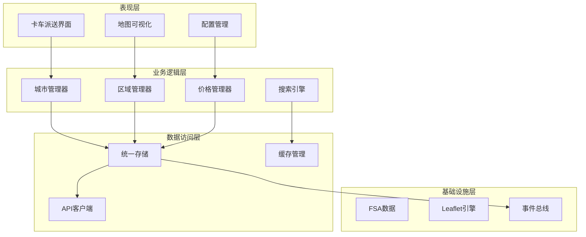
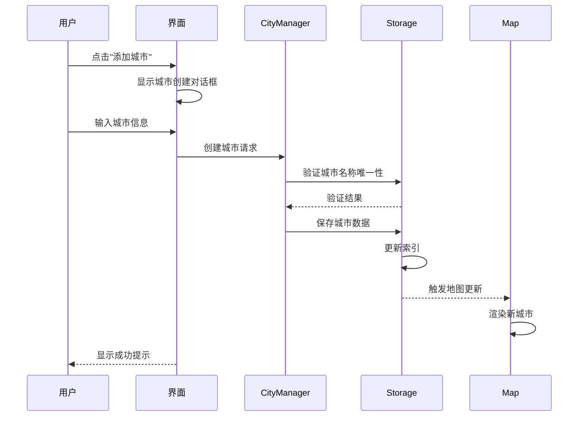
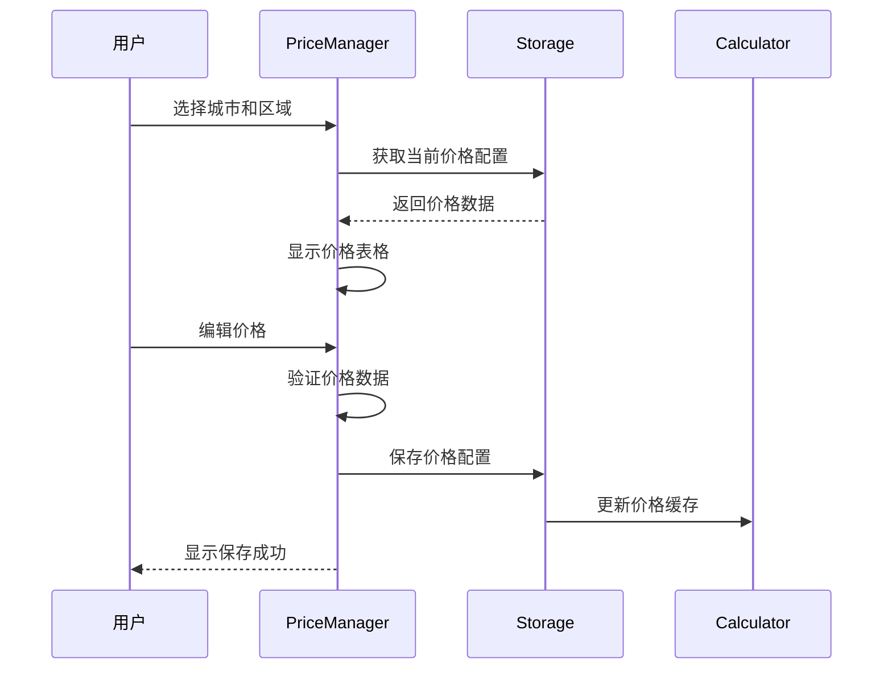

# 卡车派送功能设计文档

## 指导文档对齐

### 与 tech.md 对齐
- **技术栈一致性**: 使用React 18、Vite、Tailwind CSS、Leaflet等现有技术栈
- **存储架构**: 复用unifiedStorage统一存储架构，遵循5MB localStorage限制
- **性能指标**: 页面加载<3秒，地图渲染<5秒，搜索响应<500ms
- **开发规范**: 遵循ES6+语法、函数式编程、组件命名规范

### 与 structure.md 对齐
- **目录结构**: 
  - 城市管理组件: `src/components/cities/`
  - 地图组件: `src/components/maps/TruckDeliveryMap.jsx`
  - 工具函数: `src/utils/storage/cityStorage.js`
  - 页面组件: `src/pages/TruckDelivery/`
- **命名规范**: PascalCase组件名，camelCase工具函数
- **数据模型**: 遵循现有FSA和区域数据结构规范

### 与 product.md 对齐
- **Phase 2目标**: 实现卡车派送、城市管理、分级定价
- **业务目标**: 提升配置效率80%，降低运营成本15%
- **用户体验**: 直观可视化界面，降低培训成本

## 代码复用分析

### 可直接复用的组件
1. **AccurateFSAMap**: 地图渲染核心逻辑，包括FSA边界渲染、缩放控制
2. **AnimatedSearchBox**: 搜索框动画和防抖逻辑
3. **FilterButtonGroup**: 筛选按钮组件
4. **MainLayout**: 整体布局框架
5. **dataUpdateNotifier**: 事件通知系统
6. **unifiedStorage**: 存储管理架构

### 需要扩展的组件
1. **RegionPriceManager**: 
   - 移除价格系数逻辑
   - 改为独立价格表编辑
   - 保留重量区间配置界面
2. **RegionManagementPanel**:
   - 扩展支持10个区域
   - 添加城市关联逻辑

### 新建组件
1. **CityManager**: 城市CRUD管理
2. **CityRegionEditor**: 城市下区域编辑
3. **TruckDeliveryMap**: 卡车派送专用地图
4. **TruckPriceTable**: 独立价格表组件

## 系统架构概述

### 整体架构
卡车派送模块作为独立功能模块集成到现有系统中，复用现有的地图渲染、存储架构和UI组件库。采用分层架构设计：



### 模块间交互
- **松耦合设计**: 通过事件总线(dataUpdateNotifier)实现模块间通信
- **数据一致性**: 使用统一存储架构确保数据同步
- **性能优化**: 使用缓存层减少重复计算

## 数据模型设计

### 城市数据模型
```typescript
interface TruckDeliveryCity {
  id: string;                    // UUID
  name: string;                  // 城市名称
  province: string;              // 省份代码
  themeColor: string;           // 主题色 #RRGGBB
  regions: TruckDeliveryRegion[]; // 区域列表(1-10个)
  isActive: boolean;            // 是否启用
  metadata: {
    createdAt: string;          // ISO时间戳
    updatedAt: string;          // ISO时间戳
    version: number;            // 版本号
    createdBy?: string;         // 创建者
    notes?: string;             // 备注
  };
}
```

### 区域数据模型
```typescript
interface TruckDeliveryRegion {
  id: string;                    // UUID
  cityId: string;                // 关联城市ID
  level: number;                 // 区域等级(1-10，仅用于排序和显示)
  name: string;                  // 区域名称
  fsaCodes: string[];           // FSA代码列表
  priceTable: RegionPriceTable; // 独立价格表(每个重量区间独立定价)
  displayColor?: string;         // 显示颜色(根据等级自动计算)
  boundary?: GeoJSON;            // 区域边界(由FSA聚合)
  metadata: {
    createdAt: string;
    updatedAt: string;
    version: number;
  };
}
```

### 价格配置模型
```typescript
interface RegionPriceTable {
  regionId: string;              // 关联区域ID
  prices: WeightRangePrice[];    // 独立的重量区间价格表
  currency: 'CAD';               // 货币单位
  effectiveDate?: string;        // 生效日期
  expiryDate?: string;          // 失效日期
}

interface WeightRangePrice {
  id: string;                    // range_1 to range_13
  min: number;                   // 最小重量(kg)
  max: number;                   // 最大重量(kg)  
  label: string;                 // 显示标签 (如 "0-11 KGS")
  price: number;                 // 该区间的独立价格(无需系数计算)
  isActive: boolean;             // 是否启用
}
```

### 存储键设计
```javascript
// localStorage键名规范
const STORAGE_KEYS = {
  TRUCK_CITIES: 'truck_delivery_cities',           // 城市列表
  TRUCK_CITY_PREFIX: 'truck_city_',               // 单个城市: truck_city_{id}
  TRUCK_REGION_PREFIX: 'truck_region_',           // 单个区域: truck_region_{id}
  TRUCK_PRICE_PREFIX: 'truck_price_',             // 价格配置: truck_price_{regionId}
  TRUCK_FSA_INDEX: 'truck_fsa_city_index',        // FSA-城市索引
  TRUCK_BACKUP_PREFIX: 'truck_backup_'            // 备份前缀
};
```

## 核心组件设计

### 1. 卡车派送主界面
**组件**: `TruckDeliveryDashboard.jsx`
**职责**: 
- 整合地图、城市列表、配置面板
- 管理全局状态和路由
- 协调子组件交互

**复用组件**:
- MainLayout (布局框架)
- AnimatedSearchBox (搜索框)
- FilterButtonGroup (筛选按钮)

### 2. 城市管理组件
**组件**: `CityManager.jsx`
**职责**:
- 城市CRUD操作
- 城市列表展示和筛选
- 主题色选择器

**状态管理**:
```javascript
const [cities, setCities] = useState([]);
const [selectedCity, setSelectedCity] = useState(null);
const [isEditing, setIsEditing] = useState(false);
const [searchTerm, setSearchTerm] = useState('');
```

### 3. 区域编辑器
**组件**: `CityRegionEditor.jsx`
**职责**:
- 管理城市下的1-10个区域
- FSA分配和冲突检测
- 区域边界可视化

**关键功能**:
- 动态添加/删除区域(最多10个)
- FSA拖拽分配
- 实时冲突检测
- 颜色自动计算

### 4. 卡车派送地图
**组件**: `TruckDeliveryMap.jsx`
**职责**:
- 渲染城市和区域边界
- 处理地图交互
- 显示价格热力图

**复用/扩展**: 基于AccurateFSAMap组件
```javascript
// 继承现有地图功能
import { AccurateFSAMap } from './AccurateFSAMap';

// 扩展渲染逻辑
const renderCityRegions = (city) => {
  return city.regions.map(region => ({
    ...region,
    color: calculateRegionColor(city.themeColor, region.level),
    opacity: calculateOpacity(region.level)
  }));
};
```

### 5. 区域价格管理器
**组件**: `RegionPriceManager.jsx`
**职责**:
- 独立配置每个区域的价格表
- 批量价格导入/导出
- 价格历史记录

**复用**: 基于现有RegionPriceManager组件改造
- 移除价格系数逻辑
- 增加独立价格表编辑
- 保留重量区间配置

### 6. 搜索和定位
**组件**: `TruckDeliverySearch.jsx`
**职责**:
- 邮编/FSA/城市搜索
- 搜索结果高亮
- 地图自动定位

**集成点**:
```javascript
// 复用现有搜索逻辑
import { AnimatedSearchBox } from './AnimatedSearchBox';
import { searchFSAByPostalCode } from '../utils/searchEngine';

// 扩展搜索范围
const searchInTruckDelivery = (query) => {
  // 搜索城市
  const cityResults = searchCities(query);
  // 搜索区域
  const regionResults = searchRegions(query);
  // 搜索FSA
  const fsaResults = searchFSA(query);
  
  return [...cityResults, ...regionResults, ...fsaResults];
};
```

## 服务层设计

### 1. 城市存储服务
**文件**: `src/utils/storage/cityStorage.js`
```javascript
export class CityStorageService {
  // 获取所有城市
  async getAllCities() {
    return await storageService.get(STORAGE_KEYS.TRUCK_CITIES) || [];
  }
  
  // 保存城市
  async saveCity(city) {
    // 验证FSA冲突
    await this.validateFSAConflicts(city);
    // 保存数据
    await storageService.set(`${STORAGE_KEYS.TRUCK_CITY_PREFIX}${city.id}`, city);
    // 更新索引
    await this.updateFSAIndex(city);
    // 触发更新通知
    dataUpdateNotifier.notify('city', city);
  }
  
  // FSA冲突检测
  async validateFSAConflicts(city) {
    const index = await this.getFSAIndex();
    const conflicts = [];
    
    city.regions.forEach(region => {
      region.fsaCodes.forEach(fsa => {
        if (index[fsa] && index[fsa] !== city.id) {
          conflicts.push({ fsa, existingCity: index[fsa] });
        }
      });
    });
    
    if (conflicts.length > 0) {
      throw new FSAConflictError(conflicts);
    }
  }
}
```

### 2. 价格计算服务
**文件**: `src/utils/truck/truckPriceCalculator.js`
```javascript
export class TruckPriceCalculator {
  // 计算配送价格 - 直接查表，无系数计算
  calculatePrice(weight, regionId) {
    const priceTable = this.getPriceTable(regionId);
    const priceEntry = this.findPriceByWeight(weight, priceTable.prices);
    
    if (!priceEntry || !priceEntry.isActive) {
      throw new Error(`No active price for weight ${weight}kg in region ${regionId}`);
    }
    
    // 直接返回该重量区间的独立价格
    return {
      price: priceEntry.price,        // 直接使用配置的价格
      weightRange: priceEntry.label,  // 如 "0-11 KGS"
      regionId: regionId,
      weight: weight
    };
  }
  
  // 查找重量对应的价格
  findPriceByWeight(weight, prices) {
    return prices.find(p => weight >= p.min && weight <= p.max);
  }
  
  // 批量计算
  calculateBulkPrices(items, regionId) {
    return items.map(item => ({
      ...item,
      ...this.calculatePrice(item.weight, regionId)
    }));
  }
}
```

### 3. 地图数据服务
**文件**: `src/utils/storage/truckMapDataService.js`
```javascript
export class TruckMapDataService {
  // 构建城市地图数据
  async buildCityMapData(cityId) {
    const city = await cityStorage.getCity(cityId);
    const fsaBoundaries = await this.loadFSABoundaries(city);
    
    return {
      type: 'FeatureCollection',
      features: city.regions.map(region => ({
        type: 'Feature',
        properties: {
          regionId: region.id,
          regionName: region.name,
          level: region.level,
          cityId: city.id,
          cityName: city.name,
          color: this.calculateColor(city.themeColor, region.level)
        },
        geometry: this.mergeGeometries(
          region.fsaCodes.map(fsa => fsaBoundaries[fsa])
        )
      }))
    };
  }
  
  // 颜色计算
  calculateColor(baseColor, level) {
    // 根据等级调整颜色深浅
    const opacity = 0.2 + (level / 10) * 0.7; // 0.2-0.9
    return { color: baseColor, opacity };
  }
}
```

## 用户界面设计

### 页面布局
```
┌──────────────────────────────────────────────┐
│                  顶部导航栏                    │
├──────────────┬───────────────────────────────┤
│              │                               │
│   城市列表    │          地图视图              │
│              │                               │
│   [搜索框]    │      [城市/区域边界渲染]       │
│              │                               │
│   城市1 🟢    │                               │
│   城市2 🔵    │      [价格热力图叠加]          │
│   城市3 🟡    │                               │
│              │                               │
│   [+添加城市]  │      [缩放/平移控制]          │
│              │                               │
├──────────────┴───────────────────────────────┤
│          底部配置面板 (可折叠)                  │
│  [区域管理] [价格设置] [导入导出] [统计分析]     │
└──────────────────────────────────────────────┘
```

### 交互流程

#### 创建城市流程


#### 配置区域价格流程


## 性能优化策略

### 地图渲染优化
1. **视口剔除**: 只渲染可见区域的FSA
2. **分级加载**: 根据缩放级别加载不同精度的边界
3. **边界简化**: 使用Douglas-Peucker算法简化多边形
4. **WebWorker**: 在后台线程处理大量地理数据

```javascript
// 视口剔除实现
const filterVisibleRegions = (regions, mapBounds) => {
  return regions.filter(region => {
    const regionBounds = L.geoJSON(region.boundary).getBounds();
    return mapBounds.intersects(regionBounds);
  });
};
```

### 数据缓存策略
1. **多级缓存**: 内存 > localStorage > API
2. **增量更新**: 只同步变更的数据
3. **压缩存储**: 使用LZ-string压缩大数据
4. **过期策略**: 自动清理过期缓存

```javascript
// 缓存管理
class CacheManager {
  constructor() {
    this.memCache = new Map();
    this.maxMemSize = 50; // 50MB
  }
  
  get(key) {
    // 先查内存
    if (this.memCache.has(key)) {
      return this.memCache.get(key);
    }
    // 再查localStorage
    const stored = localStorage.getItem(key);
    if (stored) {
      const data = JSON.parse(stored);
      // 加入内存缓存
      this.memCache.set(key, data);
      return data;
    }
    return null;
  }
}
```

### 搜索性能优化
1. **索引构建**: 预构建FSA和邮编索引
2. **防抖处理**: 搜索输入防抖300ms
3. **结果缓存**: 缓存最近搜索结果
4. **模糊匹配**: 使用Trie树加速前缀搜索

## 错误处理策略

### 错误分类和处理
```javascript
// 业务逻辑错误
class FSAConflictError extends Error {
  constructor(conflicts) {
    super('FSA codes already assigned to other cities');
    this.name = 'FSAConflictError';
    this.conflicts = conflicts;
    this.recoverable = true;
  }
}

// 存储错误
class StorageQuotaError extends Error {
  constructor(required, available) {
    super(`Storage quota exceeded: need ${required}MB, have ${available}MB`);
    this.name = 'StorageQuotaError';
    this.required = required;
    this.available = available;
    this.recoverable = false;
  }
}

// 数据验证错误
class ValidationError extends Error {
  constructor(field, value, rule) {
    super(`Validation failed for ${field}: ${rule}`);
    this.name = 'ValidationError';
    this.field = field;
    this.value = value;
    this.rule = rule;
    this.recoverable = true;
  }
}
```

### 全局错误处理器
```javascript
// src/utils/truck/errorHandler.js
export const handleTruckDeliveryError = (error, context) => {
  console.error(`Error in ${context}:`, error);
  
  if (error.recoverable) {
    // 可恢复错误：提示用户并提供解决方案
    showNotification({
      type: 'warning',
      message: error.message,
      action: getRecoveryAction(error)
    });
  } else {
    // 不可恢复错误：记录日志并降级处理
    logError(error, context);
    fallbackToSafeState();
  }
};
```

### 错误恢复策略
1. **API调用重试**: 指数退避算法，最多重试3次
2. **数据验证失败**: 保留用户输入，高亮错误字段
3. **存储配额超限**: 自动清理过期数据或提示用户
4. **FSA冲突**: 显示冲突详情，提供解决选项

## 安全考虑

### 数据保护
1. **价格混淆**: 敏感价格数据使用简单混淆
2. **操作日志**: 记录关键操作到sessionStorage
3. **权限控制**: 基于配置的功能访问控制
4. **输入验证**: 严格验证用户输入

```javascript
// 价格数据混淆
const obfuscatePrice = (price) => {
  return btoa(String(price).split('').reverse().join(''));
};

const deobfuscatePrice = (obfuscated) => {
  return Number(atob(obfuscated).split('').reverse().join(''));
};
```

## 完整测试策略

### 单元测试
**覆盖率目标**: 80%

**关键测试点**:
```javascript
// src/utils/truck/__tests__/truckPriceCalculator.test.js
describe('TruckPriceCalculator', () => {
  test('should return correct price for weight range', () => {
    const calculator = new TruckPriceCalculator();
    const result = calculator.calculatePrice(10, 'region-1');
    expect(result.price).toBe(15.99);
    expect(result.weightRange).toBe('0-11 KGS');
  });
  
  test('should throw error for invalid weight', () => {
    const calculator = new TruckPriceCalculator();
    expect(() => calculator.calculatePrice(-1, 'region-1')).toThrow();
  });
});

// src/utils/truck/__tests__/cityStorage.test.js
describe('CityStorageService', () => {
  test('should detect FSA conflicts', async () => {
    const service = new CityStorageService();
    const city = { id: 'city-1', regions: [{ fsaCodes: ['M5V'] }] };
    await expect(service.validateFSAConflicts(city)).rejects.toThrow(FSAConflictError);
  });
});
```

### 集成测试
**测试场景**:
1. **城市创建流程**
   - 创建城市 → 添加区域 → 分配FSA → 设置价格
   - 验证数据持久化和地图更新

2. **价格配置流程**
   - 选择区域 → 编辑价格表 → 保存 → 验证计算
   - 测试批量导入和导出

3. **搜索定位流程**
   - 输入邮编 → 搜索 → 验证结果 → 地图定位
   - 测试模糊搜索和自动完成

### E2E测试
```javascript
// cypress/e2e/truck-delivery.cy.js
describe('Truck Delivery Feature', () => {
  it('should create city with regions', () => {
    cy.visit('/truck-delivery');
    cy.get('[data-cy=add-city]').click();
    cy.get('[data-cy=city-name]').type('Toronto');
    cy.get('[data-cy=save-city]').click();
    cy.get('[data-cy=city-list]').should('contain', 'Toronto');
  });
});
```

### 性能测试基准
- **地图渲染**: 20个城市 < 5秒 (与tech.md一致)
- **搜索响应**: 1000个FSA < 500ms
- **价格计算**: 1000次查表 < 100ms
- **数据加载**: 5MB数据 < 2秒

## 部署和迁移

### 部署清单
1. 创建新路由 `/truck-delivery`
2. 添加导航菜单项
3. 初始化存储结构
4. 迁移现有FSA数据（如需要）

### 数据迁移策略
```javascript
// 从现有区域数据迁移到卡车派送
const migrateExistingRegions = async () => {
  const existingRegions = await getAllRegionConfigs();
  const cities = [];
  
  // 转换为城市-区域结构
  Object.values(existingRegions).forEach(region => {
    if (region.fsaCodes && region.fsaCodes.length > 0) {
      // 创建虚拟城市
      cities.push({
        id: generateId(),
        name: `迁移区域 ${region.id}`,
        regions: [{
          level: 1,
          fsaCodes: region.fsaCodes,
          priceConfig: region.weightRanges
        }]
      });
    }
  });
  
  return cities;
};
```

## 未来扩展

### 计划功能
1. **路线优化**: 集成路线规划算法
2. **实时追踪**: WebSocket实时更新配送状态
3. **移动端**: React Native移动应用
4. **API开放**: 对外提供价格查询API

### 扩展接口预留
```javascript
// 预留扩展接口
export interface TruckDeliveryExtensions {
  // 路线优化
  routeOptimizer?: IRouteOptimizer;
  // 实时追踪
  trackingService?: ITrackingService;
  // 第三方集成
  integrations?: IIntegration[];
}
```

## 总结

本设计文档定义了卡车派送功能的完整技术架构，充分复用现有组件和基础设施，同时保持模块独立性。通过分层架构、事件驱动和缓存优化，确保系统的可扩展性和高性能。独立的价格配置体系提供了最大的灵活性，满足复杂的业务需求。