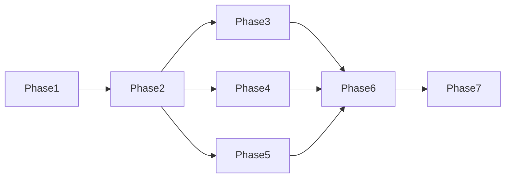

# 卡车派送功能任务列表

## 指导文档合规性
- 所有任务遵循 tech.md 的技术栈要求
- 文件组织符合 structure.md 规范
- 实现 product.md 中 Phase 2 的目标

## 原子任务要求
每个任务必须满足：
- **文件范围**: 1-3个相关文件
- **时间限制**: 15-30分钟完成
- **单一目的**: 一个可测试的结果
- **具体文件**: 明确指定要修改的文件
- **Agent友好**: 清晰的输入输出，最小化上下文切换

## 任务格式指南
```
- [ ] N. 任务简述
  - File: 具体文件路径
  - Action: 创建/修改/扩展
  - Details: 具体实现内容
  - _Leverage: 可复用的现有代码_
  - _Requirements: 关联的需求编号_
```

## 任务概览
将卡车派送功能实现分解为48个原子任务，分为7个阶段逐步实现。

## Phase 1: 基础设施搭建 (5个任务)

- [ ] 1. Add truck delivery route to router configuration
  - File: src/router/index.jsx
  - Action: Modify
  - Details: Add route path '/truck-delivery' with lazy loading
  - _Leverage: Existing router structure, React Router v7_
  - _Requirements: US-001_

- [ ] 2. Add truck delivery navigation menu item
  - File: src/layouts/MainLayout.jsx
  - Action: Modify
  - Details: Add navigation item with Truck icon from lucide-react
  - _Leverage: Existing navigation array structure_
  - _Requirements: US-001_

- [ ] 3. Create truck delivery main page component
  - File: src/pages/TruckDelivery/index.jsx
  - Action: Create
  - Details: Basic page structure with city list and map areas
  - _Leverage: MainLayout, Tailwind CSS cyber theme_
  - _Requirements: US-001, US-004_

- [ ] 4. Create city view page component
  - File: src/pages/TruckDelivery/CityView.jsx
  - Action: Create
  - Details: City details display with regions list
  - _Leverage: Existing page patterns from Settings pages_
  - _Requirements: US-001, US-002_

- [ ] 5. Create component directories for cities management
  - File: src/components/cities/ (directory)
  - Action: Create
  - Details: Create cities components directory structure
  - _Leverage: None_
  - _Requirements: US-001_

## Phase 2: 数据模型和存储 (8个任务)

- [ ] 6. Define truck delivery data types
  - File: src/utils/storage/truckDeliveryTypes.js
  - Action: Create
  - Details: Define TruckDeliveryCity, TruckDeliveryRegion, RegionPriceTable interfaces
  - _Leverage: Existing region data structures_
  - _Requirements: US-001, US-002_

- [ ] 7. Create city storage service with basic structure
  - File: src/utils/storage/cityStorage.js
  - Action: Create
  - Details: CityStorageService class with localStorage keys setup
  - _Leverage: unifiedStorage.js patterns, storageService.js_
  - _Requirements: US-001_

- [ ] 8. Implement getAllCities and getCity methods
  - File: src/utils/storage/cityStorage.js
  - Action: Modify
  - Details: Add methods to retrieve all cities or single city by ID
  - _Leverage: localStorage getItem/setItem patterns_
  - _Requirements: US-001_

- [ ] 9. Implement saveCity and deleteCity methods
  - File: src/utils/storage/cityStorage.js
  - Action: Modify
  - Details: Add methods for city creation, update, and deletion
  - _Leverage: dataUpdateNotifier for change events_
  - _Requirements: US-001_

- [ ] 10. Implement FSA conflict detection logic
  - File: src/utils/storage/cityStorage.js
  - Action: Modify
  - Details: Add validateFSAConflicts method to check FSA uniqueness
  - _Leverage: Existing FSA data from deliverableFSA.js_
  - _Requirements: US-002_

- [ ] 11. Create FSA index management methods
  - File: src/utils/storage/cityStorage.js
  - Action: Modify
  - Details: Add updateFSAIndex and getFSAIndex for fast lookups
  - _Leverage: None_
  - _Requirements: US-002, US-005_

- [ ] 12. Create price table storage service
  - File: src/utils/storage/truckPriceStorage.js
  - Action: Create
  - Details: Service for storing/retrieving region price tables
  - _Leverage: DEFAULT_WEIGHT_RANGES from unifiedStorage.js_
  - _Requirements: US-003_

- [ ] 13. Create error handler with custom error classes
  - File: src/utils/truck/errorHandler.js
  - Action: Create
  - Details: Define FSAConflictError, ValidationError, StorageQuotaError
  - _Leverage: None_
  - _Requirements: US-002, NFR-002_

## Phase 3: 城市管理功能 (8个任务)

### 3.1 城市管理器组件
- [ ] **TASK-014**: 创建 `src/components/cities/CityManager.jsx` 基础结构
  - 文件: `src/components/cities/CityManager.jsx`
  - 需求: US-001
  - 包含: 城市列表、搜索框、添加按钮

- [ ] **TASK-015**: 在 `CityManager.jsx` 实现城市列表展示
  - 文件: `src/components/cities/CityManager.jsx`
  - 需求: US-001
  - 复用: Tailwind样式

- [ ] **TASK-016**: 在 `CityManager.jsx` 实现城市搜索筛选
  - 文件: `src/components/cities/CityManager.jsx`
  - 需求: US-005
  - 复用: AnimatedSearchBox

### 3.2 城市编辑对话框
- [ ] **TASK-017**: 创建 `src/components/cities/CityEditDialog.jsx` 城市编辑对话框
  - 文件: `src/components/cities/CityEditDialog.jsx`
  - 需求: US-001
  - 包含: 名称、省份、主题色输入

- [ ] **TASK-018**: 在 `CityEditDialog.jsx` 实现主题色选择器
  - 文件: `src/components/cities/CityEditDialog.jsx`
  - 需求: US-001
  - 使用: HTML5 color picker

- [ ] **TASK-019**: 在 `CityEditDialog.jsx` 添加表单验证
  - 文件: `src/components/cities/CityEditDialog.jsx`
  - 需求: US-001
  - 验证: 城市名称唯一性

### 3.3 城市CRUD集成
- [ ] **TASK-020**: 在 `CityManager.jsx` 集成创建城市功能
  - 文件: `src/components/cities/CityManager.jsx`
  - 需求: US-001
  - 调用: cityStorage.saveCity

- [ ] **TASK-021**: 在 `CityManager.jsx` 集成编辑和删除功能
  - 文件: `src/components/cities/CityManager.jsx`
  - 需求: US-001
  - 包含: 确认对话框

## Phase 4: 区域管理功能 (8个任务)

### 4.1 区域编辑器
- [ ] **TASK-022**: 创建 `src/components/cities/CityRegionEditor.jsx` 区域编辑器
  - 文件: `src/components/cities/CityRegionEditor.jsx`
  - 需求: US-002
  - 支持: 1-10个区域配置

- [ ] **TASK-023**: 在 `CityRegionEditor.jsx` 实现动态区域添加/删除
  - 文件: `src/components/cities/CityRegionEditor.jsx`
  - 需求: US-002
  - 限制: 最多10个区域

- [ ] **TASK-024**: 在 `CityRegionEditor.jsx` 实现区域等级设置
  - 文件: `src/components/cities/CityRegionEditor.jsx`
  - 需求: US-002
  - 显示: 1-10级别选择

### 4.2 FSA分配
- [ ] **TASK-025**: 创建 `src/components/cities/FSASelector.jsx` FSA选择器组件
  - 文件: `src/components/cities/FSASelector.jsx`
  - 需求: US-002
  - 复用: 现有FSA数据

- [ ] **TASK-026**: 在 `FSASelector.jsx` 实现FSA多选功能
  - 文件: `src/components/cities/FSASelector.jsx`
  - 需求: US-002
  - 包含: 搜索和筛选

- [ ] **TASK-027**: 在 `FSASelector.jsx` 实现FSA冲突检测提示
  - 文件: `src/components/cities/FSASelector.jsx`
  - 需求: US-002, FR-002
  - 显示: 冲突的城市名称

### 4.3 区域保存
- [ ] **TASK-028**: 在 `CityRegionEditor.jsx` 集成区域保存功能
  - 文件: `src/components/cities/CityRegionEditor.jsx`
  - 需求: US-002
  - 调用: cityStorage.saveCity

- [ ] **TASK-029**: 在 `CityRegionEditor.jsx` 添加区域验证逻辑
  - 文件: `src/components/cities/CityRegionEditor.jsx`
  - 需求: US-002
  - 验证: FSA冲突、名称必填

## Phase 5: 价格配置功能 (7个任务)

### 5.1 价格表组件
- [ ] **TASK-030**: 创建 `src/components/cities/TruckPriceTable.jsx` 独立价格表组件
  - 文件: `src/components/cities/TruckPriceTable.jsx`
  - 需求: US-003, FR-003
  - 显示: 13个重量区间

- [ ] **TASK-031**: 在 `TruckPriceTable.jsx` 实现价格编辑功能
  - 文件: `src/components/cities/TruckPriceTable.jsx`
  - 需求: US-003
  - 支持: 每个区间独立定价

- [ ] **TASK-032**: 在 `TruckPriceTable.jsx` 添加价格验证
  - 文件: `src/components/cities/TruckPriceTable.jsx`
  - 需求: US-003
  - 验证: 正数、格式

### 5.2 价格管理集成
- [ ] **TASK-033**: 创建 `src/components/cities/RegionPriceManager.jsx` 区域价格管理器
  - 文件: `src/components/cities/RegionPriceManager.jsx`
  - 需求: US-003
  - 扩展: 现有RegionPriceManager

- [ ] **TASK-034**: 在 `RegionPriceManager.jsx` 集成独立价格表
  - 文件: `src/components/cities/RegionPriceManager.jsx`
  - 需求: US-003
  - 移除: 价格系数逻辑

### 5.3 价格计算服务
- [ ] **TASK-035**: 创建 `src/utils/truck/truckPriceCalculator.js` 价格计算器
  - 文件: `src/utils/truck/truckPriceCalculator.js`
  - 需求: FR-003
  - 实现: 直接查表逻辑

- [ ] **TASK-036**: 在价格计算器中实现批量计算功能
  - 文件: `src/utils/truck/truckPriceCalculator.js`
  - 需求: US-003
  - 方法: calculateBulkPrices

## Phase 6: 地图可视化 (6个任务)

### 6.1 卡车派送地图
- [ ] **TASK-037**: 创建 `src/components/maps/TruckDeliveryMap.jsx` 地图组件
  - 文件: `src/components/maps/TruckDeliveryMap.jsx`
  - 需求: US-004
  - 复用: AccurateFSAMap

- [ ] **TASK-038**: 在地图组件中实现城市边界渲染
  - 文件: `src/components/maps/TruckDeliveryMap.jsx`
  - 需求: US-004
  - 使用: 城市主题色

- [ ] **TASK-039**: 在地图组件中实现区域分级显示
  - 文件: `src/components/maps/TruckDeliveryMap.jsx`
  - 需求: US-004
  - 显示: 1-10级渐进色调

### 6.2 地图交互
- [ ] **TASK-040**: 实现城市选择和聚焦功能
  - 文件: `src/components/maps/TruckDeliveryMap.jsx`
  - 需求: US-004
  - 功能: 点击城市自动缩放

- [ ] **TASK-041**: 创建 `src/utils/storage/truckMapDataService.js` 地图数据服务
  - 文件: `src/utils/storage/truckMapDataService.js`
  - 需求: US-004
  - 功能: 构建GeoJSON数据

- [ ] **TASK-042**: 实现地图性能优化
  - 文件: `src/components/maps/TruckDeliveryMap.jsx`
  - 需求: NFR-001
  - 优化: 视口剔除、边界简化

## Phase 7: 搜索和导入导出 (4个任务)

### 7.1 搜索功能
- [ ] **TASK-043**: 创建 `src/components/cities/TruckDeliverySearch.jsx` 搜索组件
  - 文件: `src/components/cities/TruckDeliverySearch.jsx`
  - 需求: US-005
  - 复用: AnimatedSearchBox

- [ ] **TASK-044**: 实现邮编/FSA/城市搜索逻辑
  - 文件: `src/components/cities/TruckDeliverySearch.jsx`
  - 需求: US-005
  - 功能: 模糊匹配、自动完成

### 7.2 导入导出
- [ ] **TASK-045**: 创建 `src/utils/truck/importExportService.js` 导入导出服务
  - 文件: `src/utils/truck/importExportService.js`
  - 需求: US-006
  - 格式: JSON导入导出

- [ ] **TASK-046**: 在主界面集成导入导出功能
  - 文件: `src/pages/TruckDelivery/index.jsx`
  - 需求: US-006
  - 包含: 文件选择、下载

## 任务执行顺序建议

1. **基础设施优先**: 先完成Phase 1，建立基本页面结构
2. **数据层其次**: Phase 2确保数据存储稳定
3. **功能逐步添加**: Phase 3-6按顺序实现各功能模块
4. **搜索导出最后**: Phase 7完善用户体验

## 任务依赖关系



## 预计工作量

- **Phase 1**: 2小时 (基础搭建)
- **Phase 2**: 3小时 (数据模型)
- **Phase 3**: 4小时 (城市管理)
- **Phase 4**: 4小时 (区域管理)
- **Phase 5**: 3小时 (价格配置)
- **Phase 6**: 4小时 (地图可视化)
- **Phase 7**: 2小时 (搜索导出)

**总计**: 约22小时开发时间

## 测试要求

每个任务完成后需要进行：
1. **功能测试**: 验证功能是否按需求工作
2. **集成测试**: 验证与其他模块的集成
3. **性能测试**: 确保满足性能指标

## 风险点

1. **FSA冲突检测**: 需要仔细处理边界情况
2. **地图性能**: 大量区域渲染可能影响性能
3. **存储限制**: 注意5MB localStorage限制
4. **数据迁移**: 需要考虑现有数据兼容性