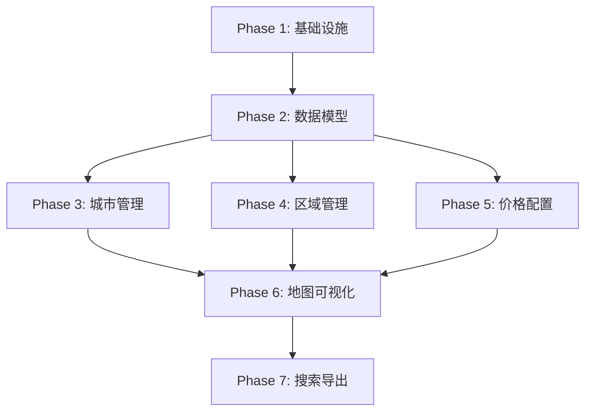

# 卡车派送功能任务列表

## 指导文档合规性
- 所有任务遵循 tech.md 的技术栈要求
- 文件组织符合 structure.md 规范  
- 实现 product.md 中 Phase 2 的目标

## 原子任务要求
每个任务必须满足：
- **文件范围**: 1-3个相关文件
- **时间限制**: 15-30分钟完成
- **单一目的**: 一个可测试的结果
- **具体文件**: 明确指定要修改的文件
- **Agent友好**: 清晰的输入输出，最小化上下文切换

## 任务概览
将卡车派送功能实现分解为52个原子任务，分为7个阶段逐步实现。

## Phase 1: 基础设施搭建 (5个任务) ✅

- [x] 1. Add truck delivery route to router configuration
  - File: src/router/index.jsx
  - Action: Modify
  - Details: Add route path '/truck-delivery' with lazy loading
  - _Leverage: Existing router structure, React Router v7_
  - _Requirements: US-001_

- [x] 2. Add truck delivery navigation menu item
  - File: src/layouts/MainLayout.jsx
  - Action: Modify
  - Details: Add navigation item with Truck icon from lucide-react
  - _Leverage: Existing navigation array structure_
  - _Requirements: US-001_

- [x] 3. Create truck delivery main page component
  - File: src/pages/TruckDelivery/index.jsx
  - Action: Create
  - Details: Basic page structure with city list and map areas
  - _Leverage: MainLayout, Tailwind CSS cyber theme_
  - _Requirements: US-001, US-004_

- [x] 4. Create city view page component
  - File: src/pages/TruckDelivery/CityView.jsx
  - Action: Create
  - Details: City details display with regions list
  - _Leverage: Existing page patterns from Settings pages_
  - _Requirements: US-001, US-002_

- [x] 5. Create component directories for cities management
  - File: src/components/cities/ (directory)
  - Action: Create
  - Details: Create cities components directory structure
  - _Leverage: None_
  - _Requirements: US-001_

## Phase 2: 数据模型和存储 (8个任务)

- [x] 6. Define truck delivery data types
  - File: src/utils/storage/truckDeliveryTypes.js
  - Action: Create
  - Details: Define TruckDeliveryCity, TruckDeliveryRegion, RegionPriceTable types
  - _Leverage: Existing region data structures_
  - _Requirements: US-001, US-002_

- [x] 7. Create city storage service with basic structure
  - File: src/utils/storage/cityStorage.js
  - Action: Create
  - Details: CityStorageService class with localStorage keys setup
  - _Leverage: unifiedStorage.js patterns, storageService.js_
  - _Requirements: US-001_

- [x] 8. Implement getAllCities and getCity methods
  - File: src/utils/storage/cityStorage.js
  - Action: Modify
  - Details: Add methods to retrieve all cities or single city by ID
  - _Leverage: localStorage getItem/setItem patterns_
  - _Requirements: US-001_

- [x] 9. Implement saveCity and deleteCity methods
  - File: src/utils/storage/cityStorage.js
  - Action: Modify
  - Details: Add methods for city creation, update, and deletion
  - _Leverage: dataUpdateNotifier for change events_
  - _Requirements: US-001_

- [x] 10. Implement FSA conflict detection logic
  - File: src/utils/storage/cityStorage.js
  - Action: Modify
  - Details: Add validateFSAConflicts method to check FSA uniqueness
  - _Leverage: Existing FSA data from deliverableFSA.js_
  - _Requirements: US-002_

- [x] 11. Create FSA index management methods
  - File: src/utils/storage/cityStorage.js
  - Action: Modify
  - Details: Add updateFSAIndex and getFSAIndex for fast lookups
  - _Leverage: None_
  - _Requirements: US-002, US-005_

- [x] 12. Create price table storage service
  - File: src/utils/storage/truckPriceStorage.js
  - Action: Create
  - Details: Service for storing/retrieving region price tables
  - _Leverage: DEFAULT_WEIGHT_RANGES from unifiedStorage.js_
  - _Requirements: US-003_

- [x] 13. Create error handler with custom error classes
  - File: src/utils/truck/errorHandler.js
  - Action: Create
  - Details: Define FSAConflictError, ValidationError, StorageQuotaError
  - _Leverage: None_
  - _Requirements: US-002, NFR-002_

## Phase 3: 城市管理功能 (9个任务)

- [ ] 14. Create CityManager component structure
  - File: src/components/cities/CityManager.jsx
  - Action: Create
  - Details: Component with state for cities list, search, selected city
  - _Leverage: React hooks, Tailwind CSS_
  - _Requirements: US-001_

- [ ] 15. Implement city list rendering in CityManager
  - File: src/components/cities/CityManager.jsx
  - Action: Modify
  - Details: Map cities array to list items with theme color indicators
  - _Leverage: Framer Motion for animations_
  - _Requirements: US-001_

- [ ] 16. Add city search functionality
  - File: src/components/cities/CityManager.jsx
  - Action: Modify
  - Details: Integrate search with city name/province filtering
  - _Leverage: AnimatedSearchBox component_
  - _Requirements: US-001, US-005_

- [ ] 17. Create CityEditDialog component
  - File: src/components/cities/CityEditDialog.jsx
  - Action: Create
  - Details: Modal dialog with form fields for city properties
  - _Leverage: Existing dialog patterns_
  - _Requirements: US-001_

- [ ] 18. Add color picker to CityEditDialog
  - File: src/components/cities/CityEditDialog.jsx
  - Action: Modify
  - Details: HTML5 color input with preview
  - _Leverage: None_
  - _Requirements: US-001_

- [ ] 19. Implement city name validation
  - File: src/components/cities/CityEditDialog.jsx
  - Action: Modify
  - Details: Check uniqueness before save, show error message
  - _Leverage: cityStorage.getAllCities()_
  - _Requirements: US-001_

- [ ] 20. Connect CityManager to storage service
  - File: src/components/cities/CityManager.jsx
  - Action: Modify
  - Details: Load cities on mount, save on create/edit
  - _Leverage: cityStorage service methods_
  - _Requirements: US-001_

- [ ] 21. Add city deletion with confirmation
  - File: src/components/cities/CityManager.jsx
  - Action: Modify
  - Details: Delete button with confirm dialog
  - _Leverage: None_
  - _Requirements: US-001_

- [ ] 22. Subscribe to data update events
  - File: src/components/cities/CityManager.jsx
  - Action: Modify
  - Details: Listen for city changes via dataUpdateNotifier
  - _Leverage: dataUpdateNotifier.subscribe()_
  - _Requirements: US-001_

## Phase 4: 区域管理功能 (10个任务)

- [ ] 23. Create CityRegionEditor component
  - File: src/components/cities/CityRegionEditor.jsx
  - Action: Create
  - Details: Component for managing 1-10 regions per city
  - _Leverage: React hooks for state_
  - _Requirements: US-002_

- [ ] 24. Implement dynamic region list
  - File: src/components/cities/CityRegionEditor.jsx
  - Action: Modify
  - Details: Add/remove regions with max 10 limit
  - _Leverage: Array state management_
  - _Requirements: US-002_

- [ ] 25. Add region level selector
  - File: src/components/cities/CityRegionEditor.jsx
  - Action: Modify
  - Details: Dropdown for levels 1-10, auto-assign colors
  - _Leverage: None_
  - _Requirements: US-002_

- [ ] 26. Create FSASelector component structure
  - File: src/components/cities/FSASelector.jsx
  - Action: Create
  - Details: Modal with searchable FSA list
  - _Leverage: deliverableFSA.js data_
  - _Requirements: US-002_

- [ ] 27. Implement FSA multi-select checkboxes
  - File: src/components/cities/FSASelector.jsx
  - Action: Modify
  - Details: Checkbox list with select all option
  - _Leverage: None_
  - _Requirements: US-002_

- [ ] 28. Add FSA search and filter
  - File: src/components/cities/FSASelector.jsx
  - Action: Modify
  - Details: Filter FSAs by code or province
  - _Leverage: Existing search patterns_
  - _Requirements: US-002_

- [ ] 29. Implement FSA conflict detection UI
  - File: src/components/cities/FSASelector.jsx
  - Action: Modify
  - Details: Highlight conflicted FSAs, show owning city
  - _Leverage: cityStorage.validateFSAConflicts()_
  - _Requirements: US-002_

- [ ] 30. Connect region editor to city data
  - File: src/components/cities/CityRegionEditor.jsx
  - Action: Modify
  - Details: Load/save regions as part of city object
  - _Leverage: cityStorage.saveCity()_
  - _Requirements: US-002_

- [ ] 31. Add region validation before save
  - File: src/components/cities/CityRegionEditor.jsx
  - Action: Modify
  - Details: Validate required fields, FSA conflicts
  - _Leverage: errorHandler.js classes_
  - _Requirements: US-002_

- [ ] 32. Implement region color calculation
  - File: src/components/cities/CityRegionEditor.jsx
  - Action: Modify
  - Details: Calculate opacity based on level (0.2-0.9)
  - _Leverage: None_
  - _Requirements: US-004_

## Phase 5: 价格配置功能 (8个任务)

- [ ] 33. Create TruckPriceTable component
  - File: src/components/cities/TruckPriceTable.jsx
  - Action: Create
  - Details: Table with 13 weight ranges and price inputs
  - _Leverage: DEFAULT_WEIGHT_RANGES structure_
  - _Requirements: US-003_

- [ ] 34. Implement price input fields
  - File: src/components/cities/TruckPriceTable.jsx
  - Action: Modify
  - Details: Number inputs for each weight range
  - _Leverage: None_
  - _Requirements: US-003_

- [ ] 35. Add price validation
  - File: src/components/cities/TruckPriceTable.jsx
  - Action: Modify
  - Details: Validate positive numbers, show errors
  - _Leverage: ValidationError from errorHandler.js_
  - _Requirements: US-003_

- [ ] 36. Create RegionPriceManager for truck delivery
  - File: src/components/cities/RegionPriceManager.jsx
  - Action: Create
  - Details: Wrapper component for region price management
  - _Leverage: Existing RegionPriceManager patterns_
  - _Requirements: US-003_

- [ ] 37. Integrate TruckPriceTable into RegionPriceManager
  - File: src/components/cities/RegionPriceManager.jsx
  - Action: Modify
  - Details: Replace coefficient logic with price table
  - _Leverage: TruckPriceTable component_
  - _Requirements: US-003_

- [ ] 38. Create truck price calculator service
  - File: src/utils/truck/truckPriceCalculator.js
  - Action: Create
  - Details: Class with calculatePrice method using direct lookup
  - _Leverage: None_
  - _Requirements: US-003_

- [ ] 39. Implement findPriceByWeight method
  - File: src/utils/truck/truckPriceCalculator.js
  - Action: Modify
  - Details: Find price entry for given weight
  - _Leverage: Array.find()_
  - _Requirements: US-003_

- [ ] 40. Add bulk price calculation
  - File: src/utils/truck/truckPriceCalculator.js
  - Action: Modify
  - Details: calculateBulkPrices for multiple items
  - _Leverage: Array.map()_
  - _Requirements: US-003_

## Phase 6: 地图可视化 (8个任务)

- [ ] 41. Create TruckDeliveryMap component
  - File: src/components/maps/TruckDeliveryMap.jsx
  - Action: Create
  - Details: Map component extending AccurateFSAMap
  - _Leverage: AccurateFSAMap, React Leaflet_
  - _Requirements: US-004_

- [ ] 42. Implement city boundary rendering
  - File: src/components/maps/TruckDeliveryMap.jsx
  - Action: Modify
  - Details: Render city regions with theme colors
  - _Leverage: GeoJSON from Leaflet_
  - _Requirements: US-004_

- [ ] 43. Add region opacity based on level
  - File: src/components/maps/TruckDeliveryMap.jsx
  - Action: Modify
  - Details: Calculate opacity 0.2-0.9 for levels 1-10
  - _Leverage: None_
  - _Requirements: US-004_

- [ ] 44. Implement city click and zoom
  - File: src/components/maps/TruckDeliveryMap.jsx
  - Action: Modify
  - Details: Click city to zoom and center
  - _Leverage: Leaflet map.fitBounds()_
  - _Requirements: US-004_

- [ ] 45. Create map data service
  - File: src/utils/storage/truckMapDataService.js
  - Action: Create
  - Details: Service to build GeoJSON from city data
  - _Leverage: FSA boundary data_
  - _Requirements: US-004_

- [ ] 46. Implement FSA boundary merging
  - File: src/utils/storage/truckMapDataService.js
  - Action: Modify
  - Details: Merge FSA polygons for regions
  - _Leverage: GeoJSON utilities_
  - _Requirements: US-004_

- [ ] 47. Add viewport culling optimization
  - File: src/components/maps/TruckDeliveryMap.jsx
  - Action: Modify
  - Details: Only render visible regions
  - _Leverage: Leaflet getBounds()_
  - _Requirements: NFR-001_

- [ ] 48. Implement boundary simplification
  - File: src/utils/storage/truckMapDataService.js
  - Action: Modify
  - Details: Simplify polygons for performance
  - _Leverage: Douglas-Peucker algorithm_
  - _Requirements: NFR-001_

## Phase 7: 搜索和导入导出 (4个任务)

- [x] 49. Create TruckDeliverySearch component
  - File: src/components/cities/TruckDeliverySearch.jsx
  - Action: Create
  - Details: Search box for postal codes, FSAs, cities
  - _Leverage: AnimatedSearchBox_
  - _Requirements: US-005_

- [x] 50. Implement search logic
  - File: src/components/cities/TruckDeliverySearch.jsx
  - Action: Modify
  - Details: Search across cities, regions, FSAs
  - _Leverage: FSA index from cityStorage_
  - _Requirements: US-005_

- [x] 51. Create import/export service
  - File: src/utils/truck/importExportService.js
  - Action: Create
  - Details: JSON export and import with validation
  - _Leverage: JSON.stringify/parse_
  - _Requirements: US-006_

- [x] 52. Add import/export UI controls
  - File: src/pages/TruckDelivery/index.jsx
  - Action: Modify
  - Details: Buttons for import/export with file picker
  - _Leverage: HTML5 file input_
  - _Requirements: US-006_

## 任务依赖关系

## 预计工作量

- **Phase 1**: 1.5小时 (5个任务 × 20分钟)
- **Phase 2**: 2.5小时 (8个任务 × 20分钟)
- **Phase 3**: 3小时 (9个任务 × 20分钟)
- **Phase 4**: 3.5小时 (10个任务 × 20分钟)
- **Phase 5**: 2.5小时 (8个任务 × 20分钟)
- **Phase 6**: 2.5小时 (8个任务 × 20分钟)
- **Phase 7**: 1.5小时 (4个任务 × 20分钟)

**总计**: 约17小时开发时间

## 验证标准

每个任务完成后验证：
1. 代码可编译运行
2. 功能符合需求描述
3. 与现有代码风格一致
4. 无明显性能问题

## 风险缓解

1. **FSA冲突**: 任务10-11专门处理冲突检测
2. **地图性能**: 任务47-48实施优化策略
3. **存储限制**: 任务13包含StorageQuotaError处理
4. **数据兼容**: 任务51包含导入验证