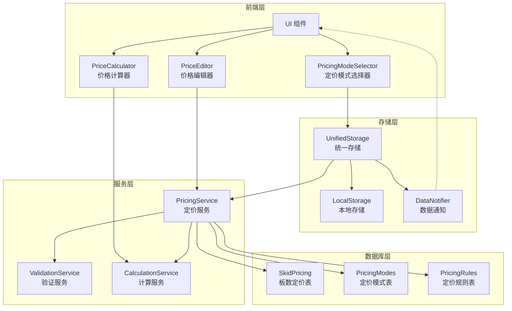
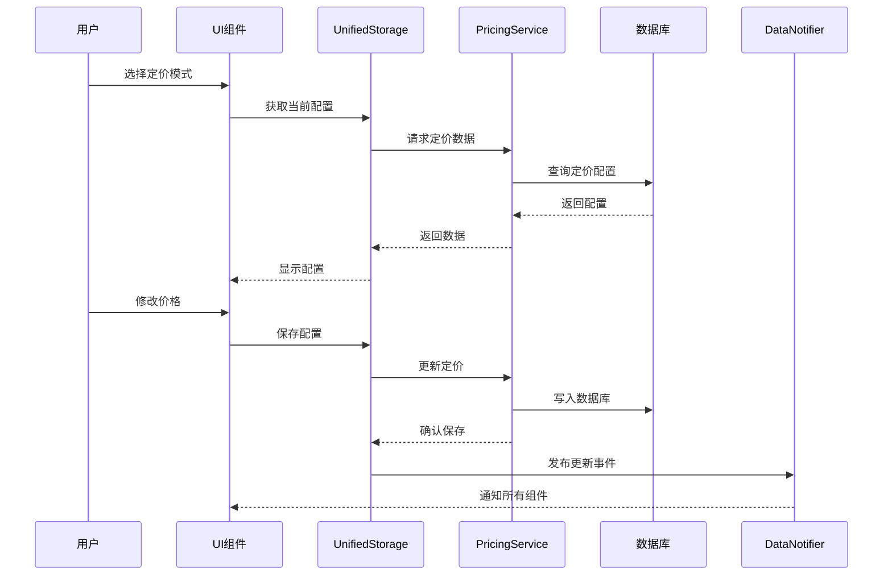
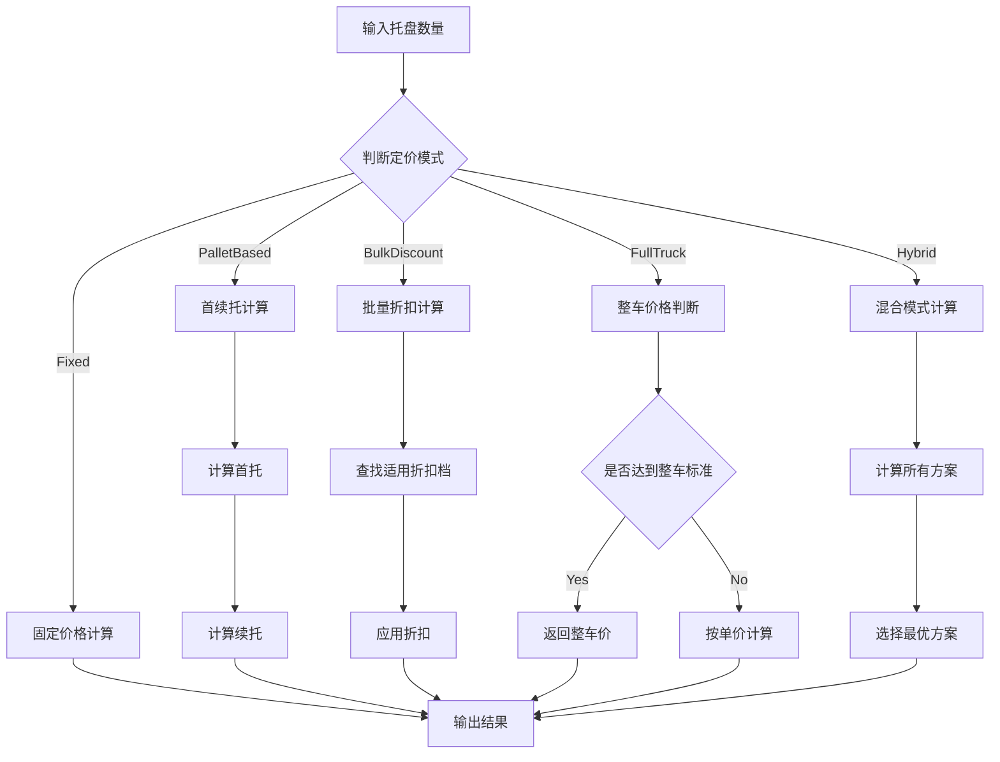

# 卡车定价增强功能设计文档

## 概述

本设计文档描述了卡车配送管理中心定价增强功能的技术实现方案。新功能在现有固定价格模式基础上，扩展支持首续托定价、批量折扣和整车优惠等复杂定价策略。

## 架构设计

### 系统架构图



### 数据流架构



## 数据模型设计

### 扩展数据库表结构

#### 1. PricingModes 表（新增）

```sql
CREATE TABLE pricing_modes (
    id UUID PRIMARY KEY DEFAULT gen_random_uuid(),
    city_id VARCHAR(50) NOT NULL,
    zone_id VARCHAR(50) NOT NULL,
    mode_type VARCHAR(50) NOT NULL, -- 'fixed', 'palletBased', 'bulkDiscount', 'fullTruck'
    config JSONB NOT NULL,
    is_active BOOLEAN DEFAULT true,
    priority INTEGER DEFAULT 0,
    created_at TIMESTAMP DEFAULT NOW(),
    updated_at TIMESTAMP DEFAULT NOW(),
    created_by VARCHAR(100),

    UNIQUE(city_id, zone_id, mode_type),
    INDEX idx_pricing_modes_city (city_id),
    INDEX idx_pricing_modes_zone (zone_id),
    INDEX idx_pricing_modes_active (is_active)
);
```

#### 2. PricingRules 表（新增）

```sql
CREATE TABLE pricing_rules (
    id UUID PRIMARY KEY DEFAULT gen_random_uuid(),
    mode_id UUID REFERENCES pricing_modes(id),
    rule_type VARCHAR(50) NOT NULL, -- 'firstPallet', 'additionalPallet', 'bulkStart', 'fullTruck'
    min_quantity INTEGER,
    max_quantity INTEGER,
    price DECIMAL(10,2),
    price_per_unit DECIMAL(10,2),
    discount_percent DECIMAL(5,2),
    sort_order INTEGER DEFAULT 0,
    created_at TIMESTAMP DEFAULT NOW(),

    INDEX idx_pricing_rules_mode (mode_id),
    INDEX idx_pricing_rules_type (rule_type)
);
```

### 定价配置数据结构

```typescript
// 定价模式枚举
interface PricingMode {
  type: 'fixed' | 'palletBased' | 'bulkDiscount' | 'fullTruck' | 'hybrid';
  config: PricingConfig;
  priority: number;
  isActive: boolean;
}

// 托盘定价配置
interface PalletBasedConfig {
  firstPalletPrice: number;      // 首托价格
  additionalPalletPrice: number; // 续托价格
  maxPallets?: number;            // 最大托盘数
}

// 批量折扣配置
interface BulkDiscountConfig {
  tiers: Array<{
    minQuantity: number;
    maxQuantity?: number;
    pricePerPallet: number;
    discountPercent?: number;
  }>;
}

// 整车定价配置
interface FullTruckConfig {
  minPallets: number;     // 最小托盘数
  fixedPrice: number;     // 固定价格
  maxPallets?: number;    // 最大托盘数
}

// 混合定价配置
interface HybridConfig {
  basePricing: PalletBasedConfig;
  bulkDiscounts?: BulkDiscountConfig;
  fullTruckOption?: FullTruckConfig;
}
```

## 组件设计

### 1. PricingModeSelector 组件

**功能**：定价模式选择和配置界面

```jsx
// 组件结构
PricingModeSelector
├── ModeTabBar           // 模式选项卡
├── FixedPriceEditor     // 固定价格编辑器
├── PalletBasedEditor    // 托盘定价编辑器
├── BulkDiscountEditor   // 批量折扣编辑器
├── FullTruckEditor      // 整车定价编辑器
└── HybridModeEditor     // 混合模式编辑器
```

**Props 接口**：
```typescript
interface PricingModeSelectorProps {
  cityId: string;
  zoneId: string;
  currentMode?: PricingMode;
  onModeChange: (mode: PricingMode) => void;
  onSave: (config: PricingConfig) => Promise<void>;
  disabled?: boolean;
}
```

### 2. PriceCalculator 组件

**功能**：实时价格计算和预览

```jsx
// 组件结构
PriceCalculator
├── QuantityInput        // 数量输入
├── PriceBreakdown       // 价格明细
├── DiscountDisplay      // 折扣显示
├── ComparisonChart      // 价格对比图
└── RecommendationPanel  // 最优方案推荐
```

**计算逻辑流程**：



### 3. PriceEditor 增强组件

**功能**：扩展现有 SkidPricingMatrix 组件

```typescript
// 增强接口
interface EnhancedPriceEditorProps extends SkidPricingMatrixProps {
  pricingMode: PricingMode;
  enableBulkEdit: boolean;
  showComparison: boolean;
  validationRules?: ValidationRule[];
}

// 验证规则
interface ValidationRule {
  field: string;
  validator: (value: any, context: any) => boolean;
  message: string;
}
```

## API 设计

### 新增 API 端点

#### 1. 定价模式管理

```typescript
// 获取定价模式配置
GET /api/v1/truck-delivery/pricing-modes/:cityId/:zoneId
Response: {
  modes: PricingMode[],
  activeMode: string,
  lastUpdated: string
}

// 更新定价模式
POST /api/v1/truck-delivery/pricing-modes/:cityId/:zoneId
Body: {
  mode: PricingMode,
  effectiveDate?: string
}

// 删除定价模式
DELETE /api/v1/truck-delivery/pricing-modes/:cityId/:zoneId/:modeType
```

#### 2. 价格计算服务

```typescript
// 计算价格
POST /api/v1/truck-delivery/calculate-price
Body: {
  cityId: string,
  zoneId: string,
  quantity: number,
  options?: {
    urgency?: 'normal' | 'express',
    includeFullTruck?: boolean
  }
}
Response: {
  basePrice: number,
  finalPrice: number,
  breakdown: PriceBreakdown[],
  appliedRules: string[],
  recommendations?: Recommendation[]
}
```

#### 3. 批量导入导出

```typescript
// 导出定价配置
GET /api/v1/truck-delivery/pricing-export/:cityId
Query: {
  format: 'excel' | 'csv' | 'json',
  includeHistory?: boolean
}

// 导入定价配置
POST /api/v1/truck-delivery/pricing-import/:cityId
Body: FormData (file upload)
Response: {
  imported: number,
  failed: number,
  errors?: ImportError[]
}
```

### 服务层扩展

```javascript
// pricingService.js 扩展
class EnhancedPricingService extends PricingService {
  // 定价模式管理
  async getPricingModes(cityId, zoneId) { ... }
  async savePricingMode(cityId, zoneId, mode) { ... }
  async deletePricingMode(cityId, zoneId, modeType) { ... }

  // 价格计算
  async calculatePrice(cityId, zoneId, quantity, options) { ... }
  async compareModePrices(cityId, zoneId, quantities) { ... }

  // 验证和规则
  async validatePricingConfig(config) { ... }
  async applyBusinessRules(price, context) { ... }

  // 批量操作
  async exportPricing(cityId, format, options) { ... }
  async importPricing(cityId, file, options) { ... }
}
```

## 状态管理

### LocalStorage 结构扩展

```javascript
// 新增 localStorage keys
const STORAGE_KEYS = {
  PRICING_MODES: 'pricing_modes_v2',
  PRICING_RULES: 'pricing_rules_v2',
  PRICE_CACHE: 'price_calculation_cache',
  USER_PREFERENCES: 'pricing_user_prefs'
};

// 数据结构
localStorage: {
  pricing_modes_v2: {
    [cityId]: {
      [zoneId]: {
        activeMode: string,
        modes: PricingMode[],
        lastUpdated: timestamp
      }
    }
  },
  pricing_rules_v2: {
    [modeId]: PricingRule[]
  },
  price_calculation_cache: {
    [cacheKey]: {
      result: CalculationResult,
      timestamp: number,
      ttl: number
    }
  }
}
```

### 数据同步机制

```javascript
// 扩展 dataUpdateNotifier
class PricingDataNotifier extends DataUpdateNotifier {
  // 新事件类型
  static EVENTS = {
    ...DataUpdateNotifier.EVENTS,
    PRICING_MODE_CHANGED: 'pricing_mode_changed',
    PRICING_RULE_UPDATED: 'pricing_rule_updated',
    PRICE_CALCULATION_COMPLETED: 'price_calculation_completed'
  };

  // 发布定价模式变更
  notifyPricingModeChange(cityId, zoneId, mode) {
    this.emit(EVENTS.PRICING_MODE_CHANGED, {
      cityId,
      zoneId,
      mode,
      timestamp: Date.now()
    });
  }
}
```

## 性能优化

### 1. 价格计算缓存

```javascript
class PriceCalculationCache {
  constructor(ttl = 300000) { // 5分钟缓存
    this.cache = new Map();
    this.ttl = ttl;
  }

  getCacheKey(cityId, zoneId, quantity, mode) {
    return `${cityId}:${zoneId}:${quantity}:${mode}`;
  }

  get(key) {
    const entry = this.cache.get(key);
    if (entry && Date.now() - entry.timestamp < this.ttl) {
      return entry.result;
    }
    return null;
  }

  set(key, result) {
    this.cache.set(key, {
      result,
      timestamp: Date.now()
    });
  }
}
```

### 2. 批量操作优化

```javascript
// 批量更新优化
class BatchPricingUpdater {
  constructor(batchSize = 100) {
    this.queue = [];
    this.batchSize = batchSize;
    this.processing = false;
  }

  async addUpdate(update) {
    this.queue.push(update);
    if (!this.processing) {
      await this.processQueue();
    }
  }

  async processQueue() {
    this.processing = true;
    while (this.queue.length > 0) {
      const batch = this.queue.splice(0, this.batchSize);
      await this.processBatch(batch);
    }
    this.processing = false;
  }

  async processBatch(batch) {
    // 使用事务处理批量更新
    return await prisma.$transaction(
      batch.map(update =>
        prisma.pricingModes.upsert(update)
      )
    );
  }
}
```

### 3. UI 渲染优化

```javascript
// 使用 React.memo 和 useMemo 优化
const PriceCell = React.memo(({ price, mode, quantity }) => {
  const calculatedPrice = useMemo(() => {
    return calculatePrice(price, mode, quantity);
  }, [price, mode, quantity]);

  return <div>{calculatedPrice}</div>;
});

// 虚拟列表优化大量数据显示
import { FixedSizeList } from 'react-window';

const PriceList = ({ items }) => (
  <FixedSizeList
    height={600}
    itemCount={items.length}
    itemSize={50}
    width="100%"
  >
    {({ index, style }) => (
      <div style={style}>
        <PriceCell {...items[index]} />
      </div>
    )}
  </FixedSizeList>
);
```

## 错误处理

### 错误类型定义

```typescript
enum PricingErrorType {
  INVALID_MODE = 'INVALID_MODE',
  CALCULATION_FAILED = 'CALCULATION_FAILED',
  CONFIGURATION_CONFLICT = 'CONFIGURATION_CONFLICT',
  VALIDATION_FAILED = 'VALIDATION_FAILED',
  IMPORT_FAILED = 'IMPORT_FAILED'
}

class PricingError extends Error {
  constructor(
    public type: PricingErrorType,
    public message: string,
    public details?: any
  ) {
    super(message);
  }
}
```

### 错误处理策略

```javascript
const errorHandlers = {
  [PricingErrorType.INVALID_MODE]: (error) => {
    // 回退到默认模式
    return { fallback: 'fixed', notify: true };
  },
  [PricingErrorType.CALCULATION_FAILED]: (error) => {
    // 使用缓存的价格
    return { useCache: true, retry: true };
  },
  [PricingErrorType.CONFIGURATION_CONFLICT]: (error) => {
    // 提示用户解决冲突
    return { showConflictResolver: true };
  }
};
```

## 测试策略

### 单元测试覆盖率要求

- 价格计算逻辑：100%
- API 端点：90%
- UI 组件：80%
- 数据验证：100%

### 核心测试用例

```javascript
// 价格计算测试
describe('PriceCalculation', () => {
  test('首续托定价计算', () => {
    const config = {
      firstPalletPrice: 40,
      additionalPalletPrice: 15
    };
    expect(calculatePalletBased(1, config)).toBe(40);
    expect(calculatePalletBased(3, config)).toBe(70);
  });

  test('批量折扣计算', () => {
    const config = {
      tiers: [
        { minQuantity: 1, maxQuantity: 5, pricePerPallet: 50 },
        { minQuantity: 6, pricePerPallet: 43 }
      ]
    };
    expect(calculateBulkDiscount(4, config)).toBe(200);
    expect(calculateBulkDiscount(8, config)).toBe(344);
  });
});
```

## 部署计划

### 阶段划分

1. **Phase 1**: 数据库迁移和 API 部署
2. **Phase 2**: UI 组件更新和集成
3. **Phase 3**: 数据迁移和用户培训

### 回滚策略

- 保留原有定价模式作为备份
- 支持一键切换回旧版本
- 数据备份和快速恢复机制

## 兼容性考虑

### 后向兼容

- 现有固定价格配置自动迁移到新系统
- API 保持旧版本端点 6 个月
- 前端组件支持传统模式和新模式

### 数据迁移

```sql
-- 迁移脚本
INSERT INTO pricing_modes (city_id, zone_id, mode_type, config)
SELECT
  city_id,
  zone_id,
  'fixed' as mode_type,
  jsonb_build_object(
    'prices', jsonb_object_agg(skid_count, price)
  ) as config
FROM skid_pricing
WHERE is_active = true
GROUP BY city_id, zone_id;
```

## 监控和告警

### 关键指标

1. **价格计算响应时间** - P95 < 100ms
2. **API 调用成功率** - > 99.9%
3. **缓存命中率** - > 80%
4. **错误率** - < 0.1%

### 告警规则

```javascript
const alertRules = [
  {
    metric: 'calculation_time_p95',
    threshold: 200,
    severity: 'warning'
  },
  {
    metric: 'api_error_rate',
    threshold: 0.01,
    severity: 'critical'
  }
];
```